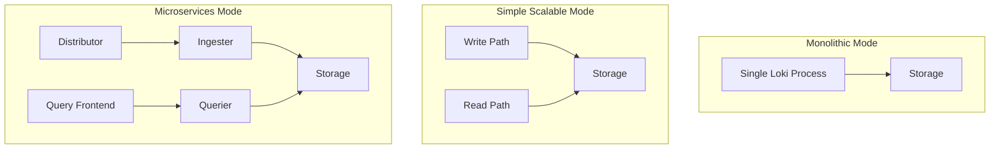

# Production Readiness

## Introduction

Production readiness is a critical phase in the deployment lifecycle of Grafana Loki. It involves ensuring that your Loki installation is robust, scalable, and reliable enough to handle real-world workloads in a production environment. While Loki can be quickly set up for development or testing purposes, moving to production requires additional considerations and optimizations.

In this guide, we'll explore the essential aspects of preparing your Grafana Loki deployment for production use, covering scalability, reliability, security, and operational best practices.

## Key Considerations for Production Readiness

### 1. Deployment Architecture

The architecture you choose significantly impacts Loki's performance and scalability in production. Loki supports several deployment modes:

- **Monolithic Mode**: All Loki components run in a single process
- **Simple Scalable Mode**: Separates read and write paths
- **Microservices Mode**: Fully distributed components for maximum scalability



For production environments with significant log volumes, the microservices mode is typically recommended as it allows independent scaling of components based on specific workload characteristics.

### 2. Resource Requirements

Properly sizing your Loki deployment is essential for production readiness. Consider these guidelines:

- **CPU**: Ingesters and queriers are CPU-intensive. Start with at least 2 CPU cores per component and scale based on workload.
- **Memory**: Ingesters require significant memory for the in-memory chunk cache. Begin with 4-8GB per ingester instance.
- **Disk**: Temporary storage for ingesters (before flushing to object storage) should be fast SSD storage.
- **Network**: High-bandwidth, low-latency networking between components.

Example Kubernetes resource configuration:

```yaml
resources:
  requests:
    memory: "4Gi"
    cpu: "1"
  limits:
    memory: "8Gi"
    cpu: "2"
```

### 3. Storage Configuration

Production deployments should use object storage backends for scalability:

- **Object Storage**: Use AWS S3, Google Cloud Storage, Azure Blob Storage, or MinIO for chunk storage
- **Index Storage**: BoltDB-Shipper or cloud-native solutions for index storage

Example storage configuration:

```yaml
storage_config:
  boltdb_shipper:
    active_index_directory: /loki/index
    cache_location: /loki/index_cache
    shared_store: s3
  aws:
    s3: s3://loki-bucket:default/index
    s3forcepathstyle: true
  filesystem:
    directory: /loki/chunks
chunk_store_config:
  max_look_back_period: 336h
schema_config:
  configs:
    - from: 2020-07-01
      store: boltdb-shipper
      object_store: aws
      schema: v11
      index:
        prefix: index_
        period: 24h
```

### 4. High Availability

For production environments, implement high availability to ensure service continuity:

- Deploy multiple replicas of each Loki component
- Use Kubernetes StatefulSets for ingesters
- Configure appropriate replication factors

Example replication factor configuration:

```yaml
ingester:
  lifecycler:
    ring:
      kvstore:
        store: consul
        prefix: loki/
      replication_factor: 3
```

### 5. Caching Strategy

Implement caching to improve query performance:

- **Results Cache**: Caches query results for frequently run queries
- **Chunk Cache**: Stores frequently accessed chunks in memory
- **Index Cache**: Improves performance of index lookups

Example cache configuration:

```yaml
chunk_store_config:
  chunk_cache_config:
    enable_fifocache: true
    fifocache:
      max_size_bytes: 1073741824  # 1GB
      validity: 24h
querier:
  query_ingesters_within: 3h
frontend:
  results_cache:
    cache:
      enable_fifocache: true
      fifocache:
        max_size_bytes: 1073741824  # 1GB
        validity: 24h
```

### 6. Performance Tuning

Optimize Loki's configuration for production performance:

- **Chunk Size**: Balance between memory usage and storage efficiency
- **Retention Policies**: Configure appropriate data retention periods
- **Query Limits**: Set timeouts and limits to prevent resource exhaustion

Example performance configuration:

```yaml
limits_config:
  enforce_metric_name: false
  reject_old_samples: true
  reject_old_samples_max_age: 168h
  max_query_parallelism: 16
  max_query_length: 721h
  max_query_series: 500
```

### 7. Monitoring and Observability

Set up comprehensive monitoring for your Loki deployment:

- Configure Loki to export metrics to Prometheus
- Create dashboards in Grafana to monitor Loki's performance
- Set up alerts for important metrics like ingestion rate, query latency, and error rates

Example Prometheus scrape configuration:

```yaml
scrape_configs:
  - job_name: loki
    static_configs:
      - targets: ['loki:3100']
    relabel_configs:
      - source_labels: ['__address__']
        target_label: instance
```

### 8. Security Considerations

Implement security measures for your production Loki deployment:

- **Authentication**: Configure authentication using Grafana, OAuth, or other methods
- **Authorization**: Implement tenant isolation with multi-tenancy
- **Network Security**: Use TLS for communications between components
- **API Security**: Restrict access to the HTTP API

Example TLS configuration:

```yaml
server:
  http_listen_port: 3100
  grpc_listen_port: 9095
  http_server_read_timeout: 300s
  http_server_write_timeout: 300s
  grpc_server_max_recv_msg_size: 104857600
  grpc_server_max_send_msg_size: 104857600
  http_tls_config:
    cert_file: /path/to/cert.pem
    key_file: /path/to/key.pem
```

## Production Checklist

Before launching Loki in production, ensure you've addressed these key points:

- [ ] Chosen the appropriate deployment architecture for your scale
- [ ] Allocated sufficient resources (CPU, memory, disk)
- [ ] Configured durable and scalable storage
- [ ] Implemented high availability with appropriate replication
- [ ] Set up caching for performance optimization
- [ ] Tuned performance parameters based on workload
- [ ] Established monitoring and alerting
- [ ] Secured the deployment with authentication and TLS
- [ ] Tested the deployment with production-like data volumes
- [ ] Created backup and disaster recovery procedures
- [ ] Documented the deployment configuration and operational procedures

## Real-World Example: Scaling Loki for High-Volume Log Processing

Let's look at a practical example of preparing Loki for a high-volume production environment processing 10TB of logs per day.

### Architecture

For this scale, we'd use the microservices deployment mode with components distributed across a Kubernetes cluster:

```yaml
# distributor-deployment.yaml (excerpt)
apiVersion: apps/v1
kind: Deployment
metadata:
  name: loki-distributor
spec:
  replicas: 3
  selector:
    matchLabels:
      app: loki
      component: distributor
  template:
    metadata:
      labels:
        app: loki
        component: distributor
    spec:
      containers:
      - name: loki
        image: grafana/loki:2.8.0
        args:
          - -config.file=/etc/loki/config.yaml
          - -target=distributor
# Similar configurations for other components
```

### Resource Allocation

For this scale, we'd provision the following resources:

- **Distributors**: 3 replicas, 2 CPU cores, 4GB RAM each
- **Ingesters**: 5 replicas, 8 CPU cores, 32GB RAM each
- **Queriers**: 3 replicas, 4 CPU cores, 16GB RAM each
- **Query Frontend**: 2 replicas, 2 CPU cores, 4GB RAM each

### Storage Strategy

We'd use a tiered storage approach:

- Recent data (7 days) in high-performance object storage
- Older data in lower-cost archival storage
- BoltDB-Shipper for index with daily compaction

### Monitoring Dashboard

Set up a Grafana dashboard to monitor key metrics:

```yaml
# prometheus-loki-rules.yaml (excerpt)
groups:
- name: loki
  rules:
  - alert: LokiIngestionRate
    expr: sum(rate(loki_distributor_bytes_received_total[5m])) > 10000000
    for: 10m
    labels:
      severity: warning
    annotations:
      summary: "High ingestion rate"
      description: "Loki ingestion rate is above 10MB/s for 10 minutes"
```

## Summary

Preparing Grafana Loki for production involves careful planning and configuration to ensure scalability, reliability, and performance. The key aspects include choosing the right architecture, allocating sufficient resources, configuring appropriate storage, implementing high availability, optimizing caching and performance, establishing monitoring, and securing the deployment.

By following the guidelines and best practices outlined in this guide, you can build a robust Loki deployment capable of handling production workloads while maintaining good performance and reliability.

## Additional Resources

- [Grafana Loki Documentation](https://grafana.com/docs/loki/latest/)
- [Loki Production Configuration Examples](https://grafana.com/docs/loki/latest/configuration/examples/)
- [Monitoring Loki with Prometheus](https://grafana.com/docs/loki/latest/operations/observability/)
- [Loki Storage Optimization Guide](https://grafana.com/docs/loki/latest/operations/storage/)

## Exercises

1. Set up a simple scalable Loki deployment with separate read and write paths.
2. Configure Loki with object storage (S3, GCS, or MinIO) for chunk storage.
3. Create a Grafana dashboard to monitor your Loki deployment's key metrics.
4. Implement a multi-tenancy setup for isolating logs from different applications.
5. Design and document a disaster recovery plan for your Loki deployment.