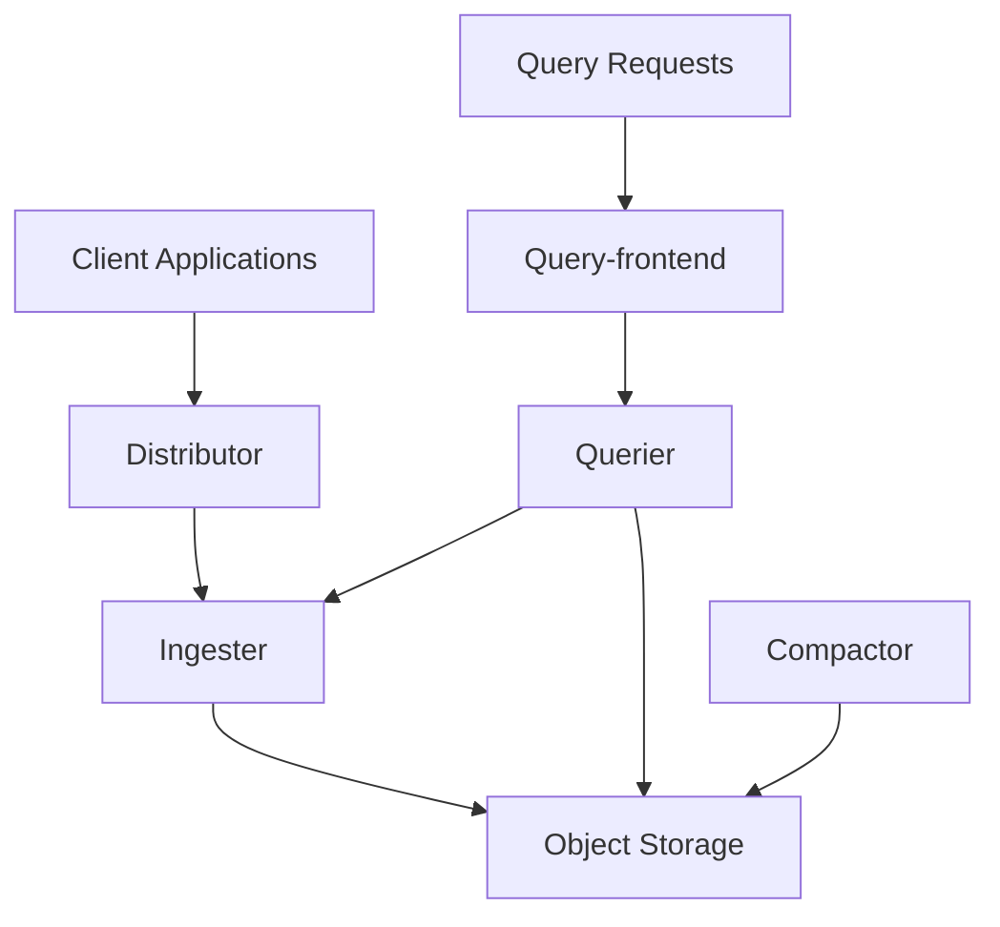

# Sizing Recommendations

## Introduction

When deploying Grafana Loki in a production environment, properly sizing your infrastructure is crucial for maintaining performance, reliability, and cost-efficiency. This guide will help you understand how to estimate and allocate resources for your Loki deployment based on your specific logging requirements.

Loki's microservices architecture allows it to scale horizontally, but each component has different resource needs. Making informed sizing decisions early can prevent performance bottlenecks and optimize your operational costs.

## Understanding Loki Resource Requirements

Loki's resource consumption is primarily influenced by:

1. **Log volume** - The amount of log data ingested per day
2. **Retention period** - How long logs are stored
3. **Query patterns** - Frequency and complexity of queries
4. **Cardinality** - Number of unique label combinations

Let's explore how these factors affect Loki's components and their sizing requirements.

## Sizing Components in Loki Architecture

Loki consists of several components, each with different scaling characteristics:



### Distributor Sizing

The distributor is the entry point for logs and handles authentication, validation, and rate limiting.

**Resource recommendations:**
- **CPU**: 2 cores per 100,000 log lines per second
- **Memory**: 1-2 GB per instance
- **Instances**: min(3, ceil(log_volume_per_second/100,000))

**Example calculation:**
For an application generating 500,000 log lines per second:

```
Required distributors = min(3, ceil(500,000/100,000)) = min(3, 5) = 3
Total CPU requirement = 3 instances × 2 cores × (500,000/100,000) = 30 cores
Total memory requirement = 3 instances × 2 GB = 6 GB
```

### Ingester Sizing

Ingesters receive log data from distributors, compress it, and write it to object storage.

**Resource recommendations:**
- **CPU**: 4 cores per 100,000 log lines per second
- **Memory**: 8-16 GB per instance (depends on chunk size and cardinality)
- **Instances**: min(3, ceil(log_volume_per_second/50,000))
- **Disk**: 3× memory for WAL (Write-Ahead Log)

**Example configuration:**

```yaml
ingester:
  chunk_idle_period: 1h
  max_chunk_age: 2h
  chunk_target_size: 1536000
  chunk_retain_period: 30s
  lifecycle:
    ring:
      kvstore:
        store: memberlist
```

### Querier Sizing

Queriers handle search requests and need resources proportional to query complexity and volume.

**Resource recommendations:**
- **CPU**: 2 cores per concurrent query
- **Memory**: 4-8 GB per instance
- **Instances**: ceil(peak_queries_per_second × avg_query_duration_seconds)

For example, if you have 5 queries per second with an average duration of 2 seconds:

```
Required queriers = ceil(5 × 2) = 10 instances
Total CPU requirement = 10 instances × 2 cores = 20 cores
Total memory requirement = 10 instances × 6 GB = 60 GB
```

### Query Frontend Sizing

The query frontend splits large queries into smaller ones and manages the query queue.

**Resource recommendations:**
- **CPU**: 1 core per 10 QPS (queries per second)
- **Memory**: 2 GB per instance
- **Instances**: 2 (minimum for high availability)

**Example configuration:**

```yaml
query_frontend:
  max_outstanding_per_tenant: 100
  split_queries_by_interval: 30m
  align_queries_with_step: true
  cache_results: true
  results_cache:
    cache:
      enable_fifocache: true
      fifocache:
        size: 1024
        validity: 24h
```

### Compactor Sizing

The compactor optimizes storage by merging and compacting smaller files.

**Resource recommendations:**
- **CPU**: 2 cores per instance
- **Memory**: 8 GB per instance
- **Instances**: 1 (only one active compactor should run at a time)

## Real-World Sizing Examples

Let's look at some practical examples for different deployment scales.

### Small Deployment (10 GB/day)

Suitable for small applications or development environments:

| Component | Instances | CPU/instance | Memory/instance |
|-----------|-----------|--------------|-----------------|
| Distributor | 2 | 1 core | 1 GB |
| Ingester | 3 | 2 cores | 4 GB |
| Querier | 2 | 2 cores | 4 GB |
| Query Frontend | 2 | 1 core | 2 GB |
| Compactor | 1 | 1 core | 4 GB |

**Kubernetes resource example:**

```yaml
distributor:
  replicas: 2
  resources:
    requests:
      cpu: 1
      memory: 1Gi
    limits:
      cpu: 2
      memory: 2Gi

ingester:
  replicas: 3
  resources:
    requests:
      cpu: 2
      memory: 4Gi
    limits:
      cpu: 4
      memory: 8Gi
```

### Medium Deployment (100 GB/day)

Suitable for medium-sized applications:

| Component | Instances | CPU/instance | Memory/instance |
|-----------|-----------|--------------|-----------------|
| Distributor | 3 | 2 cores | 2 GB |
| Ingester | 3 | 4 cores | 8 GB |
| Querier | 4 | 2 cores | 6 GB |
| Query Frontend | 2 | 2 cores | 2 GB |
| Compactor | 1 | 2 cores | 8 GB |

### Large Deployment (1 TB/day)

Suitable for large enterprise applications:

| Component | Instances | CPU/instance | Memory/instance |
|-----------|-----------|--------------|-----------------|
| Distributor | 5 | 4 cores | 4 GB |
| Ingester | 8 | 8 cores | 16 GB |
| Querier | 10 | 4 cores | 8 GB |
| Query Frontend | 3 | 4 cores | 4 GB |
| Compactor | 1 | 4 cores | 16 GB |

## Storage Considerations

Object storage requirements depend on:
- Daily log volume
- Compression ratio (typically 10:1)
- Retention period

**Estimated storage formula:**
```
storage_size = (daily_log_volume × retention_days) / compression_ratio
```

For example, with 100 GB/day and 30-day retention:
```
storage_size = (100 GB × 30 days) / 10 = 300 GB
```

## Monitoring Resource Usage

Always monitor your Loki deployment to fine-tune resource allocation. Set up Grafana dashboards to track:

- CPU and memory usage per component
- Request latency and errors
- Storage growth rate
- Query performance

**Example Prometheus query to monitor ingester memory:**

```
container_memory_usage_bytes{container="ingester"}
```

## Vertical vs. Horizontal Scaling

When to scale up vs. scale out:

- **Vertical scaling (increasing resources per instance)**: 
  - When a component needs more memory for in-memory operations
  - When you need to handle higher cardinality
  - When query performance is CPU-bound

- **Horizontal scaling (adding more instances)**:
  - When you need to handle more concurrent requests
  - For distributing log ingestion load
  - For high availability requirements

## Performance Tuning Tips

Beyond sizing, consider these performance improvements:

1. **Use caching effectively:**

```yaml
chunk_store_config:
  cache_lookups: true
  cache_period: 24h
```

2. **Optimize chunk size and idle period:**

```yaml
ingester:
  chunk_idle_period: 30m
  chunk_target_size: 1572864
```

3. **Configure splits for large queries:**

```yaml
query_frontend:
  split_queries_by_interval: 12h
```

4. **Use appropriate index and chunk caches:**

```yaml
storage_config:
  index_queries_cache_config:
    memcached:
      batch_size: 100
      parallelism: 100
    memcached_client:
      timeout: 100ms
      consistent_hash: true
```

## Summary

Properly sizing your Grafana Loki deployment requires understanding your log volume, query patterns, and retention requirements. Key points to remember:

- Start with a conservative estimate and scale as needed
- Monitor actual resource usage to fine-tune your deployment
- Different components have different scaling characteristics
- Horizontal scaling works best for high throughput
- Vertical scaling helps with complex queries and high cardinality

By following these sizing recommendations, you can build a Loki deployment that efficiently handles your logging needs while maintaining performance and controlling costs.

## Additional Resources

- [Grafana Loki Configuration Documentation](https://grafana.com/docs/loki/latest/configuration/)
- [Loki Scalability Guide](https://grafana.com/docs/loki/latest/fundamentals/architecture/deployment-modes/)
- [Operational Best Practices](https://grafana.com/docs/loki/latest/operations/)

## Exercises

1. Calculate the storage requirements for your application based on its daily log volume and desired retention period.
2. Create a sizing plan for a Loki deployment that needs to handle 50,000 log lines per second with a 14-day retention period.
3. Design a Kubernetes deployment YAML for Loki components based on your calculated resource requirements.