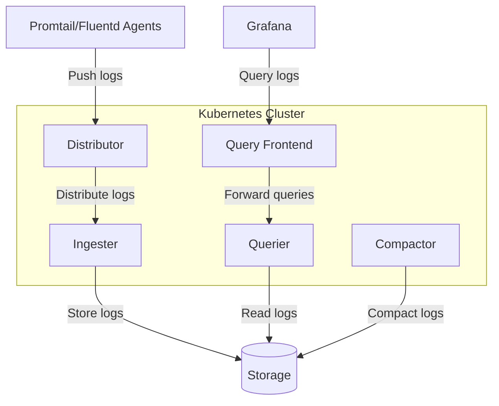

# Kubernetes Deployment

## Introduction

Kubernetes has become the industry standard for container orchestration, making it an excellent platform for deploying Grafana Loki. This guide will walk you through the process of deploying Loki on Kubernetes, explaining the architectural considerations, deployment options, and best practices to ensure your logging infrastructure is robust, scalable, and efficient.

Grafana Loki is designed to be highly scalable and cost-effective, making it particularly well-suited for Kubernetes environments. By the end of this guide, you'll understand how to deploy Loki components in Kubernetes and configure them appropriately for your specific needs.

## Prerequisites

Before deploying Loki on Kubernetes, ensure you have:

- A running Kubernetes cluster (version 1.16+)
- `kubectl` command-line tool configured to communicate with your cluster
- Helm 3 installed (for Helm-based deployments)
- Basic understanding of Kubernetes concepts (Pods, Services, ConfigMaps, etc.)
- Storage provisioner configured in your cluster (for persistent storage)

## Deployment Options

There are several ways to deploy Grafana Loki on Kubernetes:

1. **Helm Chart**: The recommended approach for most scenarios
2. **Kubernetes Manifests**: For customized deployments
3. **Loki Operator**: For automated management (in development)

Let's explore each option with practical examples.

## Option 1: Deploying Loki with Helm

Helm provides a streamlined way to deploy Loki using pre-configured charts.

### Installing Loki using Helm

First, add the Grafana Helm repository:

```bash
helm repo add grafana https://grafana.github.io/helm-charts
helm repo update
```

Next, create a `values.yaml` file to customize your Loki deployment:

```yaml
loki:
  auth_enabled: false
  commonConfig:
    replication_factor: 1
  storage:
    type: filesystem
  schemaConfig:
    configs:
      - from: 2020-10-24
        store: boltdb-shipper
        object_store: filesystem
        schema: v11
        index:
          prefix: index_
          period: 24h

persistence:
  enabled: true
  size: 10Gi

serviceMonitor:
  enabled: true
```

Now deploy Loki using the Helm chart:

```bash
helm install loki grafana/loki-distributed -f values.yaml -n monitoring --create-namespace
```

This creates a distributed Loki deployment with basic configuration. You'll see output similar to:

```
NAME: loki
LAST DEPLOYED: Fri Mar 28 2025 12:34:56
NAMESPACE: monitoring
STATUS: deployed
REVISION: 1
NOTES:
Loki has been installed. Check its status by running:
  kubectl --namespace monitoring get pods -l "app.kubernetes.io/instance=loki"
```

### Verifying the Deployment

Check if all Loki components are running:

```bash
kubectl get pods -n monitoring -l app.kubernetes.io/instance=loki
```

You should see pods for various Loki components:

```
NAME                                 READY   STATUS    RESTARTS   AGE
loki-distributed-compactor-0         1/1     Running   0          3m
loki-distributed-distributor-0       1/1     Running   0          3m
loki-distributed-ingester-0          1/1     Running   0          3m
loki-distributed-querier-0           1/1     Running   0          3m
loki-distributed-query-frontend-0    1/1     Running   0          3m
```

## Option 2: Deploying with Kubernetes Manifests

For more control over your deployment, you can use Kubernetes manifests directly.

First, create a ConfigMap for Loki's configuration:

```yaml
apiVersion: v1
kind: ConfigMap
metadata:
  name: loki-config
  namespace: monitoring
data:
  loki.yaml: |
    auth_enabled: false
    server:
      http_listen_port: 3100
    distributor:
      ring:
        kvstore:
          store: memberlist
    ingester:
      lifecycler:
        ring:
          kvstore:
            store: memberlist
          replication_factor: 1
      chunk_idle_period: 30m
      chunk_block_size: 262144
      chunk_retain_period: 1m
    memberlist:
      join_members:
        - loki-memberlist
    limits_config:
      enforce_metric_name: false
      reject_old_samples: true
      reject_old_samples_max_age: 168h
    schema_config:
      configs:
        - from: 2020-10-24
          store: boltdb-shipper
          object_store: filesystem
          schema: v11
          index:
            prefix: index_
            period: 24h
    storage_config:
      boltdb_shipper:
        active_index_directory: /data/loki/index
        cache_location: /data/loki/cache
        cache_ttl: 24h
        shared_store: filesystem
      filesystem:
        directory: /data/loki/chunks
```

Next, create a StatefulSet for Loki:

```yaml
apiVersion: apps/v1
kind: StatefulSet
metadata:
  name: loki
  namespace: monitoring
spec:
  serviceName: "loki"
  replicas: 1
  selector:
    matchLabels:
      app: loki
  template:
    metadata:
      labels:
        app: loki
    spec:
      containers:
        - name: loki
          image: grafana/loki:2.8.0
          args:
            - "-config.file=/etc/loki/loki.yaml"
          ports:
            - containerPort: 3100
              name: http
          volumeMounts:
            - name: config
              mountPath: /etc/loki
            - name: storage
              mountPath: /data
          readinessProbe:
            httpGet:
              path: /ready
              port: http
            initialDelaySeconds: 45
          livenessProbe:
            httpGet:
              path: /ready
              port: http
            initialDelaySeconds: 45
      volumes:
        - name: config
          configMap:
            name: loki-config
  volumeClaimTemplates:
    - metadata:
        name: storage
      spec:
        accessModes: ["ReadWriteOnce"]
        resources:
          requests:
            storage: 10Gi
```

Finally, create a Service to expose Loki:

```yaml
apiVersion: v1
kind: Service
metadata:
  name: loki
  namespace: monitoring
spec:
  ports:
    - port: 3100
      protocol: TCP
      name: http
  selector:
    app: loki
```

Apply these manifests to your cluster:

```bash
kubectl apply -f loki-configmap.yaml
kubectl apply -f loki-statefulset.yaml
kubectl apply -f loki-service.yaml
```

## Loki Architecture on Kubernetes

Let's understand the Loki architecture in a Kubernetes context:



### Components in Detail

1. **Distributor**: Receives incoming logs and distributes them to ingesters
2. **Ingester**: Writes logs to long-term storage
3. **Querier**: Handles read queries from Grafana
4. **Query Frontend**: Optimizes queries and manages query load
5. **Compactor**: Compacts logs for efficient storage and retrieval

## Configuring Promtail for Log Collection

Promtail is Loki's agent for collecting logs from Kubernetes pods. Deploy it using Helm:

```bash
helm install promtail grafana/promtail -n monitoring --set "config.lokiAddress=http://loki:3100/loki/api/v1/push"
```

This deploys Promtail as a DaemonSet, collecting logs from all nodes.

## Configuring Grafana to Query Loki

Add Loki as a data source in Grafana:

1. Navigate to Configuration > Data Sources
2. Click "Add data source"
3. Select "Loki"
4. Set the URL to `http://loki:3100` (or your service name)
5. Click "Save & Test"

## Scaling Loki on Kubernetes

As your log volume grows, you'll need to scale Loki. Here are some strategies:

### Horizontal Scaling

Increase replicas for Loki components:

```yaml
distributor:
  replicas: 3
  
querier:
  replicas: 3
  
ingester:
  replicas: 3
```

### Resource Allocation

Tune CPU and memory resources based on load:

```yaml
ingester:
  resources:
    requests:
      cpu: 1
      memory: 2Gi
    limits:
      cpu: 2
      memory: 4Gi
```

### Storage Considerations

Configure appropriate storage for your log volume:

```yaml
persistence:
  enabled: true
  size: 50Gi
  storageClass: "ssd"
```

## Monitoring Your Loki Deployment

Monitor Loki itself using Prometheus and Grafana:

1. Enable the ServiceMonitor in Helm values:

```yaml
serviceMonitor:
  enabled: true
```

2. Import the Loki dashboard to Grafana (Dashboard ID: 13407)

## Best Practices

1. **Resource Planning**: Allocate sufficient CPU and memory resources
2. **Storage Configuration**: Use fast storage for ingesters
3. **Retention Policy**: Configure appropriate log retention periods
4. **High Availability**: Deploy multiple replicas in production
5. **Backup Strategy**: Regularly back up Loki storage
6. **Monitoring**: Set up alerts for Loki component health
7. **Security**: Enable authentication in production environments

## Troubleshooting

### Common Issues

1. **Resource Constraints**:
   - Symptoms: Pods being evicted, OOMKilled
   - Solution: Increase memory limits

```yaml
resources:
  requests:
    memory: 2Gi
  limits:
    memory: 4Gi
```

2. **Storage Issues**:
   - Symptoms: Persistent volume claims pending
   - Solution: Check storage class configuration

3. **Query Performance**:
   - Symptoms: Slow queries, timeouts
   - Solution: Optimize queries, increase querier resources

## Summary

Deploying Grafana Loki on Kubernetes provides a scalable and efficient logging solution. We've covered:

- Different deployment methods (Helm, manifests)
- Loki's architecture in Kubernetes
- Configuration and scaling strategies
- Best practices for production deployments
- Troubleshooting common issues

By following this guide, you should now be able to deploy, configure, and manage Loki on Kubernetes for your logging needs.

## Additional Resources

- [Grafana Loki GitHub Repository](https://github.com/grafana/loki)
- [Loki Documentation](https://grafana.com/docs/loki/latest/)
- [Helm Charts Repository](https://github.com/grafana/helm-charts)

## Exercises

1. Deploy Loki using Helm with a custom configuration
2. Configure Promtail to collect logs from specific namespaces only
3. Set up a Grafana dashboard with Loki queries for application logs
4. Implement a multi-tenant Loki deployment
5. Configure log retention and deletion policies