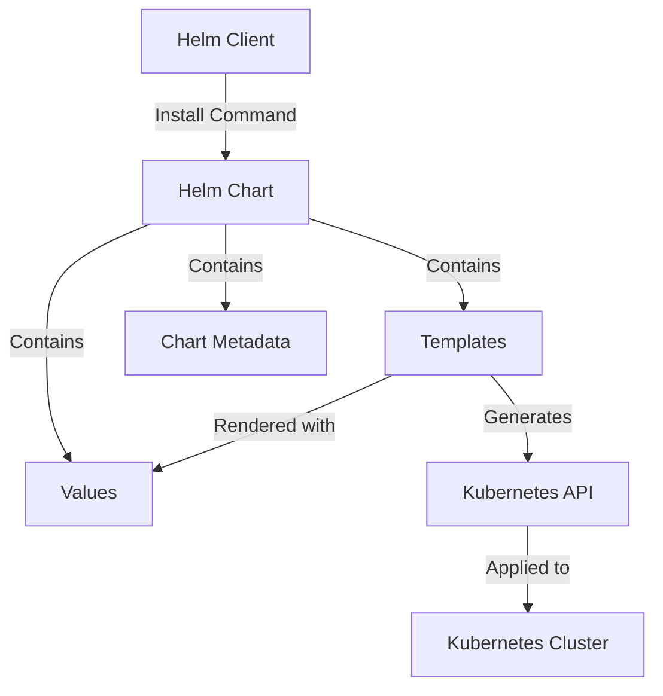

# Helm Chart Installation

## Introduction

Helm charts provide a streamlined way to deploy applications on Kubernetes clusters. For Grafana Loki, Helm charts offer a production-ready deployment method that simplifies the installation process and provides flexibility for customization. This guide will walk you through installing Grafana Loki using Helm charts, from prerequisites to verification.

## What are Helm Charts?

Helm is often referred to as the "package manager for Kubernetes." Just as package managers like apt, yum, or npm help install software on operating systems or in projects, Helm helps deploy applications on Kubernetes clusters.

A Helm chart is a collection of pre-configured Kubernetes resources that:

- Defines all necessary components for an application
- Allows for configuration through values files
- Supports versioning and upgrades
- Simplifies complex deployments into a single command



## Prerequisites

Before installing Grafana Loki using Helm charts, ensure you have:

1. A running Kubernetes cluster
2. Helm CLI installed on your local machine
3. `kubectl` configured to communicate with your cluster

Let's verify these prerequisites:

```bash
# Check Kubernetes connection
kubectl cluster-info

# Verify Helm installation
helm version
```

Expected output for `kubectl cluster-info`:

```
Kubernetes control plane is running at https://kubernetes.docker.internal:6443
CoreDNS is running at https://kubernetes.docker.internal:6443/api/v1/namespaces/kube-system/services/kube-dns:dns/proxy
```

Expected output for `helm version`:

```
version.BuildInfo{Version:"v3.12.3", GitCommit:"3a31588ad33fe3b89af5a2a54ee1d25bfe6eaa5e", GitTreeState:"clean", GoVersion:"go1.20.8"}
```

## Step 1: Add the Grafana Helm Repository

First, we need to add the Grafana Helm repository to our local Helm configuration:

```bash
helm repo add grafana https://grafana.github.io/helm-charts
helm repo update
```

Expected output:

```
"grafana" has been added to your repositories
Hang tight while we grab the latest from your chart repositories...
...Successfully got an update from the "grafana" chart repository
Update Complete. ⎈Happy Helming!⎈
```

## Step 2: Create a Values File

Helm charts accept customization through values files. Create a file named `loki-values.yaml` with your desired configuration:

```yaml
loki:
  auth_enabled: false
  storage:
    type: filesystem
  
persistence:
  enabled: true
  size: 10Gi
  
serviceMonitor:
  enabled: true
  
gateway:
  enabled: true
```

This configuration:
- Disables authentication for learning purposes (enable in production)
- Uses filesystem storage (simplest option for beginners)
- Enables persistence with a 10GB volume
- Sets up Prometheus monitoring
- Enables the Loki gateway component

## Step 3: Install Loki using Helm

Now we can install Loki using our values file:

```bash
helm install loki grafana/loki-stack -f loki-values.yaml --namespace loki --create-namespace
```

Expected output:

```
NAME: loki
LAST DEPLOYED: Thu Mar 28 14:23:15 2025
NAMESPACE: loki
STATUS: deployed
REVISION: 1
NOTES:
The Loki stack has been deployed to your cluster.

Loki can be accessed via port 3100 on the following DNS name from within your cluster:
loki.loki.svc.cluster.local

To access Loki from outside the cluster:
1. Get the Loki URL by running these commands:
   export POD_NAME=$(kubectl get pods --namespace loki -l "app=loki" -o jsonpath="{.items[0].metadata.name}")
   kubectl port-forward $POD_NAME 3100:3100 --namespace loki
   echo "Visit http://127.0.0.1:3100 to access Loki"
```

## Step 4: Verify the Installation

Check that all pods are running correctly:

```bash
kubectl get pods -n loki
```

Expected output:

```
NAME                             READY   STATUS    RESTARTS   AGE
loki-0                           1/1     Running   0          3m32s
loki-gateway-5f496c9887-2xnbt    1/1     Running   0          3m32s
loki-promtail-kt7xl              1/1     Running   0          3m32s
```

If any pods aren't in the `Running` state, you can check their logs for troubleshooting:

```bash
kubectl logs -n loki loki-0
```

## Step 5: Setup Port Forwarding

To access the Loki API locally:

```bash
kubectl port-forward service/loki-gateway 3100:80 -n loki
```

Now you can access Loki at `http://localhost:3100/` in your browser or with tools like curl:

```bash
curl http://localhost:3100/ready
```

Expected output: `ready`

## Step 6: Connect Grafana to Loki

If you have Grafana installed, add Loki as a data source:

1. In Grafana UI, go to Configuration > Data Sources
2. Click "Add data source"
3. Select "Loki"
4. For URL, enter:
   - If Grafana is in the same Kubernetes cluster: `http://loki-gateway.loki.svc.cluster.local:80`
   - If using port forwarding: `http://localhost:3100`
5. Click "Save & Test"

## Customizing Your Loki Deployment

The Helm chart offers many configuration options. Here are some common customizations:

### Scaling Loki Components

For higher performance, modify your values file:

```yaml
loki:
  replicas: 3
  
promtail:
  enabled: true
  tolerations:
    - key: node-role.kubernetes.io/master
      operator: Exists
      effect: NoSchedule
```

### Configuring Storage

For production environments, use object storage:

```yaml
loki:
  storage:
    type: s3
    s3:
      s3: s3://region
      bucketnames: my-loki-bucket
      endpoint: s3.amazonaws.com
      access_key_id: "${ACCESS_KEY}"
      secret_access_key: "${SECRET_KEY}"
```

## Upgrading Loki

To upgrade your Loki installation when new versions are released:

```bash
helm repo update
helm upgrade loki grafana/loki-stack -f loki-values.yaml --namespace loki
```

## Uninstalling Loki

If needed, you can uninstall Loki with:

```bash
helm uninstall loki -n loki
```

To also remove persistent volumes:

```bash
kubectl delete pvc -l app=loki -n loki
```

## Troubleshooting Common Issues

### Pods Stuck in Pending State

This often indicates resource constraints:

```bash
kubectl describe pod -n loki <pod-name>
```

Look for events mentioning insufficient CPU, memory, or PVC issues.

### Configuration Errors

If Loki fails to start, check the configuration:

```bash
kubectl logs -n loki loki-0 -c loki
```

### Persistence Issues

If using persistent storage:

```bash
kubectl get pvc -n loki
```

Ensure PVCs are in the "Bound" state.

## Summary

In this guide, we've learned how to:

1. Add the Grafana Helm repository
2. Create a custom values file for Loki configuration
3. Install Loki using Helm charts
4. Verify the installation and access Loki
5. Connect Grafana to our Loki instance
6. Customize, upgrade, and troubleshoot the deployment

Helm charts provide a flexible and powerful way to deploy Grafana Loki on Kubernetes clusters. While we've covered the basics here, the charts offer extensive customization options to meet the needs of production environments.

## Additional Resources

- [Official Loki Helm Chart Documentation](https://github.com/grafana/loki/tree/main/production/helm/loki)
- [Grafana Loki Configuration Reference](https://grafana.com/docs/loki/latest/configuration/)
- [Helm Charts Best Practices](https://helm.sh/docs/chart_best_practices/)

## Exercises

1. Install Loki with Promtail and Grafana in a single Helm release using the `loki-stack` chart
2. Modify your values file to enable the distributed mode for Loki
3. Configure Loki to use a different storage provider (like GCS or Azure Blob Storage)
4. Set up multi-tenancy in your Loki installation
5. Create a Kubernetes CronJob to back up Loki's index and storage