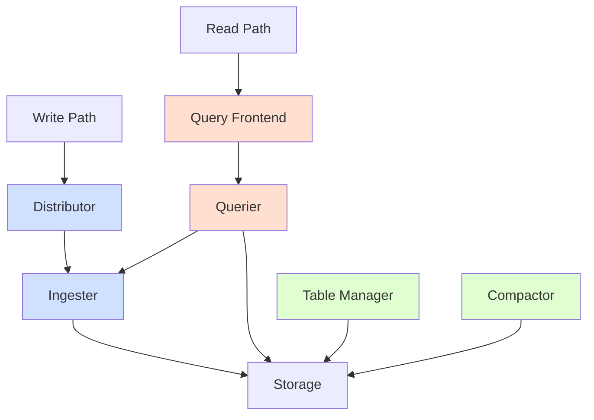

# Microservices Mode

## Introduction

Microservices Mode is one of the advanced deployment options for Grafana Loki, designed specifically for production environments that require high scalability, availability, and performance. Unlike Monolithic and Simple Scalable modes, Microservices Mode breaks down Loki's functionality into individual components that can be scaled independently based on your specific workload requirements.

This deployment model follows true microservices architecture principles, making it ideal for large-scale environments where you need granular control over resources and the ability to handle massive logging workloads efficiently.

## When to Use Microservices Mode

You should consider Microservices Mode when:

- You have a production environment with high availability requirements
- Your logging volume is large (multiple GB per hour)
- You need to scale components independently to optimize resource usage
- You're running Loki in a Kubernetes environment
- You have the operational expertise to manage a distributed system

## Architecture Overview

In Microservices Mode, Loki is split into the following components:



### Key Components

1. **Distributor**: Receives incoming logs, validates them, and distributes them to ingesters.
2. **Ingester**: Writes log data to long-term storage and handles in-memory processing.
3. **Query Frontend**: Optimizes queries and splits them into smaller ones for efficient processing.
4. **Querier**: Executes queries against both ingesters (for recent data) and storage (for older data).
5. **Table Manager**: Manages the creation and deletion of tables in the index store (optional, deprecated in newer versions).
6. **Compactor**: Optimizes storage by compacting and deduplicating stored logs.
7. **Ruler**: Evaluates alerting rules and sends alerts (optional).

## Deployment Example with Kubernetes

Microservices Mode is commonly deployed using Kubernetes. Below is an example of deploying the Distributor component using a Kubernetes manifest:

```yaml
apiVersion: apps/v1
kind: Deployment
metadata:
  name: loki-distributor
  namespace: loki
spec:
  replicas: 3
  selector:
    matchLabels:
      app: loki
      component: distributor
  template:
    metadata:
      labels:
        app: loki
        component: distributor
    spec:
      containers:
        - name: loki
          image: grafana/loki:2.8.0
          args:
            - -target=distributor
            - -config.file=/etc/loki/config/config.yaml
          ports:
            - name: http
              containerPort: 3100
          resources:
            limits:
              cpu: 500m
              memory: 1Gi
            requests:
              cpu: 100m
              memory: 512Mi
          volumeMounts:
            - name: config
              mountPath: /etc/loki/config
      volumes:
        - name: config
          configMap:
            name: loki-config
```

## Configuration Example

When running Loki in Microservices Mode, you'll need a comprehensive configuration file to define how each component operates. Here's an example configuration:

```yaml
auth_enabled: false

server:
  http_listen_port: 3100

distributor:
  ring:
    kvstore:
      store: memberlist

ingester:
  lifecycler:
    ring:
      kvstore:
        store: memberlist
      replication_factor: 3
    final_sleep: 0s
  chunk_idle_period: 1h
  chunk_retention_period: 1h
  max_transfer_retries: 0

memberlist:
  join_members:
    - loki-memberlist

limits_config:
  enforce_metric_name: false
  reject_old_samples: true
  reject_old_samples_max_age: 168h
  max_global_streams_per_user: 10000
  ingestion_rate_mb: 10
  ingestion_burst_size_mb: 20

schema_config:
  configs:
    - from: 2020-07-01
      store: boltdb-shipper
      object_store: s3
      schema: v11
      index:
        prefix: index_
        period: 24h

storage_config:
  aws:
    s3: s3://access_key:secret_key@region/bucket_name
  boltdb_shipper:
    active_index_directory: /data/loki/index
    cache_location: /data/loki/index_cache
    shared_store: s3

compactor:
  working_directory: /data/loki/compactor
  shared_store: s3
```

## Scaling Components Independently

One of the main advantages of Microservices Mode is the ability to scale components independently. Here's how you might scale different components based on workload:

| Component | Scaling Factor | When to Scale |
|-----------|----------------|---------------|
| Distributor | Write throughput | When log volume increases |
| Ingester | Memory pressure | When temporary storage needs grow |
| Query Frontend | Query complexity | When many complex queries are performed |
| Querier | Query volume | When read operations increase |
| Compactor | Storage size | When stored log volume is large |

## Operational Considerations

When operating Loki in Microservices Mode, keep these factors in mind:

1. **Resource Requirements**: Microservices Mode requires more resources than simpler deployment modes.

2. **Monitoring**: Set up comprehensive monitoring for each component:

```yaml
prometheus:
  scrape_configs:
    - job_name: 'loki-components'
      kubernetes_sd_configs:
        - role: pod
      relabel_configs:
        - source_labels: [__meta_kubernetes_pod_label_app]
          action: keep
          regex: loki
```

3. **High Availability**: Configure component replication properly:

```yaml
ingester:
  lifecycler:
    ring:
      replication_factor: 3  # Ensures data is replicated across 3 ingesters
```

4. **Storage Backend**: Choose appropriate storage options:
   - Object storage (S3, GCS, Azure Blob) for chunks
   - Cassandra, DynamoDB, or BoltDB-Shipper for indices

## Step-by-Step Migration to Microservices Mode

If you're upgrading from a simpler deployment, follow these steps:

1. **Evaluate needs**: Determine if Microservices Mode is necessary for your scale.
2. **Design architecture**: Plan component distribution and replication.
3. **Set up storage**: Configure object storage and index storage.
4. **Deploy core components**: Start with distributors, ingesters, and queriers.
5. **Configure networking**: Ensure components can communicate.
6. **Add optional components**: Deploy ruler, compactor as needed.
7. **Test thoroughly**: Validate both write and read paths.
8. **Set up monitoring**: Implement alerts for component health.

## Practical Example: Handling Log Volume Spikes

Let's examine a real-world scenario where Microservices Mode shines. Imagine an e-commerce platform experiencing traffic spikes during sales events:

1. **Challenge**: Log volume increases from 2GB/hour to 20GB/hour during a flash sale.

2. **Solution in Microservices Mode**:
   - Scale up distributors to handle increased write load:
   
   ```bash
   kubectl scale deployment loki-distributor --replicas=10
   ```
   
   - Increase ingester resources for temporary storage:
   
   ```yaml
   resources:
     limits:
       memory: 4Gi
     requests:
       memory: 2Gi
   ```
   
   - Keep read path components stable if query patterns remain unchanged

3. **Result**: The platform successfully captures all logs during the high-traffic event without impacting query performance.

## Troubleshooting Common Issues

| Issue | Possible Cause | Solution |
|-------|----------------|----------|
| Write failures | Distributor overload | Scale distributors, check rate limits |
| Slow queries | Insufficient queriers | Scale query frontends and queriers |
| High memory usage | Ingester retention settings | Adjust `chunk_idle_period` and resource limits |
| Storage growing too fast | Missing compaction | Check compactor logs and configuration |

## Summary

Microservices Mode provides the most flexible and scalable deployment option for Grafana Loki. While it requires more operational overhead than simpler deployment modes, it offers:

- Independent scaling of components
- Higher availability through component replication
- Better resource utilization
- Ability to handle large-scale logging workloads

This deployment mode is ideal for production environments with significant logging requirements and the operational expertise to manage a distributed system.

## Additional Resources

- [Grafana Loki Architecture Documentation](https://grafana.com/docs/loki/latest/fundamentals/architecture/)
- [Loki Microservices Deployment Examples](https://github.com/grafana/loki/tree/main/production)
- [Kubernetes Operator for Loki](https://github.com/grafana/loki/tree/main/operator)

## Exercises

1. Compare the resource requirements between Monolithic and Microservices Mode for a system ingesting 5GB of logs per day.

2. Design a Microservices Mode deployment for a high-availability scenario where no single component failure should affect log ingestion or querying.

3. Create a monitoring dashboard that shows the health and performance of each Loki component in Microservices Mode.

4. Implement a horizontal pod autoscaling configuration for distributors based on CPU usage.