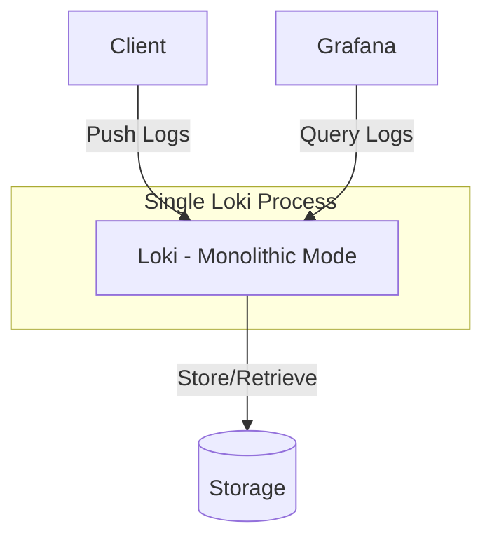

# Monolithic Mode

## Introduction

Monolithic Mode is the simplest deployment option for Grafana Loki, where all Loki components run as a single process. This deployment model is ideal for small to medium-sized environments, development setups, or when you're just getting started with Loki. In this mode, Loki operates as a self-contained system rather than as distributed microservices.

## What is Monolithic Mode?

In Monolithic Mode, all of Loki's components—including the distributor, ingester, querier, and query frontend—run within a single binary. This provides a simplified architecture that's easy to deploy and manage.



This deployment model contrasts with Loki's microservices mode, where each component runs as a separate service, allowing for horizontal scaling and higher availability.

## When to Use Monolithic Mode

Monolithic Mode is appropriate for:

- Development and testing environments
- Small production deployments (single teams or applications)
- Environments with limited resources
- Learning and experimenting with Loki
- Scenarios where operational simplicity is preferred over scalability

## Setting Up Loki in Monolithic Mode

### Prerequisites

- Docker (for containerized deployment) or a host where you can run the Loki binary
- Basic understanding of logging systems
- Storage for log data (local filesystem for simplicity)

### Basic Docker Deployment

Here's how to quickly deploy Loki in Monolithic Mode using Docker:

```bash
docker run -d --name loki -p 3100:3100 grafana/loki:latest
```

This command pulls the latest Loki image and runs it with the default configuration, which uses Monolithic Mode.

### Using a Configuration File

For more control, you can create a custom configuration file:

```yaml
auth_enabled: false

server:
  http_listen_port: 3100

common:
  path_prefix: /loki
  storage:
    filesystem:
      chunks_directory: /loki/chunks
      rules_directory: /loki/rules
  replication_factor: 1

schema_config:
  configs:
    - from: 2020-10-24
      store: boltdb-shipper
      object_store: filesystem
      schema: v11
      index:
        prefix: index_
        period: 24h

ruler:
  alertmanager_url: http://localhost:9093

# Simple retention setting
limits_config:
  retention_period: 744h  # 31 days
```

Save this as `loki-config.yaml` and run Loki with:

```bash
docker run -d --name loki -v $(pwd)/loki-config.yaml:/etc/loki/local-config.yaml -p 3100:3100 grafana/loki:latest
```

### Testing Your Deployment

To verify your Loki instance is running correctly, make a simple API request:

```bash
curl http://localhost:3100/ready
```

If Loki is healthy, it should return `ready`.

## Configuring Log Sources

Once Loki is running, you need to configure log sources to send logs to it. Here's an example using Promtail, a common log shipper for Loki:

```yaml
server:
  http_listen_port: 9080
  grpc_listen_port: 0

positions:
  filename: /tmp/positions.yaml

clients:
  - url: http://localhost:3100/loki/api/v1/push

scrape_configs:
  - job_name: system
    static_configs:
      - targets:
          - localhost
        labels:
          job: varlogs
          __path__: /var/log/*log
```

Save this as `promtail-config.yaml` and run Promtail:

```bash
docker run -d --name promtail -v $(pwd)/promtail-config.yaml:/etc/promtail/config.yaml -v /var/log:/var/log grafana/promtail:latest
```

## Monolithic Mode Resource Requirements

One advantage of Monolithic Mode is the efficient use of resources. Here's what you might expect:

| Resource | Minimum | Recommended |
|----------|---------|-------------|
| CPU      | 1 core  | 2+ cores    |
| Memory   | 512MB   | 2GB+        |
| Disk     | 10GB    | Based on retention and log volume |

These requirements will vary depending on your log volume and query patterns.

## Limitations of Monolithic Mode

While convenient, Monolithic Mode has several limitations:

1. **Limited Scalability**: Cannot scale individual components independently
2. **Single Point of Failure**: No built-in redundancy
3. **Resource Constraints**: All components compete for the same resources
4. **Limited Query Performance**: Not optimized for high-volume query loads
5. **Upgrade Challenges**: Requires complete service restart for updates

## When to Consider Migrating from Monolithic Mode

Consider migrating to Microservices Mode when:

- Your log volume exceeds several GB per day
- You need high availability for your logging system
- Query performance becomes a bottleneck
- You need to scale specific components independently
- Your organization requires enterprise-grade reliability

## Real-World Example: Monitoring a Web Application

Let's walk through a practical example of using Loki in Monolithic Mode to monitor a web application.

### Scenario

You have a small e-commerce site running on a single server, and you want to track application logs, system logs, and access logs.

### Step 1: Deploy Loki in Monolithic Mode

Use the Docker command we saw earlier:

```bash
docker run -d --name loki -p 3100:3100 grafana/loki:latest
```

### Step 2: Configure Promtail to Collect Logs

Create a configuration to collect application logs:

```yaml
server:
  http_listen_port: 9080

positions:
  filename: /tmp/positions.yaml

clients:
  - url: http://localhost:3100/loki/api/v1/push

scrape_configs:
  - job_name: application
    static_configs:
      - targets:
          - localhost
        labels:
          job: ecommerce
          app: webshop
          env: production
          __path__: /var/log/webshop/*.log

  - job_name: nginx
    static_configs:
      - targets:
          - localhost
        labels:
          job: nginx
          app: webshop
          env: production
          __path__: /var/log/nginx/access.log
```

### Step 3: Query Logs in Grafana

Connect Grafana to your Loki instance and run queries like:

```
{app="webshop"} |= "error"
```

This query finds all logs from your webshop application containing the word "error".

```
{job="nginx"} | json | status >= 400
```

This query finds all HTTP requests resulting in error statuses (assuming your Nginx logs are in JSON format).

## Best Practices for Monolithic Mode

1. **Regular Backups**: Back up your storage directory regularly
2. **Monitoring**: Set up monitoring for the Loki process itself
3. **Resource Limits**: Configure appropriate resource limits in Docker
4. **Log Retention**: Configure appropriate retention periods to manage disk usage
5. **Labels**: Use a consistent labeling scheme for your logs
6. **Index Periods**: Adjust index periods based on your query patterns
7. **Compression**: Enable compression for stored chunks to save space

## Troubleshooting Common Issues

### High Memory Usage

If Loki is consuming too much memory:

```yaml
limits_config:
  ingestion_rate_mb: 4
  ingestion_burst_size_mb: 6
  max_entries_limit_per_query: 5000
```

### Slow Queries

For improved query performance:

```yaml
query_range:
  split_queries_by_interval: 24h
  parallelise_shardable_queries: true
```

### Log Ingestion Failures

If log ingestion is failing, check:

1. Network connectivity between log sources and Loki
2. Correct URL in client configurations
3. Permissions on storage directories

## Summary

Monolithic Mode provides a simple way to deploy Grafana Loki for small to medium environments. It offers:

- Easy setup and management
- Lower resource requirements
- Simplified operations
- Perfect for development, testing, and smaller production use cases

As your logging needs grow, you can migrate to Loki's Microservices Mode for enhanced scalability and reliability.

## Additional Resources

- [Grafana Loki Documentation](https://grafana.com/docs/loki/latest/)
- [Loki GitHub Repository](https://github.com/grafana/loki)
- [Grafana Community Forums](https://community.grafana.com/)

## Exercises

1. Deploy Loki in Monolithic Mode and configure it to collect logs from a sample application.
2. Experiment with different log queries in Grafana to extract useful information.
3. Configure log retention and see how it affects disk usage.
4. Compare resource usage between default settings and custom configuration.
5. Design a migration plan from Monolithic Mode to Microservices Mode.