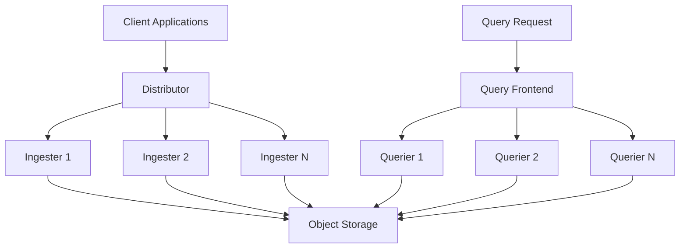

# Horizontal Scaling

## Introduction

Horizontal scaling is a critical approach when deploying Grafana Loki in production environments that need to handle large volumes of logs. Unlike vertical scaling (adding more resources to a single server), horizontal scaling involves adding more instances of components to distribute the workload across multiple servers.

In this guide, you'll learn how to horizontally scale Grafana Loki to handle increased log volumes while maintaining performance and reliability. This is particularly important when your logging needs grow beyond what a single instance can handle efficiently.

## Understanding Loki's Components

Before diving into scaling strategies, let's understand Loki's microservice architecture, which is designed to be horizontally scalable from the ground up.



The main components that can be horizontally scaled include:

- **Distributors**: Handle incoming log data and distribute it to ingesters
- **Ingesters**: Process and store log data temporarily before flushing to long-term storage
- **Query Frontend**: Splits and schedules queries across multiple queriers
- **Queriers**: Execute queries against both ingesters and storage
- **Compactor**: Handles compaction of stored chunks (can be scaled but often doesn't need to be)

## When to Scale Horizontally

You should consider horizontally scaling your Loki deployment when:

1. **Increased log volume**: Your applications are generating more logs than your current setup can handle
2. **Query performance degradation**: Queries are taking longer to complete
3. **High resource utilization**: Your current instances are consistently at high CPU/memory utilization
4. **Need for higher availability**: You want to improve fault tolerance and eliminate single points of failure

## Scaling with Kubernetes

Kubernetes is the most common platform for deploying scaled Loki instances. Let's look at how you can configure horizontal scaling with Kubernetes.

### Basic Kubernetes Deployment Example

Here's a simplified example of a Kubernetes deployment for Loki components:

```yaml
apiVersion: apps/v1
kind: Deployment
metadata:
  name: loki-distributor
spec:
  replicas: 3  # Start with 3 replicas
  selector:
    matchLabels:
      app: loki
      component: distributor
  template:
    metadata:
      labels:
        app: loki
        component: distributor
    spec:
      containers:
      - name: distributor
        image: grafana/loki:2.8.0
        args:
          - "-target=distributor"
          - "-config.file=/etc/loki/config.yaml"
        ports:
          - containerPort: 3100
            name: http
        resources:
          requests:
            cpu: 200m
            memory: 256Mi
          limits:
            cpu: 1
            memory: 1Gi
```

### Using Horizontal Pod Autoscaler (HPA)

For automatic scaling based on metrics, you can use Kubernetes' HPA:

```yaml
apiVersion: autoscaling/v2
kind: HorizontalPodAutoscaler
metadata:
  name: loki-distributor-hpa
spec:
  scaleTargetRef:
    apiVersion: apps/v1
    kind: Deployment
    name: loki-distributor
  minReplicas: 2
  maxReplicas: 10
  metrics:
  - type: Resource
    resource:
      name: cpu
      target:
        type: Utilization
        averageUtilization: 70
```

This configuration will automatically scale the distributor deployment between 2 and 10 replicas based on CPU utilization, targeting 70% utilization.

## Configuring Loki for Horizontal Scaling

To properly scale Loki, you need an appropriate configuration. Here's a sample configuration focusing on the key parameters for horizontal scaling:

```yaml
auth_enabled: false

server:
  http_listen_port: 3100

ingester:
  lifecycler:
    ring:
      kvstore:
        store: memberlist
      replication_factor: 3  # Number of replicas for each log stream
  chunk_idle_period: 30m
  max_transfer_retries: 0
  wal:
    enabled: true
    dir: /loki/wal

memberlist:
  join_members:
    - loki-memberlist

limits_config:
  enforce_metric_name: false
  reject_old_samples: true
  reject_old_samples_max_age: 168h
  max_global_streams_per_user: 10000

schema_config:
  configs:
    - from: 2020-07-01
      store: boltdb-shipper
      object_store: s3
      schema: v11
      index:
        prefix: index_
        period: 24h

storage_config:
  boltdb_shipper:
    active_index_directory: /loki/index
    cache_location: /loki/cache
    shared_store: s3
  aws:
    s3: s3://access_key:secret_key@region/bucket_name
```

Key configuration aspects for scaling:

1. **Replication Factor**: Higher values (e.g., `replication_factor: 3`) increase reliability but require more resources
2. **Ring Configuration**: Using `memberlist` for service discovery helps with dynamic scaling
3. **Shared Storage**: All components must use the same backend storage (S3 in this example)

## Best Practices for Horizontal Scaling

### 1. Start with Component-Level Planning

Scale each component separately based on their specific resource needs:

- **Distributors**: CPU-bound; scale based on incoming log volume
- **Ingesters**: Memory-bound; scale based on the number of active streams and chunk storage
- **Queriers**: CPU-bound for query processing; scale based on query load

### 2. Resource Allocation

```yaml
resources:
  requests:
    cpu: 2
    memory: 10Gi
  limits:
    cpu: 4
    memory: 16Gi
```

Start with conservative estimates and adjust based on monitoring data.

### 3. Implement Proper Monitoring

Monitor key metrics for each component to identify scaling needs:

- **Distributors**: Request rate, request latency, queue length
- **Ingesters**: Memory usage, active series, flush rate, WAL length
- **Queriers**: Query rate, query latency, query queue length

### 4. Use Affinity Rules for Distribution

For high availability, distribute components across different nodes:

```yaml
affinity:
  podAntiAffinity:
    requiredDuringSchedulingIgnoredDuringExecution:
      - labelSelector:
          matchExpressions:
            - key: app
              operator: In
              values:
                - loki
            - key: component
              operator: In
              values:
                - ingester
        topologyKey: "kubernetes.io/hostname"
```

### 5. Implement Load Balancing

For ingestion traffic, set up a load balancer in front of distributors:

```yaml
apiVersion: v1
kind: Service
metadata:
  name: loki-distributor
spec:
  selector:
    app: loki
    component: distributor
  ports:
    - port: 3100
      targetPort: 3100
  type: LoadBalancer
```

## Real-World Example: Scaling for 100GB/day Log Volume

Let's look at a practical example for an environment processing approximately 100GB of logs per day:

### Initial Setup:
- 3 distributors (2 vCPU, 4GB RAM each)
- 3 ingesters (4 vCPU, 16GB RAM each)
- 2 query frontends (2 vCPU, 4GB RAM each)
- 4 queriers (4 vCPU, 8GB RAM each)
- 1 compactor (2 vCPU, 8GB RAM)

### Scaling Decision Points:

1. **When ingestion latency exceeds 500ms**: Add distributor replicas
2. **When ingester memory utilization exceeds 70%**: Add ingester replicas
3. **When query latency exceeds 3 seconds**: Add querier replicas

### Configuration for High Availability:

```yaml
distributor:
  ring:
    kvstore:
      store: memberlist

ingester:
  lifecycler:
    ring:
      kvstore:
        store: memberlist
      replication_factor: 3
    final_sleep: 0s
  chunk_idle_period: 30m
  chunk_retain_period: 1m
  wal:
    enabled: true
    dir: /loki/wal
```

## Troubleshooting Scaling Issues

Common issues and solutions when scaling Loki:

| Issue | Symptoms | Solution |
|-------|----------|----------|
| Ingesters OOMing | Ingesters crashing with out-of-memory errors | Increase memory limits or decrease `max_chunk_age` |
| High query latency | Slow query response times | Add more queriers or optimize queries by adding more specific label filters |
| Replication lag | Inconsistent query results | Ensure sufficient network bandwidth between ingesters |
| Compaction bottlenecks | Increasing storage usage | Scale the compactor or adjust compaction interval |

## Alternative: Using Grafana Enterprise Metrics (GEM)

For organizations with enterprise requirements, Grafana Labs offers Grafana Enterprise Metrics (GEM), which provides:

- Autoscaling capabilities
- Enhanced monitoring
- Support for multi-tenancy
- Simplified operations

## Summary

Horizontal scaling is essential for running Loki in production environments with high log volumes. The key points to remember:

1. Scale individual components based on their specific resource requirements
2. Configure proper replication for reliability
3. Use shared object storage like S3 or GCS
4. Implement comprehensive monitoring to identify scaling needs
5. Use Kubernetes and HPA for automated scaling
6. Plan for gradual scaling as your log volume increases

By following these best practices, you can build a Loki deployment that scales efficiently with your growing logging needs while maintaining performance and reliability.

## Exercises

1. Deploy a basic horizontally scaled Loki setup with 2 distributors and 2 ingesters using the provided YAML templates.
2. Configure Horizontal Pod Autoscaler for your Loki components and test with varying load.
3. Monitor key metrics and identify which component needs scaling first in your environment.
4. Calculate the appropriate replication factor for your availability requirements.

## Additional Resources

- [Grafana Loki Architecture Documentation](https://grafana.com/docs/loki/latest/fundamentals/architecture/)
- [Loki Scaling Guidelines](https://grafana.com/docs/loki/latest/best-practices/)
- [Kubernetes HPA Documentation](https://kubernetes.io/docs/tasks/run-application/horizontal-pod-autoscale/)
- [Grafana Loki Community Forums](https://community.grafana.com/)