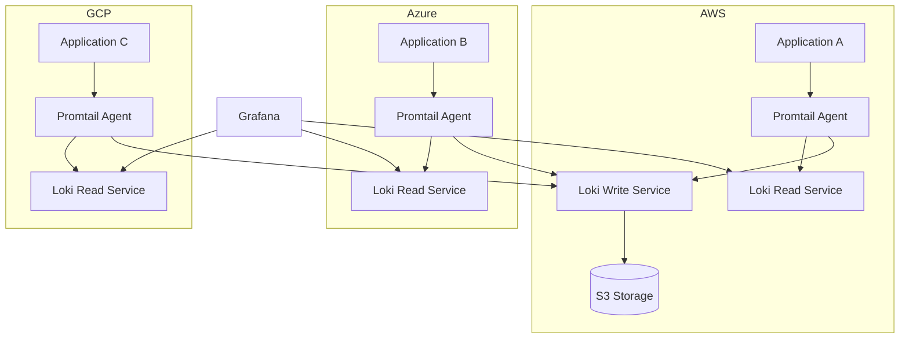

# Cloud Provider Deployments

## Introduction

Cloud provider deployments offer a convenient and scalable way to run Grafana Loki in production environments. Instead of managing your own infrastructure, you can leverage managed services from major cloud providers to simplify deployment, scaling, and maintenance of your logging stack.

In this guide, we'll explore how to deploy Grafana Loki across different cloud providers, examining both managed offerings and self-managed options on cloud infrastructure. This approach is particularly beneficial for teams looking to minimize operational overhead while maintaining robust logging capabilities.

## Why Deploy Loki in the Cloud?

Before diving into specific cloud providers, let's understand the benefits of cloud-based Loki deployments:

- **Reduced operational burden**: Cloud providers handle infrastructure maintenance, security patches, and hardware failures
- **Elastic scaling**: Easily scale your logging infrastructure up or down based on demand
- **High availability**: Built-in redundancy across multiple availability zones
- **Cost optimization**: Pay only for resources you actually use
- **Integration**: Seamless connectivity with other cloud services in your ecosystem

## Deployment Options Across Major Cloud Providers

### AWS (Amazon Web Services)

AWS offers multiple ways to deploy Grafana Loki:

#### Option 1: Amazon Managed Service for Prometheus and Grafana

While AWS doesn't offer a directly managed Loki service, you can use Amazon Managed Service for Grafana (AMG) alongside your self-managed Loki deployment:

1. Create an Amazon Managed Service for Grafana workspace
2. Deploy Loki on Amazon EKS (Elastic Kubernetes Service)
3. Connect your AMG workspace to your Loki instance

Here's how to deploy Loki on EKS using Helm:

```bash
# Create an EKS cluster (if you don't have one already)
eksctl create cluster --name loki-cluster --region us-west-2

# Add the Grafana Helm repository
helm repo add grafana https://grafana.github.io/helm-charts
helm repo update

# Create a values file for Loki configuration
cat << EOF > loki-values.yaml
loki:
  auth_enabled: false
  storage:
    type: s3
    s3:
      s3: s3://loki-storage-bucket
      region: us-west-2
EOF

# Install Loki using Helm
helm install loki grafana/loki-stack -f loki-values.yaml
```

#### Option 2: Loki on AWS ECS (Elastic Container Service)

For teams that prefer Docker-based deployments, ECS offers a viable alternative:

```bash
# Create an ECS task definition for Loki
cat << EOF > loki-task.json
{
  "family": "loki",
  "executionRoleArn": "arn:aws:iam::123456789012:role/ecsTaskExecutionRole",
  "networkMode": "awsvpc",
  "containerDefinitions": [
    {
      "name": "loki",
      "image": "grafana/loki:latest",
      "essential": true,
      "portMappings": [
        {
          "containerPort": 3100,
          "hostPort": 3100,
          "protocol": "tcp"
        }
      ],
      "logConfiguration": {
        "logDriver": "awslogs",
        "options": {
          "awslogs-group": "/ecs/loki",
          "awslogs-region": "us-west-2",
          "awslogs-stream-prefix": "ecs"
        }
      }
    }
  ],
  "requiresCompatibilities": ["FARGATE"],
  "cpu": "1024",
  "memory": "2048"
}
EOF

# Register the task definition
aws ecs register-task-definition --cli-input-json file://loki-task.json

# Create an ECS service to run Loki
aws ecs create-service \
  --cluster your-cluster \
  --service-name loki-service \
  --task-definition loki:1 \
  --desired-count 1 \
  --launch-type FARGATE \
  --network-configuration "awsvpcConfiguration={subnets=[subnet-12345678],securityGroups=[sg-12345678],assignPublicIp=ENABLED}"
```

### GCP (Google Cloud Platform)

#### Option 1: Google Managed Service for Prometheus and Grafana + GKE for Loki

Similar to AWS, Google Cloud offers a managed Grafana service that you can connect to Loki:

1. Enable Managed Service for Grafana in the Google Cloud Console
2. Create a GKE (Google Kubernetes Engine) cluster to host Loki
3. Install Loki using Helm on GKE
4. Configure the managed Grafana instance to use your Loki datasource

```bash
# Create a GKE cluster
gcloud container clusters create loki-cluster \
  --zone us-central1-a \
  --num-nodes 3 \
  --machine-type e2-standard-4

# Get credentials for the cluster
gcloud container clusters get-credentials loki-cluster --zone us-central1-a

# Install Loki using Helm
helm repo add grafana https://grafana.github.io/helm-charts
helm repo update
helm install loki grafana/loki-stack
```

#### Option 2: Loki on Google Cloud Run

For simpler deployments with less configurability:

```bash
# Build and push a Loki Docker image to Google Container Registry
docker build -t gcr.io/your-project-id/loki:latest .
docker push gcr.io/your-project-id/loki:latest

# Deploy to Cloud Run
gcloud run deploy loki \
  --image gcr.io/your-project-id/loki:latest \
  --platform managed \
  --port 3100 \
  --memory 2Gi \
  --allow-unauthenticated
```

### Azure

#### Option 1: Azure Managed Grafana + AKS for Loki

Microsoft Azure offers Azure Managed Grafana which you can integrate with a Loki instance running on AKS:

```bash
# Create an AKS cluster
az aks create \
  --resource-group myResourceGroup \
  --name lokiCluster \
  --node-count 3 \
  --enable-addons monitoring \
  --generate-ssh-keys

# Get credentials for the cluster
az aks get-credentials --resource-group myResourceGroup --name lokiCluster

# Install Loki using Helm
helm repo add grafana https://grafana.github.io/helm-charts
helm repo update
helm install loki grafana/loki-stack

# Create an Azure Managed Grafana instance
az grafana create \
  --name myGrafana \
  --resource-group myResourceGroup \
  --location eastus
```

## Architecture Pattern: Multi-Cloud Loki

For organizations with multi-cloud strategies, you can design a Loki deployment that spans multiple cloud providers. Here's a diagram showing a common architecture:



## Best Practices for Cloud Deployments

Regardless of which cloud provider you choose, consider these best practices:

1. **Network Security**: 
   - Restrict access to your Loki instances using security groups or firewall rules
   - Use private endpoints where available to keep traffic within the cloud provider's network

2. **Storage Configuration**:
   - Use cloud-native object storage (S3, GCS, Azure Blob Storage) for Loki's chunks
   - Configure appropriate retention periods to manage storage costs

3. **Authentication**:
   - Implement proper authentication for both Grafana and Loki
   - Use managed identity services when available (IAM, Workload Identity, Managed Identities)

4. **Monitoring**:
   - Set up monitoring for your Loki deployment itself
   - Create alerts for high resource utilization

5. **Cost Optimization**:
   - Implement log retention policies to control storage costs
   - Consider using spot instances for non-critical components

## Practical Example: Complete AWS Deployment

Let's walk through a comprehensive example of deploying Loki in AWS using EKS and S3:

1. First, create an S3 bucket for Loki storage:

```bash
aws s3 mb s3://my-loki-storage-bucket --region us-east-1
```

2. Create an IAM policy that allows Loki to access this bucket:

```bash
cat << EOF > loki-s3-policy.json
{
  "Version": "2012-10-17",
  "Statement": [
    {
      "Effect": "Allow",
      "Action": [
        "s3:ListBucket",
        "s3:PutObject",
        "s3:GetObject",
        "s3:DeleteObject"
      ],
      "Resource": [
        "arn:aws:s3:::my-loki-storage-bucket",
        "arn:aws:s3:::my-loki-storage-bucket/*"
      ]
    }
  ]
}
EOF

aws iam create-policy --policy-name LokiS3Policy --policy-document file://loki-s3-policy.json
```

3. Create a Kubernetes service account and associate it with the IAM policy:

```bash
eksctl create iamserviceaccount \
  --cluster=my-eks-cluster \
  --namespace=loki \
  --name=loki \
  --attach-policy-arn=arn:aws:iam::123456789012:policy/LokiS3Policy \
  --approve
```

4. Create a values file for Helm deployment:

```yaml
loki:
  auth_enabled: true
  serviceAccount:
    create: false
    name: loki
  storage:
    bucketNames:
      chunks: my-loki-storage-bucket
      ruler: my-loki-storage-bucket
      admin: my-loki-storage-bucket
    type: s3
    s3:
      s3: null
      region: us-east-1
  schema_config:
    configs:
      - from: 2020-10-24
        store: boltdb-shipper
        object_store: s3
        schema: v11
        index:
          prefix: index_
          period: 24h

promtail:
  enabled: true
  config:
    clients:
      - url: http://loki:3100/loki/api/v1/push
```

5. Deploy Loki using Helm:

```bash
# Create a namespace for Loki
kubectl create namespace loki

# Install Loki with our configuration
helm install loki grafana/loki-stack -n loki -f values.yaml
```

6. Configure an Ingress controller to expose your Loki API:

```yaml
apiVersion: networking.k8s.io/v1
kind: Ingress
metadata:
  name: loki-ingress
  namespace: loki
  annotations:
    kubernetes.io/ingress.class: alb
    alb.ingress.kubernetes.io/scheme: internet-facing
    alb.ingress.kubernetes.io/target-type: ip
spec:
  rules:
    - host: loki.example.com
      http:
        paths:
          - path: /
            pathType: Prefix
            backend:
              service:
                name: loki
                port:
                  number: 3100
```

7. Finally, configure Amazon Managed Grafana to use your Loki instance:

In the Grafana UI:
1. Go to Configuration > Data Sources
2. Click "Add data source"
3. Select "Loki"
4. Enter the URL to your Loki instance (e.g., http://loki.example.com)
5. Configure authentication if needed
6. Click "Save & Test"

## Troubleshooting Common Issues

When deploying Loki in cloud environments, you might encounter these common issues:

1. **Insufficient Permissions**: Ensure your service accounts have appropriate permissions to access storage buckets.

```bash
# Check AWS IAM policy
aws iam get-policy-document --policy-arn arn:aws:iam::123456789012:policy/LokiS3Policy
```

2. **Resource Constraints**: Loki can be resource-intensive, especially for high-volume log ingestion.

```bash
# Check Kubernetes pod resources
kubectl top pod -n loki
```

3. **Network Connectivity**: Ensure your network allows communication between components.

```bash
# Test connectivity to Loki
kubectl run -it --rm debug --image=curlimages/curl -- curl -v http://loki.loki:3100/ready
```

## Summary

Cloud provider deployments offer a flexible and scalable way to run Grafana Loki in production. Whether you choose AWS, GCP, Azure, or a multi-cloud approach, these platforms provide the infrastructure needed to build a robust logging solution.

Key points to remember:
- Use managed services where available to reduce operational overhead
- Leverage cloud-native storage for cost-effective log retention
- Implement proper security controls for your logging infrastructure
- Monitor your Loki deployment to ensure optimal performance

By following the guidelines and examples in this guide, you'll be well-equipped to deploy Grafana Loki in any cloud environment, ensuring your applications' logs are collected, stored, and made available for analysis efficiently.

## Additional Resources

To further enhance your knowledge of cloud-based Loki deployments, explore these resources:

- [Official Grafana Loki Documentation](https://grafana.com/docs/loki/latest/)
- [Grafana Labs Helm Charts Repository](https://github.com/grafana/helm-charts)
- AWS, GCP, and Azure documentation for container services
- [Grafana Cloud](https://grafana.com/products/cloud/) for a fully managed Loki experience

## Exercises

1. Deploy a minimal Loki stack on a cloud provider of your choice.
2. Configure log shipping from a simple application to your Loki instance.
3. Set up a dashboard in Grafana to visualize logs from your application.
4. Experiment with different storage configurations and measure their impact on performance and cost.
5. Implement a multi-tenant Loki deployment that serves logs for multiple applications while maintaining isolation.