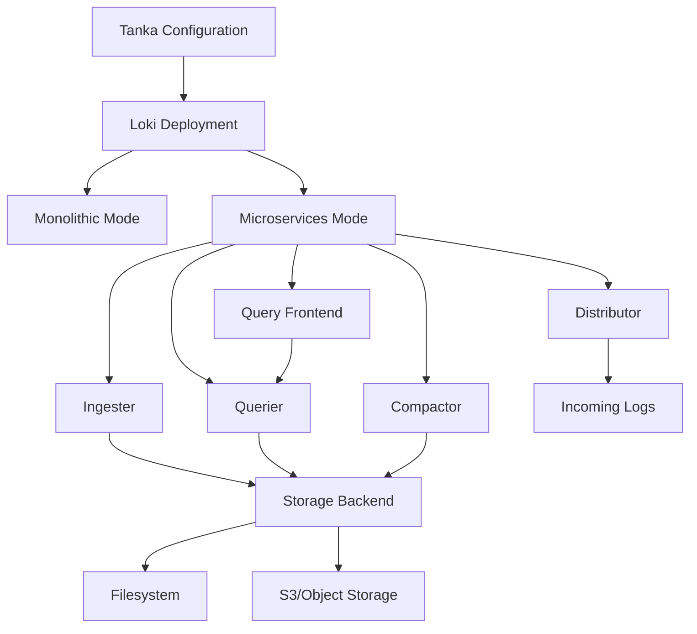

# Tanka Configuration

## Introduction

Tanka is a powerful configuration utility for Kubernetes that leverages the Jsonnet language to manage complex deployments. When deploying Grafana Loki in production environments, Tanka provides a flexible and maintainable approach to handle configuration complexity. This guide will walk you through configuring Grafana Loki using Tanka, explaining key concepts and providing practical examples.

## What is Tanka?

Tanka is an advanced configuration tool developed by Grafana Labs that allows you to define Kubernetes resources using the Jsonnet data templating language. Unlike YAML-based tools, Tanka enables you to use programming constructs like variables, functions, and imports to create modular, reusable configuration.

Benefits of using Tanka for Loki deployment include:

- **Maintainability**: Reduce duplication through abstraction and reuse
- **Validation**: Catch configuration errors before applying them
- **Modularity**: Compose complex configurations from simple building blocks
- **Flexibility**: Easily adapt configurations for different environments

## Prerequisites

Before getting started with Tanka for Loki deployment, ensure you have:

- A running Kubernetes cluster
- `kubectl` configured to communicate with your cluster
- Basic understanding of Kubernetes concepts
- [Tanka](https://tanka.dev) and [Jsonnet](https://jsonnet.org) installed

You can install Tanka and the required tools with:

```bash
# Install Tanka
go install github.com/grafana/tanka/cmd/tk@latest

# Install Jsonnet Bundler for package management
go install github.com/jsonnet-bundler/jsonnet-bundler/cmd/jb@latest
```

## Setting Up a Tanka Project for Loki

Let's start by creating a new Tanka project for our Loki deployment:

```bash
# Create a new directory for your project
mkdir loki-tanka && cd loki-tanka

# Initialize a new Tanka project
tk init

# Initialize Jsonnet Bundler
jb init

# Install Loki and Kubernetes libraries
jb install github.com/grafana/loki/production/ksonnet/loki@main
jb install github.com/jsonnet-libs/k8s-libsonnet/1.20@main
```

This creates the basic structure for your Tanka project:

```
loki-tanka/
├── environments/
│   └── default/
│       ├── main.jsonnet
│       └── spec.json
├── jsonnetfile.json
├── jsonnetfile.lock.json
├── lib/
└── vendor/
```

## Basic Loki Configuration with Tanka

Let's create a basic Loki configuration in the `environments/default/main.jsonnet` file:

```jsonnet
// environments/default/main.jsonnet
local k = import 'github.com/grafana/loki/production/ksonnet/loki/k.libsonnet';
local loki = import 'github.com/grafana/loki/production/ksonnet/loki/loki.libsonnet';

// Define the Kubernetes namespace
local namespace = 'loki';

// Create a Loki instance with default configuration
local lokiConfig = loki {
  _config+:: {
    namespace: namespace,
    storage_backend: 'filesystem',
    replication_factor: 1,
    
    // Example storage configuration for filesystem backend
    storage_filesystem_directory: '/loki/chunks',
    
    // Resource requirements
    memcached_chunks_memory: '2Gi',
    memcached_index_queries_memory: '2Gi',
    memcached_results_memory: '2Gi',
  },
};

// Generate Kubernetes manifests
{ [name]: lokiConfig[name] for name in std.objectFields(lokiConfig) }
```

In this configuration:
- We import the Loki Jsonnet libraries
- Define a namespace for our Loki deployment
- Configure Loki to use the filesystem storage backend
- Set resource requirements for the various components

## Configuring Different Deployment Modes

Loki can be deployed in different modes depending on your scaling requirements. Let's look at how to configure these with Tanka:

### Monolithic Mode (Simple)

For smaller deployments or testing, you can use the monolithic mode:

```jsonnet
// environments/default/main.jsonnet
local k = import 'github.com/grafana/loki/production/ksonnet/loki/k.libsonnet';
local loki = import 'github.com/grafana/loki/production/ksonnet/loki/loki.libsonnet';

local namespace = 'loki';

local lokiConfig = loki {
  _config+:: {
    namespace: namespace,
    
    // Use monolithic deployment mode
    auth_enabled: false,
    target: 'monolithic',
    
    // Storage configuration
    storage_backend: 'filesystem',
    storage_filesystem_directory: '/loki/chunks',
    
    // Set resource limits
    loki_pod_resources: {
      requests: {
        cpu: '1',
        memory: '1Gi',
      },
      limits: {
        cpu: '2',
        memory: '2Gi',
      },
    },
  },
};

{ [name]: lokiConfig[name] for name in std.objectFields(lokiConfig) }
```

### Microservices Mode (Scalable)

For larger, production deployments, you can use the microservices mode which separates Loki components:

```jsonnet
// environments/production/main.jsonnet
local k = import 'github.com/grafana/loki/production/ksonnet/loki/k.libsonnet';
local loki = import 'github.com/grafana/loki/production/ksonnet/loki/loki.libsonnet';

local namespace = 'loki-prod';

local lokiConfig = loki {
  _config+:: {
    namespace: namespace,
    
    // Use microservices deployment mode
    auth_enabled: true,
    target: 'scalable',
    
    // Increase replication for reliability
    replication_factor: 3,
    
    // Use object storage for production
    storage_backend: 's3',
    s3_bucket_name: 'loki-logs',
    s3_region: 'us-west-2',
    
    // Configure component resources
    distributor_resources: {
      requests: { cpu: '500m', memory: '500Mi' },
      limits: { cpu: '1', memory: '1Gi' },
    },
    ingester_resources: {
      requests: { cpu: '1', memory: '4Gi' },
      limits: { cpu: '2', memory: '8Gi' },
    },
    querier_resources: {
      requests: { cpu: '1', memory: '2Gi' },
      limits: { cpu: '2', memory: '4Gi' },
    },
  },
};

{ [name]: lokiConfig[name] for name in std.objectFields(lokiConfig) }
```

## Creating Multiple Environments

A key benefit of Tanka is the ability to create multiple environments with different configurations. Let's create a development and production environment:

```bash
# Create development environment
tk env add environments/dev --namespace=loki-dev

# Create production environment
tk env add environments/prod --namespace=loki-prod
```

Now let's create specific configurations for each environment:

### Development Environment

```jsonnet
// environments/dev/main.jsonnet
local k = import 'github.com/grafana/loki/production/ksonnet/loki/k.libsonnet';
local loki = import 'github.com/grafana/loki/production/ksonnet/loki/loki.libsonnet';

// Import base configuration from a shared lib
local base = import '../../lib/base.libsonnet';

local dev_config = base {
  _config+:: {
    namespace: 'loki-dev',
    target: 'monolithic',
    auth_enabled: false,
    storage_backend: 'filesystem',
    
    // Smaller resource requirements for dev
    loki_pod_resources: {
      requests: {
        cpu: '100m',
        memory: '256Mi',
      },
      limits: {
        cpu: '500m',
        memory: '512Mi',
      },
    },
  },
};

{ [name]: dev_config[name] for name in std.objectFields(dev_config) }
```

### Production Environment

```jsonnet
// environments/prod/main.jsonnet
local k = import 'github.com/grafana/loki/production/ksonnet/loki/k.libsonnet';
local loki = import 'github.com/grafana/loki/production/ksonnet/loki/loki.libsonnet';

// Import base configuration from a shared lib
local base = import '../../lib/base.libsonnet';

local prod_config = base {
  _config+:: {
    namespace: 'loki-prod',
    target: 'scalable',
    auth_enabled: true,
    replication_factor: 3,
    
    // Use S3 for production storage
    storage_backend: 's3',
    s3_bucket_name: 'loki-logs-prod',
    s3_region: 'us-west-2',
    
    // Configure higher resource limits for production
    distributor_resources: {
      requests: { cpu: '1', memory: '1Gi' },
      limits: { cpu: '2', memory: '2Gi' },
    },
    ingester_resources: {
      requests: { cpu: '2', memory: '8Gi' },
      limits: { cpu: '4', memory: '16Gi' },
    },
    querier_resources: {
      requests: { cpu: '2', memory: '4Gi' },
      limits: { cpu: '4', memory: '8Gi' },
    },
  },
};

{ [name]: prod_config[name] for name in std.objectFields(prod_config) }
```

## Customizing Loki Components

Tanka allows you to customize individual Loki components. Here's how to add custom configurations to specific components:

### Custom Querier Configuration

```jsonnet
// environments/prod/main.jsonnet
// ... other imports and configurations ...

local prod_config = base {
  _config+:: {
    // ... other config options ...
  },
  
  // Customize the querier deployment
  querier_deployment+: {
    spec+: {
      template+: {
        spec+: {
          containers: [
            container {
              resources: {
                requests: { cpu: '2', memory: '4Gi' },
                limits: { cpu: '4', memory: '8Gi' },
              },
              // Add custom environment variables
              env+: [
                { name: 'JAEGER_AGENT_HOST', value: 'jaeger-agent' },
                { name: 'JAEGER_SAMPLER_TYPE', value: 'const' },
                { name: 'JAEGER_SAMPLER_PARAM', value: '1' },
              ],
            } for container in super.containers
          ],
        },
      },
    },
  },
};

// ... rest of the file ...
```

### Advanced Storage Configuration

```jsonnet
// environments/prod/main.jsonnet
// ... other imports and configurations ...

local prod_config = base {
  _config+:: {
    namespace: 'loki-prod',
    target: 'scalable',
    
    // S3 storage configuration with advanced settings
    storage_backend: 's3',
    s3_bucket_name: 'loki-logs-prod',
    s3_region: 'us-west-2',
    s3_endpoint: 's3.us-west-2.amazonaws.com',
    s3_access_key: 'ACCESS_KEY', // Consider using Kubernetes secrets instead
    s3_secret_key: 'SECRET_KEY', // Consider using Kubernetes secrets instead
    s3_insecure: false,
    s3_sse_encryption: true,
    
    // Object storage for chunks
    schemaConfig: {
      configs: [{
        from: '2020-07-01',
        store: 'boltdb-shipper',
        object_store: 's3',
        schema: 'v11',
        index: {
          prefix: 'index_',
          period: '24h',
        },
      }],
    },
    
    // ... other configurations ...
  },
};

// ... rest of the file ...
```

## Deploying Loki with Tanka

Once you've configured your Loki deployment with Tanka, you can validate and apply it to your cluster:

```bash
# Show the differences between your configuration and the cluster state
tk diff environments/dev

# Apply the configuration to the cluster
tk apply environments/dev
```

For production deployment:

```bash
# Validate production configuration
tk diff environments/prod

# Apply to production
tk apply environments/prod
```

## Visualizing Your Deployment Architecture



## Common Configuration Patterns

### High Availability Configuration

```jsonnet
// High availability configuration for Loki
{
  _config+:: {
    namespace: 'loki-ha',
    target: 'scalable',
    auth_enabled: true,
    
    // Increase replication factor for reliability
    replication_factor: 3,
    
    // Configure ring for HA
    ring_final_tokens: 512,
    
    // Configure ingesters for HA
    ingester_replicas: 3,
    ingester_wal_enabled: true,
    
    // Configure distributors for HA
    distributor_replicas: 3,
    
    // Configure queriers for HA
    querier_replicas: 3,
    querier_max_concurrent: 16,
    
    // Configure query frontend for HA
    query_frontend_replicas: 2,
    
    // Set appropriate resource limits
    // ...
  },
}
```

### Multi-Tenant Configuration

```jsonnet
// Multi-tenant configuration for Loki
{
  _config+:: {
    namespace: 'loki-multi',
    target: 'scalable',
    
    // Enable authentication for multi-tenancy
    auth_enabled: true,
    
    // Enable tenant isolation
    multi_tenant_enabled: true,
    
    // Configure per-tenant limits
    tenant_configs: {
      'tenant-a': {
        ingestion_rate_mb: 4,
        ingestion_burst_size_mb: 6,
        max_query_parallelism: 16,
        max_query_series: 10000,
      },
      'tenant-b': {
        ingestion_rate_mb: 8,
        ingestion_burst_size_mb: 10,
        max_query_parallelism: 32,
        max_query_series: 20000,
      },
    },
    
    // ... other configurations ...
  },
}
```

## Troubleshooting Tanka Deployments

When working with Tanka configurations for Loki, you might encounter a few common issues:

| Issue | Solution |
|-------|----------|
| Compilation errors | Check your Jsonnet syntax and ensure all imports are correctly specified |
| Resource not found | Verify the correct namespace is set in your environment `spec.json` |
| Configuration not applied | Run `tk diff` to see if your changes were detected |
| Memory-related pod crashes | Adjust resource limits in your Tanka configuration |
| Storage issues | Verify storage backend configuration parameters |

## Summary

In this guide, we've covered how to configure and deploy Grafana Loki using Tanka:

1. **Setting up a Tanka project** for Loki deployment
2. **Configuring different deployment modes** (monolithic and microservices)
3. **Creating multiple environments** for development and production
4. **Customizing Loki components** with specific configurations
5. **Deploying Loki** with Tanka commands
6. **Common configuration patterns** for high availability and multi-tenancy

Tanka provides a powerful way to manage Loki deployments through code, allowing for more maintainable, modular, and environment-specific configurations than traditional YAML-based approaches.

## Additional Resources

- [Tanka Official Documentation](https://tanka.dev/tutorial/overview)
- [Jsonnet Language Documentation](https://jsonnet.org/learning/tutorial.html)
- [Grafana Loki GitHub Repository](https://github.com/grafana/loki)
- [Loki Deployment Best Practices](https://grafana.com/docs/loki/latest/fundamentals/deployment_modes/)

## Exercises

1. Create a basic Tanka configuration for a monolithic Loki deployment
2. Modify your configuration to use S3 as a storage backend
3. Create separate development and production environments with different resource configurations
4. Add custom environment variables to the Loki components
5. Configure high availability for a production Loki deployment