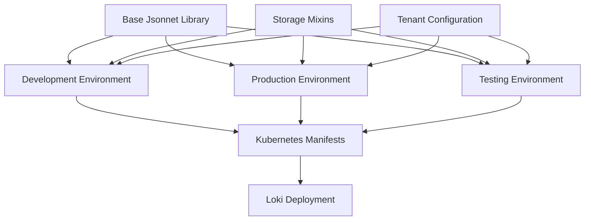

# Jsonnet Templates

## Introduction

Jsonnet is a powerful templating language that extends JSON to make it more maintainable and flexible. In the context of Grafana Loki deployments, Jsonnet templates provide a way to define, customize, and manage your configuration in a more programmatic way. This makes it easier to handle complex configurations, apply consistent settings across different environments, and reduce duplication in your deployment files.

In this guide, we'll explore how Jsonnet templates can be used specifically for Loki deployments, helping you create more maintainable and scalable configuration files.

## What is Jsonnet?

Jsonnet is a data templating language that builds upon JSON by adding features like:

- Variables and expressions
- Functions and conditionals
- Imports and libraries
- Inheritance and composition
- String interpolation
- Comments

These features make it possible to write more concise, reusable, and maintainable configuration files than plain JSON or YAML.

## Basic Jsonnet Syntax

Before diving into Loki-specific applications, let's understand some basic Jsonnet syntax:

```jsonnet
// This is a comment in Jsonnet

// Variables
local port = 3100;
local environment = "production";

// Basic object
{
  // String interpolation
  "name": "loki-" + environment,
  
  // Variable usage
  "port": port,
  
  // Conditional expression
  "replicas": if environment == "production" then 3 else 1,
  
  // Nested objects
  "resources": {
    "limits": {
      "cpu": "1",
      "memory": "2Gi"
    }
  }
}
```

The output of this Jsonnet file would be:

```json
{
  "name": "loki-production",
  "port": 3100,
  "replicas": 3,
  "resources": {
    "limits": {
      "cpu": "1",
      "memory": "2Gi"
    }
  }
}
```

## Setting Up Jsonnet for Loki

To start using Jsonnet with Loki, you'll need:

1. Install Jsonnet:

```bash
# On Linux/macOS
brew install jsonnet

# Or using Go
go install github.com/google/go-jsonnet/cmd/jsonnet@latest
```

2. Install the Loki Jsonnet libraries:

```bash
# Clone the Loki repository
git clone https://github.com/grafana/loki.git

# Or use Jsonnet-bundler to add dependencies
jb init
jb install github.com/grafana/loki/production/ksonnet/loki
```

## Creating a Basic Loki Configuration with Jsonnet

Now let's create a basic Loki configuration using Jsonnet:

```jsonnet
// loki-config.jsonnet
local k = import 'ksonnet-util/kausal.libsonnet';
local loki = import 'loki/loki.libsonnet';

// Define the environment
local environment = "dev";

// Create a basic Loki configuration
local lokiConfig = loki {
  _config+:: {
    namespace: 'monitoring',
    
    // Set up storage configuration
    storage_backend: 'filesystem',
    storage_filesystem_directory: '/loki/chunks',
    
    // Set up replication based on environment
    replicas: if environment == "production" then 3 else 1,
    
    // Configure resources
    resources: {
      limits: {
        cpu: '1',
        memory: '2Gi',
      },
      requests: {
        cpu: '500m',
        memory: '1Gi',
      },
    },
  },
};

// Export the Kubernetes objects
{
  apiVersion: 'v1',
  kind: 'List',
  items: [
    lokiConfig.statefulSet,
    lokiConfig.configMap,
    lokiConfig.service,
  ],
}
```

To generate the Kubernetes YAML from this Jsonnet:

```bash
jsonnet loki-config.jsonnet -o loki-config.yaml
```

## Creating Reusable Components

One of the major advantages of Jsonnet is the ability to create reusable components. Let's create a reusable Loki configuration that can be customized for different environments:

```jsonnet
// loki-base.libsonnet
{
  new(config):: {
    local this = self,
    
    _config:: config,
    
    // Define a deployment
    deployment: {
      apiVersion: 'apps/v1',
      kind: 'Deployment',
      metadata: {
        name: 'loki',
        namespace: this._config.namespace,
        labels: {
          app: 'loki',
          environment: this._config.environment,
        },
      },
      spec: {
        replicas: this._config.replicas,
        selector: {
          matchLabels: {
            app: 'loki',
          },
        },
        template: {
          metadata: {
            labels: {
              app: 'loki',
              environment: this._config.environment,
            },
          },
          spec: {
            containers: [
              {
                name: 'loki',
                image: this._config.image,
                ports: [
                  {
                    name: 'http',
                    containerPort: 3100,
                  },
                ],
                resources: this._config.resources,
                volumeMounts: [
                  {
                    name: 'config',
                    mountPath: '/etc/loki',
                  },
                  {
                    name: 'storage',
                    mountPath: '/loki/chunks',
                  },
                ],
              },
            ],
            volumes: [
              {
                name: 'config',
                configMap: {
                  name: 'loki',
                },
              },
              {
                name: 'storage',
                emptyDir: {},
              },
            ],
          },
        },
      },
    },
    
    // Define a configMap
    configMap: {
      apiVersion: 'v1',
      kind: 'ConfigMap',
      metadata: {
        name: 'loki',
        namespace: this._config.namespace,
      },
      data: {
        'loki.yaml': std.manifestYamlDoc(this._config.lokiConfig),
      },
    },
    
    // Define a service
    service: {
      apiVersion: 'v1',
      kind: 'Service',
      metadata: {
        name: 'loki',
        namespace: this._config.namespace,
      },
      spec: {
        selector: {
          app: 'loki',
        },
        ports: [
          {
            name: 'http',
            port: 3100,
            targetPort: 'http',
          },
        ],
      },
    },
  },
}
```

Now you can use this library to create configurations for different environments:

```jsonnet
// environments.jsonnet
local lokiBase = import 'loki-base.libsonnet';

// Development environment
local dev = lokiBase.new({
  environment: 'dev',
  namespace: 'loki-dev',
  replicas: 1,
  image: 'grafana/loki:2.8.0',
  resources: {
    limits: {
      cpu: '500m',
      memory: '1Gi',
    },
    requests: {
      cpu: '100m',
      memory: '256Mi',
    },
  },
  lokiConfig: {
    auth_enabled: false,
    server: {
      http_listen_port: 3100,
    },
    ingester: {
      lifecycler: {
        ring: {
          kvstore: {
            store: 'inmemory',
          },
        },
      },
      chunk_idle_period: '5m',
      chunk_retain_period: '30s',
    },
    schema_config: {
      configs: [
        {
          from: '2020-05-15',
          store: 'boltdb-shipper',
          object_store: 'filesystem',
          schema: 'v11',
          index: {
            prefix: 'index_',
            period: '24h',
          },
        }
      ],
    },
    storage_config: {
      boltdb_shipper: {
        active_index_directory: '/loki/index',
        cache_location: '/loki/index_cache',
        shared_store: 'filesystem',
      },
      filesystem: {
        directory: '/loki/chunks',
      },
    },
  },
});

// Production environment
local prod = lokiBase.new({
  environment: 'prod',
  namespace: 'loki-prod',
  replicas: 3,
  image: 'grafana/loki:2.8.0',
  resources: {
    limits: {
      cpu: '2',
      memory: '4Gi',
    },
    requests: {
      cpu: '1',
      memory: '2Gi',
    },
  },
  lokiConfig: {
    auth_enabled: true,
    server: {
      http_listen_port: 3100,
    },
    ingester: {
      lifecycler: {
        ring: {
          kvstore: {
            store: 'consul',
            prefix: 'loki/',
            consul: {
              host: 'consul.loki-prod:8500',
            },
          },
        },
      },
      chunk_idle_period: '15m',
      chunk_retain_period: '30s',
    },
    schema_config: {
      configs: [
        {
          from: '2020-05-15',
          store: 'boltdb-shipper',
          object_store: 's3',
          schema: 'v11',
          index: {
            prefix: 'index_',
            period: '24h',
          },
        }
      ],
    },
    storage_config: {
      boltdb_shipper: {
        active_index_directory: '/loki/index',
        cache_location: '/loki/index_cache',
        shared_store: 's3',
      },
      aws: {
        s3: 'https://s3-us-west-2.amazonaws.com',
        bucketnames: 'loki-prod-data',
        region: 'us-west-2',
      },
    },
  },
});

// Export both environments
{
  dev: {
    apiVersion: 'v1',
    kind: 'List',
    items: [
      dev.deployment,
      dev.configMap,
      dev.service,
    ],
  },
  prod: {
    apiVersion: 'v1',
    kind: 'List',
    items: [
      prod.deployment,
      prod.configMap,
      prod.service,
    ],
  },
}
```

To generate configurations for a specific environment:

```bash
# Generate dev environment config
jsonnet environments.jsonnet -o dev.json -e '(import "environments.jsonnet").dev'

# Generate prod environment config
jsonnet environments.jsonnet -o prod.json -e '(import "environments.jsonnet").prod'
```

## Advanced Jsonnet Features for Loki

### Mixins and Composition

Jsonnet allows for composition of configurations using mixins:

```jsonnet
// storage-mixins.libsonnet
{
  // Filesystem storage configuration
  filesystemStorage:: {
    storage_config+: {
      boltdb_shipper: {
        active_index_directory: '/loki/index',
        cache_location: '/loki/index_cache',
        shared_store: 'filesystem',
      },
      filesystem: {
        directory: '/loki/chunks',
      },
    },
  },
  
  // S3 storage configuration
  s3Storage:: {
    storage_config+: {
      boltdb_shipper: {
        active_index_directory: '/loki/index',
        cache_location: '/loki/index_cache',
        shared_store: 's3',
      },
      aws: {
        s3: 'https://s3-us-west-2.amazonaws.com',
        bucketnames: 'loki-data',
        region: 'us-west-2',
      },
    },
  },
}
```

You can then use these mixins in your configuration:

```jsonnet
local storageMixins = import 'storage-mixins.libsonnet';

// Base configuration
local baseConfig = {
  auth_enabled: false,
  server: {
    http_listen_port: 3100,
  },
  schema_config: {
    configs: [
      {
        from: '2020-05-15',
        store: 'boltdb-shipper',
        object_store: 'filesystem', // Will be overridden by storage mixin
        schema: 'v11',
        index: {
          prefix: 'index_',
          period: '24h',
        },
      }
    ],
  },
};

// Dev configuration with filesystem storage
local devConfig = baseConfig + storageMixins.filesystemStorage;

// Prod configuration with S3 storage
local prodConfig = baseConfig + storageMixins.s3Storage + {
  auth_enabled: true,
  schema_config+: {
    configs: [
      {
        from: '2020-05-15',
        store: 'boltdb-shipper',
        object_store: 's3', // Override filesystem setting
        schema: 'v11',
        index: {
          prefix: 'index_',
          period: '24h',
        },
      }
    ],
  },
};
```

### Implementing Multi-tenant Configurations

Jsonnet makes it easy to create multi-tenant Loki configurations:

```jsonnet
// multi-tenant.jsonnet
local tenants = [
  {
    name: 'team-a',
    retention: '168h', // 7 days
    dailyLimits: '5G',
  },
  {
    name: 'team-b',
    retention: '720h', // 30 days
    dailyLimits: '10G',
  },
  {
    name: 'team-c',
    retention: '2160h', // 90 days
    dailyLimits: '20G',
  },
];

{
  _config+:: {
    namespace: 'loki',
    
    // Configure multi-tenancy
    auth_enabled: true,
    
    // Generate limits configuration
    limits_config: {
      enforce_metric_name: false,
      reject_old_samples: true,
      reject_old_samples_max_age: '168h',
      
      // Per-tenant limits
      per_tenant_override_config: '/etc/loki/overrides.yaml',
    },
  },
  
  // Generate tenant overrides
  configMap+: {
    data+: {
      'overrides.yaml': std.manifestYamlDoc({
        overrides: std.foldl(
          function(acc, tenant) 
            acc + {
              [tenant.name]: {
                ingestion_rate_mb: std.parseInt(std.strReplace(tenant.dailyLimits, 'G', '')) * 1000 / 86400,
                ingestion_burst_size_mb: std.parseInt(std.strReplace(tenant.dailyLimits, 'G', '')) * 100 / 86400,
                max_global_streams_per_user: 10000,
                max_chunks_per_query: 1000000,
                retention_period: tenant.retention,
              },
            },
          tenants,
          {}
        ),
      }),
    },
  },
}
```

## Visualizing Loki Deployment Structure with Jsonnet

Here's a diagram showing how the different Jsonnet components fit together in a typical Loki deployment:



## Practical Example: Scaling Loki with Jsonnet

Let's create a practical example of scaling Loki components using Jsonnet:

```jsonnet
// scaled-loki.jsonnet
local k = import 'ksonnet-util/kausal.libsonnet';
local loki = import 'loki/loki.libsonnet';

// Configure scaled Loki for high throughput
local scaledLoki = loki {
  _config+:: {
    namespace: 'loki',
    
    // Split components for scaling
    separate_compactor: true,
    separate_ingester: true,
    separate_querier: true,
    
    // Configure scaling
    distributor: {
      replicas: 3,
      resources: {
        limits: {
          cpu: '1',
          memory: '1Gi',
        },
        requests: {
          cpu: '500m',
          memory: '500Mi',
        },
      },
    },
    
    ingester: {
      replicas: 3,
      resources: {
        limits: {
          cpu: '2',
          memory: '10Gi',
        },
        requests: {
          cpu: '1',
          memory: '5Gi',
        },
      },
      persistence_enabled: true,
      persistence_size: '100Gi',
    },
    
    querier: {
      replicas: 2,
      resources: {
        limits: {
          cpu: '2',
          memory: '8Gi',
        },
        requests: {
          cpu: '1',
          memory: '4Gi',
        },
      },
    },
    
    compactor: {
      replicas: 1,
      resources: {
        limits: {
          cpu: '1',
          memory: '4Gi',
        },
        requests: {
          cpu: '500m',
          memory: '2Gi',
        },
      },
    },
  },
};

// Export Kubernetes objects
{
  apiVersion: 'v1',
  kind: 'List',
  items: [
    scaledLoki.distributor.deployment,
    scaledLoki.distributor.service,
    scaledLoki.ingester.statefulSet,
    scaledLoki.ingester.service,
    scaledLoki.querier.deployment,
    scaledLoki.querier.service,
    scaledLoki.compactor.deployment,
    scaledLoki.compactor.service,
    scaledLoki.configMap,
  ],
}
```

## Best Practices for Loki Jsonnet Templates

1. **Modularize Your Configurations**: Break down your configurations into reusable modules for different components (storage, networking, etc.).

2. **Use Inheritance Wisely**: Leverage Jsonnet's inheritance to create specialized configurations without duplicating code.

3. **Parameterize Everything**: Make all environment-specific values parameters rather than hardcoding them.

4. **Document Your Templates**: Use comments to explain the purpose and usage of each template part.

5. **Validate Your Output**: Always verify the generated YAML/JSON before applying it to your cluster.

6. **Version Control Your Templates**: Keep your Jsonnet templates in version control to track changes.

7. **Use Libraries**: Take advantage of existing Jsonnet libraries like ksonnet-lib or the official Loki libraries.

8. **Test Before Deploying**: Generate and review the output of your templates before applying them to production environments.

## Summary

Jsonnet templates offer a powerful way to manage Grafana Loki deployments by providing:

- A programmatic approach to configuration
- Reusable components and libraries
- Environment-specific customization
- Reduced duplication and complexity
- Better maintainability and scalability

By leveraging Jsonnet's features such as variables, functions, inheritance, and composition, you can create flexible, maintainable, and scalable Loki deployments that can be easily customized for different environments and use cases.

## Additional Resources

1. **Learning More About Jsonnet**:
   - Official Jsonnet Documentation: [https://jsonnet.org/learning/tutorial.html](https://jsonnet.org/learning/tutorial.html)
   - Grafana Tanka (Jsonnet-based Kubernetes configuration utility): [https://tanka.dev/](https://tanka.dev/)

2. **Loki Specific Resources**:
   - Loki Jsonnet Libraries: [https://github.com/grafana/loki/tree/main/production/ksonnet/loki](https://github.com/grafana/loki/tree/main/production/ksonnet/loki)
   - Grafana Monitoring Mixins: [https://github.com/grafana/jsonnet-libs](https://github.com/grafana/jsonnet-libs)

## Exercises

1. Create a basic Loki deployment using Jsonnet for a development environment.
2. Modify your template to support both development and production environments with different resource allocations.
3. Add a configurable retention period that can be set per environment.
4. Create a Jsonnet template for a scaled-out Loki deployment with separate components for distributor, ingester, and querier.
5. Implement a multi-tenant configuration with different limits for different teams.