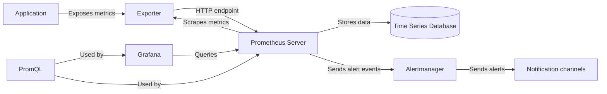

# Prometheus Introduction

## What is Prometheus?

Prometheus is an open-source systems monitoring and alerting toolkit that has become a cornerstone of modern infrastructure observability. Originally built at SoundCloud in 2012, Prometheus was later donated to the Cloud Native Computing Foundation (CNCF) where it became the second project to graduate, after Kubernetes.

Prometheus excels at monitoring highly dynamic container environments, microservices architectures, and cloud-native applications. It provides powerful querying capabilities, robust visualizations, and a reliable alerting system.

## Core Concepts

Before diving into practical examples, let's understand some fundamental Prometheus concepts:

### Time Series Data

Prometheus collects and stores all data as **time series** - streams of timestamped values belonging to the same metric with the same set of labeled dimensions. Each time series is uniquely identified by:

- Its **metric name** (e.g., `http_requests_total`)  
- A set of key-value pairs called **labels** (e.g., `{method="GET", endpoint="/api/users"}`)

### Metrics Types

Prometheus supports four core metric types:

1. **Counter**: A cumulative metric that can only increase or be reset to zero (e.g., number of requests served)
2. **Gauge**: A metric that can increase and decrease (e.g., memory usage)
3. **Histogram**: Samples observations and counts them in configurable buckets (e.g., request durations)
4. **Summary**: Similar to histogram, but also calculates configurable quantiles

### Pull-Based Architecture

Unlike many monitoring systems that push metrics to a central server, Prometheus follows a **pull-based** approach:



Prometheus Server regularly **scrapes** (pulls) metrics from instrumented applications or services. This approach offers several advantages:
- You can run your monitoring even when your alerting system is broken
- You can more easily detect if a service is down
- Multiple Prometheus servers can scrape the same targets without causing issues

## Key Components of Prometheus

The Prometheus ecosystem consists of multiple components:

1. **Prometheus Server**: The core component that scrapes and stores time series data
2. **Client Libraries**: Libraries for instrumenting application code
3. **Pushgateway**: For supporting short-lived jobs
4. **Exporters**: Tools that expose metrics from existing systems
5. **Alertmanager**: Handles alerts sent by the Prometheus server
6. **Visualization Tools**: Such as Grafana or the built-in Prometheus web UI

## Getting Started with Prometheus

Let's start with a basic setup to demonstrate how Prometheus works.

### Installing Prometheus

The easiest way to get started with Prometheus is to use Docker:

```bash
docker run -p 9090:9090 -v /path/to/prometheus.yml:/etc/prometheus/prometheus.yml prom/prometheus
```

### Basic Configuration

Prometheus uses YAML for configuration. Here's a minimal `prometheus.yml` file:

```yaml
global:
  scrape_interval: 15s

scrape_configs:
  - job_name: 'prometheus'
    static_configs:
      - targets: ['localhost:9090']
```

This configuration tells Prometheus to:
- Scrape targets every 15 seconds
- Monitor itself (Prometheus exposes its own metrics on port 9090)

### Exploring the Prometheus UI

Once Prometheus is running, you can access the web UI at `http://localhost:9090`. The interface provides several tabs:

- **Graph**: For querying and visualizing metrics
- **Status**: Shows runtime information, targets, and service discovery
- **Alerts**: Displays configured alerts and their current state
- **Help**: Documentation and configuration information

## Instrumenting an Application

Let's create a simple example of how to instrument a Node.js application with Prometheus:

```javascript
const express = require('express');
const promClient = require('prom-client');

// Create a Registry to register the metrics
const register = new promClient.Registry();
promClient.collectDefaultMetrics({ register });

// Create a counter for HTTP requests
const httpRequestsTotal = new promClient.Counter({
  name: 'http_requests_total',
  help: 'Total number of HTTP requests',
  labelNames: ['method', 'path', 'status'],
  registers: [register]
});

// Create a histogram for request durations
const httpRequestDurationMs = new promClient.Histogram({
  name: 'http_request_duration_ms',
  help: 'Duration of HTTP requests in ms',
  labelNames: ['method', 'path', 'status'],
  buckets: [10, 50, 100, 500, 1000, 5000],
  registers: [register]
});

const app = express();

// Middleware to measure request duration
app.use((req, res, next) => {
  const start = Date.now();
  
  res.on('finish', () => {
    const duration = Date.now() - start;
    httpRequestsTotal.inc({ 
      method: req.method, 
      path: req.path, 
      status: res.statusCode 
    });
    httpRequestDurationMs.observe(
      { method: req.method, path: req.path, status: res.statusCode },
      duration
    );
  });
  
  next();
});

// Sample endpoint
app.get('/api/users', (req, res) => {
  setTimeout(() => {
    res.json({ users: ['Alice', 'Bob', 'Charlie'] });
  }, Math.floor(Math.random() * 100));
});

// Expose metrics endpoint for Prometheus
app.get('/metrics', async (req, res) => {
  res.set('Content-Type', register.contentType);
  res.end(await register.metrics());
});

app.listen(3000, () => {
  console.log('Server is running on port 3000');
});
```

### How This Works:

1. We created two metrics:
   - A counter (`http_requests_total`) to track the total number of requests
   - A histogram (`http_request_duration_ms`) to measure request durations

2. We added middleware to measure each request and update our metrics

3. We exposed a `/metrics` endpoint that Prometheus can scrape

### Prometheus Configuration to Scrape Our Application

To make Prometheus scrape our application, we need to add a job to our `prometheus.yml`:

```yaml
scrape_configs:
  - job_name: 'prometheus'
    static_configs:
      - targets: ['localhost:9090']
  
  - job_name: 'node-app'
    static_configs:
      - targets: ['localhost:3000']
```

## Querying Prometheus with PromQL

Prometheus has its own query language called PromQL (Prometheus Query Language). Here are some basic query examples:

### Simple Queries

```promql
# Get the total number of HTTP requests
http_requests_total

# Filter by label
http_requests_total{method="GET"}

# Rate of requests over the last 5 minutes
rate(http_requests_total[5m])
```

### Aggregation

```promql
# Total requests across all endpoints
sum(http_requests_total)

# Requests per method
sum by(method) (http_requests_total)

# 95th percentile request duration for each endpoint
histogram_quantile(0.95, sum(rate(http_request_duration_ms_bucket[5m])) by (path, le))
```

## Alerting Basics

Prometheus can trigger alerts when certain conditions are met. Alerts are defined in a separate file, typically called `alerts.yml`:

```yaml
groups:
- name: example
  rules:
  - alert: HighRequestLatency
    expr: histogram_quantile(0.95, sum(rate(http_request_duration_ms_bucket[5m])) by (path, le)) > 200
    for: 5m
    labels:
      severity: warning
    annotations:
      summary: "High request latency on {{ $labels.path }}"
      description: "95th percentile latency is above 200ms (current value: {{ $value }}ms)"
```

This alert will fire if the 95th percentile of request latency exceeds 200ms for 5 minutes.

## Real-World Use Cases

Prometheus is used in various scenarios:

### Container Monitoring

In Kubernetes environments, Prometheus can monitor:
- Node-level metrics (CPU, memory, disk, network)
- Pod and container metrics
- Application-specific metrics

### Microservices Monitoring

For microservices architectures, Prometheus helps track:
- Service health and availability
- Request rates, error rates, and latencies
- Inter-service dependencies and communication patterns

### Database Monitoring

Using exporters, Prometheus can monitor databases like:
- PostgreSQL
- MySQL
- MongoDB
- Redis

## Best Practices

When implementing Prometheus monitoring:

1. **Choose meaningful metric names** that follow conventions:
   - Use prefixes for application-specific metrics (`app_*`)
   - Use suffixes that describe the unit (`*_seconds`, `*_bytes`)

2. **Use labels effectively** but avoid high cardinality:
   - Good: `http_requests_total{method="GET", status="200", endpoint="/api/users"}`
   - Bad: `http_requests_total{user_id="12345"}` (too many possible values)

3. **Monitor the Four Golden Signals**:
   - Latency (response time)
   - Traffic (requests per second)
   - Errors (rate of failed requests)
   - Saturation (how "full" your system is)

4. **Set up recording rules** for frequently used or complex queries to improve performance

## Summary

Prometheus provides a powerful monitoring solution with:
- A multi-dimensional data model based on time series data
- A flexible query language (PromQL)
- A pull-based architecture that's reliable and simple
- No reliance on distributed storage
- A range of client libraries and integrations

Through this introduction, you've learned about Prometheus' core concepts, how to set it up, instrument an application, write queries, and configure basic alerts. Prometheus forms the foundation of modern observability stacks and is an essential tool for anyone working with cloud-native applications.

## Additional Resources

- [Official Prometheus Documentation](https://prometheus.io/docs/introduction/overview/)
- [PromQL Examples](https://prometheus.io/docs/prometheus/latest/querying/examples/)
- [Prometheus Best Practices](https://prometheus.io/docs/practices/naming/)

## Exercises

1. Install Prometheus using Docker and configure it to monitor itself
2. Create a simple web application and instrument it with Prometheus metrics
3. Write PromQL queries to:
   - Calculate the error rate (percentage of HTTP status ≥ 400)
   - Find the three endpoints with the highest latency
   - Monitor the rate of incoming requests per second
4. Configure an alert for when your application's error rate exceeds 5%