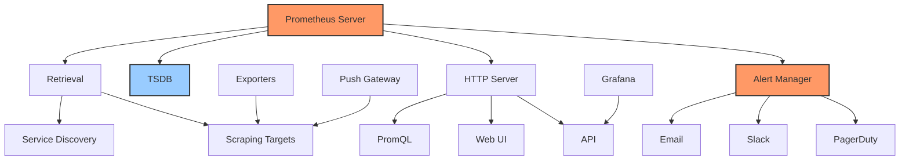

# Prometheus Architecture

## Introduction

Prometheus is an open-source systems monitoring and alerting toolkit originally built at SoundCloud. It has become a cornerstone of cloud-native monitoring solutions, especially in Kubernetes environments. Understanding Prometheus architecture is essential for effectively implementing and maintaining a robust monitoring system.

In this guide, we'll explore the core components of Prometheus, how they interact with each other, and the fundamental concepts that make Prometheus a powerful monitoring solution.

## Prometheus Architecture Overview

At a high level, Prometheus operates using several key components working together to collect, store, and query metrics data, as well as to trigger alerts when specific conditions are met.

Here's a diagram that illustrates the Prometheus architecture:



Let's explore each component in detail.

## Core Components

### 1. Prometheus Server

The Prometheus server is the central component that performs the actual monitoring work. It consists of several sub-components:

#### Time Series Database (TSDB)

The TSDB is where Prometheus stores all its metrics data. It's optimized for:
- High write throughput
- Efficient storage of time-series data
- Fast query execution

```javascript
// Simplified representation of how data is stored in TSDB
{
  metric: "http_requests_total",
  labels: {
    method: "GET",
    endpoint: "/api/v1/users",
    status: "200"
  },
  samples: [
    [1616161616, 10],  // timestamp, value
    [1616161676, 15],
    [1616161736, 18]
  ]
}
```

#### Data Retrieval (Scraper)

This component is responsible for:
- Pulling metrics from monitored targets (HTTP endpoints)
- Processing and storing the metrics in the database
- Managing service discovery to find targets dynamically

#### HTTP Server

Provides:
- A web UI for querying data and visualizing metrics
- API endpoints for external systems to query data
- Administrative interfaces for managing Prometheus

### 2. Exporters

Exporters are specialized applications that convert existing metrics from a system (which may not be directly exposable to Prometheus) into a format that Prometheus can scrape. Common exporters include:

- Node Exporter: System metrics (CPU, memory, disk, network)
- MySQL Exporter: MySQL server metrics
- Blackbox Exporter: Probing of endpoints over HTTP, HTTPS, DNS, TCP and ICMP

Example of metrics exposed by Node Exporter:

```plaintext
# HELP node_cpu_seconds_total Seconds the CPUs spent in each mode.
# TYPE node_cpu_seconds_total counter
node_cpu_seconds_total{cpu="0",mode="idle"} 8570.6
node_cpu_seconds_total{cpu="0",mode="system"} 47.79
node_cpu_seconds_total{cpu="0",mode="user"} 38.42
```

### 3. Push Gateway

While Prometheus primarily uses a pull model (scraping metrics from targets), the Push Gateway allows for a push model in certain scenarios:

- Short-lived jobs that may not exist long enough to be scraped
- Batch jobs where metrics need to be collected after completion
- Jobs behind network restrictions that can't be directly scraped

Example of pushing metrics to the Push Gateway:

```bash
echo "some_metric 3.14" | curl --data-binary @- http://pushgateway:9091/metrics/job/some_job
```

### 4. Alert Manager

The Alert Manager handles alerts sent by Prometheus server:

- Deduplicates, groups, and routes alerts to the correct receiver
- Silences and inhibits alerts when needed
- Integrates with various notification channels (email, Slack, PagerDuty, etc.)

Example Alert Manager configuration:

```yaml
route:
  group_by: ['alertname', 'cluster', 'service']
  group_wait: 30s
  group_interval: 5m
  repeat_interval: 3h
  receiver: 'team-X-mails'

receivers:
- name: 'team-X-mails'
  email_configs:
  - to: 'team-X+alerts@example.org'
```

## Data Flow in Prometheus

Let's understand how data flows through the Prometheus ecosystem:

1. **Collection**: Prometheus server scrapes metrics from targets (or receives them via the Push Gateway)
2. **Storage**: The scraped metrics are stored in the TSDB
3. **Querying**: Users can query the stored metrics using PromQL through the HTTP API
4. **Alerting**: Prometheus evaluates alert rules against the data and sends alerts to the Alert Manager
5. **Visualization**: Tools like Grafana can query Prometheus and visualize the metrics

## PromQL: Prometheus Query Language

PromQL is the query language used to retrieve and process time series data in Prometheus. It's powerful for creating complex queries and aggregations.

Basic PromQL examples:

```plaintext
# Simple query to get HTTP request rate
http_requests_total

# Rate of HTTP requests over the last 5 minutes
rate(http_requests_total[5m])

# 95th percentile of request durations
histogram_quantile(0.95, sum(rate(http_request_duration_seconds_bucket[5m])) by (le))
```

## Scraping and Service Discovery

Prometheus uses a pull-based model to collect metrics, which offers several advantages:

- Centralized control of scrape frequency and timeout settings
- Better visibility into targets' health (if it can't scrape, something is wrong)
- No need for authentication/authorization on the target side in many cases

Configuration example for scraping targets:

```yaml
scrape_configs:
  - job_name: 'node'
    scrape_interval: 15s
    static_configs:
      - targets: ['localhost:9100']
  
  - job_name: 'kubernetes-pods'
    kubernetes_sd_configs:
      - role: pod
    relabel_configs:
      - source_labels: [__meta_kubernetes_pod_annotation_prometheus_io_scrape]
        action: keep
        regex: true
```

## Storage Efficiency

Prometheus is designed for efficient storage of time-series data:

- Uses a custom time-series database optimized for append operations
- Applies delta encoding and compression to reduce storage requirements
- Implements a block-based storage model with chunks of samples

The storage is configured to handle high cardinality and large numbers of time series efficiently.

## Practical Example: Monitoring a Web Application

Let's walk through a practical example of how Prometheus architecture components work together to monitor a web application:

1. **Setup exporters**: Install Node Exporter on your servers and add application-specific metrics to your code

```javascript
// Example of adding Prometheus metrics in a Node.js application
const client = require('prom-client');
const httpRequestDurationMicroseconds = new client.Histogram({
  name: 'http_request_duration_seconds',
  help: 'Duration of HTTP requests in seconds',
  labelNames: ['method', 'route', 'status_code'],
  buckets: [0.1, 0.3, 0.5, 0.7, 1, 3, 5, 7, 10]
});

// Register the metrics
client.register.registerMetric(httpRequestDurationMicroseconds);

// Add middleware to track request duration
app.use((req, res, next) => {
  const end = httpRequestDurationMicroseconds.startTimer();
  res.on('finish', () => {
    end({ method: req.method, route: req.route.path, status_code: res.statusCode });
  });
  next();
});

// Expose metrics endpoint
app.get('/metrics', async (req, res) => {
  res.set('Content-Type', client.register.contentType);
  res.end(await client.register.metrics());
});
```

2. **Configure Prometheus** to scrape these exporters:

```yaml
scrape_configs:
  - job_name: 'node'
    scrape_interval: 15s
    static_configs:
      - targets: ['node1:9100', 'node2:9100']
  
  - job_name: 'web-app'
    scrape_interval: 10s
    static_configs:
      - targets: ['webapp:8080']
```

3. **Set up alert rules** for important metrics:

```yaml
groups:
- name: example
  rules:
  - alert: HighRequestLatency
    expr: rate(http_request_duration_seconds_sum[5m]) / rate(http_request_duration_seconds_count[5m]) > 0.5
    for: 10m
    labels:
      severity: warning
    annotations:
      summary: High request latency on {{ $labels.instance }}
      description: "App is experiencing high latency for HTTP requests (> 500ms)
  VALUE = {{ $value }}
  LABELS: {{ $labels }}"
```

4. **Configure Alert Manager** to route notifications:

```yaml
route:
  group_by: ['alertname']
  group_wait: 30s
  group_interval: 5m
  repeat_interval: 1h
  receiver: 'web-hooks'
receivers:
- name: 'web-hooks'
  slack_configs:
  - channel: '#alerts'
    send_resolved: true
```

5. **Create Grafana dashboards** to visualize the metrics:

```json
{
  "title": "Web Application Dashboard",
  "panels": [
    {
      "title": "Request Rate",
      "type": "graph",
      "datasource": "Prometheus",
      "targets": [
        {
          "expr": "sum(rate(http_request_total[1m])) by (route)",
          "legendFormat": "{{route}}"
        }
      ]
    },
    {
      "title": "Response Time",
      "type": "graph",
      "datasource": "Prometheus",
      "targets": [
        {
          "expr": "histogram_quantile(0.95, sum(rate(http_request_duration_seconds_bucket[5m])) by (le, route))",
          "legendFormat": "{{route}} (p95)"
        }
      ]
    }
  ]
}
```

## Best Practices for Prometheus Architecture

1. **Retention period**: Configure appropriate data retention based on your needs and storage capacity
   ```yaml
   prometheus.yml:
     storage:
       tsdb:
         retention.time: 15d
   ```

2. **Scrape interval**: Balance between data granularity and system load
   ```yaml
   global:
     scrape_interval: 15s
     evaluation_interval: 15s
   ```

3. **Federation**: For large-scale deployments, consider federation to create a hierarchy of Prometheus servers
   ```yaml
   scrape_configs:
     - job_name: 'federate'
       scrape_interval: 15s
       honor_labels: true
       metrics_path: '/federate'
       params:
         'match[]':
           - '{job="prometheus"}'
           - '{__name__=~"job:.*"}'
       static_configs:
         - targets:
           - 'source-prometheus-1:9090'
           - 'source-prometheus-2:9090'
   ```

4. **High Availability**: Deploy Prometheus in pairs for redundancy using the same scrape configuration

5. **Resource allocation**: Prometheus is memory-intensive, so allocate sufficient resources
   ```yaml
   # Docker/Kubernetes resource recommendation for medium workload
   resources:
     requests:
       memory: "2Gi"
       cpu: "500m"
     limits:
       memory: "4Gi"
       cpu: "1000m"
   ```

## Summary

Prometheus architecture consists of several components working together to provide a robust monitoring system:

1. **Prometheus Server**: The core component that scrapes and stores time series data
2. **Exporters**: Convert metrics from various systems into a format Prometheus can consume
3. **Push Gateway**: Allows short-lived jobs to push their metrics to Prometheus
4. **Alert Manager**: Handles alerts, including deduplication, grouping, and routing
5. **PromQL**: A powerful query language for analyzing the collected metrics

The pull-based model, efficient storage, and flexible query language make Prometheus particularly well-suited for dynamic environments like containers and microservices.

## Exercises

1. Install Prometheus and Node Exporter on your local machine and configure Prometheus to scrape Node Exporter metrics.
2. Write PromQL queries to:
   - Find the CPU usage rate
   - Calculate the 95th percentile of memory usage
   - Count the number of running processes
3. Create a simple alert rule that triggers when disk usage exceeds 80%.
4. Set up Grafana and create a dashboard with system metrics from Prometheus.
5. Instrument a simple application with Prometheus client library in your preferred language.

## Additional Resources

- [Prometheus Documentation](https://prometheus.io/docs/introduction/overview/)
- [PromQL Cheat Sheet](https://promlabs.com/promql-cheat-sheet/)
- [Grafana Dashboards for Prometheus](https://grafana.com/grafana/dashboards/)
- [Prometheus Operator for Kubernetes](https://github.com/prometheus-operator/prometheus-operator)
- [SRE Books by Google](https://sre.google/books/)

By understanding Prometheus architecture, you'll be well-equipped to implement effective monitoring solutions for your infrastructure and applications, enabling better visibility, troubleshooting, and capacity planning.