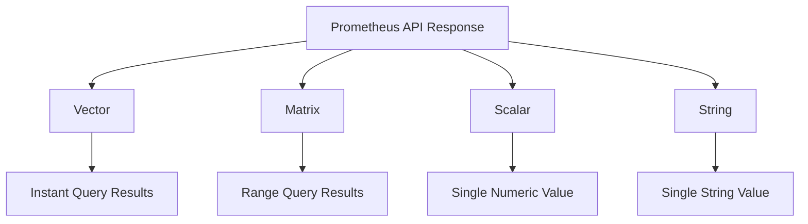

# Prometheus HTTP API

## Introduction

The Prometheus HTTP API is a powerful interface that allows you to interact with Prometheus programmatically. Whether you need to query metrics, check the status of your Prometheus server, or manage your monitoring setup, the HTTP API provides a structured way to accomplish these tasks.

In this guide, we'll explore the Prometheus HTTP API endpoints, learn how to make requests, and understand the responses. This knowledge will enable you to build custom dashboards, automate monitoring tasks, and integrate Prometheus with other systems in your infrastructure.

## API Basics

The Prometheus HTTP API is RESTful and uses JSON as its primary data format. All endpoints are accessible via the `/api/v1/` path prefix on your Prometheus server.

### Base URL

If your Prometheus server is running on `localhost` at port `9090` (the default), your base URL for API calls would be:

```
http://localhost:9090/api/v1/
```

### Response Format

All API responses follow a common structure:

```json
{
  "status": "success" | "error",
  "data": <data>,
  "errorType": <string>,
  "error": <string>
}
```

- `status`: Indicates if the request was successful
- `data`: Contains the actual response data (when successful)
- `errorType` and `error`: Provide details about errors (when unsuccessful)

## Query API Endpoints

### Instant Queries

The `/api/v1/query` endpoint allows you to execute an instant query at a single point in time.

#### Parameters

- `query`: The PromQL expression to evaluate
- `time`: The evaluation timestamp (optional, defaults to current time)
- `timeout`: Evaluation timeout (optional)

#### Example

```bash
curl 'http://localhost:9090/api/v1/query?query=up&time=2023-05-01T20:10:30.781Z'
```

#### Response

```json
{
  "status": "success",
  "data": {
    "resultType": "vector",
    "result": [
      {
        "metric": {
          "__name__": "up",
          "instance": "localhost:9090",
          "job": "prometheus"
        },
        "value": [1620243030.781, "1"]
      },
      {
        "metric": {
          "__name__": "up",
          "instance": "localhost:9100",
          "job": "node"
        },
        "value": [1620243030.781, "1"]
      }
    ]
  }
}
```

### Range Queries

The `/api/v1/query_range` endpoint allows you to query time series data over a range of time.

#### Parameters

- `query`: The PromQL expression to evaluate
- `start`: Start timestamp
- `end`: End timestamp
- `step`: Query resolution step width in duration format or float seconds
- `timeout`: Evaluation timeout (optional)

#### Example

```bash
curl 'http://localhost:9090/api/v1/query_range?query=rate(node_cpu_seconds_total{mode="system"}[1m])&start=2023-05-01T00:00:00.000Z&end=2023-05-01T02:00:00.000Z&step=15m'
```

#### Response

```json
{
  "status": "success",
  "data": {
    "resultType": "matrix",
    "result": [
      {
        "metric": {
          "__name__": "node_cpu_seconds_total",
          "cpu": "0",
          "instance": "localhost:9100",
          "job": "node",
          "mode": "system"
        },
        "values": [
          [1620259200, "0.02"],
          [1620260100, "0.03"],
          [1620261000, "0.01"],
          [1620261900, "0.02"],
          [1620262800, "0.01"],
          [1620263700, "0.02"],
          [1620264600, "0.02"],
          [1620265500, "0.03"],
          [1620266400, "0.02"]
        ]
      }
    ]
  }
}
```

## Metadata API Endpoints

### Series

The `/api/v1/series` endpoint returns a list of time series that match a certain label set.

#### Parameters

- `match[]`: Repeated series selector argument that selects the series to return
- `start`: Start timestamp
- `end`: End timestamp

#### Example

```bash
curl 'http://localhost:9090/api/v1/series?match[]=up&match[]=process_cpu_seconds_total&start=2023-05-01T00:00:00.000Z&end=2023-05-01T02:00:00.000Z'
```

#### Response

```json
{
  "status": "success",
  "data": [
    {
      "__name__": "up",
      "instance": "localhost:9090",
      "job": "prometheus"
    },
    {
      "__name__": "up",
      "instance": "localhost:9100",
      "job": "node"
    },
    {
      "__name__": "process_cpu_seconds_total",
      "instance": "localhost:9090",
      "job": "prometheus"
    }
  ]
}
```

### Labels

The `/api/v1/labels` endpoint returns a list of available label names.

#### Example

```bash
curl 'http://localhost:9090/api/v1/labels'
```

#### Response

```json
{
  "status": "success",
  "data": [
    "__name__",
    "instance",
    "job",
    "scrape_job",
    "service"
  ]
}
```

### Label Values

The `/api/v1/label/<label_name>/values` endpoint returns a list of values for a specific label.

#### Example

```bash
curl 'http://localhost:9090/api/v1/label/job/values'
```

#### Response

```json
{
  "status": "success",
  "data": [
    "prometheus",
    "node",
    "alertmanager"
  ]
}
```

## Targets API

The `/api/v1/targets` endpoint returns information about targets being scraped.

### Active Targets

#### Example

```bash
curl 'http://localhost:9090/api/v1/targets'
```

#### Response

```json
{
  "status": "success",
  "data": {
    "activeTargets": [
      {
        "discoveredLabels": {
          "__address__": "localhost:9090",
          "__metrics_path__": "/metrics",
          "__scheme__": "http",
          "job": "prometheus"
        },
        "labels": {
          "instance": "localhost:9090",
          "job": "prometheus"
        },
        "scrapePool": "prometheus",
        "scrapeUrl": "http://localhost:9090/metrics",
        "globalUrl": "http://localhost:9090/metrics",
        "lastError": "",
        "lastScrape": "2023-05-01T20:10:30.781Z",
        "lastScrapeDuration": 0.0025,
        "health": "up",
        "scrapeInterval": "15s",
        "scrapeTimeout": "10s"
      }
    ]
  }
}
```

## Alerts API

The `/api/v1/alerts` endpoint returns information about active alerts.

### Example

```bash
curl 'http://localhost:9090/api/v1/alerts'
```

### Response

```json
{
  "status": "success",
  "data": {
    "alerts": [
      {
        "labels": {
          "alertname": "HighRequestLatency",
          "severity": "critical",
          "instance": "server01:8080"
        },
        "annotations": {
          "summary": "High request latency on server01:8080",
          "description": "The API server on server01:8080 has a 95th percentile latency of 1.2s"
        },
        "state": "firing",
        "activeAt": "2023-05-01T20:00:30.781Z",
        "value": "1.2"
      }
    ]
  }
}
```

## Rules API

The `/api/v1/rules` endpoint returns information about recording and alerting rules.

### Example

```bash
curl 'http://localhost:9090/api/v1/rules'
```

### Response

```json
{
  "status": "success",
  "data": {
    "groups": [
      {
        "name": "example",
        "file": "/etc/prometheus/rules/example.yml",
        "rules": [
          {
            "name": "instance_memory_limit_bytes",
            "query": "sum by(instance)(node_memory_MemTotal_bytes) * 0.8",
            "health": "ok",
            "type": "recording",
            "lastEvaluation": "2023-05-01T20:10:30.781Z",
            "evaluationTime": 0.0005
          },
          {
            "name": "HighRequestLatency",
            "query": "job:request_latency_seconds:mean5m{job=\"myjob\"} > 0.5",
            "health": "ok",
            "type": "alerting",
            "lastEvaluation": "2023-05-01T20:10:30.781Z",
            "evaluationTime": 0.0004,
            "alerts": [
              {
                "labels": {
                  "alertname": "HighRequestLatency",
                  "severity": "critical",
                  "instance": "server01:8080"
                },
                "annotations": {
                  "summary": "High request latency on server01:8080"
                },
                "state": "firing",
                "activeAt": "2023-05-01T19:00:30.781Z",
                "value": "0.6"
              }
            ]
          }
        ]
      }
    ]
  }
}
```

## Admin API Endpoints

These endpoints provide administrative capabilities and information about the Prometheus server itself.

### Status

The `/api/v1/status/config` endpoint returns the current Prometheus configuration.

#### Example

```bash
curl 'http://localhost:9090/api/v1/status/config'
```

### Flags

The `/api/v1/status/flags` endpoint returns the command-line flags that Prometheus was started with.

#### Example

```bash
curl 'http://localhost:9090/api/v1/status/flags'
```

#### Response

```json
{
  "status": "success",
  "data": {
    "alertmanager.notification-queue-capacity": "10000",
    "alertmanager.timeout": "10s",
    "config.file": "/etc/prometheus/prometheus.yml",
    "log.level": "info",
    "query.lookback-delta": "5m",
    "query.max-concurrency": "20",
    "query.max-samples": "50000000",
    "storage.tsdb.path": "/prometheus",
    "storage.tsdb.retention.time": "15d",
    "web.console.libraries": "/usr/share/prometheus/console_libraries",
    "web.console.templates": "/usr/share/prometheus/consoles",
    "web.enable-lifecycle": "true"
  }
}
```

## Practical Examples

Let's explore some real-world examples of using the Prometheus HTTP API.

### Building a Custom Dashboard

This example shows how to fetch data for a custom dashboard that displays CPU and memory usage:

```javascript
// Function to fetch current CPU usage
async function fetchCpuUsage() {
  const response = await fetch(
    'http://localhost:9090/api/v1/query?query=100 - (avg by (instance) (irate(node_cpu_seconds_total{mode="idle"}[5m])) * 100)'
  );
  const data = await response.json();
  return data.data.result;
}

// Function to fetch current memory usage
async function fetchMemoryUsage() {
  const response = await fetch(
    'http://localhost:9090/api/v1/query?query=(node_memory_MemTotal_bytes - node_memory_MemAvailable_bytes) / node_memory_MemTotal_bytes * 100'
  );
  const data = await response.json();
  return data.data.result;
}

// Function to fetch CPU usage over the last hour
async function fetchCpuHistory() {
  const endTime = new Date().toISOString();
  const startTime = new Date(Date.now() - 3600000).toISOString();
  
  const response = await fetch(
    `http://localhost:9090/api/v1/query_range?query=100 - (avg by (instance) (irate(node_cpu_seconds_total{mode="idle"}[5m])) * 100)&start=${startTime}&end=${endTime}&step=60s`
  );
  const data = await response.json();
  return data.data.result;
}

// Update the dashboard with the fetched data
async function updateDashboard() {
  const cpuUsage = await fetchCpuUsage();
  const memoryUsage = await fetchMemoryUsage();
  const cpuHistory = await fetchCpuHistory();
  
  // Update UI elements with the fetched data
  document.getElementById('cpu-gauge').value = cpuUsage[0].value[1];
  document.getElementById('memory-gauge').value = memoryUsage[0].value[1];
  
  // Update the CPU history chart
  renderCpuChart(cpuHistory);
}

// Call updateDashboard every 30 seconds
setInterval(updateDashboard, 30000);
updateDashboard();
```

### Automated Alert Checking

This example shows how to create a script that checks for firing alerts:

```python
import requests
import json
import smtplib
from email.message import EmailMessage

def check_alerts():
    """Check Prometheus for firing alerts and notify if found"""
    response = requests.get('http://localhost:9090/api/v1/alerts')
    data = response.json()
    
    if data['status'] != 'success':
        print(f"Error fetching alerts: {data.get('error', 'Unknown error')}")
        return
    
    firing_alerts = []
    for alert in data['data']['alerts']:
        if alert['state'] == 'firing':
            firing_alerts.append(alert)
    
    if firing_alerts:
        send_notification(firing_alerts)
    else:
        print("No firing alerts found.")

def send_notification(alerts):
    """Send email notification for firing alerts"""
    msg = EmailMessage()
    msg['Subject'] = f"ALERT: {len(alerts)} Prometheus alerts firing"
    msg['From'] = "prometheus@example.com"
    msg['To'] = "oncall@example.com"
    
    body = "The following alerts are currently firing:

"
    
    for alert in alerts:
        labels = alert['labels']
        annotations = alert.get('annotations', {})
        
        body += f"Alert: {labels.get('alertname', 'Unnamed Alert')}
"
        body += f"Severity: {labels.get('severity', 'unknown')}
"
        body += f"Instance: {labels.get('instance', 'unknown')}
"
        body += f"Summary: {annotations.get('summary', 'No summary available')}
"
        body += f"Description: {annotations.get('description', 'No description available')}
"
        body += f"Started: {alert.get('activeAt', 'unknown')}
"
        body += "-" * 40 + "

"
    
    msg.set_content(body)
    
    # Configure your SMTP server details here
    smtp_server = smtplib.SMTP('smtp.example.com', 587)
    smtp_server.starttls()
    smtp_server.login('user', 'password')
    smtp_server.send_message(msg)
    smtp_server.quit()
    
    print(f"Notification sent for {len(alerts)} firing alerts")

if __name__ == "__main__":
    check_alerts()
```

### Monitoring System Health

This example shows a simple shell script that checks if all targets are healthy:

```bash
#!/bin/bash

# Get all targets from Prometheus
response=$(curl -s 'http://localhost:9090/api/v1/targets')

# Parse unhealthy targets using jq (a JSON processor)
# You may need to install jq with: apt-get install jq or brew install jq
unhealthy=$(echo $response | jq -r '.data.activeTargets[] | select(.health != "up") | .labels.instance')

if [ -z "$unhealthy" ]; then
  echo "All targets are healthy"
  exit 0
else
  echo "Unhealthy targets found:"
  echo "$unhealthy"
  exit 1
fi
```

## Understanding the API Response Types

Prometheus API responses include different result types, which are important to understand when processing the returned data:



### Vector

A vector result contains a set of time series that each have a single sample at the same timestamp. This is returned by instant queries.

### Matrix

A matrix result contains a set of time series that each have a range of samples over time. This is returned by range queries.

### Scalar

A scalar result is a simple numeric floating point value.

### String

A string result is a simple string value.

## Summary

The Prometheus HTTP API provides a powerful interface for interacting with your monitoring data programmatically. In this guide, we've covered:

- The basic structure of the API and its responses
- Query endpoints for instant and range queries
- Metadata endpoints for exploring labels and series
- Administrative endpoints for Prometheus configuration
- Target and alert management endpoints
- Practical examples of API usage in real-world scenarios

With this knowledge, you can now:
- Build custom dashboards that fetch data directly from Prometheus
- Create automated scripts for monitoring and alert management
- Integrate Prometheus with other systems in your infrastructure
- Explore and analyze your metrics programmatically

## Additional Resources

To continue learning about the Prometheus HTTP API:

- [Official Prometheus HTTP API Documentation](https://prometheus.io/docs/prometheus/latest/querying/api/)
- [PromQL Query Language Documentation](https://prometheus.io/docs/prometheus/latest/querying/basics/)
- [Prometheus Configuration Documentation](https://prometheus.io/docs/prometheus/latest/configuration/configuration/)

## Exercises

1. Write a script that fetches the 95th percentile of request latency over the last hour for a specific service.

2. Create a simple web dashboard that shows the top 5 CPU-consuming processes on your servers.

3. Build a script that checks if any Prometheus targets have been down for more than 10 minutes and sends an alert.

4. Use the API to fetch all recording rules and their current values.

5. Create a program that exports specific Prometheus metrics to a CSV file for offline analysis.