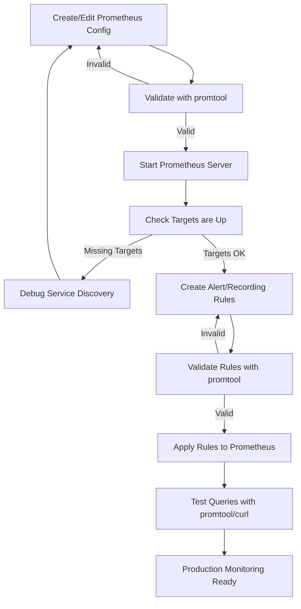

# Prometheus CLI Tools

## Introduction

Prometheus, an open-source monitoring and alerting toolkit, comes with several powerful command-line interface (CLI) tools that enhance your monitoring capabilities. These tools allow you to interact with Prometheus data, validate configurations, and debug issues directly from your terminal. This guide explores the essential Prometheus CLI tools that every beginner should know when working with Prometheus.

## Core Prometheus CLI Tools

Prometheus offers several command-line utilities that help with different aspects of monitoring. Let's explore each of them in detail.

### The Prometheus Server Binary

The main `prometheus` binary itself can be used as a CLI tool with various flags and commands.

#### Basic Usage

```bash
prometheus [flags]
```

#### Common Flags

```bash
# Start Prometheus with a specific configuration file
prometheus --config.file=/path/to/prometheus.yml

# Specify a different data storage location
prometheus --storage.tsdb.path=/path/to/data

# Enable web console features
prometheus --web.console.templates=/path/to/consoles
prometheus --web.console.libraries=/path/to/console_libraries

# Change the listening address and port
prometheus --web.listen-address=0.0.0.0:9090
```

#### Example: Starting Prometheus with Custom Settings

```bash
prometheus --config.file=/etc/prometheus/prometheus.yml \
  --storage.tsdb.path=/prometheus \
  --web.console.libraries=/usr/share/prometheus/console_libraries \
  --web.console.templates=/usr/share/prometheus/consoles \
  --web.listen-address=0.0.0.0:9090
```

This command starts Prometheus with a custom configuration file, data storage location, and web console settings.

### Promtool

`promtool` is a utility that helps with tasks related to Prometheus configuration, debugging, and querying.

#### Installation

If you've installed Prometheus, `promtool` is typically included. You can verify it's installed by running:

```bash
promtool --version
```

#### Key Features

1. **Configuration Validation**
2. **Rule Checking**
3. **Service Discovery Debugging**
4. **TSDB Analysis**

Let's look at each feature in detail.

### Configuration Validation

One of the most common uses for `promtool` is validating your Prometheus configuration files before applying them.

```bash
promtool check config /path/to/prometheus.yml
```

**Example Output:**
```
Checking /path/to/prometheus.yml
  SUCCESS: 0 rule files found
```

This helps prevent starting Prometheus with an invalid configuration, which could lead to unexpected behavior or failure to start.

### Rule Checking

Prometheus rules (recording and alerting) can be validated to ensure they're correctly formatted.

```bash
promtool check rules /path/to/rules.yml
```

**Example Output:**
```
Checking /path/to/rules.yml
  SUCCESS: 5 rules found
```

#### Example: Creating and Validating an Alert Rule

Let's create a simple alert rule and validate it:

1. Create a file named `high_cpu_alert.yml`:

```yaml
groups:
  - name: cpu_alerts
    rules:
    - alert: HighCPULoad
      expr: 100 - (avg by(instance) (irate(node_cpu_seconds_total{mode="idle"}[5m])) * 100) > 80
      for: 5m
      labels:
        severity: warning
      annotations:
        summary: "High CPU load on {{ $labels.instance }}"
        description: "CPU load is above 80% for 5 minutes (current value: {{ $value }}%)"
```

2. Validate the rule:

```bash
promtool check rules high_cpu_alert.yml
```

**Expected Output:**
```
Checking high_cpu_alert.yml
  SUCCESS: 1 rules found
```

### Testing Rules

Beyond just checking syntax, `promtool` can also test rules against sample data to see if they behave as expected.

```bash
promtool test rules test_cases.yml
```

Here's an example of a test case file:

```yaml
rule_files:
  - high_cpu_alert.yml

evaluation_interval: 1m

tests:
  - interval: 1m
    input_series:
      - series: 'node_cpu_seconds_total{instance="server1", mode="idle", job="node"}'
        values: '0+10x100'  # Values increasing by 10 each step
    alert_rule_test:
      - eval_time: 5m
        alertname: HighCPULoad
        exp_alerts:
          - exp_labels:
              severity: warning
              instance: server1
            exp_annotations:
              summary: "High CPU load on server1"
              description: "CPU load is above 80% for 5 minutes (current value: 90%)"
```

### Querying Prometheus

`promtool` can execute queries directly against your Prometheus server:

```bash
promtool query instant <timestamp> <query> [--host=<host>]
```

#### Example: Query Instant

```bash
promtool query instant 2023-01-15T12:00:00Z 'up' --host=http://localhost:9090
```

This query returns the "up" metric (which shows which targets are up) at the specified timestamp.

### Debugging Service Discovery

The `promtool` utility helps debug service discovery configurations:

```bash
promtool debug sd-config <sd_config_file>
```

For example, to debug Kubernetes service discovery:

```bash
promtool debug sd kubernetes /path/to/k8s_config.yml
```

This shows what services would be discovered with the given configuration, helping you identify any issues.

## Advanced: Prometheus API and Direct TSDB Access

### Using cURL with Prometheus API

While not a dedicated CLI tool, you can interact with Prometheus's HTTP API using standard tools like `curl`:

```bash
# Query the current value of a metric
curl -s 'http://localhost:9090/api/v1/query?query=up'

# Query a range of values
curl -s 'http://localhost:9090/api/v1/query_range?query=rate(node_cpu_seconds_total{mode="system"}[5m])&start=2023-01-15T00:00:00Z&end=2023-01-15T01:00:00Z&step=15s'
```

### Example: Fetching Alert Rules with cURL

```bash
curl -s http://localhost:9090/api/v1/rules | jq .
```

**Sample Output:**
```json
{
  "status": "success",
  "data": {
    "groups": [
      {
        "name": "cpu_alerts",
        "file": "high_cpu_alert.yml",
        "rules": [
          {
            "name": "HighCPULoad",
            "query": "100 - (avg by(instance) (irate(node_cpu_seconds_total{mode=\"idle\"}[5m])) * 100) > 80",
            "duration": 300,
            "labels": {
              "severity": "warning"
            },
            "annotations": {
              "description": "CPU load is above 80% for 5 minutes (current value: {{ $value }}%)",
              "summary": "High CPU load on {{ $labels.instance }}"
            },
            "alerts": [],
            "health": "ok",
            "type": "alerting"
          }
        ]
      }
    ]
  }
}
```

## Real-World Scenarios

Let's explore some real-world scenarios where Prometheus CLI tools prove invaluable.

### Scenario 1: Configuration Validation in CI/CD Pipeline

When incorporating Prometheus configuration into a CI/CD pipeline, automated validation is essential:

```bash
#!/bin/bash
# Script to validate Prometheus config in CI/CD

# Validate main config
promtool check config /path/to/prometheus.yml
if [ $? -ne 0 ]; then
  echo "Prometheus configuration validation failed"
  exit 1
fi

# Validate rules
promtool check rules /path/to/rules/
if [ $? -ne 0 ]; then
  echo "Prometheus rules validation failed"
  exit 1
fi

echo "All Prometheus configurations are valid"
exit 0
```

This script can be integrated into your CI/CD pipeline to ensure only valid configurations are deployed.

### Scenario 2: Troubleshooting Missing Metrics

When metrics aren't showing up as expected, you can use `promtool` to debug:

```bash
# Check if Prometheus can reach the target
curl -s http://localhost:9090/api/v1/targets | jq .

# Validate the query syntax
promtool check metrics 'rate(http_requests_total{job="api"}[5m])'

# Test with a minimal query to see if any data is returned
curl -s 'http://localhost:9090/api/v1/query?query=up{job="api"}'
```

### Scenario 3: Creating a Monitoring Dashboard Setup Script

```bash
#!/bin/bash
# Script to set up Prometheus monitoring

# Validate the configuration
echo "Validating Prometheus configuration..."
promtool check config prometheus.yml
if [ $? -ne 0 ]; then
  echo "Configuration invalid. Please fix errors and try again."
  exit 1
fi

# Start Prometheus with the validated configuration
echo "Starting Prometheus..."
prometheus --config.file=prometheus.yml \
  --storage.tsdb.path=/prometheus \
  --web.console.libraries=/usr/share/prometheus/console_libraries \
  --web.console.templates=/usr/share/prometheus/consoles &

# Wait for Prometheus to start
sleep 5

# Verify Prometheus is running
curl -s http://localhost:9090/-/healthy
if [ $? -ne 0 ]; then
  echo "Prometheus failed to start. Check logs for details."
  exit 1
fi

echo "Prometheus monitoring successfully set up and running!"
```

## Command Line Workflow Diagram

Here's a visual representation of a typical Prometheus CLI workflow:



## Summary

Prometheus CLI tools provide powerful functionality for managing and interacting with your monitoring setup. Here's a quick recap of what we've covered:

- The main `prometheus` binary with its command-line options
- `promtool` for configuration validation, rule checking, and debugging
- Using cURL to interact with the Prometheus HTTP API
- Real-world scenarios showcasing practical applications

These tools form an essential part of the Prometheus ecosystem, enabling you to maintain, debug, and optimize your monitoring infrastructure from the command line.

## Additional Resources

To further enhance your understanding of Prometheus CLI tools, consider exploring:

1. The official Prometheus documentation on command-line flags
2. `promtool` advanced usage in the Prometheus documentation
3. Prometheus HTTP API reference for more complex querying capabilities

## Exercises

To reinforce your learning, try these exercises:

1. Write a script that validates all your Prometheus configuration files and rule files with appropriate error handling.
2. Create a test case for an alerting rule and use `promtool test rules` to verify it works as expected.
3. Set up a cron job that periodically queries your Prometheus instance for specific metrics and sends a notification if certain conditions are met.
4. Use `promtool` to debug service discovery for a specific platform (like Kubernetes or AWS EC2).
5. Create a shell function that wraps `curl` to make querying your Prometheus instance more convenient.