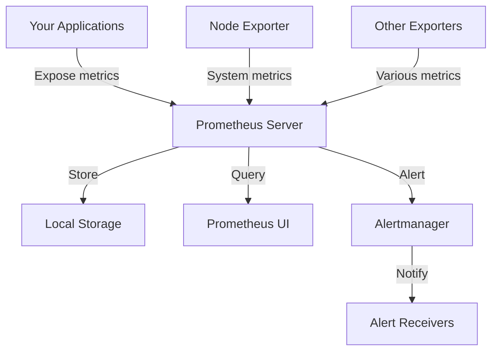

# Prometheus Installation

## Introduction

Prometheus is an open-source systems monitoring and alerting toolkit that has become a standard for monitoring cloud-native applications. Originally built at SoundCloud, Prometheus joined the Cloud Native Computing Foundation in 2016 and has grown to be a widely adopted technology.

In this guide, we'll walk through the process of installing Prometheus on different operating systems and deployment environments. By the end of this tutorial, you'll have a functioning Prometheus server ready to collect metrics from your applications and infrastructure.

## Prerequisites

Before installing Prometheus, ensure you have:

- Administrative access to your server
- Basic familiarity with command-line operations
- Recommended: 2+ CPU cores and at least 4GB RAM for production deployments
- At least 10GB of free disk space for metrics storage (more for production environments)

## Installation Methods

There are several ways to install Prometheus depending on your environment and preferences. We'll cover:

1. Using pre-compiled binaries (for Linux, Windows, and macOS)
2. Using Docker
3. Installing on Kubernetes using Helm

## Method 1: Installing Using Pre-compiled Binaries

### Linux Installation

Follow these steps to install Prometheus on a Linux system:

#### Step 1: Create a Prometheus user

```bash
sudo useradd --no-create-home --shell /bin/false prometheus
```

#### Step 2: Create directories for Prometheus files

```bash
sudo mkdir /etc/prometheus /var/lib/prometheus
sudo chown prometheus:prometheus /var/lib/prometheus
```

#### Step 3: Download the latest Prometheus release

First, check the [Prometheus download page](https://prometheus.io/download/) for the latest version, then:

```bash
# Download Prometheus (replace X.Y.Z with the latest version)
wget https://github.com/prometheus/prometheus/releases/download/vX.Y.Z/prometheus-X.Y.Z.linux-amd64.tar.gz

# Extract the archive
tar -xvf prometheus-X.Y.Z.linux-amd64.tar.gz

# Navigate to the extracted directory
cd prometheus-X.Y.Z.linux-amd64
```

#### Step 4: Copy the binaries and configuration

```bash
# Copy binaries
sudo cp prometheus /usr/local/bin/
sudo cp promtool /usr/local/bin/

# Set correct ownership
sudo chown prometheus:prometheus /usr/local/bin/prometheus
sudo chown prometheus:prometheus /usr/local/bin/promtool

# Copy configuration files and console libraries
sudo cp -r consoles /etc/prometheus
sudo cp -r console_libraries /etc/prometheus
sudo cp prometheus.yml /etc/prometheus/

# Set correct ownership
sudo chown -R prometheus:prometheus /etc/prometheus
```

#### Step 5: Create a systemd service file

```bash
sudo nano /etc/systemd/system/prometheus.service
```

Add the following content:

```ini
[Unit]
Description=Prometheus Time Series Collection and Processing Server
Wants=network-online.target
After=network-online.target

[Service]
User=prometheus
Group=prometheus
Type=simple
ExecStart=/usr/local/bin/prometheus \
    --config.file /etc/prometheus/prometheus.yml \
    --storage.tsdb.path /var/lib/prometheus/ \
    --web.console.templates=/etc/prometheus/consoles \
    --web.console.libraries=/etc/prometheus/console_libraries

[Install]
WantedBy=multi-user.target
```

#### Step 6: Start and enable the Prometheus service

```bash
sudo systemctl daemon-reload
sudo systemctl start prometheus
sudo systemctl enable prometheus
```

#### Step 7: Verify the installation

```bash
sudo systemctl status prometheus
```

You should now be able to access Prometheus UI at `http://your-server-ip:9090`.

### Windows Installation

For Windows systems, the installation process is simpler:

#### Step 1: Download the Windows binary

Visit the [Prometheus download page](https://prometheus.io/download/) and download the Windows binary.

#### Step 2: Extract the archive

Extract the downloaded ZIP file to a location of your choice, e.g., `C:\prometheus`.

#### Step 3: Configure Prometheus

Open `prometheus.yml` in a text editor and adjust the configuration as needed.

#### Step 4: Run Prometheus

Open Command Prompt as Administrator, navigate to the Prometheus directory, and run:

```cmd
prometheus.exe --config.file=prometheus.yml
```

For automatic startup, you can create a Windows service using NSSM (Non-Sucking Service Manager) or similar tools.

### macOS Installation

For macOS, using Homebrew is the easiest approach:

```bash
# Install Homebrew if not already installed
/bin/bash -c "$(curl -fsSL https://raw.githubusercontent.com/Homebrew/install/HEAD/install.sh)"

# Install Prometheus
brew install prometheus

# Start Prometheus
brew services start prometheus
```

## Method 2: Using Docker

Docker provides a convenient way to run Prometheus without installing it directly on your host system:

#### Step 1: Create a Prometheus configuration file

Create a directory for your Prometheus configuration and a `prometheus.yml` file:

```bash
mkdir -p prometheus/config
cd prometheus/config
```

Create a `prometheus.yml` file with the following content:

```yaml
global:
  scrape_interval: 15s

scrape_configs:
  - job_name: 'prometheus'
    static_configs:
      - targets: ['localhost:9090']
```

#### Step 2: Run Prometheus using Docker

```bash
docker run -d \
    --name prometheus \
    -p 9090:9090 \
    -v $(pwd)/config/prometheus.yml:/etc/prometheus/prometheus.yml \
    prom/prometheus
```

This command starts a Prometheus container, maps port 9090, and uses your configuration file.

#### Step 3: Verify the installation

Open a web browser and navigate to `http://localhost:9090`. You should see the Prometheus UI.

## Method 3: Installing on Kubernetes using Helm

For Kubernetes environments, Helm provides an easy way to deploy Prometheus:

#### Step 1: Install Helm (if not already installed)

```bash
curl https://raw.githubusercontent.com/helm/helm/main/scripts/get-helm-3 | bash
```

#### Step 2: Add the Prometheus Helm repository

```bash
helm repo add prometheus-community https://prometheus-community.github.io/helm-charts
helm repo update
```

#### Step 3: Create a values file (optional)

Create a file named `prometheus-values.yaml` to customize your Prometheus installation:

```yaml
server:
  persistentVolume:
    size: 10Gi
  retention: 15d
alertmanager:
  enabled: true
```

#### Step 4: Install Prometheus using Helm

```bash
# Create a namespace for Prometheus
kubectl create namespace monitoring

# Install Prometheus
helm install prometheus prometheus-community/prometheus \
    --namespace monitoring \
    --values prometheus-values.yaml
```

#### Step 5: Access Prometheus UI

Set up port forwarding to access the Prometheus UI:

```bash
kubectl port-forward -n monitoring svc/prometheus-server 9090:80
```

You can now access Prometheus at `http://localhost:9090`.

## Basic Configuration

After installation, you'll want to configure Prometheus to scrape metrics from your targets. The basic configuration file (`prometheus.yml`) looks like this:

```yaml
global:
  scrape_interval: 15s
  evaluation_interval: 15s

scrape_configs:
  - job_name: 'prometheus'
    static_configs:
      - targets: ['localhost:9090']
  
  - job_name: 'node'
    static_configs:
      - targets: ['node-exporter:9100']
```

Key configuration sections include:

- `global`: Sets global settings such as how frequently to scrape targets
- `scrape_configs`: Defines what targets Prometheus should monitor
- `alerting`: Configures how alerting works (not shown in example)
- `rule_files`: Specifies which rule files to load (not shown in example)

## Validating Your Installation

To ensure your Prometheus installation is working correctly:

1. Open the Prometheus UI in your browser (typically at port 9090)
2. Navigate to the Status > Targets page to verify that Prometheus is successfully scraping its targets
3. Run a simple query like `up` in the Graph section to see which targets are up

## Visualizing the Architecture

Here's a simple diagram of the Prometheus architecture you've just set up:



## Troubleshooting Common Issues

### Issue 1: Prometheus won't start

Check the service status:

```bash
sudo systemctl status prometheus
```

Look for error messages in the logs:

```bash
sudo journalctl -u prometheus
```

Common causes:
- Configuration file syntax errors
- Permission issues on data directories
- Port 9090 already in use

### Issue 2: Prometheus can't scrape targets

If you see targets in an "down" state:
1. Check network connectivity between Prometheus and the target
2. Verify the target is actually exposing metrics
3. Ensure firewall rules allow traffic on the metrics port

### Issue 3: High resource usage

If Prometheus is consuming too many resources:
1. Adjust retention period (`--storage.tsdb.retention.time`)
2. Increase scrape intervals
3. Reduce the number of metrics collected using relabeling

## Summary

In this guide, we've covered:

- Installing Prometheus using pre-compiled binaries on Linux, Windows, and macOS
- Deploying Prometheus using Docker
- Setting up Prometheus on Kubernetes with Helm
- Basic configuration to get started
- Validating your installation
- Troubleshooting common issues

You now have a functional Prometheus installation ready to monitor your applications and infrastructure. In the next sections of this learning path, we'll explore how to configure Prometheus to scrape different targets and how to create queries and alerts.

## Additional Resources

- [Official Prometheus Documentation](https://prometheus.io/docs/introduction/overview/)
- [Prometheus GitHub Repository](https://github.com/prometheus/prometheus)
- [Prometheus Best Practices](https://prometheus.io/docs/practices/naming/)

## Exercises

1. Add another target to your Prometheus configuration and verify that metrics are being scraped.
2. Configure Prometheus to use external storage like Amazon S3 or Google Cloud Storage.
3. Install Grafana and connect it to your Prometheus instance to create dashboards.
4. Set up a basic alert rule that triggers when a target goes down.
5. Explore different exporters available for Prometheus and install one that's relevant to your environment.