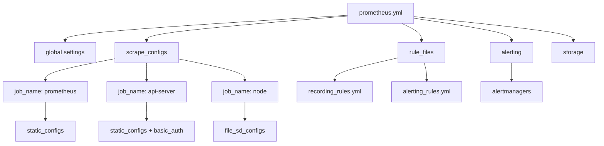

# Prometheus Configuration

## Introduction

Configuration is a fundamental aspect of setting up and running Prometheus effectively. Prometheus uses a YAML configuration file that defines everything from which targets to monitor to how long data should be retained. In this guide, we'll explore the structure of Prometheus configuration, learn how to define monitoring targets, and understand best practices for a well-configured monitoring system.

Proper configuration allows you to:
- Define which services and endpoints Prometheus will monitor
- Set up scrape intervals and timeouts
- Configure rule files for alerting and recording
- Set up service discovery mechanisms
- Manage data retention and storage

## Configuration File Basics

Prometheus uses a single YAML configuration file (conventionally named `prometheus.yml`) as its primary configuration source. When you start Prometheus, you typically specify this file using the `--config.file` flag.

### Basic Structure

The configuration file has several main sections:

- `global`: Settings that apply to the entire Prometheus server
- `scrape_configs`: Defines the targets Prometheus will monitor
- `rule_files`: Specifies recording and alerting rules
- `alerting`: Configures where alert notifications should be sent
- `remote_write` and `remote_read`: Set up integrations with remote storage systems

Let's look at a minimal configuration file:

```yaml
global:
  scrape_interval: 15s
  evaluation_interval: 15s

scrape_configs:
  - job_name: "prometheus"
    static_configs:
      - targets: ["localhost:9090"]
```

This simple configuration:
1. Sets the default scrape and rule evaluation interval to 15 seconds
2. Creates a single job named "prometheus" that monitors the Prometheus server itself

## The `global` Section

The `global` section defines parameters that are valid in all other configuration contexts. These are the server's defaults.

```yaml
global:
  # How frequently to scrape targets by default
  scrape_interval: 15s
  
  # How frequently to evaluate rules
  evaluation_interval: 15s
  
  # How long until a scrape request times out
  scrape_timeout: 10s
  
  # Rules for attaching labels to all metrics
  external_labels:
    environment: production
    region: us-east-1
```

The `external_labels` are particularly important - they are attached to all time series and alerts when communicating with external systems like remote storage or alertmanagers.

## Scrape Configurations

The `scrape_configs` section is where you define the targets Prometheus will monitor. Each entry is called a "job" and can contain multiple target endpoints.

### Static Configuration

The simplest way to define targets is with `static_configs`:

```yaml
scrape_configs:
  - job_name: "api-server"
    scrape_interval: 5s  # Override global setting for this job
    static_configs:
      - targets: ["api.example.com:8080", "api-backup.example.com:8080"]
        labels:
          team: "backend"
          service: "api"
```

This configuration:
1. Creates a job named "api-server"
2. Overrides the global scrape interval to check these targets every 5 seconds
3. Defines two static targets to monitor
4. Attaches additional labels that will be added to all metrics from these targets

### Using File-Based Service Discovery

For more dynamic environments, Prometheus offers various service discovery mechanisms. Here's how to use file-based discovery:

```yaml
scrape_configs:
  - job_name: "file-sd-example"
    file_sd_configs:
      - files:
        - "targets/*.json"
        refresh_interval: 30s
```

With this configuration, Prometheus will look for target definition files in the `targets/` directory and reload them every 30 seconds.

A matching JSON target file might look like:

```json
[
  {
    "targets": ["server1:9100", "server2:9100"],
    "labels": {
      "env": "production",
      "job": "node-exporter"
    }
  }
]
```

### Relabeling

Relabeling is a powerful feature that allows you to modify labels before metrics are ingested:

```yaml
scrape_configs:
  - job_name: "kubernetes-pods"
    kubernetes_sd_configs:
      - role: pod
    relabel_configs:
      - source_labels: [__meta_kubernetes_pod_annotation_prometheus_io_scrape]
        action: keep
        regex: true
      - source_labels: [__meta_kubernetes_pod_annotation_prometheus_io_path]
        action: replace
        target_label: __metrics_path__
        regex: (.+)
```

This configuration:
1. Discovers all Kubernetes pods
2. Keeps only those with an annotation `prometheus.io/scrape: "true"`
3. Uses a pod annotation to set the metrics path

## Rule Configuration

Rules allow Prometheus to precompute frequently needed expressions and create alerts.

```yaml
rule_files:
  - "rules/recording_rules.yml"
  - "rules/alerting_rules.yml"
```

A simple alerting rule file might look like:

```yaml
groups:
  - name: example
    rules:
      - alert: HighCPULoad
        expr: node_load1 > 0.8
        for: 5m
        labels:
          severity: warning
        annotations:
          summary: "High CPU load on {{$labels.instance}}"
          description: "CPU load is above 80% for more than 5 minutes (current value: {{$value}})"
```

## Alertmanager Configuration

To send alerts, you need to configure the Alertmanager connection:

```yaml
alerting:
  alertmanagers:
    - static_configs:
        - targets:
          - "alertmanager:9093"
```

## Storage Configuration

You can configure how Prometheus stores its time series data:

```yaml
storage:
  tsdb:
    path: "/data"
    retention:
      time: 15d
      size: 50GB
```

This tells Prometheus to:
1. Store data in the `/data` directory
2. Keep data for 15 days OR until the storage reaches 50GB, whichever comes first

## Practical Example: Complete Configuration

Let's put it all together with a more comprehensive real-world example:

```yaml
global:
  scrape_interval: 15s
  evaluation_interval: 15s
  scrape_timeout: 10s
  external_labels:
    environment: production
    region: us-east-1

# Rule files specifies a list of files from which rules are read
rule_files:
  - "rules/recording_rules.yml"
  - "rules/alerting_rules.yml"

# Alertmanager configuration
alerting:
  alertmanagers:
    - static_configs:
        - targets:
          - "alertmanager:9093"

# Scrape configs
scrape_configs:
  # Self monitoring
  - job_name: "prometheus"
    static_configs:
      - targets: ["localhost:9090"]

  # Node exporters
  - job_name: "node"
    file_sd_configs:
      - files:
        - "targets/nodes.json"
        refresh_interval: 5m
    relabel_configs:
      - source_labels: [env]
        action: replace
        target_label: environment

  # API servers with different scrape interval
  - job_name: "api-server"
    scrape_interval: 5s
    metrics_path: /metrics
    scheme: https
    basic_auth:
      username: prometheus
      password: secret_password
    static_configs:
      - targets: ["api.example.com:8443"]
        labels:
          team: "backend"
```

This configuration:
1. Sets global parameters for scraping and evaluation
2. Configures rule files for alerting and recording rules
3. Sets up the connection to Alertmanager
4. Monitors Prometheus itself, node exporters via file-based service discovery, and an API server with basic authentication

## Visualizing Prometheus Configuration



## How to Reload Configuration

Prometheus can reload its configuration without restarting. You can trigger a reload by sending a `SIGHUP` signal to the Prometheus process or by making an HTTP POST request to the `/-/reload` endpoint if the `--web.enable-lifecycle` flag is enabled.

For example:

```bash
curl -X POST http://localhost:9090/-/reload
```

## Best Practices for Configuration

1. **Use service discovery** instead of static configs when possible to make your configuration adaptable to changing environments

2. **Organize rule files logically** by separating recording rules from alerting rules, and grouping rules by function or team

3. **Set appropriate scrape intervals** - more frequent for critical services, less frequent for stable services with little change

4. **Use relabeling sparingly** - while powerful, complex relabeling can make debugging difficult

5. **Version control your configuration files** to track changes and enable rollbacks

6. **Use hierarchical structures** - apply defaults in the `global` section and override only when necessary at the job level

7. **Test configuration changes** before applying them to production:
   ```bash
   promtool check config prometheus.yml
   ```

## Summary

Prometheus configuration is flexible and powerful, allowing you to define monitoring targets, alerting rules, and storage settings. The YAML-based configuration file provides a declarative way to specify what and how Prometheus should monitor.

Key points to remember:
- The configuration file defines global settings, scrape targets, rules, and alerting
- Service discovery mechanisms help adapt to dynamic environments
- Relabeling allows for powerful transformations of metadata
- Configuration can be reloaded without restarting Prometheus

## Additional Resources

- [Prometheus Configuration Documentation](https://prometheus.io/docs/prometheus/latest/configuration/configuration/)
- [Service Discovery Options](https://prometheus.io/docs/prometheus/latest/configuration/configuration/#scrape_config)
- [Recording Rules](https://prometheus.io/docs/prometheus/latest/configuration/recording_rules/)
- [Alerting Rules](https://prometheus.io/docs/prometheus/latest/configuration/alerting_rules/)

## Exercises

1. Create a basic `prometheus.yml` file that monitors Prometheus itself and a Node Exporter instance.

2. Modify your configuration to add an alerting rule that fires when a target has been down for more than 5 minutes.

3. Set up file-based service discovery for a group of web servers, with different scrape intervals based on their importance.

4. Use relabeling to add environment and team labels based on the hostname of the target.

5. Configure Prometheus to keep metrics for 30 days, but limit the total storage size to 100GB.