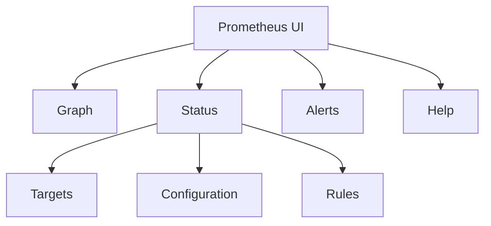
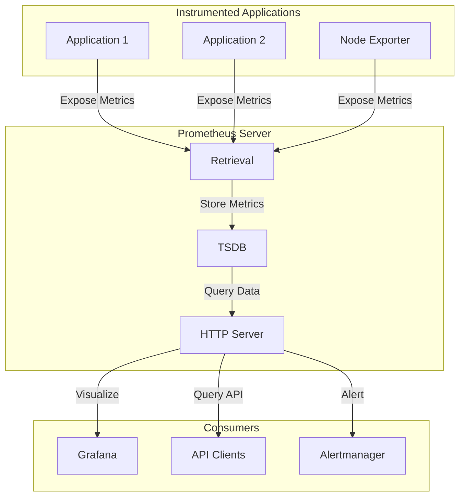

# Prometheus First Steps

## Introduction

Prometheus is an open-source systems monitoring and alerting toolkit that has become a cornerstone of cloud-native observability. Originally built at SoundCloud, Prometheus is now a standalone project maintained by the Cloud Native Computing Foundation (CNCF). In this guide, we'll take our first steps with Prometheus, understanding its core concepts and getting a basic implementation up and running.

Prometheus follows a pull-based model where it scrapes metrics from instrumented applications at regular intervals. These metrics are stored in a time-series database and can be queried using PromQL (Prometheus Query Language). This approach provides a powerful and flexible way to monitor your systems and applications.

## What is Prometheus?

Prometheus is a monitoring system that:

- Collects metrics from configured targets at specified intervals
- Evaluates rule expressions
- Displays results
- Can trigger alerts when specified conditions are observed

Its key features include:

- A multi-dimensional data model with time series data identified by metric name and key/value pairs
- PromQL, a flexible query language
- No reliance on distributed storage; single server nodes are autonomous
- Time series collection via a pull model over HTTP
- Pushing time series is supported via an intermediary gateway
- Targets are discovered via service discovery or static configuration
- Multiple modes of graphing and dashboarding support

## Prerequisites

Before we begin, ensure you have:

- A Linux, macOS, or Windows system
- Basic understanding of command-line operations
- Docker installed (for the simplest setup)
- About 2GB of free disk space

## Installing Prometheus

The easiest way to get started with Prometheus is using Docker. Let's set up a basic Prometheus instance:

```bash
# Create a configuration directory
mkdir -p prometheus/config

# Create a basic prometheus.yml configuration file
cat > prometheus/config/prometheus.yml << EOF
global:
  scrape_interval: 15s

scrape_configs:
  - job_name: 'prometheus'
    static_configs:
      - targets: ['localhost:9090']
EOF

# Run Prometheus in Docker
docker run -d \
  --name prometheus \
  -p 9090:9090 \
  -v $(pwd)/prometheus/config:/etc/prometheus \
  prom/prometheus
```

This setup:
1. Creates a configuration directory
2. Adds a basic configuration file that tells Prometheus to scrape itself
3. Runs Prometheus in a Docker container, exposing port 9090

## Accessing the Prometheus UI

Once Prometheus is running, you can access its web interface by opening `http://localhost:9090` in your browser. You should see the Prometheus UI, which looks like this:



The UI is divided into several sections:
- **Graph**: For executing queries and visualizing results
- **Status**: For checking Prometheus configuration and target status
- **Alerts**: For viewing configured alerts
- **Help**: For accessing documentation

## Understanding Basic Prometheus Concepts

### Metrics and Time Series

In Prometheus, all data is stored as time series - streams of timestamped values that share the same metric name and set of labeled dimensions. Each time series is uniquely identified by:

1. A **metric name** that describes what is being measured (e.g., `http_requests_total`)
2. A set of **labels** (key-value pairs) that identify specific instances (e.g., `{method="GET", endpoint="/api/users"}`)

For example, a metric might look like:
```
http_requests_total{method="GET", endpoint="/api/users", status="200"} 1234
```

This indicates that there have been 1234 HTTP GET requests to the `/api/users` endpoint that returned a 200 status code.

### Data Types

Prometheus supports four core metric types:

1. **Counter**: A cumulative metric that only increases (e.g., number of requests)
2. **Gauge**: A metric that can go up and down (e.g., memory usage)
3. **Histogram**: Samples observations and counts them in configurable buckets (e.g., request durations)
4. **Summary**: Similar to histogram, but calculates quantiles over a sliding time window

## Your First Prometheus Queries

Let's explore some basic queries using the Prometheus UI:

1. Navigate to `http://localhost:9090/graph`
2. In the query box, enter `prometheus_http_requests_total`
3. Click "Execute"

You should see a list of time series showing the total HTTP requests to various Prometheus endpoints.

Let's try a few more basic queries:

### Query the rate of HTTP requests

```
rate(prometheus_http_requests_total[1m])
```

This shows the per-second rate of HTTP requests over the last minute.

### Filter by handler

```
prometheus_http_requests_total{handler="/api/v1/query"}
```

This shows only requests to the query API endpoint.

### Calculate total requests across all handlers

```
sum(prometheus_http_requests_total)
```

This aggregates all HTTP requests regardless of handler or other labels.

## Configuring Prometheus to Monitor an External Target

Let's update our configuration to monitor an external target. We'll use Node Exporter, which provides hardware and OS metrics:

```bash
# Run Node Exporter
docker run -d \
  --name node-exporter \
  -p 9100:9100 \
  prom/node-exporter

# Update Prometheus configuration
cat > prometheus/config/prometheus.yml << EOF
global:
  scrape_interval: 15s

scrape_configs:
  - job_name: 'prometheus'
    static_configs:
      - targets: ['localhost:9090']
  
  - job_name: 'node-exporter'
    static_configs:
      - targets: ['host.docker.internal:9100']
EOF

# Restart Prometheus
docker restart prometheus
```

After a minute or so, you should be able to query Node Exporter metrics:

1. In the Prometheus UI, try the query `node_cpu_seconds_total`
2. You'll see CPU usage metrics for your host system

## Understanding Prometheus Architecture



The core components are:
- **Prometheus Server**: Scrapes and stores time series data
- **Client Libraries**: For instrumenting application code
- **Exporters**: Expose metrics from third-party systems
- **Alertmanager**: Handles alerts
- **Visualization Tools**: Like Grafana for dashboarding

## Real-world Application Monitoring

Let's see a practical example of monitoring a web application. Imagine we have a simple web service and want to track:
- Request count
- Response latency
- Error rate

Here's how we'd set up basic instrumentation using Python and the Prometheus client:

```python
from flask import Flask, request
from prometheus_client import Counter, Histogram, generate_latest, CONTENT_TYPE_LATEST
import time

app = Flask(__name__)

# Define metrics
REQUEST_COUNT = Counter('http_requests_total', 'Total HTTP Requests', ['method', 'endpoint', 'status'])
REQUEST_LATENCY = Histogram('http_request_duration_seconds', 'HTTP Request Latency', ['method', 'endpoint'])

@app.route('/metrics')
def metrics():
    return generate_latest(), 200, {'Content-Type': CONTENT_TYPE_LATEST}

@app.route('/api/data')
def get_data():
    start_time = time.time()
    # Simulate processing
    time.sleep(0.1)
    status = 200
    # Record metrics
    REQUEST_COUNT.labels(method='GET', endpoint='/api/data', status=status).inc()
    REQUEST_LATENCY.labels(method='GET', endpoint='/api/data').observe(time.time() - start_time)
    return {"data": "example"}, status

if __name__ == '__main__':
    app.run(host='0.0.0.0', port=8000)
```

To monitor this application with Prometheus, we'd update our configuration:

```yaml
scrape_configs:
  # Other configs...
  
  - job_name: 'web-app'
    static_configs:
      - targets: ['host.docker.internal:8000']
    metrics_path: '/metrics'
```

With this setup, we could then create useful queries:

- Request rate: `rate(http_requests_total[1m])`
- 95th percentile latency: `histogram_quantile(0.95, sum(rate(http_request_duration_seconds_bucket[5m])) by (le, endpoint))`
- Error rate: `sum(rate(http_requests_total{status=~"5.."}[5m])) / sum(rate(http_requests_total[5m]))`

## Advanced Concepts

As you become more comfortable with Prometheus, you'll want to explore:

1. **Recording rules**: Pre-computed expressions saved as new time series
2. **Alerting rules**: Conditions that trigger notifications
3. **Service discovery**: Automatically find targets to monitor
4. **Federation**: Scaling Prometheus across multiple instances
5. **Long-term storage**: Integrating with solutions like Thanos or Cortex

## Summary

In this guide, we've taken our first steps with Prometheus:

- Set up a basic Prometheus server using Docker
- Understood the key concepts of metrics and time series
- Executed simple queries using PromQL
- Configured Prometheus to monitor external targets
- Explored a real-world application monitoring example

Prometheus provides a powerful foundation for monitoring your systems and applications. As you build on these fundamentals, you'll be able to create comprehensive monitoring solutions that help ensure reliability and performance.

## Practice Exercises

1. Set up Prometheus to monitor your local machine using Node Exporter
2. Create a dashboard that shows CPU, memory, and disk usage
3. Write a query that alerts when CPU usage exceeds 80% for 5 minutes
4. Instrument a simple application of your choice with Prometheus metrics

## Additional Resources

- [Official Prometheus Documentation](https://prometheus.io/docs/introduction/overview/)
- [PromQL Cheat Sheet](https://promlabs.com/promql-cheat-sheet/)
- [Grafana Integration Guide](https://grafana.com/docs/grafana/latest/datasources/prometheus/)
- [Prometheus Up & Running (Book)](https://www.oreilly.com/library/view/prometheus-up/9781492034131/)