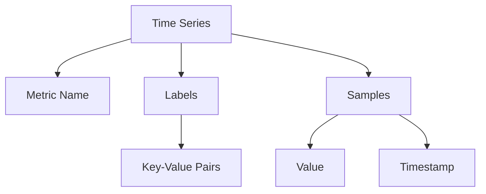
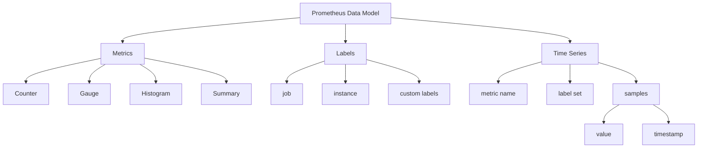

# Prometheus Data Model

## Introduction

The Prometheus data model is the foundation of how Prometheus stores and processes monitoring data. Understanding this model is crucial for effectively using Prometheus in your monitoring setup. Unlike traditional monitoring systems that work with simple numeric values, Prometheus uses a multidimensional data model that provides rich context and powerful querying capabilities.

In this guide, we'll explore the core concepts of the Prometheus data model, including metric types, time series, and the labeling system that makes Prometheus so flexible.

## Time Series Fundamentals

At its core, Prometheus stores all data as **time series** - streams of timestamped values belonging to the same metric and set of labeled dimensions. 

Each time series is uniquely identified by:
1. A **metric name** that describes what is being measured
2. A set of **key-value pairs** called **labels** that identify the specific instance or characteristic of what is being measured

### Time Series Format

Time series in Prometheus follow this format:

```
metric_name{label1="value1", label2="value2", ...} value @timestamp
```

For example, a time series measuring HTTP requests might look like:

```
http_requests_total{method="POST", endpoint="/api/users", status="200"} 23 1616030043
```

Let's visualize the structure of a time series:



## Metric Names

Metric names in Prometheus indicate what is being measured. They must follow these conventions:

- Must match the regex pattern: `[a-zA-Z_:][a-zA-Z0-9_:]*`
- Should follow the format: `namespace_subsystem_name`
- Should use units in the name (e.g., `http_requests_total`, `node_memory_bytes_total`)

Examples of good metric names:
- `prometheus_http_requests_total`
- `process_cpu_seconds_total`
- `node_memory_usage_bytes`

## Labels

Labels are key-value pairs that add dimensions to metrics, allowing you to differentiate between different instances or characteristics of what you're measuring.

### Label Best Practices

- Keep the number of labels reasonable (high cardinality can impact performance)
- Choose meaningful label names that describe the dimension
- Use consistent labeling schemes across related metrics
- Label names must match the regex: `[a-zA-Z_][a-zA-Z0-9_]*`

### Reserved Labels

Prometheus reserves some label names for internal use:

- `job`: The configured job name that the target belongs to
- `instance`: The `<host>:<port>` of the target's URL
- Label names starting with `__` are reserved for internal use

## Metric Types

Prometheus defines four core metric types. Let's examine each one in detail.

### 1. Counter

A **counter** is a cumulative metric that represents a single monotonically increasing value. It can only increase or be reset to zero (e.g., on process restart).

**Use cases**: Count events like requests, errors, or completed tasks.

Example:
```
# Number of HTTP requests received
http_requests_total{method="GET", endpoint="/api/products"} 1027
```

In your code (using the Prometheus client library):

```python
from prometheus_client import Counter

http_requests = Counter('http_requests_total', 
                        'Total HTTP requests',
                        ['method', 'endpoint'])

# Increment counter when a request happens
http_requests.labels(method='GET', endpoint='/api/products').inc()
```

### 2. Gauge

A **gauge** is a metric that represents a single numerical value that can arbitrarily go up and down.

**Use cases**: Measure values like current memory usage, temperature, or concurrent connections.

Example:
```
# Current memory usage in bytes
memory_usage_bytes{service="api"} 213992714
```

In your code:

```python
from prometheus_client import Gauge

memory_usage = Gauge('memory_usage_bytes', 
                    'Current memory usage in bytes',
                    ['service'])

# Set to current value
memory_usage.labels(service='api').set(213992714)

# Or increment/decrement
memory_usage.labels(service='api').inc(1000)  # Increase by 1000
memory_usage.labels(service='api').dec(500)   # Decrease by 500
```

### 3. Histogram

A **histogram** samples observations and counts them in configurable buckets. It also provides a sum of all observed values.

**Use cases**: Measure request durations, response sizes.

Example:
```
# Request duration histogram
http_request_duration_seconds_bucket{le="0.1"} 743
http_request_duration_seconds_bucket{le="0.5"} 2207
http_request_duration_seconds_bucket{le="1"} 2989
http_request_duration_seconds_bucket{le="2.5"} 3112
http_request_duration_seconds_bucket{le="+Inf"} 3112
http_request_duration_seconds_sum 1274.3
http_request_duration_seconds_count 3112
```

In your code:

```python
from prometheus_client import Histogram

request_duration = Histogram('http_request_duration_seconds',
                            'HTTP request duration in seconds',
                            ['endpoint'],
                            buckets=[0.1, 0.5, 1, 2.5, 5, 10])

# Track request duration
@request_duration.labels(endpoint='/api/products').time()
def process_request():
    # Process the request
    pass
```

### 4. Summary

A **summary** is similar to a histogram but calculates configurable quantiles over a sliding time window.

**Use cases**: Calculate percentiles for request durations or response sizes when you need exact quantiles.

Example:
```
# Request duration summary
http_request_duration_seconds{quantile="0.5"} 0.052
http_request_duration_seconds{quantile="0.9"} 0.87
http_request_duration_seconds{quantile="0.99"} 2.31
http_request_duration_seconds_sum 1274.3
http_request_duration_seconds_count 3112
```

In your code:

```python
from prometheus_client import Summary

request_duration = Summary('http_request_duration_seconds',
                          'HTTP request duration in seconds',
                          ['endpoint'],
                          quantiles=[0.5, 0.9, 0.99])

# Track request duration
@request_duration.labels(endpoint='/api/products').time()
def process_request():
    # Process the request
    pass
```

## Histogram vs. Summary

Let's compare these two similar but distinct metric types:

| Feature | Histogram | Summary |
|---------|-----------|---------|
| Calculation | Server-side calculation of quantiles | Client-side calculation of quantiles |
| Aggregation | Can be aggregated across instances | Cannot be aggregated for quantiles |
| Accuracy | Depends on bucket definition | Provides accurate quantiles |
| Resource usage | Less CPU intensive | More CPU intensive |
| Use case | When approximate quantiles are acceptable | When exact quantiles are required |

## Sample Scrape Output

Let's look at what the Prometheus data model looks like when Prometheus scrapes a target:

```
# HELP http_requests_total Total number of HTTP requests
# TYPE http_requests_total counter
http_requests_total{method="get",endpoint="/api",status="200"} 1027
http_requests_total{method="post",endpoint="/api",status="200"} 87
http_requests_total{method="get",endpoint="/home",status="200"} 144

# HELP memory_usage_bytes Current memory usage in bytes
# TYPE memory_usage_bytes gauge
memory_usage_bytes{service="api"} 213992714
memory_usage_bytes{service="worker"} 104838400

# HELP http_request_duration_seconds HTTP request duration in seconds
# TYPE http_request_duration_seconds histogram
http_request_duration_seconds_bucket{le="0.1"} 743
http_request_duration_seconds_bucket{le="0.5"} 2207
http_request_duration_seconds_bucket{le="1"} 2989
http_request_duration_seconds_bucket{le="2.5"} 3112
http_request_duration_seconds_bucket{le="+Inf"} 3112
http_request_duration_seconds_sum 1274.3
http_request_duration_seconds_count 3112
```

## Visualizing the Data Model

Let's use a diagram to visualize how the Prometheus data model organizes metrics:



## Real-World Example

Let's look at a practical example of how you might use the Prometheus data model in a web application:

```python
from prometheus_client import Counter, Gauge, Histogram, start_http_server
import time
import random

# Start up the server to expose metrics
start_http_server(8000)

# Create metrics
request_counter = Counter('app_http_requests_total', 
                         'Total HTTP requests', 
                         ['method', 'endpoint', 'status'])

active_requests = Gauge('app_http_active_requests', 
                       'Number of active HTTP requests', 
                       ['endpoint'])

request_duration = Histogram('app_http_request_duration_seconds', 
                            'HTTP request duration in seconds', 
                            ['endpoint'], 
                            buckets=[0.01, 0.05, 0.1, 0.5, 1, 5])

# Simulate request handling
while True:
    endpoints = ['/home', '/api/users', '/api/products', '/about']
    statuses = ['200', '300', '400', '500']
    methods = ['GET', 'POST', 'PUT', 'DELETE']
    
    endpoint = random.choice(endpoints)
    
    # Update active requests gauge
    active_requests.labels(endpoint=endpoint).inc()
    
    # Time the request processing
    with request_duration.labels(endpoint=endpoint).time():
        # Simulate request processing time
        time.sleep(random.uniform(0.001, 3))
    
    # Decrement active requests
    active_requests.labels(endpoint=endpoint).dec()
    
    # Update request counter
    method = random.choice(methods)
    status = random.choice(statuses)
    request_counter.labels(method=method, endpoint=endpoint, status=status).inc()
    
    time.sleep(0.1)
```

With this code, Prometheus would collect time series data that could help you answer questions like:
- How many requests are we serving for each endpoint?
- What's the error rate (status 4xx/5xx)?
- What's the 95th percentile request duration for the /api/users endpoint?
- How many active requests do we have right now?

## PromQL Basics with the Data Model

The Prometheus data model is designed to be queried using PromQL (Prometheus Query Language). Here are some basic examples:

```
# Get the total number of HTTP requests for each endpoint
http_requests_total{job="api-server"}

# Get the rate of requests over the last 5 minutes
rate(http_requests_total[5m])

# Get the 95th percentile of request durations
histogram_quantile(0.95, rate(http_request_duration_seconds_bucket[5m]))

# Alert when error rate is high
sum(rate(http_requests_total{status=~"5.."}[5m])) / sum(rate(http_requests_total[5m])) > 0.1
```

## Summary

In this guide, we explored the Prometheus data model:

- **Time Series**: The fundamental unit of data in Prometheus
- **Metric Names**: Identifiers for what is being measured
- **Labels**: Key-value pairs that add dimensions to metrics
- **Metric Types**: Counters, Gauges, Histograms, and Summaries

Understanding this data model is crucial for:
- Designing effective monitoring solutions
- Creating meaningful metrics that provide actionable insights
- Writing efficient PromQL queries
- Troubleshooting issues with your Prometheus setup

The multidimensional nature of Prometheus's data model provides flexibility and power that traditional monitoring systems lack, allowing you to gain deeper insights into your systems and applications.

## Exercises

1. **Basic Metric Design**: Design metrics for monitoring a web application's login system. Include appropriate metric types and labels.

2. **Cardinality Analysis**: Given a metric `http_requests_total{method, endpoint, status, user_id}`, calculate how many time series this could generate in a system with 5 methods, 20 endpoints, 10 status codes, and 10,000 users. Discuss the cardinality issues.

3. **Metric Type Selection**: For each scenario, select the most appropriate metric type and explain why:
   - Number of logged-in users
   - Total bytes transferred
   - CPU temperature
   - Request processing time

## Additional Resources

- [Prometheus Documentation: Data Model](https://prometheus.io/docs/concepts/data_model/)
- [Prometheus Best Practices: Naming and Labels](https://prometheus.io/docs/practices/naming/)
- [PromQL Tutorial](https://prometheus.io/docs/prometheus/latest/querying/basics/)
- [Prometheus: Up & Running (Book)](https://www.oreilly.com/library/view/prometheus-up/9781492034131/)