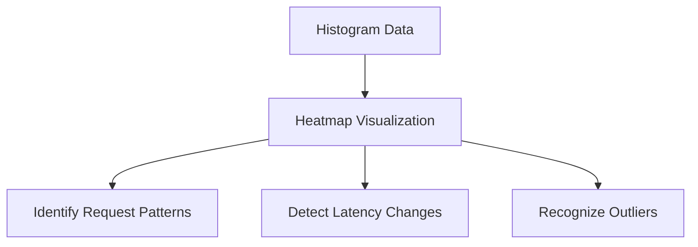
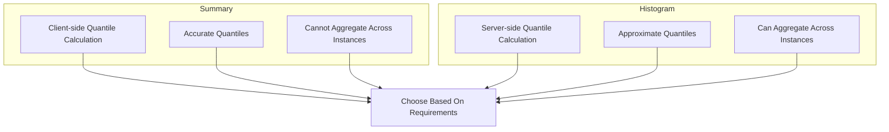
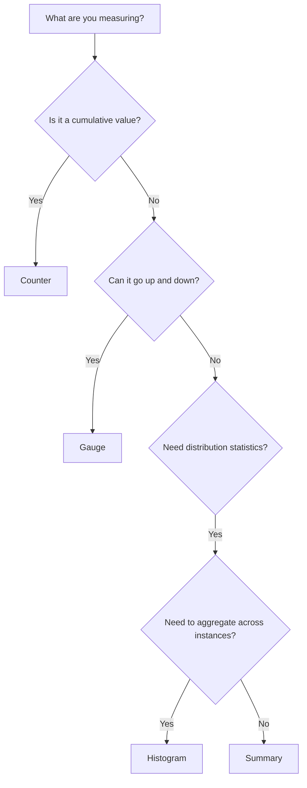

# Prometheus Metrics Types

## Introduction

Metrics are at the heart of Prometheus monitoring. They provide quantifiable data about your systems, allowing you to observe behavior, identify issues, and make informed decisions. Understanding the different types of metrics in Prometheus is crucial for effective monitoring and alerting.

Prometheus supports four core metric types, each designed to represent different kinds of data:

- **Counters** - Values that only increase over time
- **Gauges** - Values that can go up and down
- **Histograms** - Samples observations and counts them in configurable buckets
- **Summaries** - Similar to histograms, but with quantiles calculated client-side

Let's explore each of these in depth.

## Counter

### What is a Counter?

A counter is a metric that represents a **single monotonically increasing value** that can only go up or be reset to zero. Counters are perfect for measuring things like:

- Number of requests served
- Number of errors
- Number of tasks completed
- Number of events processed

### Counter Example

Here's how you define a counter in Go using the Prometheus client library:

```go
import (
    "github.com/prometheus/client_golang/prometheus"
    "github.com/prometheus/client_golang/prometheus/promauto"
)

var (
    requestsTotal = promauto.NewCounter(prometheus.CounterOpts{
        Name: "http_requests_total",
        Help: "The total number of HTTP requests",
    })
)

// Increment the counter in your code
func serveRequest() {
    // ... handle request
    requestsTotal.Inc()
}
```

In Python:

```python
from prometheus_client import Counter

requests_total = Counter('http_requests_total', 'The total number of HTTP requests')

def serve_request():
    # ... handle request
    requests_total.inc()
```

### Practical Use Cases

1. **Request Counting**:
   ```promql
   http_requests_total
   ```

2. **Rate Calculation**:
   To calculate the rate of requests per second over the last 5 minutes:
   ```promql
   rate(http_requests_total[5m])
   ```

3. **Error Rate Calculation**:
   ```promql
   rate(http_request_errors_total[5m]) / rate(http_requests_total[5m])
   ```

### Important Counter Rules

- Counters should never go down (except reset to zero when process restarts)
- Use rate() or increase() functions when querying counters
- Name counters with `_total` suffix by convention

## Gauge

### What is a Gauge?

A gauge is a metric that represents a **single numerical value that can go up and down**. Gauges are suitable for metrics that can increase or decrease, such as:

- Current memory usage
- Current active connections
- Queue size
- CPU utilization
- Temperature

### Gauge Example

In Go:

```go
var (
    activeConnections = promauto.NewGauge(prometheus.GaugeOpts{
        Name: "http_active_connections",
        Help: "The current number of active HTTP connections",
    })
)

// Increment or decrement the gauge
func connectionOpened() {
    activeConnections.Inc()
}

func connectionClosed() {
    activeConnections.Dec()
}

// Or set an absolute value
func updateConnections(count int) {
    activeConnections.Set(float64(count))
}
```

In Python:

```python
from prometheus_client import Gauge

active_connections = Gauge('http_active_connections', 'The current number of active HTTP connections')

def connection_opened():
    active_connections.inc()

def connection_closed():
    active_connections.dec()

def update_connections(count):
    active_connections.set(count)
```

### Practical Use Cases

1. **Memory Usage Monitoring**:
   ```promql
   process_resident_memory_bytes
   ```

2. **CPU Utilization**:
   ```promql
   node_cpu_utilization_percentage
   ```

3. **Disk Space Available**:
   ```promql
   node_filesystem_avail_bytes / node_filesystem_size_bytes * 100
   ```

### Important Gauge Rules

- Use gauges for values that can increase or decrease
- Query gauges directly without functions like rate()
- For gauges that fluctuate, consider min(), max(), or avg() for analysis over time periods

## Histogram

### What is a Histogram?

A histogram samples observations (usually request durations or response sizes) and counts them in configurable buckets. It also provides a sum of all observed values. Histograms are useful for:

- Request duration
- Response size
- Queue delay
- Any value where you want to track distribution

### Histogram Components

A histogram exposes multiple time series:

- **Sum** - Sum of all observed values
- **Count** - Count of events observed
- **Buckets** - Cumulative counters for observations in specified ranges

### Histogram Example

In Go:

```go
var (
    requestDuration = promauto.NewHistogram(prometheus.HistogramOpts{
        Name:    "http_request_duration_seconds",
        Help:    "HTTP request duration in seconds",
        Buckets: prometheus.DefBuckets, // Default: [0.005, 0.01, 0.025, 0.05, 0.1, 0.25, 0.5, 1, 2.5, 5, 10]
    })
)

func handleRequest() {
    start := time.Now()
    // ... handle request
    duration := time.Since(start).Seconds()
    requestDuration.Observe(duration)
}
```

In Python:

```python
from prometheus_client import Histogram
import time

request_duration = Histogram(
    'http_request_duration_seconds',
    'HTTP request duration in seconds',
    buckets=(0.005, 0.01, 0.025, 0.05, 0.1, 0.25, 0.5, 1, 2.5, 5, 10)
)

def handle_request():
    start = time.time()
    # ... handle request
    duration = time.time() - start
    request_duration.observe(duration)
```

### Histogram Metrics Format

Histograms create multiple time series:

```
http_request_duration_seconds_bucket{le="0.1"} 123  # requests <= 0.1 seconds
http_request_duration_seconds_bucket{le="0.5"} 456  # requests <= 0.5 seconds
http_request_duration_seconds_bucket{le="1"} 789    # requests <= 1 second
...
http_request_duration_seconds_bucket{le="+Inf"} 1000  # all requests
http_request_duration_seconds_sum 5423.13            # sum of all durations
http_request_duration_seconds_count 1000            # count of all observations
```

### Practical Use Cases

1. **Calculating Request Duration Percentiles**:
   ```promql
   histogram_quantile(0.95, rate(http_request_duration_seconds_bucket[5m]))
   ```

2. **Average Request Duration**:
   ```promql
   rate(http_request_duration_seconds_sum[5m]) / rate(http_request_duration_seconds_count[5m])
   ```

3. **Percentage of Requests Faster Than Threshold**:
   ```promql
   rate(http_request_duration_seconds_bucket{le="0.1"}[5m]) / rate(http_request_duration_seconds_count[5m]) * 100
   ```

### Visualizing Histograms

Histograms can be visualized as heatmaps in Grafana:



## Summary

### What is a Summary?

A summary is similar to a histogram, but it calculates configurable quantiles directly on the client side. Summaries are useful for similar use cases as histograms but with more accurate quantiles at the cost of aggregation capabilities.

### Summary Components

A summary exposes multiple time series:

- **Sum** - Sum of all observed values
- **Count** - Count of events observed
- **Quantiles** - Calculated percentiles (e.g., 0.5 for median, 0.9 for 90th percentile)

### Summary Example

In Go:

```go
var (
    requestDuration = promauto.NewSummary(prometheus.SummaryOpts{
        Name:       "http_request_duration_seconds",
        Help:       "HTTP request duration in seconds",
        Objectives: map[float64]float64{0.5: 0.05, 0.9: 0.01, 0.99: 0.001},
    })
)

func handleRequest() {
    start := time.Now()
    // ... handle request
    duration := time.Since(start).Seconds()
    requestDuration.Observe(duration)
}
```

In Python:

```python
from prometheus_client import Summary
import time

request_duration = Summary(
    'http_request_duration_seconds',
    'HTTP request duration in seconds',
    ['method', 'endpoint'],
    objectives={0.5: 0.05, 0.9: 0.01, 0.99: 0.001}
)

def handle_request(method, endpoint):
    start = time.time()
    # ... handle request
    duration = time.time() - start
    request_duration.labels(method=method, endpoint=endpoint).observe(duration)
```

### Summary Metrics Format

Summaries create multiple time series:

```
http_request_duration_seconds{quantile="0.5"} 0.123    # 50th percentile (median)
http_request_duration_seconds{quantile="0.9"} 0.456    # 90th percentile
http_request_duration_seconds{quantile="0.99"} 0.789   # 99th percentile
http_request_duration_seconds_sum 5423.13              # sum of all durations
http_request_duration_seconds_count 1000               # count of all observations
```

### Summary vs. Histogram



Choose a **histogram** when:
- You need to aggregate metrics across multiple instances
- You want to calculate different quantiles at query time
- You need to analyze bucket distributions

Choose a **summary** when:
- You need more accurate quantiles
- You don't need to aggregate across instances
- Quantiles are predetermined

## Labels and Dimensions

All Prometheus metrics can have labels to add dimensions to your data. This allows for more granular analysis.

### Example with Labels

```go
var (
    requestsTotal = promauto.NewCounterVec(
        prometheus.CounterOpts{
            Name: "http_requests_total",
            Help: "The total number of HTTP requests",
        },
        []string{"method", "status", "path"},
    )
)

func handleRequest(method, path string, status int) {
    // ... handle request
    requestsTotal.WithLabelValues(method, fmt.Sprintf("%d", status), path).Inc()
}
```

In Python:

```python
from prometheus_client import Counter

requests_total = Counter('http_requests_total', 'The total number of HTTP requests',
                         ['method', 'status', 'path'])

def handle_request(method, path, status):
    # ... handle request
    requests_total.labels(method=method, status=str(status), path=path).inc()
```

### Best Practices for Labels

- Use labels for dimensions that enable meaningful aggregation
- Keep cardinality under control (avoid labels with high cardinality)
- Common labels: environment, service, instance, endpoint, status_code
- Avoid using high-cardinality labels like user IDs or session IDs

## Choosing the Right Metric Type



Use this decision flow to help choose the right metric type:

1. **Counter**: For values that only increase (total requests, errors, etc.)
2. **Gauge**: For values that go up and down (memory usage, queue size, etc.)
3. **Histogram**: For distributions you want to aggregate across instances (request duration)
4. **Summary**: For accurate quantiles calculated client-side

## Sample Instrumentation Code

Here's a complete example showing how to instrument a Go HTTP server:

```go
package main

import (
    "fmt"
    "net/http"
    "time"

    "github.com/prometheus/client_golang/prometheus"
    "github.com/prometheus/client_golang/prometheus/promauto"
    "github.com/prometheus/client_golang/prometheus/promhttp"
)

var (
    // Counter for total requests
    requestsTotal = promauto.NewCounterVec(
        prometheus.CounterOpts{
            Name: "http_requests_total",
            Help: "The total number of HTTP requests",
        },
        []string{"method", "path", "status"},
    )

    // Gauge for current active requests
    activeRequests = promauto.NewGauge(prometheus.GaugeOpts{
        Name: "http_active_requests",
        Help: "The current number of active HTTP requests",
    })

    // Histogram for request duration
    requestDuration = promauto.NewHistogramVec(
        prometheus.HistogramOpts{
            Name:    "http_request_duration_seconds",
            Help:    "HTTP request duration in seconds",
            Buckets: []float64{0.01, 0.05, 0.1, 0.5, 1, 2.5, 5},
        },
        []string{"method", "path"},
    )
)

func instrumentHandler(next http.HandlerFunc) http.HandlerFunc {
    return func(w http.ResponseWriter, r *http.Request) {
        // Start timer
        start := time.Now()
        
        // Track active requests
        activeRequests.Inc()
        defer activeRequests.Dec()
        
        // Create a response wrapper to capture status code
        wrapper := newResponseWrapper(w)
        
        // Call the actual handler
        next(wrapper, r)
        
        // Record metrics after request is complete
        duration := time.Since(start).Seconds()
        status := fmt.Sprintf("%d", wrapper.statusCode)
        
        requestsTotal.WithLabelValues(r.Method, r.URL.Path, status).Inc()
        requestDuration.WithLabelValues(r.Method, r.URL.Path).Observe(duration)
    }
}

// ResponseWrapper to capture status code
type responseWrapper struct {
    http.ResponseWriter
    statusCode int
}

func newResponseWrapper(w http.ResponseWriter) *responseWrapper {
    return &responseWrapper{w, http.StatusOK}
}

func (rw *responseWrapper) WriteHeader(code int) {
    rw.statusCode = code
    rw.ResponseWriter.WriteHeader(code)
}

// Sample handlers
func homeHandler(w http.ResponseWriter, r *http.Request) {
    time.Sleep(50 * time.Millisecond) // Simulate work
    fmt.Fprintf(w, "Welcome Home!")
}

func aboutHandler(w http.ResponseWriter, r *http.Request) {
    time.Sleep(100 * time.Millisecond) // Simulate work
    fmt.Fprintf(w, "About Us")
}

func errorHandler(w http.ResponseWriter, r *http.Request) {
    time.Sleep(200 * time.Millisecond) // Simulate work
    w.WriteHeader(http.StatusInternalServerError)
    fmt.Fprintf(w, "Something went wrong!")
}

func main() {
    // Register metrics endpoint
    http.Handle("/metrics", promhttp.Handler())
    
    // Register application endpoints with instrumentation
    http.HandleFunc("/", instrumentHandler(homeHandler))
    http.HandleFunc("/about", instrumentHandler(aboutHandler))
    http.HandleFunc("/error", instrumentHandler(errorHandler))
    
    // Start server
    fmt.Println("Server starting on :8080")
    http.ListenAndServe(":8080", nil)
}
```

## Summary

Prometheus provides four core metric types, each designed for specific use cases:

1. **Counters** are for values that only increase over time, like total requests or errors.
2. **Gauges** are for values that can go up and down, like memory usage or active connections.
3. **Histograms** sample observations and count them in buckets, useful for analyzing distributions.
4. **Summaries** calculate quantiles client-side, offering accurate percentiles at the cost of aggregation.

Choosing the right metric type is essential for effective monitoring. Consider what you're measuring and how you need to analyze it when selecting a metric type. Labels add dimensions to your metrics, allowing for more granular analysis, but be careful to keep cardinality under control.

Well-designed metrics enable powerful queries with PromQL, which can be used for dashboards, alerts, and troubleshooting.

## Additional Resources

- Practice creating counters and gauges for a simple web application
- Experiment with histograms to track response time distributions
- Create a dashboard in Grafana to visualize your metrics
- Set up alerts based on thresholds for your metrics

## Next Steps

Now that you understand Prometheus metric types, you're ready to explore:

1. Writing effective PromQL queries
2. Setting up alerting rules
3. Designing comprehensive monitoring dashboards
4. Advanced instrumentation patterns

With these foundations, you'll be well on your way to building robust observability solutions with Prometheus.