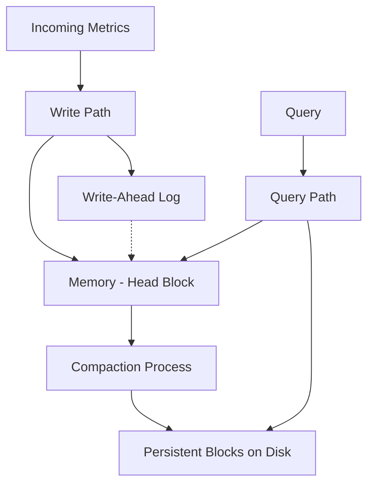

# Prometheus Time Series Database

## Introduction

The Prometheus Time Series Database (TSDB) is the storage engine that powers Prometheus, enabling it to efficiently store and retrieve time series data. A time series is a sequence of data points collected over time intervals, making it perfect for monitoring applications. In Prometheus, these data points represent metrics about your systems that change over time, such as CPU usage, memory consumption, request counts, or error rates.

Understanding how Prometheus stores and manages this data is crucial for effectively using Prometheus in production environments, optimizing its performance, and troubleshooting issues when they arise.

## What is a Time Series Database?

Before diving into the specifics of Prometheus's implementation, let's clarify what makes a time series database special:

A Time Series Database (TSDB) is designed to handle metrics and events that are time-stamped. Unlike traditional relational databases, TSDBs are optimized for:

- Writing and storing large volumes of timestamped data efficiently
- Fast retrieval of data points for specific time ranges
- Aggregation and analysis of time-based patterns
- Handling high write throughput with reasonable query performance

## Prometheus TSDB Architecture

Prometheus uses a custom-built time series database that was redesigned in Prometheus 2.0 for significantly improved performance.



The key components include:

### 1. Head Block (In-Memory)

The most recent data points collected by Prometheus are stored in memory in the "head" block. This allows for fast writes and quick access to recent data.

- New samples are appended to in-memory structures
- Data is also written to a Write-Ahead Log (WAL) for durability
- The head block typically contains the last 2-3 hours of data

### 2. Persistent Blocks (On Disk)

Older data is stored in immutable blocks on disk:

- Every 2 hours (by default), the head block is compacted into a persistent block
- These blocks contain chunks of compressed time series data
- Each block covers a specific time range (typically 2 hours)
- Blocks include an index to quickly locate series and their chunks

### 3. Compaction

To maintain efficiency as data ages:

- Prometheus periodically compacts smaller blocks into larger ones
- This reduces the number of blocks that need to be examined during queries
- Older data might be downsampled (reducing resolution) during compaction
- After compaction, the original blocks are deleted

## Data Model

Understanding Prometheus's data model is essential to comprehend how its TSDB operates.

### Time Series Identifier

Each time series in Prometheus is uniquely identified by:

1. A metric name (e.g., `http_requests_total`)
2. A set of key-value label pairs (e.g., `{method="GET", endpoint="/api/v1/users", status="200"}`)

This combination of name and labels is called a "series identifier" and determines which time series a sample belongs to.

### Samples

Each time series consists of samples, which are individual data points composed of:

- A timestamp (with millisecond precision)
- A float64 value

### Storage Format

Prometheus uses efficient encoding and compression techniques:

- Similar timestamps across series are delta-encoded
- Values are compressed using various algorithms depending on their patterns
- Similar series are grouped into chunks for better compression

## Example: How Data Flows Through Prometheus TSDB

Let's trace how metric data moves through the TSDB:

1. **Collection**: Prometheus scrapes a target and obtains a metric:

```
http_requests_total{method="GET", endpoint="/api/v1/users", status="200"} 1234
```

2. **In-Memory Storage**: This sample is:
   - Appended to the in-memory head block
   - Written to the WAL file for crash recovery

3. **Persistence**: After 2 hours:
   - The head block is compacted into a persistent block
   - The block is written to disk with indexes
   - The WAL entries are no longer needed

4. **Long-term Storage**: After several days:
   - Multiple 2-hour blocks are compacted into larger blocks
   - Older, less-frequently accessed data may be stored with reduced resolution

## Query Processing

When you execute a PromQL query, Prometheus:

1. Identifies which time series match the query's metric name and label selectors
2. Determines which blocks contain data for the requested time range
3. Fetches the required chunks from the relevant blocks (both memory and disk)
4. Applies any specified functions or operations on the data
5. Returns the result

### Example Query and Data Flow

Suppose we run this query:

```
rate(http_requests_total{method="GET"}[5m])
```

The TSDB will:

1. Look up series with the metric name `http_requests_total` and the label `method="GET"`
2. Identify blocks containing data for the requested time range
3. Load relevant chunks from these blocks
4. Calculate the per-second rate of change over 5-minute windows
5. Return the calculated values

## Practical Configuration Examples

Let's look at some practical configurations that affect the TSDB's behavior:

### Storage Retention

You can control how long Prometheus keeps data:

```yaml
# prometheus.yml
global:
  scrape_interval: 15s
  evaluation_interval: 15s

storage:
  tsdb:
    path: /path/to/data
    retention.time: 15d  # Keep data for 15 days
    # Alternative: retention.size: 50GB  # Keep at most 50GB of data
```

### Tuning Block Parameters

For advanced use cases, you can adjust how blocks are created and managed:

```yaml
# prometheus.yml
storage:
  tsdb:
    path: /path/to/data
    retention.time: 30d
    min_block_duration: 2h  # Minimum block duration
    max_block_duration: 36h # Maximum block duration for compaction
    no_lockfile: false      # Whether to use lockfiles
```

## Performance Considerations

The TSDB design has several performance implications:

1. **Write Performance**: Prometheus can handle millions of samples per second on modern hardware due to its append-only nature and efficient memory structures.

2. **Query Performance**: Queries spanning recent data are typically faster because they hit the in-memory head block. Queries spanning larger time ranges or many series might be slower as they need to access multiple blocks on disk.

3. **Cardinality**: Each unique combination of metric name and label values creates a new time series. High cardinality (too many series) can severely impact performance and memory usage.

### Cardinality Example

Consider these two approaches to tracking HTTP requests:

**High cardinality (problematic):**
```
http_requests_total{user_id="123", url="/exact/path", ...}
```

**Better approach:**
```
http_requests_total{route="/api/:id", method="GET", status_code="200"}
```

The first approach creates a new time series for every user and exact URL, potentially millions of series. The second approach uses templates and limits labels to essential dimensions.

## TSDB Internal Commands

Prometheus provides tools to inspect and manage the TSDB:

### Viewing TSDB Stats

Using the HTTP API, you can examine TSDB statistics:

```bash
curl http://localhost:9090/api/v1/status/tsdb
```

Example output:

```json
{
  "status": "success",
  "data": {
    "headStats": {
      "numSeries": 12345,
      "numLabelPairs": 2345,
      "chunkCount": 34567,
      "minTime": 1630000000,
      "maxTime": 1630007200
    },
    "seriesCountByMetricName": [
      {
        "name": "http_requests_total",
        "value": 5678
      },
      {
        "name": "node_cpu_seconds_total",
        "value": 2345
      }
    ]
  }
}
```

### Examining Blocks

You can list the blocks in your TSDB:

```bash
ls -la /path/to/prometheus/data/
```

You might see something like:

```
drwxr-xr-x 3 prometheus prometheus 4096 Sep 1 12:00 01F2Z3Y...
drwxr-xr-x 3 prometheus prometheus 4096 Sep 1 14:00 01F2Z4A...
drwxr-xr-x 3 prometheus prometheus 4096 Sep 1 16:00 01F2Z4C...
drwxr-xr-x 3 prometheus prometheus 4096 Sep 1 12:00 chunks_head
drwxr-xr-x 2 prometheus prometheus 4096 Sep 1 16:05 wal
```

## Summary

The Prometheus Time Series Database is a specialized storage engine optimized for monitoring data. Its key features include:

- Efficient write path with in-memory storage and write-ahead logging
- Immutable block-based storage design for durable data
- Automatic compaction to optimize storage and query performance
- Specialized index structures for fast time series lookups
- Optimized compression for both timestamps and values

Understanding these concepts is essential for effectively deploying, scaling, and troubleshooting Prometheus in production environments. The TSDB's design choices directly affect how much data you can store, how far back you can query, and how efficiently Prometheus can process both incoming metrics and your queries.

## Additional Resources

For deeper exploration of Prometheus TSDB:

- Experiment with the TSDB admin API endpoints to understand your data's characteristics
- Study the impact of different retention periods on disk usage and query performance
- Practice managing cardinality by carefully designing your metrics and labels
- Explore the relationship between scrape interval, storage requirements, and data granularity

## Exercises

1. Set up a local Prometheus instance and configure different retention periods. Observe how this affects disk usage.

2. Write PromQL queries that calculate the growth rate of your TSDB by querying internal metrics such as `prometheus_tsdb_head_series`.

3. Create a high-cardinality scenario (e.g., by adding unique user IDs as labels) and observe its impact on Prometheus performance.

4. Use the TSDB admin API to analyze the distribution of time series across different metrics in your Prometheus server.

5. Set up a dashboard to monitor the health and performance of your Prometheus TSDB using metrics like:
   - `prometheus_tsdb_head_series`
   - `prometheus_tsdb_blocks_loaded`
   - `prometheus_tsdb_compactions_total`
   - `prometheus_tsdb_wal_corruptions_total`