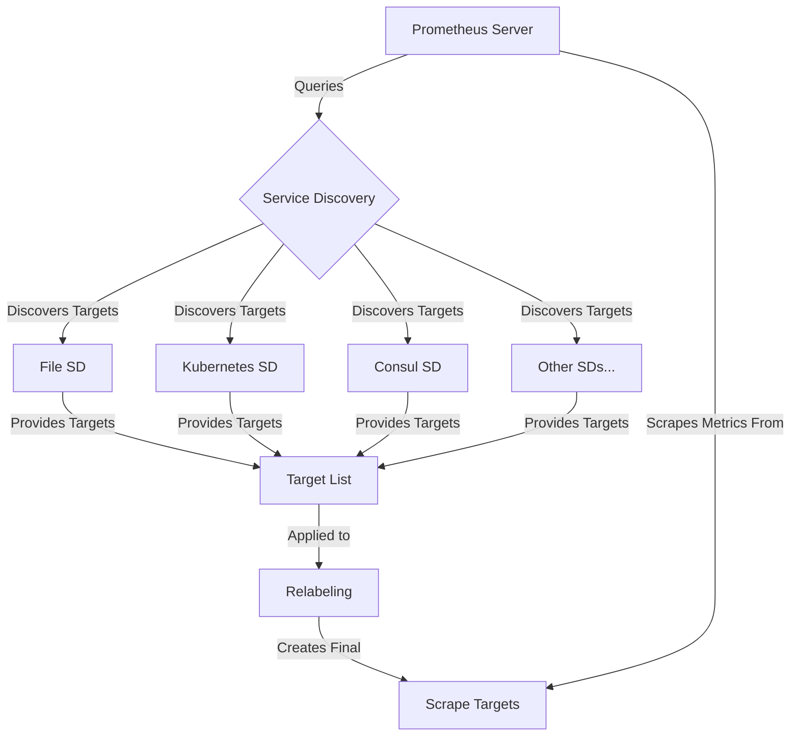

# Prometheus Service Discovery

## Introduction

In modern, dynamic environments like cloud platforms and container orchestrators, monitoring targets can appear, disappear, or change their network location frequently. Manually maintaining a list of targets to monitor becomes impractical and error-prone. This is where **Service Discovery** becomes essential in Prometheus.

Service Discovery allows Prometheus to automatically discover and monitor targets in your infrastructure without requiring manual updates to your configuration files. It adapts to your changing environment by dynamically updating the list of targets to scrape metrics from.

## Understanding Service Discovery in Prometheus

### What is Service Discovery?

Service Discovery is a mechanism that enables Prometheus to automatically find and monitor targets (services, instances, or applications) in your infrastructure. Instead of manually specifying each target's IP address and port, Prometheus can query various "service discovery" sources to build and maintain its list of scrape targets.

### Why Service Discovery Matters

Without service discovery, you would need to:
1. Manually update Prometheus configuration when new services appear
2. Remove targets when services are decommissioned 
3. Update targets when services change their location
4. Restart Prometheus after every configuration change

This manual process becomes unmanageable in dynamic environments where:
- Containers are frequently created and destroyed
- Autoscaling creates and removes instances
- Services might be relocated due to infrastructure changes

## Service Discovery Mechanisms

Prometheus supports numerous service discovery mechanisms out of the box. Let's explore the most common ones:

### File-based Service Discovery

The simplest form of service discovery uses files that contain target information in JSON format. This approach works well for static environments or when you want to integrate with custom systems.

#### Configuration Example

```yaml
scrape_configs:
  - job_name: 'file_sd_example'
    file_sd_configs:
      - files:
        - '/etc/prometheus/targets/*.json'
        refresh_interval: 5m
```

#### Target File Example

```json
[
  {
    "targets": ["server1.example.com:9100", "server2.example.com:9100"],
    "labels": {
      "env": "production",
      "job": "node_exporter"
    }
  },
  {
    "targets": ["database.example.com:9187"],
    "labels": {
      "env": "production",
      "job": "postgres_exporter"
    }
  }
]
```

With this setup, Prometheus will scan the specified directory for JSON files every 5 minutes and update its targets accordingly.

### Kubernetes Service Discovery

One of the most powerful service discovery integrations is with Kubernetes. Prometheus can discover and monitor pods, services, endpoints, and other Kubernetes resources automatically.

#### Configuration Example

```yaml
scrape_configs:
  - job_name: 'kubernetes-pods'
    kubernetes_sd_configs:
      - role: pod
        api_server: 'https://kubernetes.default.svc:443'
        tls_config:
          ca_file: /var/run/secrets/kubernetes.io/serviceaccount/ca.crt
        bearer_token_file: /var/run/secrets/kubernetes.io/serviceaccount/token
    relabel_configs:
      - source_labels: [__meta_kubernetes_pod_annotation_prometheus_io_scrape]
        action: keep
        regex: true
      - source_labels: [__meta_kubernetes_pod_annotation_prometheus_io_path]
        action: replace
        target_label: __metrics_path__
        regex: (.+)
      - source_labels: [__address__, __meta_kubernetes_pod_annotation_prometheus_io_port]
        action: replace
        regex: ([^:]+)(?::\d+)?;(\d+)
        replacement: $1:$2
        target_label: __address__
      - action: labelmap
        regex: __meta_kubernetes_pod_label_(.+)
      - source_labels: [__meta_kubernetes_namespace]
        action: replace
        target_label: kubernetes_namespace
      - source_labels: [__meta_kubernetes_pod_name]
        action: replace
        target_label: kubernetes_pod_name
```

This configuration:
1. Discovers all pods in the Kubernetes cluster
2. Filters pods based on a `prometheus.io/scrape: "true"` annotation
3. Customizes the metrics path based on pod annotations
4. Adjusts the target address using pod annotations
5. Adds Kubernetes metadata as labels

### Consul Service Discovery

For environments using Consul for service registry, Prometheus provides native integration:

```yaml
scrape_configs:
  - job_name: 'consul_services'
    consul_sd_configs:
      - server: 'localhost:8500'
        services: [] # Empty array means all services
    relabel_configs:
      - source_labels: [__meta_consul_service]
        target_label: job
```

### AWS EC2 Service Discovery

For AWS environments, Prometheus can discover EC2 instances:

```yaml
scrape_configs:
  - job_name: 'ec2_instances'
    ec2_sd_configs:
      - region: us-east-1
        access_key: ACCESS_KEY
        secret_key: SECRET_KEY
        port: 9100
    relabel_configs:
      - source_labels: [__meta_ec2_tag_Name]
        target_label: instance_name
```

## Understanding Relabeling in Service Discovery

Service discovery mechanisms provide a wealth of metadata about discovered targets. **Relabeling** is a powerful feature that allows you to filter, modify, and transform this metadata before Prometheus starts scraping.

### Common Relabeling Actions

1. **keep/drop**: Filter targets based on label values
2. **replace**: Change label values
3. **labelmap**: Turn metadata into labels
4. **labeldrop/labelkeep**: Remove or keep specific labels

### Relabeling Example

```yaml
relabel_configs:
  # Keep only targets with environment=production
  - source_labels: [__meta_example_environment]
    action: keep
    regex: production
    
  # Set the instance label to the hostname
  - source_labels: [__meta_example_hostname]
    target_label: instance
    
  # Add a custom label
  - source_labels: [__meta_example_region, __meta_example_zone]
    separator: "-"
    target_label: location
    replacement: "$1"
```

## Visualizing Service Discovery with Prometheus UI

Prometheus provides a built-in UI to inspect your service discovery configuration and troubleshoot issues. You can access it at:

`http://your-prometheus-server:9090/service-discovery`

This page shows:
1. All configured jobs
2. Discovered targets for each job
3. Target metadata before and after relabeling
4. Information about dropped targets

It's an invaluable tool for debugging service discovery problems.

## Practical Example: Complete Service Discovery Setup

Let's build a comprehensive service discovery configuration that combines multiple mechanisms:

```yaml
global:
  scrape_interval: 15s

scrape_configs:
  # Scrape Prometheus itself
  - job_name: 'prometheus'
    static_configs:
      - targets: ['localhost:9090']

  # Discover and scrape Node Exporters on all servers
  - job_name: 'node_exporters'
    file_sd_configs:
      - files:
        - '/etc/prometheus/file_sd/nodes/*.json'
    relabel_configs:
      - source_labels: [__meta_environment]
        regex: production
        action: keep

  # Discover and scrape services in Kubernetes
  - job_name: 'kubernetes-services'
    kubernetes_sd_configs:
      - role: service
    relabel_configs:
      - source_labels: [__meta_kubernetes_service_annotation_prometheus_io_scrape]
        action: keep
        regex: true
      - source_labels: [__meta_kubernetes_service_annotation_prometheus_io_port]
        action: replace
        target_label: __address__
        regex: ([^:]+)(?::\d+)?;(\d+)
        replacement: $1:$2
      - source_labels: [__meta_kubernetes_namespace]
        target_label: kubernetes_namespace
      - source_labels: [__meta_kubernetes_service_name]
        target_label: kubernetes_service_name
```

## Service Discovery Workflow

The following diagram illustrates the typical service discovery workflow in Prometheus:



## Best Practices for Service Discovery

1. **Use appropriate discovery mechanism**: Choose the mechanism that best fits your environment (Kubernetes for container orchestration, Consul for service mesh, etc.)

2. **Implement proper filtering**: Use relabeling to filter out targets you don't want to monitor to avoid unnecessary load

3. **Add meaningful labels**: Use relabeling to add useful labels that help with querying and alerting

4. **Monitor service discovery**: Set up alerts for service discovery failures or unexpected drops in target count

5. **Limit target count**: Be mindful of how many targets Prometheus is discovering to avoid overwhelming your server

6. **Use federation**: For very large environments, consider using Prometheus federation instead of having a single Prometheus instance discover all targets

7. **Document your approach**: Maintain documentation of your service discovery setup for troubleshooting

## Troubleshooting Service Discovery

Common service discovery issues and their solutions:

| Issue | Possible Solution |
|-------|-------------------|
| Missing targets | Check permissions, network connectivity, or relabeling rules dropping targets |
| Too many targets | Review your discovery configuration and filtering rules |
| Incorrect metadata | Examine the unmodified target metadata and adjust relabeling |
| High resource usage | Consider limiting the scope of discovery or implementing more filtering |
| Stale targets | Check refresh intervals and ensure discovery sources are up-to-date |

## Summary

Service Discovery is a fundamental feature of Prometheus that enables automatic, dynamic monitoring of your infrastructure. By leveraging service discovery mechanisms appropriate for your environment, you can ensure that Prometheus always has an up-to-date view of your monitoring targets without manual intervention.

The key takeaways from this lesson are:

1. Service Discovery eliminates the need for manual target configuration
2. Prometheus supports numerous service discovery mechanisms out of the box
3. Relabeling allows powerful transformation of discovered target metadata
4. Different environments benefit from different discovery approaches
5. Proper configuration of service discovery is crucial for effective monitoring

## Exercises

1. Set up file-based service discovery for a set of test servers
2. Configure Kubernetes service discovery and use annotations to control which pods get scraped
3. Experiment with different relabeling configurations to see how they affect target selection
4. Use the Prometheus UI to explore service discovery results and debug issues

## Additional Resources

- [Prometheus Service Discovery Documentation](https://prometheus.io/docs/prometheus/latest/configuration/configuration/#scrape_config)
- [Relabeling in Prometheus](https://prometheus.io/docs/prometheus/latest/configuration/configuration/#relabel_config)
- [Kubernetes Service Discovery](https://prometheus.io/docs/prometheus/latest/configuration/configuration/#kubernetes_sd_config)
- [Service Discovery in Dynamic Environments](https://prometheus.io/blog/2015/06/01/advanced-service-discovery/)