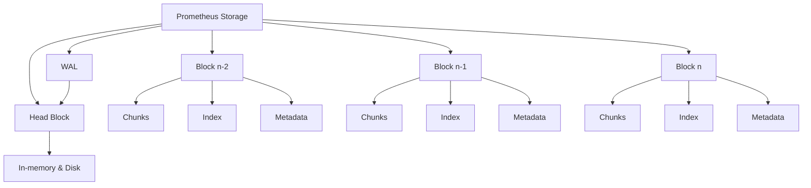
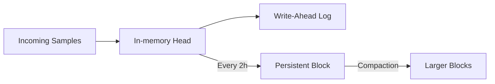

# Prometheus Storage

## Introduction

Storage is a fundamental aspect of Prometheus that determines how your metrics data is persisted, accessed, and managed over time. Prometheus implements a custom time-series database (TSDB) designed specifically for storing time-series metrics efficiently. Understanding how Prometheus handles storage is essential for ensuring your monitoring system remains performant and reliable as your infrastructure grows.

In this guide, we'll explore:
- How Prometheus stores data locally
- The structure and components of Prometheus's storage engine
- How to configure retention policies
- Options for integrating with remote storage systems
- Best practices for optimizing storage performance

## Local Storage Fundamentals

Prometheus stores all its metrics data in a local time-series database on disk. This approach offers excellent performance for real-time queries while maintaining a reasonable resource footprint.

### Storage Architecture

Prometheus uses a custom time-series database implementation with the following characteristics:

1. **Time-Series Identification**: Each time series is uniquely identified by its metric name and a set of key-value label pairs.

2. **Samples**: The actual data points consist of:
   - A float64 value
   - A millisecond-precision timestamp

3. **File Structure**: Data is organized into blocks, each covering a fixed time range (typically 2 hours).



### Write-Ahead Log (WAL)

Before metrics are written to disk storage blocks, Prometheus records them in a write-ahead log (WAL):

- Ensures data durability across Prometheus restarts
- Protects against data loss during crashes or unexpected shutdowns
- Periodically compacted into persistent block storage

Let's look at the directory structure of Prometheus storage:

```
data/
├── 01FX3RGYVS9BVBX1BRH5DG0WSC/  # Block directory with unique ID
│   ├── chunks/                   # Contains compressed time-series data
│   │   ├── 000001
│   │   └── 000002
│   ├── index                     # Index file mapping series to chunks
│   └── meta.json                 # Metadata about the block
├── 01FX4Z9ZP7P1P72S8H56V1QJZ7/   # Another block directory
│   ├── ...
├── wal/                          # Write-ahead log directory
│   ├── 000001
│   └── 000002
└── chunks_head/                  # "Head" block for most recent data
```

### Sample Code: Inspecting Storage Directories

Here's how you could inspect your Prometheus storage directory:

```bash
# List prometheus data directories
ls -la /path/to/prometheus/data

# Check size of storage
du -sh /path/to/prometheus/data

# View block metadata
cat /path/to/prometheus/data/01FX3RGYVS9BVBX1BRH5DG0WSC/meta.json
```

Example output of a `meta.json` file:

```json
{
  "version": 1,
  "ulid": "01FX3RGYVS9BVBX1BRH5DG0WSC",
  "minTime": 1647302400000,
  "maxTime": 1647388800000,
  "stats": {
    "numSamples": 12586354,
    "numSeries": 52714,
    "numChunks": 104851
  },
  "compaction": {
    "level": 1,
    "sources": [
      "01FX3RGYVS9BVBX1BRH5DG0WSC"
    ]
  }
}
```

## Configuring Storage Retention

Prometheus doesn't retain data indefinitely. You can configure how long data is stored based on:

1. **Time-based retention**: Keep data for a specific duration
2. **Size-based retention**: Limit the total disk space used

### Time-based Retention

To configure how long Prometheus keeps data, use the `--storage.tsdb.retention.time` flag:

```bash
# Keep data for 15 days (default is 15d)
prometheus --storage.tsdb.retention.time=15d

# Use m (minutes), h (hours), d (days), w (weeks), y (years)
prometheus --storage.tsdb.retention.time=30d
```

### Size-based Retention

Alternatively, limit the total storage size with `--storage.tsdb.retention.size`:

```bash
# Limit storage to 100 GB
prometheus --storage.tsdb.retention.size=100GB

# Use KB, MB, GB, PB, etc.
prometheus --storage.tsdb.retention.size=500GB
```

### Combining Both Approaches

You can specify both time and size limits. Prometheus will delete data when either limit is reached:

```bash
prometheus --storage.tsdb.retention.time=30d --storage.tsdb.retention.size=100GB
```

### Example in prometheus.yml

Alternatively, you can define these settings in your Prometheus configuration file:

```yaml
global:
  scrape_interval: 15s
  evaluation_interval: 15s

storage:
  tsdb:
    path: "/path/to/data"
    retention:
      time: 30d
      size: 100GB
```

## Storage Optimization

### Compaction

Prometheus automatically compacts older blocks to reduce storage requirements and improve query performance. The compaction process:

1. Merges multiple smaller blocks into larger ones
2. Removes deleted time series
3. Deduplicates overlapping samples
4. Optimizes indexes

This process happens in the background and requires no manual intervention.

### Block Creation

New sample data is initially stored in an in-memory "head" block and is periodically compacted into persistent blocks on disk.



## Remote Storage Integration

While Prometheus excels at local storage for recent data, many users need long-term storage or high-availability solutions. Prometheus supports remote storage integration through a standardized API.

### Remote Write

The remote write functionality allows Prometheus to duplicate data to external storage systems:

```yaml
remote_write:
  - url: "http://remote-storage-endpoint/write"
    # Optional HTTP basic auth
    basic_auth:
      username: "username"
      password: "password"
    # Optional write relabel configs
    write_relabel_configs:
      - source_labels: [__name__]
        regex: 'temp.*'
        action: keep
```

### Remote Read

Remote read allows Prometheus to query historical data from external storage systems:

```yaml
remote_read:
  - url: "http://remote-storage-endpoint/read"
    # Optional HTTP basic auth
    basic_auth:
      username: "username"
      password: "password"
    # Read recent data from local storage
    read_recent: true
```

### Popular Remote Storage Options

Prometheus can integrate with several remote storage systems:

- **Thanos**: Distributed metrics system with unlimited retention
- **Cortex**: Horizontally scalable, multi-tenant Prometheus-as-a-Service
- **VictoriaMetrics**: Fast, cost-effective time-series database
- **InfluxDB**: Purpose-built time-series database
- **Grafana Mimir**: Scalable Prometheus solution by Grafana Labs

### Example: Remote Storage with Thanos

Here's a basic example of setting up Prometheus with Thanos for remote storage:

```yaml
# prometheus.yml
global:
  scrape_interval: 15s
  evaluation_interval: 15s
  external_labels:
    region: us-west
    replica: 1

storage:
  tsdb:
    path: "/prometheus"
    retention.time: 2d

# Enable the Thanos sidecar
remote_write:
  - url: "http://thanos-receive:19291/api/v1/receive"
```

And then run the Thanos sidecar alongside Prometheus:

```bash
thanos sidecar \
  --tsdb.path /prometheus \
  --prometheus.url http://localhost:9090 \
  --objstore.config-file bucket_config.yaml
```

## Best Practices

### Storage Performance

1. **Hardware Considerations**:
   - Use SSDs for enhanced performance
   - Allocate sufficient memory (Prometheus keeps a portion of recent data in memory)
   - Consider RAID configurations for data durability

2. **Data Volume Management**:
   - Use appropriate sample intervals (avoid over-sampling)
   - Implement careful label usage (too many unique label combinations cause high cardinality)
   - Use recording rules to pre-compute expensive queries

### Monitoring Storage Health

Monitor Prometheus itself with these key metrics:

```promql
# Disk space used by Prometheus
prometheus_tsdb_storage_blocks_bytes

# Number of time series
prometheus_tsdb_head_series

# WAL corruptions
prometheus_tsdb_wal_corruptions_total

# Compaction failures
prometheus_tsdb_compactions_failed_total
```

### Avoiding High Cardinality

High cardinality (too many unique time series) is a common cause of storage and performance issues:

1. Avoid using high-variability labels like user IDs or session IDs
2. Limit the number of labels per metric
3. Use recording rules to aggregate high-cardinality metrics
4. Consider using the `metric_relabel_configs` option to drop unnecessary labels

Example of label filtering:

```yaml
scrape_configs:
  - job_name: 'api_servers'
    metrics_path: '/metrics'
    static_configs:
      - targets: ['api1:9090', 'api2:9090']
    metric_relabel_configs:
      # Drop high-cardinality metrics
      - source_labels: [__name__]
        regex: 'http_request_duration_seconds_bucket'
        action: drop
      # Remove high-cardinality labels
      - regex: 'id|uuid|session_id'
        action: labeldrop
```

## Practical Example: Estimating Storage Requirements

Let's calculate the approximate storage requirements for a Prometheus instance:

```
Storage per day = samples_per_second × bytes_per_sample × seconds_per_day

Where:
- samples_per_second = metrics × (scrape_frequency / scrape_interval)
- bytes_per_sample ≈ 1-2 bytes (after compression)
- seconds_per_day = 86,400
```

For example, with 1,000 time series scraped every 15 seconds:

```
samples_per_second = 1,000 × (1/15) = 66.67
bytes_per_day = 66.67 × 1.5 × 86,400 ≈ 8.6 MB per day
```

For 30 days' retention, you'd need approximately:
```
8.6 MB × 30 ≈ 258 MB
```

This is a simplified calculation; actual storage needs will vary based on:
- Compression efficiency
- Label cardinality
- Metric volatility

## Summary

Prometheus storage is built around an efficient time-series database optimized for metrics data. Understanding how it works helps you make better decisions about:

- Local storage configuration and retention policies
- When and how to integrate with remote storage
- Optimizing storage performance and resource usage
- Planning for scaling your monitoring infrastructure

The default local storage provides excellent performance for real-time monitoring needs, while remote storage integration offers a path to long-term storage and high availability.

## Exercises

1. Set up Prometheus with a 7-day retention policy and observe the storage directory structure.

2. Create metrics with different cardinality levels and measure their impact on storage size.

3. Configure Prometheus to use remote write with a local Thanos, VictoriaMetrics, or other remote storage option.

4. Write PromQL queries to monitor your Prometheus storage metrics and create alerts for potential storage issues.

5. Experiment with different compaction settings and measure their impact on query performance.

## Additional Resources

- [Prometheus Storage Documentation](https://prometheus.io/docs/prometheus/latest/storage/)
- [TSDB Format Documentation](https://github.com/prometheus/prometheus/blob/main/tsdb/docs/format/README.md)
- [Remote Storage Integrations](https://prometheus.io/docs/operating/integrations/#remote-endpoints-and-storage)
- [Thanos Documentation](https://thanos.io/tip/thanos/quick-tutorial.md/)
- [Grafana Mimir Documentation](https://grafana.com/docs/mimir/latest/)
- [VictoriaMetrics Documentation](https://docs.victoriametrics.com/)