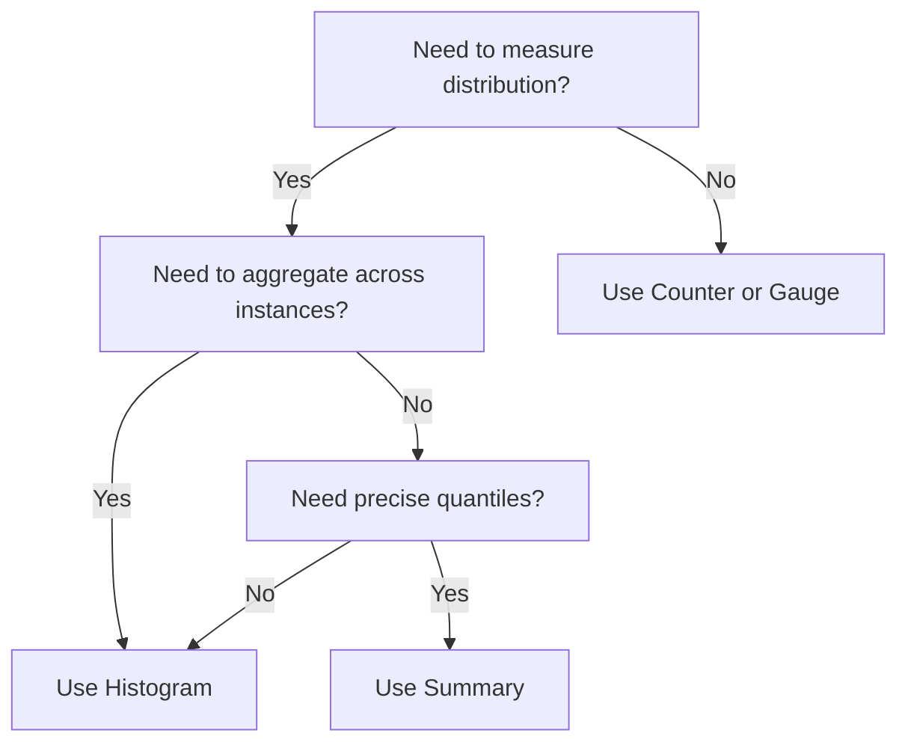
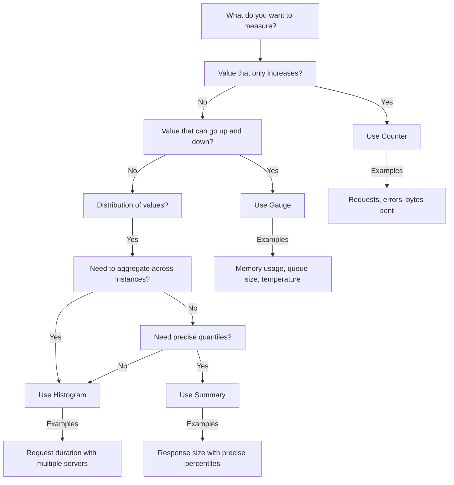

# Prometheus Metric Types Overview

Prometheus provides four fundamental metric types that serve as the building blocks for any monitoring system. Each type is designed to capture different aspects of your system's behavior and performance. Understanding these metric types is crucial for effective monitoring and alerting.

## Introduction

When setting up monitoring with Prometheus, choosing the right metric type is essential. Using an inappropriate metric type can lead to misleading insights or make it difficult to extract the information you need. In this guide, we'll explore each metric type in detail, including when and how to use them.

## The Four Core Metric Types

Prometheus offers four core metric types:

1. **Counters**: For cumulative values that only increase
2. **Gauges**: For values that can go up and down
3. **Histograms**: For sampling observations and counting them in configurable buckets
4. **Summaries**: Similar to histograms but with quantiles calculated by the client

Let's examine each type in detail.

## Counters

### What is a Counter?

A counter is a cumulative metric that represents a single monotonically increasing counter whose value can only increase or be reset to zero upon restart. Counters are perfect for tracking:

- Number of requests served
- Number of errors
- Number of tasks completed
- Total bytes sent or received

### When to Use Counters

Use a counter when you need to track how many times something has happened. Counters should never decrease in value during normal operation.

### Counter Code Example

Here's how to create and use a counter in Go:

```go
import (
	"github.com/prometheus/client_golang/prometheus"
	"github.com/prometheus/client_golang/prometheus/promauto"
)

var (
	requestsTotal = promauto.NewCounter(prometheus.CounterOpts{
		Name: "http_requests_total",
		Help: "The total number of HTTP requests",
	})
)

// Increment the counter when a request is received
func handleRequest() {
	// Process request...
	requestsTotal.Inc()
}
```

### Querying Counters

To get the rate of increase of a counter over time (which is often more useful than the raw value), use the `rate()` function:

```
rate(http_requests_total[5m])
```

This shows the per-second rate of increase over the last 5 minutes.

## Gauges

### What is a Gauge?

A gauge is a metric that represents a single numerical value that can arbitrarily go up and down. Gauges are perfect for measuring:

- Current memory usage
- CPU utilization
- Number of concurrent requests
- Queue size
- Temperature

### When to Use Gauges

Use a gauge when you need to track a value that can increase or decrease. Gauges are ideal for measuring current states.

### Gauge Code Example

Here's how to create and use a gauge in Python:

```python
from prometheus_client import Gauge

# Create a gauge metric
active_requests = Gauge('active_requests', 'Number of active requests')

# Set the gauge to a specific value
active_requests.set(15)

# Increment or decrement the gauge
active_requests.inc()  # Increment by 1
active_requests.dec(2)  # Decrement by 2
```

### Querying Gauges

You can directly query the current value of a gauge:

```
active_requests
```

Or get the average over time:

```
avg_over_time(active_requests[10m])
```

## Histograms

### What is a Histogram?

A histogram samples observations (usually request durations or response sizes) and counts them in configurable buckets. It also provides a sum of all observed values.

Histograms are ideal for:
- Request duration
- Response size
- Latency measurements

### When to Use Histograms

Use histograms when you need distribution information about your data, such as percentiles, or when you want to aggregate measurements across multiple instances.

### Histogram Code Example

Here's how to create and use a histogram in Go:

```go
import (
	"github.com/prometheus/client_golang/prometheus"
	"github.com/prometheus/client_golang/prometheus/promauto"
	"time"
)

var (
	requestDuration = promauto.NewHistogram(prometheus.HistogramOpts{
		Name:    "http_request_duration_seconds",
		Help:    "HTTP request duration in seconds",
		Buckets: prometheus.DefBuckets, // Default buckets: [0.005, 0.01, 0.025, 0.05, 0.1, 0.25, 0.5, 1, 2.5, 5, 10]
	})
)

func handleRequestWithTiming() {
	start := time.Now()
	
	// Process request...
	
	duration := time.Since(start).Seconds()
	requestDuration.Observe(duration)
}
```

### Understanding Histogram Metrics

A single histogram creates multiple time series:

- `http_request_duration_seconds_count` - Total number of observations
- `http_request_duration_seconds_sum` - Sum of all observed values
- `http_request_duration_seconds_bucket{le="0.1"}` - Count of observations less than or equal to 0.1 seconds
- `http_request_duration_seconds_bucket{le="0.25"}` - Count of observations less than or equal to 0.25 seconds
- And so on for each bucket...

### Querying Histograms

To calculate the 95th percentile of request duration over the past 5 minutes:

```
histogram_quantile(0.95, rate(http_request_duration_seconds_bucket[5m]))
```

To get the average request duration:

```
rate(http_request_duration_seconds_sum[5m]) / rate(http_request_duration_seconds_count[5m])
```

## Summaries

### What is a Summary?

A summary is similar to a histogram but calculates configurable quantiles on the client side. It also tracks the count and sum of observations.

Summaries are useful for:
- Request duration
- Response size
- Precise percentile calculations

### When to Use Summaries

Use summaries when you need accurate quantiles and don't need to aggregate across multiple instances. If you need to aggregate quantiles across instances, use histograms instead.

### Summary Code Example

Here's how to create and use a summary in Python:

```python
from prometheus_client import Summary
import time

# Create a summary with specific quantiles
request_time = Summary('request_processing_seconds', 'Time spent processing request',
                       ['method', 'endpoint'],
                       quantiles=(0.5, 0.9, 0.99))

# Use a decorator to time a function
@request_time.time()
def process_request(method, endpoint):
    # Simulate processing time
    time.sleep(0.1)
    return "processed"

# Or manually time code
def handle_request(method, endpoint):
    start = time.time()
    # Process request...
    duration = time.time() - start
    request_time.labels(method=method, endpoint=endpoint).observe(duration)
```

### Understanding Summary Metrics

A summary creates multiple time series:

- `request_processing_seconds_count{method="GET",endpoint="/api"}` - Count of observations
- `request_processing_seconds_sum{method="GET",endpoint="/api"}` - Sum of observations
- `request_processing_seconds{method="GET",endpoint="/api",quantile="0.5"}` - 50th percentile
- `request_processing_seconds{method="GET",endpoint="/api",quantile="0.9"}` - 90th percentile
- `request_processing_seconds{method="GET",endpoint="/api",quantile="0.99"}` - 99th percentile

### Histograms vs. Summaries

Here's a comparison to help you choose between histograms and summaries:



| Feature | Histogram | Summary |
|---------|-----------|---------|
| Calculates quantiles | On the server side via `histogram_quantile()` | On the client side |
| Configurable buckets/quantiles | Yes, at creation time | Yes, at creation time |
| Can aggregate quantiles across instances | Yes | No |
| CPU usage | Lower | Higher |
| Precision of quantiles | Lower (depends on bucket definition) | Higher |

## Real-World Applications

### Monitoring Web Service Performance

Let's look at a complete example of monitoring a web service using all four metric types:

```go
package main

import (
	"math/rand"
	"net/http"
	"time"

	"github.com/prometheus/client_golang/prometheus"
	"github.com/prometheus/client_golang/prometheus/promauto"
	"github.com/prometheus/client_golang/prometheus/promhttp"
)

var (
	// Counter: track total requests
	requestsTotal = promauto.NewCounterVec(
		prometheus.CounterOpts{
			Name: "api_requests_total",
			Help: "Total number of API requests",
		},
		[]string{"method", "endpoint", "status"},
	)

	// Gauge: track current active requests
	activeRequests = promauto.NewGauge(prometheus.GaugeOpts{
		Name: "api_active_requests",
		Help: "Number of active requests currently being processed",
	})

	// Histogram: track request duration
	requestDuration = promauto.NewHistogramVec(
		prometheus.HistogramOpts{
			Name:    "api_request_duration_seconds",
			Help:    "Request duration in seconds",
			Buckets: []float64{0.01, 0.05, 0.1, 0.5, 1, 2.5, 5},
		},
		[]string{"method", "endpoint"},
	)

	// Summary: track response size
	responseSize = promauto.NewSummaryVec(
		prometheus.SummaryOpts{
			Name:       "api_response_size_bytes",
			Help:       "Response size in bytes",
			Objectives: map[float64]float64{0.5: 0.05, 0.9: 0.01, 0.99: 0.001},
		},
		[]string{"method", "endpoint"},
	)
)

func handleAPI(w http.ResponseWriter, r *http.Request) {
	// Start timing
	timer := prometheus.NewTimer(requestDuration.WithLabelValues(r.Method, r.URL.Path))
	
	// Increment active requests gauge
	activeRequests.Inc()
	defer activeRequests.Dec()
	
	// Simulate processing time
	time.Sleep(time.Duration(rand.Intn(500)) * time.Millisecond)
	
	// Generate random response size between 100 and 10000 bytes
	size := rand.Intn(9900) + 100
	responseSize.WithLabelValues(r.Method, r.URL.Path).Observe(float64(size))
	
	// Increment requests counter with status 200
	requestsTotal.WithLabelValues(r.Method, r.URL.Path, "200").Inc()
	
	// Stop timer
	timer.ObserveDuration()
	
	w.Write(make([]byte, size))
}

func main() {
	// Register metrics handler
	http.Handle("/metrics", promhttp.Handler())
	
	// Register API handler
	http.HandleFunc("/api/", handleAPI)
	
	// Start server
	http.ListenAndServe(":8080", nil)
}
```

With this instrumentation, you can:

1. Track the total number of requests to each endpoint (`api_requests_total`)
2. Monitor current system load with active requests (`api_active_requests`)
3. Analyze request duration distributions (`api_request_duration_seconds`)
4. Measure response size percentiles (`api_response_size_bytes`)

### Dashboard Example

You might create a Grafana dashboard with panels like:

1. **Request Rate**: 
   ```
   sum(rate(api_requests_total[5m])) by (endpoint)
   ```

2. **Error Rate**: 
   ```
   sum(rate(api_requests_total{status=~"5.."}[5m])) / sum(rate(api_requests_total[5m]))
   ```

3. **95th Percentile Latency**: 
   ```
   histogram_quantile(0.95, sum(rate(api_request_duration_seconds_bucket[5m])) by (le, endpoint))
   ```

4. **Active Requests**: 
   ```
   api_active_requests
   ```

## Choosing the Right Metric Type

Use this decision tree to help you choose the appropriate metric type:



## Best Practices

1. **Naming Conventions**: Follow the Prometheus naming conventions:
   - Use lowercase names with underscores
   - Include units in the name (e.g., `_seconds`, `_bytes`)
   - Use suffixes like `_total` for counters
   - Use descriptive help text

2. **Labels**: Use labels to differentiate metrics, but keep cardinality reasonable:
   - Good: `method`, `endpoint`, `status_code`
   - Avoid: `user_id`, `request_id`, or other high-cardinality dimensions

3. **Bucket Selection**:
   - For histograms, choose buckets that cover the expected range of values
   - Consider using exponential bucket spacing (e.g., `[0.01, 0.1, 1, 10, 100]`)

4. **Counter Rates vs. Raw Values**:
   - Always use `rate()` or `increase()` functions with counters
   - Example: `rate(http_requests_total[5m])` instead of `http_requests_total`

## Summary

In this guide, we've explored the four core metric types in Prometheus:

- **Counters**: For values that only increase (e.g., request count)
- **Gauges**: For values that can go up and down (e.g., memory usage)
- **Histograms**: For distributional data with aggregation capability
- **Summaries**: For precise client-side percentiles

Each metric type serves a specific purpose, and choosing the right one is crucial for effective monitoring. By understanding these types and their appropriate use cases, you can build comprehensive monitoring solutions that provide valuable insights into your systems.

## Exercises

1. **Basic Implementation**:
   - Instrument a simple web application with counters for total requests and gauges for active requests.

2. **Response Time Analysis**:
   - Add a histogram to track request duration and create a query to display the 90th percentile.

3. **Error Rate Monitoring**:
   - Create a counter for errors and calculate the error rate using PromQL.

4. **Comparison Exercise**:
   - Implement both a histogram and a summary for the same metric and compare the results and performance.

## Further Reading

- [Prometheus Documentation on Metric Types](https://prometheus.io/docs/concepts/metric_types/)
- [Best Practices for Instrumenting Code](https://prometheus.io/docs/practices/instrumentation/)
- [PromQL Basics](https://prometheus.io/docs/prometheus/latest/querying/basics/)
- [Histograms and Summaries in Detail](https://prometheus.io/docs/practices/histograms/)