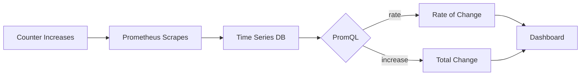

# Prometheus Counters

## Introduction

Counters are one of the four fundamental metric types in Prometheus. A counter is a cumulative metric that represents a single monotonically increasing value, whose value can only increase or be reset to zero upon restart. Counters are perfect for tracking things like:

- Number of requests served
- Number of errors encountered
- Number of tasks completed
- Number of events processed

Think of a counter like the odometer in your car—it only goes up, recording the total distance traveled. If you want to know how far you drove today, you'd need to calculate the difference between the current reading and yesterday's reading.

## Understanding Counters

### Key Characteristics

- **Monotonic Increase**: Counters can only go up (or be reset to zero when the application restarts).
- **Non-negative**: Counter values are always zero or positive.
- **Cumulative**: They represent a running total since the last application restart.

### When to Use Counters

Use counters when you want to track:
- The total number of something (requests, errors, events)
- Things that happen over time and accumulate
- Events you want to calculate rates from

### When NOT to Use Counters

Don't use counters for values that can decrease. For example:
- Current memory usage
- Number of active connections
- Queue size

For these, you would use a gauge (another Prometheus metric type).

## Creating and Using Counters

Let's explore how to create and use counters in Prometheus with the official client libraries.

### Basic Counter Example in Go

```go
package main

import (
	"net/http"

	"github.com/prometheus/client_golang/prometheus"
	"github.com/prometheus/client_golang/prometheus/promauto"
	"github.com/prometheus/client_golang/prometheus/promhttp"
)

var (
	// Create a counter to track HTTP requests
	httpRequestsTotal = promauto.NewCounter(prometheus.CounterOpts{
		Name: "http_requests_total",
		Help: "Total number of HTTP requests",
	})
)

func handler(w http.ResponseWriter, r *http.Request) {
	// Increment the counter by 1 for each request
	httpRequestsTotal.Inc()
	w.Write([]byte("Hello, World!"))
}

func main() {
	http.HandleFunc("/", handler)
	http.Handle("/metrics", promhttp.Handler())
	http.ListenAndServe(":8080", nil)
}
```

**Output** when accessing `/metrics` endpoint:

```
# HELP http_requests_total Total number of HTTP requests
# TYPE http_requests_total counter
http_requests_total 5
```

The output shows that 5 requests have been made to the server since it started.

### Counter Example in Python

```python
from prometheus_client import Counter, start_http_server
import time
import random

# Create a counter
requests_total = Counter('requests_total', 'Total number of requests')

# Simulate processing requests
def process_request():
    # Pretend to handle a request and increment the counter
    requests_total.inc()

if __name__ == '__main__':
    # Start up the server to expose the metrics
    start_http_server(8000)
    # Generate some requests
    while True:
        process_request()
        time.sleep(random.uniform(0.1, 0.5))
```

**Output** when accessing metrics on port 8000:

```
# HELP requests_total Total number of requests
# TYPE requests_total counter
requests_total 42.0
```

### Counter with Labels

Counters can include labels to track different categories within the same metric:

```go
var (
	httpRequestsTotal = promauto.NewCounterVec(
		prometheus.CounterOpts{
			Name: "http_requests_total",
			Help: "Total number of HTTP requests",
		},
		[]string{"method", "endpoint", "status"},
	)
)

func handler(w http.ResponseWriter, r *http.Request) {
	// Increment counter with specific labels
	httpRequestsTotal.WithLabelValues(r.Method, r.URL.Path, "200").Inc()
	w.Write([]byte("Hello, World!"))
}
```

**Output**:

```
# HELP http_requests_total Total number of HTTP requests
# TYPE http_requests_total counter
http_requests_total{method="GET",endpoint="/",status="200"} 3
http_requests_total{method="POST",endpoint="/api",status="200"} 2
```

## Counter Operations

### Incrementing Counters

Counters support two main operations:

1. **Inc()** - Increments the counter by 1
2. **Add(float64)** - Adds the given value to the counter (must be positive)

```go
// Increment by 1
myCounter.Inc()

// Add 3.5 to the counter
myCounter.Add(3.5)
```

In Python:

```python
# Increment by 1
my_counter.inc()

# Add 3.5 to the counter
my_counter.inc(3.5)
```

### What NOT to Do with Counters

❌ **Never decrease a counter's value**:

```go
// This is incorrect and will cause a runtime error
myCounter.Add(-5)  // Error! Counters cannot go down
```

❌ **Never set a counter to an absolute value** (unless you're resetting it):

```go
// This is incorrect usage
myCounter.Set(10)  // Error! Counters don't have a Set() method
```

## Visualizing and Querying Counters

Counters are most useful when computing rates of change. This is done using the `rate()` and `increase()` functions in PromQL.

### Using rate() Function

The `rate()` function calculates the per-second average rate of increase over a time window:

```
rate(http_requests_total[5m])
```

This query gives you the average rate of requests per second over the last 5 minutes.

### Using increase() Function

The `increase()` function is similar but gives the total increase in a time period:

```
increase(http_requests_total[1h])
```

This query tells you how many requests were received in the last hour.

### Visualization Example



## Real-World Applications

### Web Server Monitoring

Track total requests, errors, and successful responses:

```go
var (
	httpRequestsTotal = promauto.NewCounterVec(
		prometheus.CounterOpts{
			Name: "http_requests_total",
			Help: "Total number of HTTP requests",
		},
		[]string{"method", "status"},
	)
)

func middleware(next http.Handler) http.Handler {
	return http.HandlerFunc(func(w http.ResponseWriter, r *http.Request) {
		ww := NewResponseWriter(w)
		next.ServeHTTP(ww, r)
		
		// Record the request with method and status code
		httpRequestsTotal.WithLabelValues(
			r.Method,
			fmt.Sprintf("%d", ww.Status()),
		).Inc()
	})
}
```

### Database Operation Tracking

```go
var (
	dbOperationsTotal = promauto.NewCounterVec(
		prometheus.CounterOpts{
			Name: "db_operations_total",
			Help: "Total number of database operations",
		},
		[]string{"operation", "status"},
	)
)

func executeQuery(query string) (result Result, err error) {
	defer func() {
		status := "success"
		if err != nil {
			status = "error"
		}
		dbOperationsTotal.WithLabelValues("query", status).Inc()
	}()
	
	// Execute DB query...
	return result, err
}
```

### Business Metrics

Counters aren't just for technical monitoring - they can track business events too:

```go
var (
	purchasesTotal = promauto.NewCounterVec(
		prometheus.CounterOpts{
			Name: "purchases_total",
			Help: "Total number of purchases",
		},
		[]string{"product", "payment_method"},
	)
	
	revenueTotal = promauto.NewCounterVec(
		prometheus.CounterOpts{
			Name: "revenue_total",
			Help: "Total revenue in cents",
		},
		[]string{"product"},
	)
)

func recordPurchase(product string, paymentMethod string, amountCents float64) {
	purchasesTotal.WithLabelValues(product, paymentMethod).Inc()
	revenueTotal.WithLabelValues(product).Add(amountCents)
}
```

## Best Practices for Counters

1. **Use Clear Naming**: Follow the Prometheus naming convention: `<namespace>_<name>_total`
2. **Add Helpful Descriptions**: The "Help" text should clearly explain what the counter represents
3. **Choose Labels Carefully**: 
   - Add enough labels to make the metric useful for analysis
   - Avoid high cardinality labels (e.g., user IDs, timestamps)
4. **Reset Handling**: Expect counters to reset when services restart and handle this in your alerting and dashboards
5. **Always Use Rates**: When graphing counters, use `rate()` or `increase()` functions rather than raw counter values

## Common Counter Patterns

### Error Tracking

```go
var (
	errorsTotal = promauto.NewCounterVec(
		prometheus.CounterOpts{
			Name: "app_errors_total",
			Help: "Total number of application errors",
		},
		[]string{"type", "service"},
	)
)

func handleError(err error) {
	errType := classifyError(err)
	errorsTotal.WithLabelValues(errType, "ordering_service").Inc()
	// Handle the error...
}
```

### Event Processing

```go
var (
	eventsProcessedTotal = promauto.NewCounterVec(
		prometheus.CounterOpts{
			Name: "events_processed_total",
			Help: "Total number of events processed",
		},
		[]string{"event_type", "status"},
	)
)

func processEvent(event Event) error {
	var status string
	defer func() {
		eventsProcessedTotal.WithLabelValues(event.Type, status).Inc()
	}()
	
	// Process event...
	if err != nil {
		status = "error"
		return err
	}
	
	status = "success"
	return nil
}
```

## Summary

Prometheus counters are powerful tools for tracking cumulative metrics in your applications. Key takeaways:

- Counters are for values that only increase over time
- They're ideal for tracking totals of events, requests, errors, etc.
- Always use `rate()` or `increase()` when querying counters
- Well-designed counters with appropriate labels provide essential insights into application behavior

Counters form the foundation of many monitoring solutions, and when used alongside other Prometheus metric types (gauges, histograms, and summaries), they provide a complete picture of your application's performance and behavior.

## Exercises

1. Create a counter to track the number of logins to your application, with labels for "success" and "failure".
2. Implement counters to track different types of errors in your application.
3. Set up a Grafana dashboard that displays the rate of successful vs. failed operations using counter metrics.
4. Create a counter that tracks business events in your application (e.g., registrations, subscriptions, or purchases).
5. Experiment with different time windows in the `rate()` function to see how it affects the smoothness of your graphs.

## Additional Resources

- [Prometheus Documentation - Metric Types](https://prometheus.io/docs/concepts/metric_types/)
- [Prometheus Best Practices - Naming](https://prometheus.io/docs/practices/naming/)
- [PromQL Functions for Counters](https://prometheus.io/docs/prometheus/latest/querying/functions/)
- [RED Method for Monitoring](https://grafana.com/blog/2018/08/02/the-red-method-how-to-instrument-your-services/)