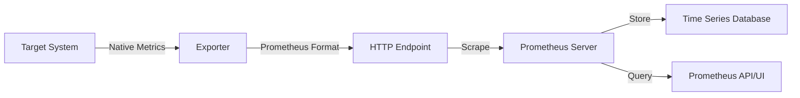

# Understanding Prometheus Exporters

## Introduction

Prometheus exporters are specialized applications that serve as bridges between your systems or services and the Prometheus monitoring ecosystem. At their core, exporters translate metrics from various sources into the Prometheus exposition format, making them accessible for collection by Prometheus servers.

Think of exporters as translators that speak two languages fluently:
- The native language of the system being monitored
- The Prometheus metrics format that Prometheus servers understand

This translation capability allows Prometheus to monitor virtually anything, from databases and web servers to IoT devices and custom applications, even if they weren't originally designed with Prometheus compatibility in mind.

## What Are Prometheus Exporters?

Exporters are lightweight servers that:

1. **Collect metrics** from a target system or application
2. **Transform** these metrics into Prometheus format
3. **Expose** the metrics at an HTTP endpoint (typically `/metrics`)

When Prometheus scrapes this endpoint, it receives up-to-date metrics in a format it can process and store.



### Types of Exporters

Prometheus exporters generally fall into several categories:

1. **Infrastructure exporters**: Monitor hardware, operating systems, and network devices
   - Node Exporter (Linux/Unix systems)
   - Windows Exporter
   - SNMP Exporter (network devices)

2. **Database exporters**: Monitor database systems
   - MySQL Exporter
   - PostgreSQL Exporter
   - MongoDB Exporter

3. **Messaging system exporters**: Monitor message queues and brokers
   - RabbitMQ Exporter
   - Kafka Exporter

4. **Storage exporters**: Monitor storage systems
   - Ceph Exporter
   - HDFS Exporter

5. **HTTP and API exporters**: Monitor web services and APIs
   - Blackbox Exporter (probe endpoints)
   - Cloudwatch Exporter (for AWS services)

6. **Application and service exporters**: Monitor specific applications
   - JMX Exporter (Java applications)
   - HAProxy Exporter
   - Nginx Exporter

7. **Custom exporters**: Your own applications exposing Prometheus metrics

## How Exporters Work

### The Metrics Exposition Format

Prometheus exporters expose metrics in a simple text-based format. Each line represents a sample and follows this pattern:

```
metric_name{label1="value1", label2="value2"} value [timestamp]
```

- **metric_name**: The name of the metric (e.g., `node_cpu_seconds_total`)
- **labels**: Key-value pairs that provide additional context (optional)
- **value**: The current value of the metric
- **timestamp**: When the metric was collected (optional, usually omitted)

### Example Metrics Output

Here's a snippet of what the `/metrics` endpoint looks like from a Node Exporter:

```
# HELP node_cpu_seconds_total Seconds the CPUs spent in each mode.
# TYPE node_cpu_seconds_total counter
node_cpu_seconds_total{cpu="0",mode="idle"} 3.55378e+06
node_cpu_seconds_total{cpu="0",mode="iowait"} 1789.12
node_cpu_seconds_total{cpu="0",mode="irq"} 0
node_cpu_seconds_total{cpu="0",mode="nice"} 347.84
node_cpu_seconds_total{cpu="0",mode="softirq"} 5787.75
node_cpu_seconds_total{cpu="0",mode="steal"} 0
node_cpu_seconds_total{cpu="0",mode="system"} 27130.5
node_cpu_seconds_total{cpu="0",mode="user"} 81987.76
# HELP node_memory_MemAvailable_bytes Memory information field MemAvailable_bytes.
# TYPE node_memory_MemAvailable_bytes gauge
node_memory_MemAvailable_bytes 2.1327872e+09
```

Each metric includes:
- A `# HELP` comment explaining what the metric represents
- A `# TYPE` comment indicating whether it's a counter, gauge, histogram, or summary
- One or more samples with labels and values

## Common Prometheus Exporters

Let's explore some of the most widely used exporters and how to implement them.

### Node Exporter

The Node Exporter collects hardware and OS metrics from Unix-like systems, making it one of the most fundamental exporters.

#### Installation

```bash
# Download the latest release
wget https://github.com/prometheus/node_exporter/releases/download/v1.5.0/node_exporter-1.5.0.linux-amd64.tar.gz

# Extract the binary
tar xvfz node_exporter-1.5.0.linux-amd64.tar.gz

# Move to /usr/local/bin
sudo mv node_exporter-1.5.0.linux-amd64/node_exporter /usr/local/bin/

# Create a service file for systemd
sudo tee /etc/systemd/system/node_exporter.service > /dev/null << EOF
[Unit]
Description=Node Exporter
After=network.target

[Service]
Type=simple
User=node_exporter
ExecStart=/usr/local/bin/node_exporter

[Install]
WantedBy=multi-user.target
EOF

# Create user
sudo useradd -rs /bin/false node_exporter

# Start the service
sudo systemctl daemon-reload
sudo systemctl start node_exporter
sudo systemctl enable node_exporter
```

#### Configuration in Prometheus

Add this to your `prometheus.yml`:

```yaml
scrape_configs:
  - job_name: 'node'
    static_configs:
      - targets: ['localhost:9100']
```

#### What It Monitors

- CPU usage and statistics
- Memory usage
- Disk I/O and space
- Network statistics
- File system metrics
- And many more system-level metrics

### MySQL Exporter

The MySQL Exporter allows Prometheus to monitor MySQL/MariaDB database instances.

#### Installation

```bash
# Download the latest release
wget https://github.com/prometheus/mysqld_exporter/releases/download/v0.14.0/mysqld_exporter-0.14.0.linux-amd64.tar.gz

# Extract the binary
tar xvfz mysqld_exporter-0.14.0.linux-amd64.tar.gz

# Move to /usr/local/bin
sudo mv mysqld_exporter-0.14.0.linux-amd64/mysqld_exporter /usr/local/bin/
```

#### Configuration

Create a `.my.cnf` file for the exporter to connect to MySQL:

```
[client]
user=exporter
password=password
```

Set up a MySQL user with appropriate permissions:

```sql
CREATE USER 'exporter'@'localhost' IDENTIFIED BY 'password' WITH MAX_USER_CONNECTIONS 3;
GRANT PROCESS, REPLICATION CLIENT, SELECT ON *.* TO 'exporter'@'localhost';
```

Run the exporter:

```bash
mysqld_exporter --config.my-cnf=.my.cnf
```

#### Add to Prometheus

```yaml
scrape_configs:
  - job_name: 'mysql'
    static_configs:
      - targets: ['localhost:9104']
```

#### What It Monitors

- Query throughput and performance
- Connection statistics
- Buffer pool utilization
- InnoDB metrics
- Replication lag and status
- And many more database-specific metrics

### Blackbox Exporter

The Blackbox Exporter allows Prometheus to probe endpoints over HTTP, HTTPS, DNS, TCP, and ICMP.

#### Installation

```bash
# Download the latest release
wget https://github.com/prometheus/blackbox_exporter/releases/download/v0.23.0/blackbox_exporter-0.23.0.linux-amd64.tar.gz

# Extract the binary
tar xvfz blackbox_exporter-0.23.0.linux-amd64.tar.gz

# Move to /usr/local/bin
sudo mv blackbox_exporter-0.23.0.linux-amd64/blackbox_exporter /usr/local/bin/
```

#### Configuration

Create a configuration file `blackbox.yml`:

```yaml
modules:
  http_2xx:
    prober: http
    http:
      preferred_ip_protocol: "ip4"
  http_post_2xx:
    prober: http
    http:
      method: POST
  tcp_connect:
    prober: tcp
  icmp:
    prober: icmp
```

Run the exporter:

```bash
blackbox_exporter --config.file=blackbox.yml
```

#### Add to Prometheus

```yaml
scrape_configs:
  - job_name: 'blackbox'
    metrics_path: /probe
    params:
      module: [http_2xx]  # Use the module defined in the blackbox.yml
    static_configs:
      - targets:
        - https://example.com    # Target to probe
        - https://prometheus.io
    relabel_configs:
      - source_labels: [__address__]
        target_label: __param_target
      - source_labels: [__param_target]
        target_label: instance
      - target_label: __address__
        replacement: localhost:9115  # The blackbox exporter's real hostname:port
```

#### What It Monitors

- HTTP response times and status codes
- SSL/TLS certificate validity
- DNS resolution times
- TCP connection establishment times
- ICMP ping response times

## Writing Your Own Exporter

Sometimes, you'll need to monitor systems or applications that don't have existing exporters. In these cases, you can write your own.

### When to Write a Custom Exporter

- You have a proprietary system with no existing exporter
- You need to monitor specific business metrics
- You want to consolidate metrics from multiple sources
- You need to transform metrics in specific ways

### Approaches to Writing Custom Exporters

1. **Direct instrumentation**: Add Prometheus client libraries to your application
2. **Standalone exporter**: Create a separate application that collects metrics and exposes them

### Example: Simple Python Exporter

Here's a basic exporter written in Python using the `prometheus_client` library:

```python
from prometheus_client import start_http_server, Counter, Gauge
import random
import time

# Create metrics
REQUESTS = Counter('app_requests_total', 'Total app requests', ['request_type'])
INPROGRESS = Gauge('app_requests_inprogress', 'Number of requests in progress')
LAST_REQUEST_TIME = Gauge('app_last_request_timestamp', 'Last request timestamp')

# Simulate request handling
def process_request(request_type):
    INPROGRESS.inc()
    time.sleep(random.uniform(0.1, 0.5))
    REQUESTS.labels(request_type=request_type).inc()
    LAST_REQUEST_TIME.set(time.time())
    INPROGRESS.dec()

if __name__ == '__main__':
    # Start server
    start_http_server(8000)
    print("Exporter running on port 8000")
    
    # Simulate traffic
    request_types = ['GET', 'POST', 'PUT', 'DELETE']
    while True:
        process_request(random.choice(request_types))
```

To run this exporter:

1. Install the required library: `pip install prometheus_client`
2. Run the script: `python exporter.py`
3. Access metrics at `http://localhost:8000/metrics`

### Best Practices for Writing Exporters

1. **Follow the naming conventions**:
   - Use lowercase with underscores
   - Include units in the metric name (e.g., `http_request_duration_seconds`)
   - Use the application name as a prefix

2. **Choose the right metric types**:
   - **Counter**: For values that only increase (e.g., request count)
   - **Gauge**: For values that can go up and down (e.g., memory usage)
   - **Histogram**: For measuring distributions (e.g., request durations)
   - **Summary**: Similar to histogram but calculates quantiles

3. **Use labels effectively**:
   - Add context with labels, but don't overuse them
   - Avoid high cardinality labels (e.g., user IDs, timestamps)

4. **Ensure reliability**:
   - Handle errors gracefully
   - Don't block the metrics endpoint
   - Implement timeouts for external dependencies

5. **Document your metrics**:
   - Add HELP and TYPE comments
   - Provide clear descriptions

## Deploying and Managing Exporters

### Containerization with Docker

Many exporters offer official Docker images for easy deployment. Here's an example using Node Exporter:

```bash
docker run -d \
  --name=node-exporter \
  --net="host" \
  --pid="host" \
  -v "/:/host:ro,rslave" \
  prom/node-exporter \
  --path.rootfs=/host
```

### Using Docker Compose

For managing multiple exporters, Docker Compose can be helpful:

```yaml
version: '3'

services:
  prometheus:
    image: prom/prometheus
    ports:
      - "9090:9090"
    volumes:
      - ./prometheus.yml:/etc/prometheus/prometheus.yml
    networks:
      - monitoring

  node-exporter:
    image: prom/node-exporter
    ports:
      - "9100:9100"
    networks:
      - monitoring

  mysql-exporter:
    image: prom/mysqld-exporter
    ports:
      - "9104:9104"
    environment:
      - DATA_SOURCE_NAME=exporter:password@(mysql:3306)/
    networks:
      - monitoring
    depends_on:
      - mysql

networks:
  monitoring:
```

### Kubernetes Deployment

In Kubernetes environments, you can use the Prometheus Operator to manage exporters:

```yaml
apiVersion: monitoring.coreos.com/v1
kind: ServiceMonitor
metadata:
  name: example-app
spec:
  selector:
    matchLabels:
      app: example-app
  endpoints:
  - port: web
```

This automatically discovers and scrapes services with matching labels.

## Troubleshooting Exporters

### Common Issues and Solutions

1. **Exporter not starting**
   - Check port conflicts
   - Verify permissions
   - Review logs

2. **No metrics showing in Prometheus**
   - Confirm Prometheus configuration
   - Check network connectivity
   - Verify the metrics endpoint is accessible

3. **Incomplete or incorrect metrics**
   - Check exporter configuration
   - Review documentation for required permissions
   - Test the exporter endpoint directly

### Debugging Techniques

1. **Direct testing**: Access the `/metrics` endpoint directly in a browser or with curl:
   ```bash
   curl http://localhost:9100/metrics
   ```

2. **Enable debug logging**: Most exporters have a debug or verbose mode:
   ```bash
   node_exporter --log.level=debug
   ```

3. **Use the Prometheus targets page**: Check the status of targets in the Prometheus UI at `/targets`

## Integrating with Grafana

While this is more thoroughly covered in other sections, it's worth mentioning how exporters connect to the broader monitoring ecosystem.

Once Prometheus is collecting metrics from your exporters, you can create dashboards in Grafana:

1. Add Prometheus as a data source in Grafana
2. Create dashboards using PromQL queries
3. Set up alerts based on metrics thresholds

Many popular exporters have pre-built Grafana dashboards available in the [Grafana dashboard repository](https://grafana.com/grafana/dashboards/).

## Summary

Prometheus exporters are essential components in the Prometheus ecosystem, acting as bridges between your systems and Prometheus itself. Key takeaways:

- Exporters translate metrics from various systems into Prometheus format
- There are exporters available for most common systems and applications
- You can create custom exporters when needed
- Properly configured exporters provide valuable insights into system behavior
- Best practices include following naming conventions, choosing the right metric types, and effective labeling

By mastering exporters, you can extend Prometheus monitoring to virtually any system or application in your infrastructure, creating a comprehensive observability solution.

## Additional Resources

- [Official Prometheus Exporters documentation](https://prometheus.io/docs/instrumenting/exporters/)
- [Prometheus GitHub repositories](https://github.com/prometheus) - home to many official exporters
- [Client Libraries documentation](https://prometheus.io/docs/instrumenting/clientlibs/) - for direct instrumentation
- [Awesome Prometheus](https://github.com/roaldnefs/awesome-prometheus) - a curated list of Prometheus resources

## Exercises

1. Install and configure the Node Exporter on your local machine or a test server.
2. Create a simple Prometheus configuration to scrape the Node Exporter.
3. Use the Blackbox Exporter to monitor the uptime of your favorite website.
4. Write a small custom exporter (in any language) that exposes at least two metrics.
5. Create a Docker Compose file that runs Prometheus and at least two exporters.