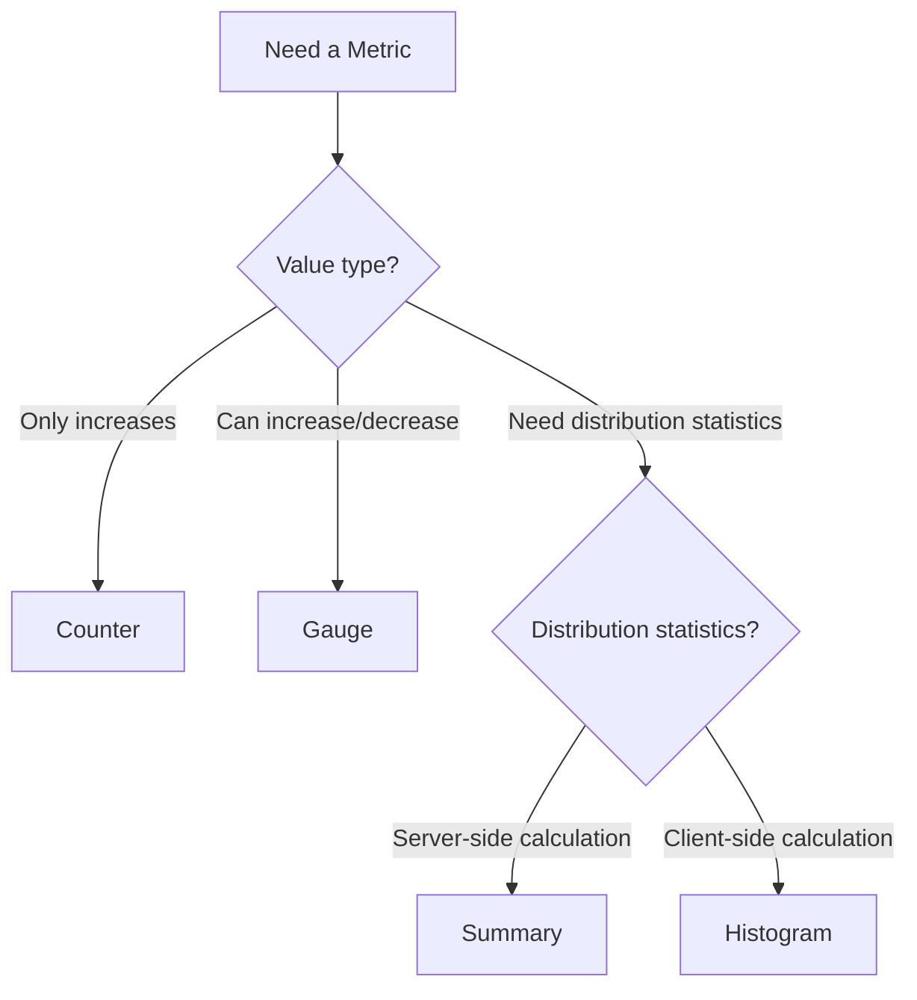

# Prometheus Gauges

## Introduction

Gauges are one of the four core metric types in Prometheus, alongside counters, histograms, and summaries. Unlike counters which only increase, **gauges** represent values that can both increase and decrease over time. Think of a gauge like a thermometer or a fuel gauge in your car - the value can go up or down depending on current conditions.

Gauges are perfect for measuring metrics such as:
- Current memory usage
- CPU utilization
- Temperature
- Number of concurrent requests
- Queue size or buffer capacity

In this guide, we'll explore how gauges work, how to implement them, and practical examples of when to use them in your applications.

## Understanding Gauges

A gauge represents a single numerical value that can arbitrarily go up or down. Gauges provide a snapshot of your system at a specific moment in time.

### Key Characteristics of Gauges

- **Bidirectional**: Values can increase or decrease
- **Current state**: Represents the current value of something
- **No reset on restart**: Doesn't automatically reset to zero when your application restarts (unlike counters)
- **Point-in-time**: Captures the value at the moment of measurement

### When to Use Gauges vs. Other Metric Types

|Scenario|Use Gauge?|Explanation|
|--------|----------|-----------|
|Current memory usage|✅|Changes up and down based on system activity|
|Total HTTP requests|❌|Always increasing - use a counter instead|
|Connection pool size|✅|Changes based on active connections|
|Request duration|❌|Better captured as a histogram or summary|
|Temperature readings|✅|Can increase or decrease with environmental changes|

## Implementing Gauges in Prometheus

Let's look at how to implement gauges using the official Prometheus client libraries.

### Go Implementation

```go
package main

import (
    "net/http"
    
    "github.com/prometheus/client_golang/prometheus"
    "github.com/prometheus/client_golang/prometheus/promauto"
    "github.com/prometheus/client_golang/prometheus/promhttp"
)

func main() {
    // Create a gauge to track memory usage
    memoryUsage := promauto.NewGauge(prometheus.GaugeOpts{
        Name: "app_memory_usage_bytes",
        Help: "Current memory usage of the application in bytes",
    })
    
    // Set the initial value
    memoryUsage.Set(0)
    
    // Update the gauge value periodically (in a real app)
    // This could be in a goroutine that samples memory every X seconds
    memoryUsage.Set(12345678)  // Setting to a specific value
    memoryUsage.Inc()          // Increment by 1
    memoryUsage.Dec()          // Decrement by 1
    memoryUsage.Add(100)       // Add a specific amount
    memoryUsage.Sub(50)        // Subtract a specific amount
    
    // Expose metrics endpoint
    http.Handle("/metrics", promhttp.Handler())
    http.ListenAndServe(":9090", nil)
}
```

### Python Implementation

```python
from prometheus_client import Gauge, start_http_server
import time
import psutil

# Create a gauge to track CPU usage
cpu_usage = Gauge('app_cpu_usage_percent', 'Current CPU usage in percent')

# Create a gauge with labels for multiple disks
disk_usage = Gauge('app_disk_usage_percent', 
                  'Disk usage in percent', 
                  ['device', 'mountpoint'])

# Start metrics endpoint
start_http_server(9090)

# Main loop
while True:
    # Update CPU gauge
    cpu_percent = psutil.cpu_percent()
    cpu_usage.set(cpu_percent)
    
    # Update disk gauges for each partition
    for partition in psutil.disk_partitions():
        usage = psutil.disk_usage(partition.mountpoint).percent
        disk_usage.labels(
            device=partition.device, 
            mountpoint=partition.mountpoint
        ).set(usage)
    
    time.sleep(5)  # Update every 5 seconds
```

### Java Implementation

```java
import io.prometheus.client.Gauge;
import io.prometheus.client.exporter.HTTPServer;

import java.io.IOException;

public class GaugeExample {
    public static void main(String[] args) throws IOException {
        // Create a gauge to track connection pool usage
        final Gauge connectionPoolGauge = Gauge.build()
            .name("app_db_connections_active")
            .help("Number of active database connections")
            .register();
            
        // Create a gauge with labels
        final Gauge queueSizeGauge = Gauge.build()
            .name("app_queue_size")
            .help("Current queue size")
            .labelNames("queue_name")
            .register();
        
        // Set values
        connectionPoolGauge.set(42);
        
        // Multiple ways to update the gauge
        connectionPoolGauge.inc();          // Increment by 1
        connectionPoolGauge.inc(5);         // Increment by 5
        connectionPoolGauge.dec();          // Decrement by 1
        connectionPoolGauge.dec(3);         // Decrement by 3
        
        // Using labels
        queueSizeGauge.labels("high_priority").set(3);
        queueSizeGauge.labels("low_priority").set(15);
        
        // Start HTTP server to expose metrics
        HTTPServer server = new HTTPServer(9090);
        
        // Keep the application running
        Thread.sleep(Long.MAX_VALUE);
    }
}
```

## Gauge Functions and Operations

Gauges provide several operations to manipulate their values:

- `set(value)`: Set the gauge to a specific value
- `inc()`: Increment by 1
- `dec()`: Decrement by 1
- `add(value)`: Add a specific value
- `sub(value)`: Subtract a specific value
- `setToCurrentTime()`: Set the gauge to the current Unix timestamp (available in some clients)

## Visualizing Gauges in Prometheus

When you query a gauge in Prometheus or visualize it in Grafana, you're seeing the most recent value at each timestamp. This makes gauges ideal for displaying the current state of a system.

Here's a simple Prometheus query to display a gauge metric:

```
app_memory_usage_bytes
```

## Advanced Gauge Techniques

### Tracking Start Times with Gauges

Gauges are useful for tracking when something started:

```python
from prometheus_client import Gauge
import time

# Record application start time as a gauge
app_start_time = Gauge('app_start_timestamp_seconds', 
                       'UNIX timestamp when the application started')
                       
# Set the gauge to the current time
app_start_time.set_to_current_time()
```

This allows you to calculate uptime with a Prometheus query:

```
time() - app_start_timestamp_seconds
```

### Using Callbacks for Dynamic Values

For values that change frequently, you can use callback functions instead of manually updating the gauge:

```python
from prometheus_client import Gauge
import psutil

# Create a gauge that calls psutil each time it's scraped
memory_gauge = Gauge('app_memory_used_bytes', 
                    'Memory used in bytes', 
                    ['type'])
                    
# Register callback functions for different memory stats
memory_gauge.labels('virtual').set_function(
    lambda: psutil.virtual_memory().used)
memory_gauge.labels('swap').set_function(
    lambda: psutil.swap_memory().used)
```

## Practical Real-World Examples

### Example 1: Monitoring API Rate Limits

Many APIs have rate limits. A gauge can track how many requests you have left:

```python
from prometheus_client import Gauge
import requests
import time

# Create gauge for remaining API requests
api_requests_remaining = Gauge('api_requests_remaining', 
                              'Number of API requests remaining before rate limit')

# Update function
def update_api_limit():
    while True:
        response = requests.get('https://api.example.com/status')
        limit_remaining = int(response.headers.get('X-RateLimit-Remaining', 0))
        api_requests_remaining.set(limit_remaining)
        time.sleep(60)  # Check once per minute
```

### Example 2: Database Connection Pool

Monitor your application's database connection pool:

```java
import io.prometheus.client.Gauge;

public class DatabaseMetrics {
    private static final Gauge DB_CONNECTIONS = Gauge.build()
        .name("app_db_connections")
        .help("Database connections")
        .labelNames("state")
        .register();
        
    // Update metrics when connection pool changes
    public void updateMetrics(int active, int idle, int max) {
        DB_CONNECTIONS.labels("active").set(active);
        DB_CONNECTIONS.labels("idle").set(idle);
        DB_CONNECTIONS.labels("max").set(max);
    }
}
```

### Example 3: Monitoring Queue Depth

Track how many items are in your processing queue:

```go
package main

import (
    "github.com/prometheus/client_golang/prometheus"
    "github.com/prometheus/client_golang/prometheus/promauto"
)

var (
    queueSize = promauto.NewGaugeVec(
        prometheus.GaugeOpts{
            Name: "app_processing_queue_size",
            Help: "Current number of items in processing queues",
        },
        []string{"queue_name", "priority"},
    )
)

func trackQueueSizes(queues map[string]int) {
    for name, size := range queues {
        // Split name into queue name and priority
        queueName := "default"
        priority := "medium"
        
        // In a real app, parse these from the queue name
        if name == "orders_high" {
            queueName = "orders"
            priority = "high"
        }
        
        queueSize.WithLabelValues(queueName, priority).Set(float64(size))
    }
}
```

### Example 4: System Resource Monitoring

Monitor system metrics using gauges:

```python
from prometheus_client import Gauge, start_http_server
import psutil
import time

# Create gauges
cpu_usage = Gauge('system_cpu_usage_percent', 'CPU usage percentage')
memory_usage = Gauge('system_memory_usage_bytes', 'Memory usage in bytes')
disk_io = Gauge('system_disk_io_operations', 
               'Disk I/O operations', 
               ['operation'])

# Start metrics endpoint
start_http_server(9090)

# Update metrics in a loop
while True:
    # CPU usage
    cpu_usage.set(psutil.cpu_percent())
    
    # Memory usage
    mem = psutil.virtual_memory()
    memory_usage.set(mem.used)
    
    # Disk I/O
    io_counters = psutil.disk_io_counters()
    disk_io.labels('read').set(io_counters.read_count)
    disk_io.labels('write').set(io_counters.write_count)
    
    time.sleep(1)  # Update every second
```

## Gauge Anti-Patterns and Pitfalls

### Common Mistakes to Avoid

1. **Using a gauge for accumulated values**: If a value only increases (like request count), use a counter instead.
2. **Ignoring resets**: Remember that gauges don't automatically reset when your application restarts.
3. **Gauge overload**: Don't create too many gauges with unique label combinations, as this can lead to cardinality explosion.
4. **Incorrect alerting**: Alerting on gauge absolute values can be tricky; consider using rate of change or relative thresholds.

### Best Practices

1. **Choose descriptive names**: Use clear names that indicate what the gauge measures.
2. **Include units in metric names**: Add units like `_bytes`, `_seconds`, or `_percent` to make metrics clearer.
3. **Use labels effectively**: Group related gauges using labels rather than creating separate metrics.
4. **Document your gauges**: Add helpful descriptions using the `help` parameter.

## Visualizing Gauge Metrics in Grafana

Gauges are versatile for visualization in Grafana:

1. **Time-series graph**: Shows how values change over time
2. **Single-stat panel**: Shows current value
3. **Gauge visualization**: Shows value within a min/max range
4. **Heatmap**: For gauges with multiple instances

An example Grafana query for memory usage:

```
100 * (app_memory_usage_bytes / app_memory_total_bytes)
```

## Gauges vs. Other Metric Types

Let's compare gauges to other Prometheus metric types:



## Summary

Gauges are essential metrics that represent values that can arbitrarily go up and down. They're perfect for:

- Capturing the current state of resources (memory, CPU, etc.)
- Tracking capacities and utilization
- Monitoring queue depths and connection pools
- Measuring environmental values like temperature

When implementing gauges, remember:
- Choose the right metric type for your data
- Use labels to organize related metrics
- Follow naming conventions that include units
- Consider how the data will be visualized and alerted on

With gauges, you can effectively monitor the current state of your systems and make informed decisions based on real-time data.

## Exercises

1. Create a simple application that exposes a gauge metric to track:
   - Memory usage
   - Number of active user sessions
   - Current queue size

2. Extend the application to use labels to track multiple queues or resources.

3. Set up a Prometheus server to scrape your application and create a Grafana dashboard to visualize the gauge metrics.

4. Implement a gauge that uses a callback function to dynamically report system metrics.

5. Create an alert rule in Prometheus that triggers when a gauge value exceeds a certain threshold.

## Further Reading

- [Prometheus Documentation on Metric Types](https://prometheus.io/docs/concepts/metric_types/)
- [Best Practices for Monitoring](https://prometheus.io/docs/practices/instrumentation/)
- [Grafana Dashboard Examples](https://grafana.com/grafana/dashboards/)
- [Prometheus Client Libraries](https://prometheus.io/docs/instrumenting/clientlibs/)