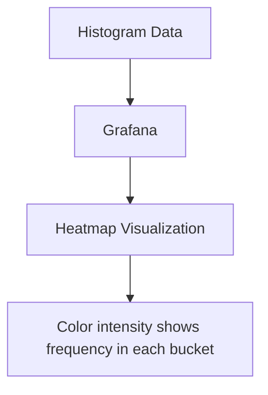

# Prometheus Histograms

## Introduction

Histograms are one of the most powerful and complex metric types in Prometheus. They allow you to measure the distribution of values for a particular metric, such as request durations or response sizes. Unlike counters and gauges, which capture single values, histograms provide a more complete picture by tracking how often values fall into specific ranges or "buckets."

In this guide, we'll explore histograms in depth, understand when to use them, and learn how to implement and query them effectively.

## What are Histograms?

A histogram is a metric that samples observations (usually things like request durations or response sizes) and counts them in configurable buckets. It also provides a sum of all observed values.

When you create a histogram in Prometheus, it actually generates multiple time series:

- A counter for each bucket with a label `le` (less than or equal to) showing the upper bound of the bucket
- A sum of all observed values
- A count of events that have been observed

This allows you to calculate quantiles (like median, 95th percentile) from your data.

## When to Use Histograms

Histograms are ideal for:

- Measuring request durations
- Measuring response sizes
- Tracking latency distribution
- Any scenario where the distribution of values is more important than individual measurements

For example, knowing the average response time of your API is useful, but understanding that 95% of requests complete in under 300ms while 5% take over 2 seconds gives you much more actionable information.

## How Histograms Work

Histograms in Prometheus work by counting observations into buckets. Let's break down the key components:

### Buckets

Buckets represent ranges of values. Each bucket counts values less than or equal to its upper bound.

For example, if you have buckets with upper bounds of 0.1, 0.2, 0.5, 1, and +Inf (infinity), and you observe a value of 0.3:
- The 0.1 bucket remains unchanged (0.3 is greater than 0.1)
- The 0.2 bucket remains unchanged (0.3 is greater than 0.2)
- The 0.5 bucket increments by 1 (0.3 is less than 0.5)
- The 1 bucket increments by 1 (0.3 is less than 1)
- The +Inf bucket increments by 1 (all values are less than infinity)

The `+Inf` bucket always includes all observations, so its value equals the total count.

### Sum

Besides buckets, histograms also track the sum of all observed values, allowing you to calculate the average value.

### Count

The count represents the total number of observations, which equals the value of the `+Inf` bucket.

## Creating a Histogram in Go

Here's how to create and use a histogram in a Go application using the official Prometheus client:

```go
package main

import (
    "math/rand"
    "net/http"
    "time"

    "github.com/prometheus/client_golang/prometheus"
    "github.com/prometheus/client_golang/prometheus/promhttp"
)

func main() {
    // Create a histogram with custom buckets for tracking request duration
    requestDuration := prometheus.NewHistogram(prometheus.HistogramOpts{
        Name:    "http_request_duration_seconds",
        Help:    "Histogram of HTTP request durations in seconds",
        Buckets: []float64{0.01, 0.05, 0.1, 0.5, 1, 2, 5, 10},
    })

    // Register the histogram with Prometheus
    prometheus.MustRegister(requestDuration)

    // Define handler that simulates HTTP requests with varying durations
    http.HandleFunc("/", func(w http.ResponseWriter, r *http.Request) {
        // Start timing the request
        start := time.Now()

        // Simulate work (random delay between 0 and 2 seconds)
        time.Sleep(time.Duration(rand.Float64()*2000) * time.Millisecond)

        // Record the request duration
        duration := time.Since(start).Seconds()
        requestDuration.Observe(duration)

        w.Write([]byte("Request processed!
"))
    })

    // Expose the Prometheus metrics
    http.Handle("/metrics", promhttp.Handler())

    // Start the server
    http.ListenAndServe(":8080", nil)
}
```

In this example:
1. We create a histogram named `http_request_duration_seconds` with custom buckets
2. We register it with Prometheus
3. In our HTTP handler, we measure the duration of each request
4. We record these durations using the `Observe()` method
5. Prometheus automatically counts the observations into appropriate buckets

## Creating a Histogram in Python

Here's how to implement the same concept using the Python client:

```python
from prometheus_client import Histogram, start_http_server
import random
import time

# Create a histogram with custom buckets
REQUEST_DURATION = Histogram(
    'http_request_duration_seconds',
    'Histogram of HTTP request durations in seconds',
    buckets=[0.01, 0.05, 0.1, 0.5, 1, 2, 5, 10]
)

# Start the metrics server
start_http_server(8000)

# Simulate HTTP requests
def process_request():
    # Use a context manager to time the request
    with REQUEST_DURATION.time():
        # Simulate work (random delay between 0 and 2 seconds)
        time.sleep(random.random() * 2)

# Main loop
while True:
    process_request()
    time.sleep(0.5)
```

Notice how the Python client provides a convenient context manager via `.time()` that automatically times the execution of the code block and records it to the histogram.

## Understanding the Generated Metrics

When you create a histogram named `http_request_duration_seconds`, Prometheus generates the following metrics:

- `http_request_duration_seconds_bucket{le="0.01"}` (count of requests that took 0.01s or less)
- `http_request_duration_seconds_bucket{le="0.05"}` (count of requests that took 0.05s or less)
- `http_request_duration_seconds_bucket{le="0.1"}` (and so on for each bucket)
- ...
- `http_request_duration_seconds_bucket{le="+Inf"}` (count of all requests)
- `http_request_duration_seconds_sum` (sum of all request durations)
- `http_request_duration_seconds_count` (total count of requests, same as the "+Inf" bucket)

## Visualizing Histogram Data

A common way to visualize histogram data is through a heatmap in Grafana:



Another approach is to calculate and graph percentiles using PromQL functions like `histogram_quantile`.

## Querying Histograms with PromQL

### Calculating Percentiles

One of the most common queries for histograms is calculating percentiles. For example, to find the 95th percentile of request durations:

```
histogram_quantile(0.95, rate(http_request_duration_seconds_bucket[5m]))
```

This calculates the 95th percentile value from the request duration histogram over the last 5 minutes.

### Average Value

To calculate the average request duration:

```
rate(http_request_duration_seconds_sum[5m]) / rate(http_request_duration_seconds_count[5m])
```

This divides the rate of change of the sum by the rate of change of the count, giving us the average duration.

### Median Value

For the median (50th percentile):

```
histogram_quantile(0.5, rate(http_request_duration_seconds_bucket[5m]))
```

## Histogram vs. Summary

Prometheus offers another similar metric type called Summary. Here's how they compare:

| Feature | Histogram | Summary |
|---------|-----------|---------|
| Calculation location | Server-side (using PromQL) | Client-side (in your application) |
| Configurable | Bucket boundaries | Quantile error rates |
| Storage efficiency | More time series | Fewer time series |
| Aggregation | Can be aggregated across instances | Pre-calculated quantiles cannot be aggregated |

Choose a histogram when:
- You need to aggregate quantiles across multiple instances
- You don't know in advance which percentiles you'll need
- You want to use Prometheus native functions for calculations

## Best Practices

### Choosing Bucket Boundaries

Selecting appropriate bucket boundaries is crucial for effective histograms:

1. **Understand your data**: Start by understanding the range and distribution of your values
2. **Cover the full range**: Ensure buckets cover from the smallest to largest expected values
3. **Higher resolution where it matters**: Place more buckets in ranges where precision is important
4. **Use linear or exponential distributions**: Linear for uniform ranges, exponential (powers of 2 or 10) for wide ranges
5. **Include the SLO thresholds**: Always include buckets at your SLO thresholds (e.g., 100ms, 200ms)

### Default Buckets

The Prometheus clients provide default buckets, but these are rarely ideal for your specific use case. For example, Go's default buckets are:

```go
[]float64{.005, .01, .025, .05, .1, .25, .5, 1, 2.5, 5, 10}
```

### Linear vs. Exponential Buckets

For creating custom buckets, Prometheus clients typically provide helper functions:

```go
// Go - Linear buckets
prometheus.LinearBuckets(0.1, 0.1, 10) // Start: 0.1, Width: 0.1, Count: 10
// Results in: [0.1, 0.2, 0.3, ..., 1.0]

// Go - Exponential buckets
prometheus.ExponentialBuckets(0.001, 2, 10) // Start: 0.001, Factor: 2, Count: 10
// Results in: [0.001, 0.002, 0.004, 0.008, ..., 0.512]
```

## Real-World Example: API Latency Monitoring

Let's look at a more complete example of monitoring API endpoint latencies:

```go
package main

import (
    "math/rand"
    "net/http"
    "time"

    "github.com/prometheus/client_golang/prometheus"
    "github.com/prometheus/client_golang/prometheus/promauto"
    "github.com/prometheus/client_golang/prometheus/promhttp"
)

var (
    // Create a histogram vector to track latency by endpoint
    apiLatency = promauto.NewHistogramVec(
        prometheus.HistogramOpts{
            Name:    "api_request_duration_seconds",
            Help:    "API endpoint latency distribution",
            Buckets: []float64{0.001, 0.005, 0.01, 0.025, 0.05, 0.1, 0.25, 0.5, 1, 2.5, 5, 10},
        },
        []string{"endpoint", "method", "status"},
    )
)

func instrumentHandler(path string, handler http.HandlerFunc) http.HandlerFunc {
    return func(w http.ResponseWriter, r *http.Request) {
        start := time.Now()
        
        // Execute the actual handler
        handler(w, r)
        
        // Record the request duration with labels
        duration := time.Since(start).Seconds()
        status := "200" // In a real app, capture the actual status
        apiLatency.WithLabelValues(path, r.Method, status).Observe(duration)
    }
}

func main() {
    // Define handlers
    http.HandleFunc("/api/users", instrumentHandler("/api/users", func(w http.ResponseWriter, r *http.Request) {
        // Simulate varying response times
        time.Sleep(time.Duration(rand.Float64()*50) * time.Millisecond)
        w.Write([]byte(`{"users": [{"id": 1, "name": "Alice"}, {"id": 2, "name": "Bob"}]}`))
    }))
    
    http.HandleFunc("/api/products", instrumentHandler("/api/products", func(w http.ResponseWriter, r *http.Request) {
        // Simulate more complex endpoint with longer response times
        time.Sleep(time.Duration(100+rand.Float64()*150) * time.Millisecond)
        w.Write([]byte(`{"products": [{"id": 1, "name": "Widget"}]}`))
    }))
    
    // Expose the metrics endpoint
    http.Handle("/metrics", promhttp.Handler())
    
    // Start the server
    http.ListenAndServe(":8080", nil)
}
```

This example:
1. Creates a histogram vector with labels for endpoint, method, and status
2. Uses a middleware to automatically track the duration of each request
3. Provides different simulated latencies for different endpoints

## Querying the API Latency Data

### 95th Percentile by Endpoint

```
histogram_quantile(0.95, sum(rate(api_request_duration_seconds_bucket[5m])) by (endpoint, le))
```

### Comparing Endpoints

```
histogram_quantile(0.5, sum(rate(api_request_duration_seconds_bucket{endpoint=~"/api/users|/api/products"}[5m])) by (endpoint, le))
```

### Apdex Score Calculation

The Apdex (Application Performance Index) score measures user satisfaction based on response times:

```
(
  sum(rate(api_request_duration_seconds_bucket{le="0.1"}[5m])) by (endpoint) +
  sum(rate(api_request_duration_seconds_bucket{le="0.5"}[5m] - api_request_duration_seconds_bucket{le="0.1"}[5m])) by (endpoint) * 0.5
) / sum(rate(api_request_duration_seconds_count[5m])) by (endpoint)
```

This calculates:
- Satisfied users (requests under 0.1s) count fully
- Tolerating users (requests between 0.1s and 0.5s) count as half
- Frustrated users (requests over 0.5s) count as zero

## Summary

Prometheus histograms provide a powerful way to measure and understand the distribution of values like request durations and response sizes. They allow you to:

1. Track observations across configurable buckets
2. Calculate percentiles and quantiles of your data
3. Understand the complete distribution, not just averages
4. Monitor service level objectives (SLOs) effectively
5. Gain insights into outliers and performance bottlenecks

While histograms are more complex than counters and gauges, they provide significantly more insight into your system's behavior, especially for performance-related metrics.

## Additional Resources and Exercises

### Further Learning

- [Official Prometheus Documentation on Histograms](https://prometheus.io/docs/concepts/metric_types/#histogram)
- [Histograms and Summaries in the Prometheus Blog](https://prometheus.io/docs/practices/histograms/)
- [Quantiles and Apdex Scores with Prometheus](https://www.robustperception.io/how-does-a-prometheus-histogram-work/)

### Exercises

1. **Basic Histogram Implementation**
   - Create a simple web server that measures and records request durations using a histogram
   - Use default buckets and then try customizing them

2. **Multi-dimensional Histogram**
   - Extend your implementation to use a histogram vector with labels for HTTP method and status code
   - Write PromQL queries to analyze the performance of different API endpoints

3. **Alerting on Percentiles**
   - Set up an alert that triggers when the 95th percentile of request durations exceeds 500ms
   - Test the alert by introducing artificial latency spikes

4. **Custom Bucket Analysis**
   - Experiment with different bucket configurations (linear vs. exponential)
   - Analyze how bucket selection affects the accuracy of percentile calculations

5. **Grafana Visualization**
   - Create a Grafana dashboard with panels showing:
     - Heatmap of request durations
     - 50th, 95th, and 99th percentiles over time
     - Count of requests exceeding the SLO threshold