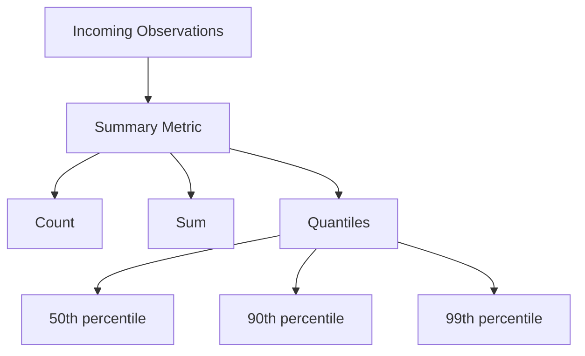

# Prometheus Summaries

## Introduction

In Prometheus monitoring, a **Summary** is one of the four core metric types that allows you to track the distribution of values over time. Unlike counters or gauges that track single values, summaries are designed to capture and analyze observations that vary across a range of values—such as request durations, response sizes, or resource consumption measurements.

Summaries are particularly useful when you need to:
- Track percentiles (quantiles) of observed values
- Calculate average values within sliding time windows
- Analyze distributions without predefined buckets (unlike histograms)

By the end of this guide, you'll understand how summaries work, when to use them, and how to implement them in your applications.

## How Summaries Work

A summary metric in Prometheus consists of multiple components:

1. A **count** of the total number of observations
2. A **sum** of all observed values
3. **Quantiles** (configurable percentiles) of the observed values

When you track a value using a summary, Prometheus calculates and exposes these components so you can analyze the distribution of values over time.



## Summary vs. Histogram

Before diving deeper, it's important to understand when to use a summary versus a histogram:

| Summary | Histogram |
|---------|-----------|
| Client-side quantile calculation | Server-side quantile calculation |
| More accurate for specific quantiles | Better for exploring data with flexible quantiles |
| Higher client CPU usage | Lower client CPU usage |
| Cannot be aggregated across instances | Can be aggregated across instances |

Choose a summary when you need precise quantiles calculated on the client side and don't need to aggregate them across multiple instances.

## Creating Summaries in Prometheus Client Libraries

Let's look at how to create and use summaries with different Prometheus client libraries.

### Go Example

```go
package main

import (
    "math/rand"
    "net/http"
    "time"

    "github.com/prometheus/client_golang/prometheus"
    "github.com/prometheus/client_golang/prometheus/promhttp"
)

var (
    requestDuration = prometheus.NewSummary(
        prometheus.SummaryOpts{
            Name:       "http_request_duration_seconds",
            Help:       "HTTP request duration in seconds",
            Objectives: map[float64]float64{0.5: 0.05, 0.9: 0.01, 0.99: 0.001},
        },
    )
)

func init() {
    prometheus.MustRegister(requestDuration)
}

func main() {
    // Simulate requests with random durations
    go func() {
        for {
            // Simulate a request duration between 0 and 500ms
            duration := rand.Float64() * 0.5
            requestDuration.Observe(duration)
            time.Sleep(100 * time.Millisecond)
        }
    }()

    http.Handle("/metrics", promhttp.Handler())
    http.ListenAndServe(":8080", nil)
}
```

This example creates a summary metric that tracks HTTP request durations. The `Objectives` map defines the quantiles to track along with their allowed error margin.

### Python Example

```python
from prometheus_client import Summary, start_http_server
import random
import time

# Create a summary to track request duration
REQUEST_DURATION = Summary(
    'http_request_duration_seconds',
    'HTTP request duration in seconds',
    ['endpoint']
)

# A decorator to measure the execution time of a function
@REQUEST_DURATION.labels('api').time()
def process_request():
    # Simulate processing time
    time.sleep(random.uniform(0, 0.5))
    return "processed"

if __name__ == '__main__':
    # Start up the server to expose the metrics
    start_http_server(8000)
    
    # Generate some requests
    while True:
        process_request()
        time.sleep(1)
```

In this Python example, we create a summary and use its `.time()` decorator to automatically time a function's execution. The metric is labeled by endpoint to allow for more granular analysis.

### Java Example

```java
import io.prometheus.client.Summary;
import io.prometheus.client.exporter.HTTPServer;

import java.io.IOException;
import java.util.Random;

public class SummaryExample {
    private static final Summary requestDuration = Summary.build()
            .name("http_request_duration_seconds")
            .help("HTTP request duration in seconds")
            .quantile(0.5, 0.05)  // 50th percentile with 5% error
            .quantile(0.9, 0.01)  // 90th percentile with 1% error
            .quantile(0.99, 0.001) // 99th percentile with 0.1% error
            .register();
    
    public static void main(String[] args) throws IOException, InterruptedException {
        // Start an HTTP server to expose metrics
        HTTPServer server = new HTTPServer(8080);
        Random random = new Random();
        
        while (true) {
            // Use a timer to automatically time execution and observe the duration
            Summary.Timer timer = requestDuration.startTimer();
            try {
                // Simulate work
                Thread.sleep(random.nextInt(500));
            } finally {
                timer.observeDuration();
            }
            Thread.sleep(100);
        }
    }
}
```

## Understanding Summary Output

When you scrape a summary metric, you'll see multiple time series like this:

```
# HELP http_request_duration_seconds HTTP request duration in seconds
# TYPE http_request_duration_seconds summary
http_request_duration_seconds{quantile="0.5"} 0.24714789
http_request_duration_seconds{quantile="0.9"} 0.41428945
http_request_duration_seconds{quantile="0.99"} 0.48916918
http_request_duration_seconds_sum 612.92
http_request_duration_seconds_count 1592
```

This output shows:
- Three quantile values (50th, 90th, and 99th percentiles)
- The sum of all observed values (612.92 seconds)
- The count of observations (1592)

## Practical Use Cases

### Case 1: Monitoring API Response Times

One of the most common applications of summaries is tracking API response times:

```javascript
const client = require('prom-client');

// Create a summary
const apiResponseTime = new client.Summary({
  name: 'api_response_time_seconds',
  help: 'Response time of the API in seconds',
  labelNames: ['endpoint', 'status_code'],
  percentiles: [0.5, 0.9, 0.95, 0.99]
});

// In your request handler
app.get('/api/data', (req, res) => {
  const end = apiResponseTime.startTimer({ endpoint: '/api/data' });
  
  // Process request
  fetchData()
    .then(data => {
      res.status(200).json(data);
      end({ status_code: 200 });
    })
    .catch(err => {
      res.status(500).json({ error: err.message });
      end({ status_code: 500 });
    });
});
```

With this implementation, you can answer questions like:
- What's the median response time for the `/api/data` endpoint?
- What is the 99th percentile response time for successful requests?
- How does the response time distribution change during peak hours?

### Case 2: Tracking Resource Consumption

You can use summaries to track resource consumption patterns:

```python
from prometheus_client import Summary
import psutil
import time

# Create a summary for memory usage (percentage)
MEMORY_USAGE = Summary(
    'system_memory_usage_percent',
    'System memory usage in percent',
    ['process']
)

# Create a summary for CPU usage (percentage)
CPU_USAGE = Summary(
    'system_cpu_usage_percent',
    'System CPU usage in percent',
    ['process']
)

def collect_metrics():
    while True:
        # Observe memory usage
        memory_percent = psutil.virtual_memory().percent
        MEMORY_USAGE.labels('system').observe(memory_percent)
        
        # Observe CPU usage
        cpu_percent = psutil.cpu_percent(interval=1)
        CPU_USAGE.labels('system').observe(cpu_percent)
        
        time.sleep(10)
```

This allows you to analyze:
- Typical memory usage patterns (median usage)
- Peak memory consumption (99th percentile)
- Variations in CPU utilization throughout the day

## Best Practices for Using Summaries

1. **Choose Appropriate Quantiles**: Only track the quantiles you actually need. Each quantile increases memory usage.

2. **Use Proper Error Margins**: Each quantile can have an error margin. Smaller error margins require more memory.

3. **Consider Summary vs Histogram**: Use summaries when you need precise quantiles calculated on the client side and don't need to aggregate them.

4. **Add Useful Labels**: Include labels that help you analyze the data, but avoid high-cardinality labels.

5. **Set Reasonable Timeouts**: For timing operations, make sure to set reasonable timeouts to avoid skewed metrics from hung operations.

## Common Pitfalls

1. **Aggregation Limitations**: Quantiles from summaries cannot be meaningfully aggregated across instances. If you need to aggregate percentiles, use histograms instead.

2. **Memory Usage**: Tracking many quantiles with low error margins can significantly increase memory usage.

3. **Duration Calculation**: When manually calculating durations, be careful about time units and precision.

4. **Label Cardinality**: Avoid using high-cardinality labels with summaries to prevent memory bloat.

## PromQL Queries for Summaries

Here are some useful PromQL queries for working with summaries:

```
# Get the 90th percentile request duration for an API endpoint
http_request_duration_seconds{quantile="0.9",endpoint="/api/users"}

# Calculate request rate
rate(http_request_duration_seconds_count{endpoint="/api/users"}[5m])

# Calculate average request duration over 5 minutes
rate(http_request_duration_seconds_sum{endpoint="/api/users"}[5m]) / 
rate(http_request_duration_seconds_count{endpoint="/api/users"}[5m])
```

## Summary

In this guide, we've covered:

- What Prometheus summaries are and how they work
- When to use summaries vs. histograms
- How to implement summaries in different programming languages
- How to interpret summary metrics
- Practical use cases for summaries
- Best practices and common pitfalls
- Useful PromQL queries for analyzing summary data

Summaries are a powerful tool in your monitoring toolkit when you need to track distributions of values and analyze percentiles. By choosing the right metric type for your use case and following best practices, you can build effective monitoring solutions that help you understand your system's behavior.

## Additional Resources

- [Prometheus Documentation on Metric Types](https://prometheus.io/docs/concepts/metric_types/)
- [Understanding Quantiles](https://prometheus.io/docs/practices/histograms/)
- [Prometheus Client Libraries](https://prometheus.io/docs/instrumenting/clientlibs/)

## Exercises

1. Implement a summary metric to track the response size of an API endpoint.
2. Create a dashboard that shows the 50th, 90th, and 99th percentiles of response times.
3. Compare the results of using a summary versus a histogram for the same metric.
4. Implement a summary with appropriate labels to track database query times by query type.
5. Use the `rate()` function with summary metrics to analyze throughput and latency together.