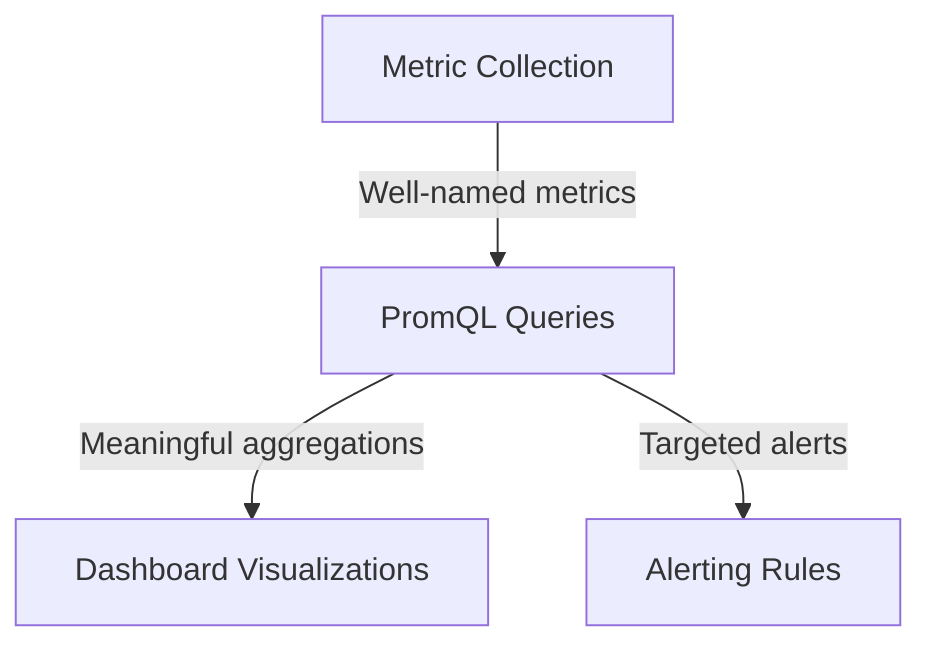

# Prometheus Naming Conventions

## Introduction

When working with Prometheus, having consistent and meaningful metric names is crucial for creating maintainable monitoring systems. Good naming conventions make metrics easier to discover, understand, and use in queries. This guide covers the standard naming patterns used in Prometheus metrics and best practices that will help you design a clean and consistent metrics architecture.

## Basics of Prometheus Metric Names

Prometheus metric names follow a specific structure that helps users quickly understand what the metric represents and how it should be interpreted.

### Metric Name Format

Metric names in Prometheus:

- Must match the regex `[a-zA-Z_:][a-zA-Z0-9_:]*`
- Should be human-readable and meaningful
- Typically use underscores (`_`) to separate words
- Should have a domain-specific prefix
- Typically include units as a suffix

Here's the standard format for a Prometheus metric name:

```
<prefix>_<name>_<unit>_<suffix>
```

For example: `http_requests_total` or `node_memory_usage_bytes`

## Naming Components Explained

### Metric Prefixes

Metric names should begin with a prefix that identifies the monitored system:

- `http_` - for HTTP-related metrics
- `node_` - for machine-level metrics
- `process_` - for process-level metrics
- `app_` - for application-specific metrics

Example:
```
# Good - Uses appropriate prefix
http_requests_total

# Not recommended - Missing prefix
requests_total
```

### Metric Suffixes and Units

The suffix typically describes the unit of measurement:

- `_total` - for counters
- `_count` - for count values in histograms and summaries
- `_sum` - for sum values in histograms and summaries
- `_bucket` - for histogram buckets
- `_ratio` - for ratios or percentages (0-1)
- `_percent` - for percentages (0-100)
- `_bytes` - for sizes in bytes
- `_seconds` - for durations or time periods

Example:
```
# Good - Includes unit
process_cpu_seconds_total

# Not recommended - Missing unit
process_cpu
```

## Naming by Metric Types

Each Prometheus metric type has specific naming conventions:

### Counters

Counters should use the `_total` suffix to indicate they only increase over time:

```
# Counter examples
http_requests_total
errors_total
http_request_duration_seconds_total
```

### Gauges

Gauges represent a snapshot value that can go up or down, so they should not use the `_total` suffix:

```
# Gauge examples
memory_usage_bytes
cpu_usage_percent
active_connections
queue_length
```

### Histograms and Summaries

These complex metrics automatically create several related time series with specific suffixes:

```
# Histogram generates:
http_request_duration_seconds_bucket{le="0.1"} 
http_request_duration_seconds_bucket{le="0.5"}
http_request_duration_seconds_bucket{le="1"}
http_request_duration_seconds_count
http_request_duration_seconds_sum

# Summary generates:
http_request_duration_seconds{quantile="0.5"}
http_request_duration_seconds{quantile="0.9"}
http_request_duration_seconds{quantile="0.99"}
http_request_duration_seconds_count
http_request_duration_seconds_sum
```

## Best Practices

### 1. Be Consistent

Consistency helps both humans and machines understand your metrics:

```
# Consistent naming
api_http_requests_total
api_http_failures_total
api_http_duration_seconds_sum

# Inconsistent naming (avoid)
api_requests
http_api_failures
http_duration_ms_api
```

### 2. Include Units

Always include units in metric names to avoid confusion:

```
# Good - Units included
memory_usage_bytes
request_duration_seconds
file_size_bytes

# Not recommended - Missing units
memory
request_duration
file_size
```

### 3. Use Appropriate Labels Instead of Embedding Information in Names

Use labels to differentiate aspects of what's being measured rather than creating new metrics:

```
# Bad approach - Information embedded in name
http_requests_login_total
http_requests_logout_total
http_requests_profile_total

# Better approach - Using labels
http_requests_total{endpoint="/login"}
http_requests_total{endpoint="/logout"}
http_requests_total{endpoint="/profile"}
```

### 4. Avoid Reserved Words

Avoid using reserved words or characters that have special meaning in PromQL:

- `job` - used as a label by Prometheus
- `instance` - used as a label by Prometheus
- Special characters like `*`, `{`, `}`, `[`, `]`

## Real-World Examples

Let's look at some examples from common exporters and applications:

### Node Exporter Metrics

The Node Exporter follows consistent naming conventions:

```
# CPU metrics
node_cpu_seconds_total{mode="idle"}
node_cpu_seconds_total{mode="user"}

# Memory metrics
node_memory_MemTotal_bytes
node_memory_MemFree_bytes

# Disk metrics
node_disk_io_time_seconds_total
node_disk_read_bytes_total
```

### Custom Application Metrics

Here's how you might instrument a web application:

```javascript
// Counter for HTTP requests
const httpRequestsTotal = new prometheus.Counter({
  name: 'app_http_requests_total',
  help: 'Total number of HTTP requests',
  labelNames: ['method', 'path', 'status']
});

// Gauge for active connections
const activeConnections = new prometheus.Gauge({
  name: 'app_active_connections',
  help: 'Current number of active connections'
});

// Histogram for request duration
const httpRequestDurationSeconds = new prometheus.Histogram({
  name: 'app_http_request_duration_seconds',
  help: 'HTTP request duration in seconds',
  labelNames: ['method', 'path'],
  buckets: [0.01, 0.05, 0.1, 0.5, 1, 2, 5]
});
```

## OpenMetrics Standard

Prometheus naming conventions align with the OpenMetrics standard, which provides more formal specifications for metrics. Key aspects from the OpenMetrics standard include:

- Metric names must match the regex `[a-zA-Z_:][a-zA-Z0-9_:]*`
- Metric names beginning with `_` are reserved
- Colons (`:`) are reserved for user-defined recording rules

## Evolving Metrics Over Time

When evolving your metrics, follow these principles:

1. **Avoid renaming metrics** - This creates discontinuity in data
2. **Add new metrics** rather than changing existing ones
3. Use **recording rules** to create aggregated metrics while preserving raw data

```yaml
# Example recording rule to create a new aggregated metric
groups:
- name: example
  rules:
  - record: job:http_requests_total:rate5m
    expr: sum(rate(http_requests_total[5m])) by (job)
```

## Visualization Considerations

Good naming conventions make it easier to create meaningful dashboards:



## Common Pitfalls

1. **Inconsistent casing**: Stick to snake_case for all metrics
2. **Missing units**: Always include relevant units in metric names
3. **Too many labels**: Use labels judiciously, as they increase cardinality
4. **Embedding label values in names**: Use label dimensions instead of creating multiple metrics

## Summary

Effective Prometheus naming conventions follow these key principles:

- Use clear, descriptive names with appropriate prefixes
- Include units in metric names
- Follow type-specific naming patterns (e.g., `_total` for counters)
- Use labels rather than creating multiple metrics
- Maintain consistency across your metrics ecosystem

By following these conventions, you'll create a monitoring system that is easier to query, understand, and maintain.

## Additional Resources

- [Prometheus Documentation on Metric Names](https://prometheus.io/docs/practices/naming/)
- [OpenMetrics Specification](https://github.com/OpenObservability/OpenMetrics/blob/main/specification/OpenMetrics.md)
- [Google's Four Golden Signals](https://sre.google/sre-book/monitoring-distributed-systems/)

## Exercises

1. Rename these poorly named metrics to follow Prometheus conventions:
   - `requests`
   - `memory_usage`
   - `errors_api_login`
   - `duration_ms`

2. Create a proper naming scheme for metrics that would monitor:
   - Database connection pool usage
   - API endpoint response times
   - Failed login attempts
   - Queue processing rates

3. Convert these metrics into a single metric with appropriate labels:
   - `http_get_requests_total`
   - `http_post_requests_total`
   - `http_put_requests_total`
   - `http_delete_requests_total`