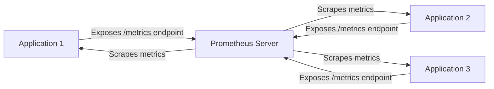
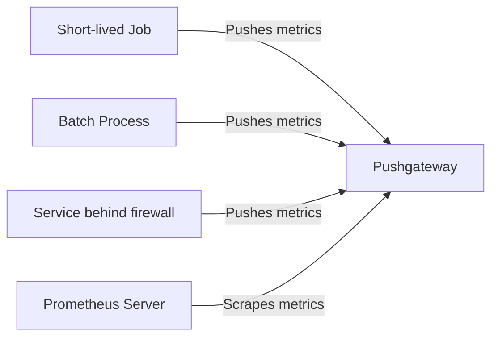

# Prometheus Pull vs Push

## Introduction

When setting up monitoring with Prometheus, one of the fundamental concepts you'll encounter is the distinction between the "pull" and "push" models for collecting metrics. Prometheus primarily operates on a pull-based architecture, but also supports push-based metrics collection through components like the Pushgateway. 

Understanding the differences, advantages, and appropriate use cases for each approach is crucial for designing an effective monitoring system. In this guide, we'll explore both models in depth and help you determine which approach is best suited for your specific scenarios.

## Pull Model: The Prometheus Default

### How the Pull Model Works

In the pull model, which is Prometheus' default operating mode:

1. Prometheus server **actively scrapes** metrics from instrumented targets
2. Targets expose metrics at an HTTP endpoint (typically `/metrics`)
3. Prometheus fetches these metrics at regular intervals based on configured scrape frequencies

Let's visualize this model:



### Code Example: Setting Up a Target for Pull-Based Metrics

Here's a simple example of how to expose metrics in a Node.js application using the `prom-client` library:

```javascript
const express = require('express');
const client = require('prom-client');

// Create a Registry to register metrics
const register = new client.Registry();

// Add default metrics (CPU, memory, etc.)
client.collectDefaultMetrics({ register });

// Create a custom counter
const httpRequestsTotal = new client.Counter({
  name: 'http_requests_total',
  help: 'Total number of HTTP requests',
  labelNames: ['method', 'status'],
  registers: [register]
});

const app = express();

// Increment counter on each request
app.use((req, res, next) => {
  httpRequestsTotal.inc({ method: req.method, status: res.statusCode });
  next();
});

// Expose metrics endpoint for Prometheus to scrape
app.get('/metrics', async (req, res) => {
  res.set('Content-Type', register.contentType);
  res.end(await register.metrics());
});

app.get('/', (req, res) => {
  res.send('Hello World!');
});

app.listen(8080, () => {
  console.log('Server is running on port 8080');
});
```

### Prometheus Configuration for Pull Model

To configure Prometheus to scrape metrics from the application above, add the following to your `prometheus.yml`:

```yaml
scrape_configs:
  - job_name: 'nodejs_app'
    scrape_interval: 15s
    static_configs:
      - targets: ['localhost:8080']
```

### Advantages of the Pull Model

1. **Centralized control**: Prometheus controls when and how often metrics are collected
2. **Built-in health checking**: If a target is down, Prometheus knows immediately
3. **Discovery mechanisms**: Prometheus supports service discovery to automatically find targets
4. **Simplicity for targets**: Applications simply expose their metrics without needing to know where they're sent
5. **Load management**: Prometheus can adjust scrape frequencies to manage its own load

### Limitations of the Pull Model

1. **Firewall limitations**: Targets must be reachable by the Prometheus server
2. **Not ideal for short-lived jobs**: Jobs that complete before being scraped might not have their metrics collected
3. **Push-based architectures**: Some systems are inherently push-based and don't fit well with pull

## Push Model: Using the Pushgateway

### How the Push Model Works

In the push model:

1. Instrumented applications **actively push** their metrics to a Prometheus Pushgateway
2. The Pushgateway temporarily stores these metrics
3. Prometheus then pulls metrics from the Pushgateway (it's still pulling, but from a centralized location)

Let's visualize this model:



### Code Example: Pushing Metrics to Pushgateway

Here's how to push metrics to a Pushgateway from a Node.js application:

```javascript
const client = require('prom-client');
const gateway = require('prom-client-push');

// Create a Registry
const register = new client.Registry();

// Create a counter
const jobCounter = new client.Counter({
  name: 'batch_job_executions_total',
  help: 'Total number of batch job executions',
  labelNames: ['status'],
  registers: [register]
});

// Create a Pushgateway instance
const pushGateway = new gateway('http://localhost:9091', {}, register);

async function runBatchJob() {
  try {
    console.log('Starting batch job...');
    // Perform job tasks
    
    // Record successful execution
    jobCounter.inc({ status: 'success' });
    console.log('Job completed successfully');
  } catch (error) {
    // Record failed execution
    jobCounter.inc({ status: 'failure' });
    console.log('Job failed:', error);
  }
  
  // Push metrics to Pushgateway with job name and instance labels
  try {
    await pushGateway.pushAdd({ jobName: 'batch_processor', groupings: { instance: 'job-instance-1' } });
    console.log('Metrics pushed to Pushgateway');
  } catch (error) {
    console.error('Failed to push metrics:', error);
  }
}

runBatchJob();
```

### Configuring Prometheus to Scrape from Pushgateway

To configure Prometheus to scrape from the Pushgateway, add this to your `prometheus.yml`:

```yaml
scrape_configs:
  - job_name: 'pushgateway'
    scrape_interval: 10s
    honor_labels: true  # Important - preserve labels pushed by clients
    static_configs:
      - targets: ['localhost:9091']
```

### When to Use the Push Model

The push model is particularly useful for:

1. **Short-lived jobs**: Batch jobs that complete quickly and may not be running when Prometheus scrapes
2. **Firewall constraints**: Services that can't be directly accessed by Prometheus
3. **Network isolation**: When targets are in a different network segment
4. **Gateway patterns**: When you need to consolidate metrics from multiple sources

### Advantages of the Push Model

1. **Better for ephemeral workloads**: Short-lived jobs can push their metrics before terminating
2. **Works with network restrictions**: Targets can push outward through firewalls
3. **Immediate metric updates**: Critical metrics can be pushed immediately rather than waiting for a scrape
4. **Batch processing**: Multiple metrics can be pushed in a single operation

### Limitations of the Push Model

1. **Loss of timestamp precision**: Pushgateway timestamps metrics when they're pushed, not when they're generated
2. **Stale metrics**: Metrics remain in the Pushgateway until explicitly deleted or the Pushgateway restarts
3. **No built-in instance health monitoring**: Prometheus can't determine if a pushing instance is down
4. **Potential for metric duplication**: Need careful management to avoid duplicated metrics

## Comparing Pull and Push Models

| Feature | Pull Model | Push Model (Pushgateway) |
|---------|-----------|--------------------------|
| Control flow | Prometheus initiates | Application initiates |
| Service discovery | Built-in | Not applicable |
| Target health monitoring | Automatic | Manual |
| Network requirements | Prometheus must reach targets | Targets must reach Pushgateway |
| Suitable for ephemeral services | Limited | Good |
| Metric freshness | Depends on scrape interval | Immediate (but then depends on Pushgateway scrape interval) |
| Configuration complexity | Moderate | Higher |
| Scaling considerations | Prometheus must handle all scrapes | Distributed across applications |

## Real-World Examples and Patterns

### Using Pull Model (Common Scenarios)

1. **Microservices Architecture**

   In a Kubernetes environment with microservices, each service exposes metrics at `/metrics`, and Prometheus uses the Kubernetes service discovery to automatically find and scrape all services.

   ```yaml
   scrape_configs:
     - job_name: 'kubernetes-pods'
       kubernetes_sd_configs:
         - role: pod
       relabel_configs:
         - source_labels: [__meta_kubernetes_pod_annotation_prometheus_io_scrape]
           action: keep
           regex: true
   ```

2. **Infrastructure Monitoring**

   Node Exporter runs on each server exposing hardware and OS metrics that Prometheus scrapes directly.

### Using Push Model (Common Scenarios)

1. **CI/CD Pipeline Metrics**

   Jenkins jobs push build metrics to the Pushgateway after each build completes:

   ```groovy
   pipeline {
     agent any
     stages {
       stage('Build') {
         steps {
           sh './build.sh'
         }
         post {
           always {
             sh './push_build_metrics.sh ${currentBuild.result}'
           }
         }
       }
     }
   }
   ```

2. **Cron Jobs**

   System cron jobs that run periodically can push their execution metrics:

   ```bash
   #!/bin/bash
   
   start_time=$(date +%s)
   
   # Run the actual job
   /usr/local/bin/backup_database.sh
   exit_code=$?
   
   end_time=$(date +%s)
   duration=$((end_time - start_time))
   
   # Push metrics
   cat <<EOF | curl --data-binary @- http://pushgateway:9091/metrics/job/database_backup/instance/$(hostname)
   # TYPE job_duration_seconds gauge
   # HELP job_duration_seconds Duration of job execution in seconds
   job_duration_seconds ${duration}
   
   # TYPE job_exit_code gauge
   # HELP job_exit_code Exit code of the job (0 = success)
   job_exit_code ${exit_code}
   EOF
   ```

## Hybrid Approaches

In many real-world scenarios, a hybrid approach works best:

1. **Use pull for long-running services** that are always available and can be directly reached by Prometheus

2. **Use push via Pushgateway for:**
   - Short-lived batch jobs
   - Systems behind firewalls
   - Events that need immediate recording

## Best Practices

### For Pull Model

1. **Set appropriate scrape intervals**: Balance between freshness and system load
2. **Use labels effectively**: For better metric organization and querying
3. **Implement service discovery**: To automatically find and monitor new instances
4. **Monitor the monitoring**: Track Prometheus' own performance metrics

### For Push Model

1. **Clean up stale metrics**: Ensure old metrics from terminated jobs are removed
2. **Use consistent labels**: Maintain coherent labeling between different pushing clients
3. **Implement push authentication**: Secure your Pushgateway to prevent unauthorized metric submissions
4. **Don't overuse**: Reserve the push model for cases where pull genuinely won't work

## Summary

Prometheus' primary architecture is built around the pull model, where it actively scrapes metrics from targets. This approach offers centralized control, built-in health checking, and simpler target implementation. However, there are scenarios where this model falls short, particularly with ephemeral workloads and network restrictions.

The push model, implemented through the Pushgateway, complements the pull model by addressing these limitations. It allows short-lived jobs to push their metrics before terminating and works around network constraints.

The most effective monitoring strategies often combine both approaches:
- Use the pull model as your default for long-running services
- Use the push model for specific use cases where the pull model is inadequate

By understanding the strengths and weaknesses of each approach, you can design a robust monitoring system that provides comprehensive visibility into your applications and infrastructure.

## Additional Resources

- [Prometheus Documentation: When to use the Pushgateway](https://prometheus.io/docs/practices/pushing/)
- [Pushgateway GitHub Repository](https://github.com/prometheus/pushgateway)
- [Service Discovery in Prometheus](https://prometheus.io/docs/prometheus/latest/configuration/configuration/#scrape_config)

## Exercises

1. **Basic Pull Setup**: Instrument a simple web application with Prometheus client library and configure Prometheus to scrape it.

2. **Pushgateway Implementation**: Create a batch job that pushes its execution metrics to a Pushgateway and verify that Prometheus is collecting them.

3. **Hybrid Architecture Design**: Design a monitoring architecture for a system that includes both long-running services and short-lived jobs. Decide which components should use the pull model and which should use the push model.

4. **Migration Exercise**: Take an application that uses a traditional monitoring system with a pure push model and adapt it to work with Prometheus' pull model.