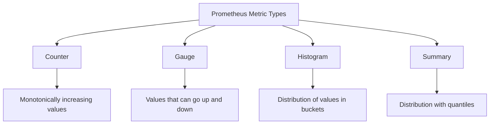

# Prometheus Client Libraries

## Introduction

When monitoring applications with Prometheus, you need a way to expose metrics from your application so Prometheus can scrape them. This is where **Prometheus client libraries** come in. These libraries are the bridge between your application code and the Prometheus monitoring system.

Client libraries allow you to instrument your code with metrics that Prometheus can understand. They handle the heavy lifting of:
- Defining metrics (counters, gauges, histograms, etc.)
- Exposing metrics via an HTTP endpoint
- Managing metric state and thread safety
- Formatting metrics in the Prometheus exposition format

In this guide, we'll explore what Prometheus client libraries are, how they work, and how to use them in different programming languages.

## Understanding Prometheus Client Libraries

Prometheus client libraries are available for many programming languages and frameworks. They all share some common characteristics while providing language-specific features.

### Core Components of Client Libraries

All Prometheus client libraries provide:

1. **Metric Types**: Implementations of the four core Prometheus metric types
2. **Registry**: A collection to track all metrics
3. **HTTP Handler**: A component to expose metrics in the Prometheus format
4. **Instrumentation Helpers**: Utilities for common use cases

### Key Metric Types



- **Counter**: Represents a cumulative value that only increases (like request count)
- **Gauge**: Represents a value that can go up or down (like memory usage)
- **Histogram**: Tracks the distribution of values within configurable buckets
- **Summary**: Similar to histogram but calculates quantiles directly

## Getting Started with Client Libraries

Let's look at how to use Prometheus client libraries in different languages. We'll start with some of the most commonly used ones.

### Python Client Library

First, install the library:

```bash
pip install prometheus_client
```

Basic usage example:

```python
from prometheus_client import Counter, Gauge, start_http_server
import time
import random

# Create metrics
REQUEST_COUNT = Counter('app_requests_total', 'Total app requests')
RANDOM_VALUE = Gauge('app_random_value', 'Random value set by the app')

# Start up the server to expose metrics
start_http_server(8000)

# Example application logic
while True:
    # Increment counter on each request simulation
    REQUEST_COUNT.inc()
    
    # Set gauge to random value
    RANDOM_VALUE.set(random.random() * 100)
    
    # Simulate request processing
    time.sleep(1)
```

When Prometheus scrapes the `/metrics` endpoint, you'll see something like:

```
# HELP app_requests_total Total app requests
# TYPE app_requests_total counter
app_requests_total 42.0
# HELP app_random_value Random value set by the app
# TYPE app_random_value gauge
app_random_value 65.43210987654321
```

### Go Client Library

Installing the library:

```bash
go get github.com/prometheus/client_golang/prometheus
go get github.com/prometheus/client_golang/prometheus/promauto
go get github.com/prometheus/client_golang/prometheus/promhttp
```

Example in Go:

```go
package main

import (
    "net/http"
    "time"

    "github.com/prometheus/client_golang/prometheus"
    "github.com/prometheus/client_golang/prometheus/promauto"
    "github.com/prometheus/client_golang/prometheus/promhttp"
)

func recordMetrics() {
    go func() {
        counter := promauto.NewCounter(prometheus.CounterOpts{
            Name: "app_requests_total",
            Help: "The total number of processed requests",
        })
        
        gauge := promauto.NewGauge(prometheus.GaugeOpts{
            Name: "app_goroutines",
            Help: "Number of goroutines that currently exist",
        })
        
        for {
            counter.Inc()
            gauge.Set(float64(runtime.NumGoroutine()))
            time.Sleep(2 * time.Second)
        }
    }()
}

func main() {
    recordMetrics()

    http.Handle("/metrics", promhttp.Handler())
    http.ListenAndServe(":2112", nil)
}
```

### Java Client Library

Adding the dependency to your `pom.xml` (for Maven):

```xml
<dependency>
    <groupId>io.prometheus</groupId>
    <artifactId>simpleclient</artifactId>
    <version>0.16.0</version>
</dependency>
<dependency>
    <groupId>io.prometheus</groupId>
    <artifactId>simpleclient_hotspot</artifactId>
    <version>0.16.0</version>
</dependency>
<dependency>
    <groupId>io.prometheus</groupId>
    <artifactId>simpleclient_httpserver</artifactId>
    <version>0.16.0</version>
</dependency>
```

Example in Java:

```java
import io.prometheus.client.Counter;
import io.prometheus.client.Gauge;
import io.prometheus.client.exporter.HTTPServer;
import io.prometheus.client.hotspot.DefaultExports;

import java.io.IOException;
import java.util.Random;

public class PrometheusExample {
    static final Counter requestsTotal = Counter.build()
            .name("app_requests_total")
            .help("Total requests.")
            .register();
            
    static final Gauge processingTime = Gauge.build()
            .name("app_processing_time_seconds")
            .help("Current processing time in seconds.")
            .register();
            
    public static void main(String[] args) throws IOException, InterruptedException {
        // Expose metrics for the JVM
        DefaultExports.initialize();
        
        // Start an HTTP server to expose metrics
        HTTPServer server = new HTTPServer(8000);
        
        Random random = new Random();
        
        // Simulation loop
        while (true) {
            // Increment the counter
            requestsTotal.inc();
            
            // Set a random processing time
            double processingTimeValue = random.nextDouble() * 10;
            processingTime.set(processingTimeValue);
            
            Thread.sleep(1000);
        }
    }
}
```

### Node.js Client Library

Installing the library:

```bash
npm install prom-client
```

Example in Node.js:

```javascript
const express = require('express');
const promClient = require('prom-client');

// Create a Registry to register the metrics
const register = new promClient.Registry();
promClient.collectDefaultMetrics({ register });

// Create custom metrics
const httpRequestCounter = new promClient.Counter({
    name: 'http_requests_total',
    help: 'Total number of HTTP requests',
    labelNames: ['method', 'status'],
    registers: [register]
});

const httpRequestDuration = new promClient.Histogram({
    name: 'http_request_duration_seconds',
    help: 'HTTP request duration in seconds',
    labelNames: ['method', 'route'],
    buckets: [0.1, 0.3, 0.5, 0.7, 1, 3, 5, 7, 10],
    registers: [register]
});

// Create an Express app
const app = express();

// Example route
app.get('/', (req, res) => {
    // Start timer
    const end = httpRequestDuration.startTimer({ method: 'GET', route: '/' });
    
    // Increment counter
    httpRequestCounter.inc({ method: 'GET', status: 200 });
    
    // Send response
    res.send('Hello World!');
    
    // End timer
    end();
});

// Metrics endpoint for Prometheus to scrape
app.get('/metrics', async (req, res) => {
    res.set('Content-Type', register.contentType);
    res.end(await register.metrics());
});

app.listen(3000, () => {
    console.log('Server is running on port 3000');
});
```

## Best Practices for Using Client Libraries

### Naming Conventions

Prometheus recommends following a consistent naming convention for metrics:

- Use a prefix related to your application: `myapp_`
- Use snake_case (lowercase with underscores)
- Include units in the metric name: `request_duration_seconds`
- Be descriptive and clear

Example:
```
http_requests_total (good)
http_requests (too generic)
```

### Labels

Labels allow you to differentiate metrics based on dimensions:

```python
# Python example
REQUEST_DURATION = Histogram(
    'http_request_duration_seconds',
    'HTTP request duration in seconds',
    ['method', 'endpoint', 'status']
)

# Track request duration
REQUEST_DURATION.labels(
    method='GET',
    endpoint='/api/users', 
    status='200'
).observe(response_time)
```

But be careful:
- Too many label combinations can cause "cardinality explosion"
- Avoid using high-cardinality labels like user IDs, emails, or URLs

### Instrumentation Patterns

Common patterns for instrumentation include:

1. **Direct Instrumentation**: Adding metrics directly to your application code
2. **Middleware Instrumentation**: Using middleware to automatically track metrics
3. **Library Instrumentation**: Using pre-built instrumentation for common libraries

Example of middleware instrumentation in Express.js:

```javascript
// Middleware to track HTTP requests
app.use((req, res, next) => {
    const start = Date.now();
    
    // The 'finish' event fires when the response is sent to the client
    res.on('finish', () => {
        const duration = Date.now() - start;
        
        // Record the metrics
        httpRequestCounter.inc({
            method: req.method,
            status: res.statusCode
        });
        
        httpRequestDuration.observe({
            method: req.method,
            route: req.route ? req.route.path : req.path
        }, duration / 1000); // Convert to seconds
    });
    
    next();
});
```

## Advanced Usage

### Custom Collectors

Sometimes you need to collect metrics that aren't simple increments or values. For this, you can create custom collectors.

Python example:

```python
from prometheus_client import Collector

class DatabaseConnectionCollector(Collector):
    def __init__(self, db_connection):
        self.db_connection = db_connection

    def collect(self):
        # Get current database connections
        active_connections = self.db_connection.get_active_connections()
        connection_gauge = GaugeMetricFamily(
            'database_connections',
            'Number of active database connections',
            labels=['db_name', 'state']
        )
        
        connection_gauge.add_metric(['main', 'active'], active_connections['active'])
        connection_gauge.add_metric(['main', 'idle'], active_connections['idle'])
        
        yield connection_gauge

# Register the custom collector
REGISTRY.register(DatabaseConnectionCollector(my_db_connection))
```

### Push Gateway Integration

When your jobs are short-lived (like batch jobs), they might not exist long enough for Prometheus to scrape them. In these cases, you can use the Prometheus Pushgateway:

```python
from prometheus_client import Counter, push_to_gateway

JOB_COUNTER = Counter('batch_jobs_total', 'Total number of batch jobs processed')

# Process batch job
def process_batch_job():
    # Do job processing
    # ...
    
    # Increment counter
    JOB_COUNTER.inc()
    
    # Push metrics to Pushgateway
    push_to_gateway('pushgateway:9091', job='batch-processor', registry=REGISTRY)
```

## Real-World Application Example

Let's look at a more complete example of instrumenting a web service.

### Web Service Instrumentation

This example shows how to instrument a Python Flask web service:

```python
from flask import Flask, request
from prometheus_client import Counter, Histogram, generate_latest, CONTENT_TYPE_LATEST
import time

app = Flask(__name__)

# Create metrics
REQUEST_COUNT = Counter(
    'app_request_count',
    'Application Request Count',
    ['method', 'endpoint', 'http_status']
)
REQUEST_LATENCY = Histogram(
    'app_request_latency_seconds',
    'Application Request Latency',
    ['method', 'endpoint']
)

@app.before_request
def before_request():
    request.start_time = time.time()

@app.after_request
def after_request(response):
    request_latency = time.time() - request.start_time
    REQUEST_LATENCY.labels(
        method=request.method,
        endpoint=request.endpoint
    ).observe(request_latency)
    
    REQUEST_COUNT.labels(
        method=request.method,
        endpoint=request.endpoint,
        http_status=response.status_code
    ).inc()
    
    return response

@app.route('/')
def hello_world():
    return 'Hello, World!'

@app.route('/slow')
def slow_endpoint():
    time.sleep(2)  # Simulate slow processing
    return 'This was a slow request!'

@app.route('/metrics')
def metrics():
    return generate_latest(), 200, {'Content-Type': CONTENT_TYPE_LATEST}

if __name__ == '__main__':
    app.run(host='0.0.0.0', port=5000)
```

### Prometheus Configuration

To scrape this application, your `prometheus.yml` would include:

```yaml
scrape_configs:
  - job_name: 'web-service'
    scrape_interval: 15s
    static_configs:
      - targets: ['webservice:5000']
```

With this setup, you could create Grafana dashboards to monitor:
- Request rates
- Error rates
- Response time distributions
- SLO/SLI compliance

## Common Issues and Troubleshooting

### Metrics Not Showing Up

If metrics aren't appearing in Prometheus:

1. **Endpoint Configuration**: Ensure the metrics endpoint is accessible
2. **Prometheus Configuration**: Check Prometheus is configured to scrape your endpoint
3. **Registry Issues**: Make sure metrics are registered correctly

### High Cardinality Problems

If you see performance issues:

1. **Review Labels**: Remove high-cardinality labels
2. **Use Buckets**: Adjust histogram buckets to be more efficient
3. **Aggregate**: Use client-side aggregation where appropriate

## Summary

Prometheus client libraries are essential tools for instrumenting your applications for monitoring with Prometheus. They provide:

- Easy integration with various programming languages
- Built-in support for Prometheus metric types (counters, gauges, histograms, summaries)
- Consistent interfaces for exposing metrics
- Thread-safe metric collection and exposure

By properly using client libraries, you can gain valuable insights into your application's performance, identify issues early, and ensure your systems are operating as expected.

## Further Resources

To continue learning about Prometheus client libraries:

1. **Official Documentation**:
   - [Prometheus Client Libraries](https://prometheus.io/docs/instrumenting/clientlibs/)
   - Language-specific documentation for [Go](https://github.com/prometheus/client_golang), [Python](https://github.com/prometheus/client_python), [Java](https://github.com/prometheus/client_java), etc.

2. **Practice Exercises**:
   - Instrument a simple web application with Prometheus metrics
   - Create a custom dashboard in Grafana to visualize your metrics
   - Implement alerting based on your application metrics

3. **Next Steps in Your Learning Path**:
   - Learn about Prometheus alerting
   - Explore more advanced PromQL queries
   - Study service discovery mechanisms for dynamic environments