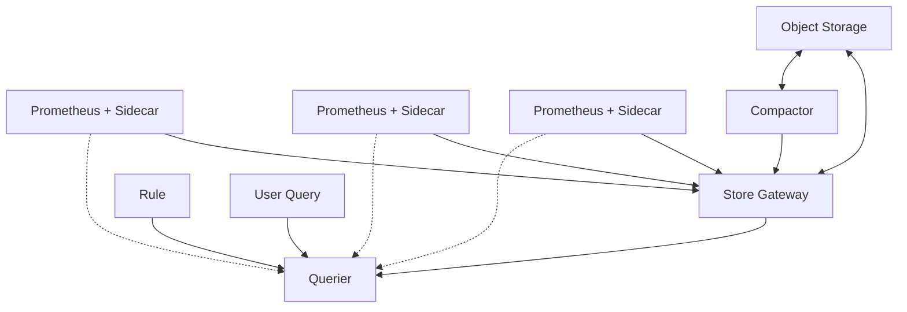

# Thanos Overview

## Introduction

Thanos is an open-source project that extends Prometheus capabilities by adding highly available, long-term storage to your monitoring setup. If you've been working with Prometheus and found yourself limited by single-node deployments or short data retention periods, Thanos provides an elegant solution to these challenges.

The name "Thanos" comes from the Greek word for "death" - symbolizing its ability to address the mortality (limitations) of standard Prometheus deployments. Just as Prometheus (in Greek mythology) gave fire to humanity, Thanos gives longevity and resilience to Prometheus monitoring systems.

## What Problems Does Thanos Solve?

Before diving into how Thanos works, let's understand the key limitations of standard Prometheus that Thanos addresses:

1. **Limited Storage Capacity**: Native Prometheus has limited local storage, making long-term data retention difficult.
2. **Lack of High Availability**: Prometheus runs as a single node with no built-in clustering.
3. **Global Query View**: Traditional setups make it hard to query across multiple Prometheus instances.
4. **Resource Limitations**: A single Prometheus server can only handle so much load and metrics.

## Thanos Architecture

Thanos extends Prometheus by adding several components that work together:



### Core Components

1. **Sidecar**: Connects to Prometheus, reads its data, and uploads it to object storage.
2. **Store Gateway**: Serves metrics from object storage.
3. **Querier**: Implements Prometheus' query API and aggregates results from multiple sources.
4. **Compactor**: Compacts, downsamples and applies retention policies on data in object storage.
5. **Ruler**: Evaluates recording and alerting rules against data in Thanos.
6. **Receiver**: Ingests data in Prometheus remote-write format and writes it to object storage.

## Setting Up Thanos with Prometheus

Let's walk through a basic setup to understand how Thanos works with Prometheus.

### Prerequisites

- Running Prometheus instance(s)
- Object storage (like AWS S3, Google Cloud Storage, MinIO)
- Basic knowledge of Kubernetes (for production deployments)

### Step 1: Deploy Prometheus with Thanos Sidecar

First, let's configure Prometheus to work with the Thanos sidecar:

```yaml
# prometheus.yaml
global:
  external_labels:
    region: us-east-1
    replica: 1
  scrape_interval: 15s

storage:
  tsdb:
    path: /prometheus
    retention: 2d  # Short local retention
    min_block_duration: 2h
    max_block_duration: 2h
```

Now, let's run Prometheus with the Thanos sidecar:

```bash
# Start Prometheus
prometheus --config.file=prometheus.yaml --storage.tsdb.path=/prometheus

# Start Thanos sidecar
thanos sidecar \
  --tsdb.path /prometheus \
  --prometheus.url http://localhost:9090 \
  --objstore.config-file=bucket.yaml
```

### Step 2: Configure Object Storage

Create a configuration file for your object storage:

```yaml
# bucket.yaml
type: S3
config:
  bucket: "thanos"
  endpoint: "s3.amazonaws.com"
  access_key: "ACCESS_KEY"
  secret_key: "SECRET_KEY"
```

### Step 3: Set Up Thanos Querier

The querier component allows you to query data across all your Prometheus servers:

```bash
thanos query \
  --store=sidecar-1:10901 \
  --store=sidecar-2:10901 \
  --store=store-gateway:10901
```

### Step 4: Deploy Store Gateway

The store gateway gives access to historical data stored in your object storage:

```bash
thanos store \
  --objstore.config-file=bucket.yaml
```

### Step 5: Set Up Compactor

The compactor processes data in your object storage for better performance:

```bash
thanos compact \
  --data-dir=/compact \
  --objstore.config-file=bucket.yaml \
  --retention.resolution-raw=30d \
  --retention.resolution-5m=90d \
  --retention.resolution-1h=1y
```

## Practical Example: High Availability Prometheus Setup

Let's see how Thanos enables a highly available Prometheus deployment:

```yaml
# docker-compose.yml
version: '3.7'

services:
  prometheus-1:
    image: prom/prometheus:v2.32.0
    volumes:
      - ./prometheus-1.yaml:/etc/prometheus/prometheus.yml
    command:
      - '--config.file=/etc/prometheus/prometheus.yml'
      - '--storage.tsdb.path=/prometheus'
      - '--web.enable-lifecycle'
    ports:
      - "9091:9090"

  prometheus-2:
    image: prom/prometheus:v2.32.0
    volumes:
      - ./prometheus-2.yaml:/etc/prometheus/prometheus.yml
    command:
      - '--config.file=/etc/prometheus/prometheus.yml'
      - '--storage.tsdb.path=/prometheus'
      - '--web.enable-lifecycle'
    ports:
      - "9092:9090"

  thanos-sidecar-1:
    image: quay.io/thanos/thanos:v0.24.0
    command:
      - 'sidecar'
      - '--tsdb.path=/prometheus'
      - '--prometheus.url=http://prometheus-1:9090'
      - '--grpc-address=0.0.0.0:10901'
      - '--http-address=0.0.0.0:10902'
      - '--objstore.config-file=/etc/thanos/bucket.yaml'
    volumes:
      - ./bucket.yaml:/etc/thanos/bucket.yaml
    depends_on:
      - prometheus-1

  thanos-sidecar-2:
    image: quay.io/thanos/thanos:v0.24.0
    command:
      - 'sidecar'
      - '--tsdb.path=/prometheus'
      - '--prometheus.url=http://prometheus-2:9090'
      - '--grpc-address=0.0.0.0:10901'
      - '--http-address=0.0.0.0:10902'
      - '--objstore.config-file=/etc/thanos/bucket.yaml'
    volumes:
      - ./bucket.yaml:/etc/thanos/bucket.yaml
    depends_on:
      - prometheus-2

  thanos-querier:
    image: quay.io/thanos/thanos:v0.24.0
    command:
      - 'query'
      - '--grpc-address=0.0.0.0:10901'
      - '--http-address=0.0.0.0:10902'
      - '--store=thanos-sidecar-1:10901'
      - '--store=thanos-sidecar-2:10901'
      - '--store=thanos-store-gateway:10901'
    ports:
      - "10902:10902"
    depends_on:
      - thanos-sidecar-1
      - thanos-sidecar-2

  thanos-store-gateway:
    image: quay.io/thanos/thanos:v0.24.0
    command:
      - 'store'
      - '--data-dir=/data'
      - '--grpc-address=0.0.0.0:10901'
      - '--http-address=0.0.0.0:10902'
      - '--objstore.config-file=/etc/thanos/bucket.yaml'
    volumes:
      - ./bucket.yaml:/etc/thanos/bucket.yaml
```

With this setup, you have:
- Two independent Prometheus servers monitoring the same targets
- Thanos sidecars uploading metrics to object storage
- A global query view through the Thanos querier
- Long-term storage via the object storage

## Querying Data in Thanos

Thanos implements the same query API as Prometheus, so you can use PromQL just as you would with Prometheus:

```
# Total number of HTTP requests across all instances
sum(http_requests_total)

# CPU usage by instance with data from the last 1 year
max by(instance) (node_cpu_seconds_total{mode="idle"})[1y:1h]
```

The key difference is that Thanos can query across:
- Multiple Prometheus instances (horizontal scaling)
- Extended time ranges (historical data in object storage)
- Deduplicated data (from redundant Prometheus servers)

## Production Considerations

When deploying Thanos in production, consider the following:

1. **Resource Requirements**: Different components have varying resource needs:
   - Querier: High memory for concurrent queries
   - Store Gateway: Memory based on number of blocks
   - Compactor: CPU intensive during compaction

2. **Network Traffic**: Object storage can generate significant egress costs:
   - Use caching effectively
   - Consider placement of components to minimize cross-region traffic

3. **Security**:
   - Secure access to object storage
   - Implement TLS for all Thanos component communications
   - Use authentication for Thanos API endpoints

4. **Data Retention**:
   - Configure appropriate retention policies
   - Balance storage costs against data availability needs

## Alternatives and Comparison

How does Thanos compare to other solutions?

| Feature | Thanos | Cortex | M3DB | VictoriaMetrics |
|---------|--------|--------|------|-----------------|
| Architecture | Sidecars + Components | Microservices | Database | Single Binary/Cluster |
| Storage | Object Storage | Various | Custom | Various |
| HA | Yes | Yes | Yes | Yes |
| Complexity | Medium | High | High | Low |
| Prometheus Compatibility | Native | Native | Partial | High |

## Summary

Thanos extends Prometheus with:
- Long-term metrics storage using object storage
- High availability through redundant Prometheus instances
- Global query view across multiple Prometheus servers
- Downsampling for efficient long-term data storage

These capabilities allow you to build a robust, scalable monitoring system that can grow with your infrastructure while maintaining the familiar Prometheus experience.

## Additional Resources

- [Official Thanos Documentation](https://thanos.io/tip/thanos/getting-started.md/)
- [Thanos GitHub Repository](https://github.com/thanos-io/thanos)
- [PromCon Talks on Thanos](https://www.youtube.com/results?search_query=promcon+thanos)

## Exercises

1. Set up a basic Thanos deployment with two Prometheus instances and query data across both.
2. Configure Thanos to store metrics in MinIO (a self-hosted S3-compatible object store).
3. Write a recording rule in Thanos Ruler and verify it's working.
4. Create a Grafana dashboard that visualizes data from your Thanos setup.
5. Simulate a Prometheus outage and verify that historical data remains available through Thanos.