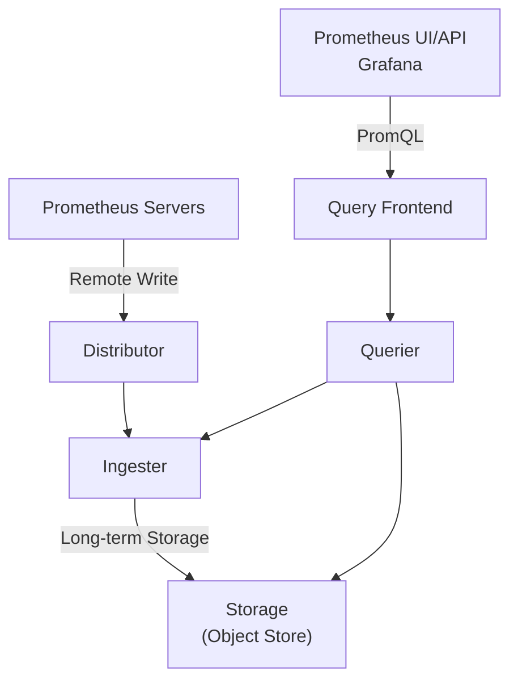

# Cortex Overview

## Introduction

Cortex is an integral component of the Prometheus ecosystem that addresses some of the core limitations of vanilla Prometheus. While Prometheus excels at collecting and storing metrics for short to medium durations, it wasn't designed for horizontal scalability, high availability, or long-term storage. This is where Cortex steps in.

Cortex provides a horizontally scalable, highly available, multi-tenant, long-term storage solution for Prometheus metrics. It allows you to scale your monitoring system beyond the capabilities of a single Prometheus server, making it suitable for large organizations with extensive infrastructure monitoring needs.

## What Problems Does Cortex Solve?

Before diving into how Cortex works, let's understand the challenges it addresses:

1. **Scalability**: A single Prometheus server can handle millions of time series, but has limits when scaling beyond that.
2. **High Availability**: Vanilla Prometheus offers limited high availability options.
3. **Long-term Storage**: Prometheus is primarily designed for short to medium-term storage (typically weeks).
4. **Multi-tenancy**: Prometheus doesn't natively support isolation between different teams or services.

## Cortex Architecture

Cortex is built as a set of microservices that can be deployed and scaled independently. This architecture provides flexibility in how you deploy and operate Cortex.



### Key Components

1. **Distributor**: Receives metrics from Prometheus servers via the remote_write API, validates and splits them by tenant, and forwards them to Ingesters.

2. **Ingester**: Responsible for writing metrics to storage. It holds metrics in memory and flushes them to long-term storage periodically.

3. **Storage**: Cortex supports various backends including Amazon S3, Google Cloud Storage, Microsoft Azure, and local filesystems.

4. **Query Frontend**: Receives PromQL queries, queues them, and dispatches them to Queriers.

5. **Querier**: Evaluates PromQL queries by fetching data from Ingesters and long-term storage.

## Setting Up Cortex with Prometheus

Let's look at how to integrate Prometheus with Cortex. The first step is to configure Prometheus to remote_write metrics to Cortex.

Here's a basic configuration example for Prometheus:

```yaml
global:
  scrape_interval: 15s
  evaluation_interval: 15s

remote_write:
  - url: "http://cortex-distributor:9009/api/v1/push"
    basic_auth:
      username: "user"
      password: "password"

scrape_configs:
  - job_name: 'prometheus'
    static_configs:
      - targets: ['localhost:9090']
```

This configuration tells Prometheus to send metrics to the Cortex distributor every time it scrapes targets.

## Deploying Cortex with Docker Compose

Let's set up a simple Cortex deployment using Docker Compose for testing purposes:

```yaml
version: '3'

services:
  cortex:
    image: cortexproject/cortex:v1.13.0
    command: -config.file=/etc/cortex/config.yaml
    ports:
      - "9009:9009"  # Distributor
      - "9000:9000"  # API and UI
    volumes:
      - ./cortex-config.yaml:/etc/cortex/config.yaml
      - cortex-data:/data

  grafana:
    image: grafana/grafana:latest
    ports:
      - "3000:3000"
    environment:
      - GF_AUTH_ANONYMOUS_ENABLED=true
      - GF_AUTH_ANONYMOUS_ORG_ROLE=Admin
    volumes:
      - grafana-data:/var/lib/grafana

volumes:
  cortex-data:
  grafana-data:
```

And a minimal Cortex configuration file (`cortex-config.yaml`):

```yaml
auth_enabled: false

server:
  http_listen_port: 9009
  grpc_listen_port: 9095

ingester:
  lifecycler:
    ring:
      kvstore:
        store: inmemory
      replication_factor: 1
    final_sleep: 0s
  chunk_idle_period: 5m
  chunk_retain_period: 30s

storage:
  engine: blocks

blocks_storage:
  backend: filesystem
  filesystem:
    dir: /data/blocks
  tsdb:
    dir: /data/tsdb

compactor:
  data_dir: /data/compactor
  shared_store: filesystem
```

## Querying Metrics in Cortex

Once you have Prometheus sending metrics to Cortex, you can query them using the same PromQL language you're familiar with. Cortex provides a compatible API endpoint.

You can configure Grafana to use Cortex as a data source:

1. Go to Grafana's "Data Sources" configuration
2. Add a new Prometheus data source
3. Set the URL to `http://cortex:9009/api/prom`
4. Save and test the connection

Here's an example PromQL query to monitor HTTP request rates:

```
sum(rate(http_requests_total[5m])) by (service, endpoint)
```

The output will show the rate of HTTP requests grouped by service and endpoint:

| service | endpoint | value |
|---------|----------|-------|
| api     | /users   | 42.5  |
| api     | /login   | 15.2  |
| web     | /home    | 78.9  |

## Multi-tenancy in Cortex

One of Cortex's key features is multi-tenancy, which allows different teams or services to use the same Cortex cluster without seeing each other's metrics.

To enable multi-tenancy, you need to:

1. Enable authentication in the Cortex configuration:

```yaml
auth_enabled: true

auth:
  type: enterprise
```

2. Configure Prometheus to include a tenant ID in remote_write:

```yaml
remote_write:
  - url: "http://cortex-distributor:9009/api/v1/push"
    headers:
      X-Scope-OrgID: "team-platform"
```

3. Include the same header when querying:

```bash
curl -H "X-Scope-OrgID: team-platform" http://cortex:9009/api/v1/query?query=up
```

## Scaling Cortex

Cortex is designed to be horizontally scalable. Each component can be scaled independently based on your needs. For instance, if you have high ingestion rates, you can scale up the Distributor and Ingester components:

```yaml
# kubernetes deployment example
apiVersion: apps/v1
kind: Deployment
metadata:
  name: cortex-distributor
spec:
  replicas: 3  # Scale to 3 instances
  # ...rest of deployment config
```

## Monitoring Cortex

Cortex exposes its own metrics in Prometheus format, which allows you to monitor Cortex with Prometheus itself. Here are some important metrics to watch:

- `cortex_distributor_received_samples_total`: Total number of samples received by the distributor
- `cortex_ingester_memory_series`: Current number of series in memory
- `cortex_query_frontend_queries_total`: Total number of queries handled by the query frontend

A simple alerting rule might look like:

```yaml
groups:
- name: cortex
  rules:
  - alert: CortexIngesterHighMemory
    expr: cortex_ingester_memory_series > 1500000
    for: 10m
    labels:
      severity: warning
    annotations:
      description: "Cortex ingester {{ $labels.instance }} has high memory usage"
```

## Comparison with Other Solutions

| Feature | Prometheus | Cortex | Thanos | Victoria Metrics |
|---------|------------|--------|--------|------------------|
| Scalability | Limited | High | High | High |
| Multi-tenancy | No | Yes | Limited | Yes |
| Long-term storage | Limited | Yes | Yes | Yes |
| Complexity | Low | High | Medium | Medium |
| Query Performance | Fast | Variable | Variable | Fast |

## Practical Example: Monitoring Microservices

Let's consider a scenario where you have dozens of microservices and want to set up scalable monitoring. Here's how you might approach it with Cortex:

1. Deploy a Prometheus server in each environment (staging, production)
2. Configure each Prometheus server to scrape local services and remote_write to a central Cortex cluster
3. Set up Grafana to query Cortex for unified dashboards across all environments

```yaml
# prometheus.yaml for production environment
global:
  scrape_interval: 15s
  external_labels:
    env: production

remote_write:
  - url: "http://cortex:9009/api/v1/push"
    headers:
      X-Scope-OrgID: "production"

scrape_configs:
  - job_name: 'microservices'
    kubernetes_sd_configs:
      - role: pod
    relabel_configs:
      - source_labels: [__meta_kubernetes_pod_annotation_prometheus_io_scrape]
        action: keep
        regex: true
```

With this setup:
- Each Prometheus server handles local metric collection
- Cortex provides long-term storage and unified querying
- Different environments are separated by tenant IDs

## Summary

Cortex extends Prometheus with horizontal scalability, high availability, multi-tenancy, and long-term storage capabilities, making it suitable for large-scale monitoring systems. It maintains compatibility with the Prometheus query language and ecosystem, allowing for a smooth integration.

The key benefits of Cortex include:
- Scalability beyond a single Prometheus server
- Long-term storage of metrics
- Multi-tenant isolation for different teams or services
- High availability for mission-critical monitoring

## Further Resources

To deepen your understanding of Cortex, consider these resources:

1. [Official Cortex Documentation](https://cortexmetrics.io/docs/)
2. [Cortex GitHub Repository](https://github.com/cortexproject/cortex)
3. [CNCF Webinar: Introduction to Cortex](https://www.cncf.io/online-programs/introduction-to-cortex/)

## Exercises

1. Set up a local Cortex instance using Docker Compose and configure Prometheus to send metrics to it.
2. Create a Grafana dashboard that queries metrics from Cortex.
3. Experiment with multi-tenancy by setting up multiple Prometheus servers with different tenant IDs.
4. Benchmark Cortex query performance compared to direct Prometheus queries.
5. Implement alerting based on metrics stored in Cortex.