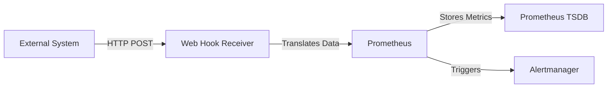
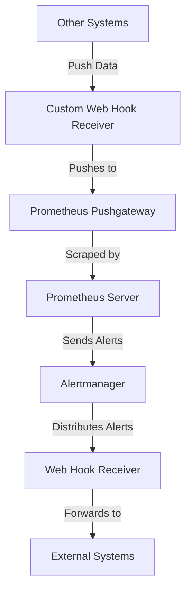

# Prometheus Web Hook Receiver

## Introduction

Prometheus has become a cornerstone in modern monitoring infrastructures, but sometimes you need to connect it with external systems that don't natively integrate with Prometheus. This is where the Prometheus Web Hook Receiver comes into play. 

Web Hook Receivers allow external systems to push metrics and alerts into your Prometheus ecosystem through HTTP endpoints. This creates a bridge between Prometheus and various other tools, extending Prometheus's reach beyond its pull-based architecture.

In this guide, we'll explore what Web Hook Receivers are, how they work within the Prometheus ecosystem, and how to implement them in practical scenarios.

## What are Web Hook Receivers?

Web Hook Receivers are HTTP endpoints that accept incoming webhook requests from external systems. These receivers translate the incoming data into a format that Prometheus can understand and process.



While Prometheus primarily uses a pull-based model (where it scrapes metrics from targets), web hook receivers add push capabilities, enabling integration with systems that can't be directly scraped.

## Component Position in the Prometheus Ecosystem

Web Hook Receivers typically function as part of the Alertmanager's ecosystem, but can also be standalone services that feed data into Prometheus through exporters or the Pushgateway.



## Setting Up a Basic Web Hook Receiver

Let's walk through creating a simple web hook receiver using Go. This receiver will accept HTTP POST requests and forward the alert data to another system.

### Step 1: Create a Basic Server

```go
package main

import (
    "encoding/json"
    "fmt"
    "io/ioutil"
    "log"
    "net/http"
)

func main() {
    // Define the webhook handler
    http.HandleFunc("/webhook", webhookHandler)
    
    // Start the server
    fmt.Println("Starting webhook receiver on :8080...")
    log.Fatal(http.ListenAndServe(":8080", nil))
}

func webhookHandler(w http.ResponseWriter, r *http.Request) {
    // Only accept POST requests
    if r.Method != http.MethodPost {
        http.Error(w, "Method not allowed", http.StatusMethodNotAllowed)
        return
    }
    
    // Read the request body
    body, err := ioutil.ReadAll(r.Body)
    if err != nil {
        http.Error(w, "Error reading request body", http.StatusInternalServerError)
        return
    }
    
    // Print the received webhook payload
    fmt.Println("Received webhook payload:")
    fmt.Println(string(body))
    
    // Respond with success
    w.WriteHeader(http.StatusOK)
    w.Write([]byte("Webhook received successfully"))
}
```

### Step 2: Parse and Process Alertmanager Webhooks

Now let's enhance our receiver to understand the Alertmanager webhook format:

```go
// Define AlertManager webhook structure
type AlertManagerNotification struct {
    Version           string            `json:"version"`
    GroupKey          string            `json:"groupKey"`
    Status            string            `json:"status"`
    Receiver          string            `json:"receiver"`
    GroupLabels       map[string]string `json:"groupLabels"`
    CommonLabels      map[string]string `json:"commonLabels"`
    CommonAnnotations map[string]string `json:"commonAnnotations"`
    ExternalURL       string            `json:"externalURL"`
    Alerts            []Alert           `json:"alerts"`
}

type Alert struct {
    Status       string            `json:"status"`
    Labels       map[string]string `json:"labels"`
    Annotations  map[string]string `json:"annotations"`
    StartsAt     string            `json:"startsAt"`
    EndsAt       string            `json:"endsAt"`
    GeneratorURL string            `json:"generatorURL"`
    Fingerprint  string            `json:"fingerprint"`
}

func webhookHandler(w http.ResponseWriter, r *http.Request) {
    if r.Method != http.MethodPost {
        http.Error(w, "Method not allowed", http.StatusMethodNotAllowed)
        return
    }
    
    body, err := ioutil.ReadAll(r.Body)
    if err != nil {
        http.Error(w, "Error reading request body", http.StatusInternalServerError)
        return
    }
    
    // Parse the alert notification
    var notification AlertManagerNotification
    if err := json.Unmarshal(body, &notification); err != nil {
        http.Error(w, "Error parsing JSON", http.StatusBadRequest)
        fmt.Println("Error parsing JSON:", err)
        return
    }
    
    // Process the alerts
    fmt.Printf("Received %d alerts with status: %s
", len(notification.Alerts), notification.Status)
    for i, alert := range notification.Alerts {
        fmt.Printf("Alert %d: %s - %s
", i+1, alert.Labels["alertname"], alert.Annotations["description"])
    }
    
    // Forward the alerts to another system (example)
    // forwardToExternalSystem(notification)
    
    w.WriteHeader(http.StatusOK)
    w.Write([]byte("Alerts processed successfully"))
}
```

### Step 3: Test with Sample Data

You can test your webhook receiver using curl:

```bash
curl -X POST -H "Content-Type: application/json" -d '{
  "version": "4",
  "groupKey": "{}:{alertname=\"InstanceDown\"}",
  "status": "firing",
  "receiver": "webhook",
  "groupLabels": {
    "alertname": "InstanceDown"
  },
  "commonLabels": {
    "alertname": "InstanceDown",
    "instance": "localhost:9090",
    "job": "prometheus"
  },
  "commonAnnotations": {
    "description": "Instance localhost:9090 is down",
    "summary": "Instance down"
  },
  "externalURL": "http://localhost:9093",
  "alerts": [
    {
      "status": "firing",
      "labels": {
        "alertname": "InstanceDown",
        "instance": "localhost:9090",
        "job": "prometheus"
      },
      "annotations": {
        "description": "Instance localhost:9090 has been down for more than 1 minute",
        "summary": "Instance down"
      },
      "startsAt": "2023-04-01T12:00:00.000Z",
      "endsAt": "0001-01-01T00:00:00.000Z",
      "generatorURL": "http://localhost:9090",
      "fingerprint": "c1b5ce88d5b1a734"
    }
  ]
}' http://localhost:8080/webhook
```

Output from the server:
```
Received 1 alerts with status: firing
Alert 1: InstanceDown - Instance localhost:9090 has been down for more than 1 minute
```

## Configuring Alertmanager to Send Webhooks

Now that we have a receiver, let's configure Alertmanager to send alerts to it:

1. Edit your Alertmanager configuration file:

```yaml
global:
  resolve_timeout: 5m

route:
  group_by: ['alertname']
  group_wait: 10s
  group_interval: 10s
  repeat_interval: 1h
  receiver: 'webhook-receiver'

receivers:
- name: 'webhook-receiver'
  webhook_configs:
  - url: 'http://localhost:8080/webhook'
    send_resolved: true
```

2. Restart Alertmanager to apply the configuration.

## Real-World Examples

### Example 1: Integrating with Slack

Let's modify our webhook receiver to forward alerts to Slack:

```go
func forwardToSlack(notification AlertManagerNotification) error {
    // Create Slack message
    message := SlackMessage{
        Text: fmt.Sprintf("Alert Status: %s", notification.Status),
        Attachments: []SlackAttachment{},
    }
    
    // Add each alert as an attachment
    for _, alert := range notification.Alerts {
        color := "danger"
        if alert.Status == "resolved" {
            color = "good"
        }
        
        attachment := SlackAttachment{
            Color: color,
            Title: alert.Labels["alertname"],
            Text:  alert.Annotations["description"],
            Fields: []SlackField{
                {Title: "Status", Value: alert.Status, Short: true},
                {Title: "Instance", Value: alert.Labels["instance"], Short: true},
                {Title: "Started", Value: alert.StartsAt, Short: false},
            },
        }
        
        message.Attachments = append(message.Attachments, attachment)
    }
    
    // Convert to JSON
    jsonData, err := json.Marshal(message)
    if err != nil {
        return err
    }
    
    // Send to Slack webhook URL
    slackWebhookURL := "https://hooks.slack.com/services/YOUR/SLACK/WEBHOOK"
    resp, err := http.Post(slackWebhookURL, "application/json", bytes.NewBuffer(jsonData))
    if err != nil {
        return err
    }
    defer resp.Body.Close()
    
    if resp.StatusCode != http.StatusOK {
        return fmt.Errorf("slack returned non-200 status code: %d", resp.StatusCode)
    }
    
    return nil
}

type SlackMessage struct {
    Text        string            `json:"text"`
    Attachments []SlackAttachment `json:"attachments"`
}

type SlackAttachment struct {
    Color  string       `json:"color"`
    Title  string       `json:"title"`
    Text   string       `json:"text"`
    Fields []SlackField `json:"fields"`
}

type SlackField struct {
    Title string `json:"title"`
    Value string `json:"value"`
    Short bool   `json:"short"`
}
```

### Example 2: Creating a Custom Metrics Webhook

This example shows how to create a webhook that receives custom metrics and pushes them to Prometheus Pushgateway:

```go
package main

import (
    "bytes"
    "encoding/json"
    "fmt"
    "io/ioutil"
    "log"
    "net/http"
    "strings"
)

type MetricPayload struct {
    Name   string            `json:"name"`
    Value  float64           `json:"value"`
    Type   string            `json:"type"`
    Labels map[string]string `json:"labels"`
}

func main() {
    http.HandleFunc("/metrics", metricsHandler)
    fmt.Println("Starting metrics webhook receiver on :8081...")
    log.Fatal(http.ListenAndServe(":8081", nil))
}

func metricsHandler(w http.ResponseWriter, r *http.Request) {
    if r.Method != http.MethodPost {
        http.Error(w, "Method not allowed", http.StatusMethodNotAllowed)
        return
    }
    
    body, err := ioutil.ReadAll(r.Body)
    if err != nil {
        http.Error(w, "Error reading request body", http.StatusInternalServerError)
        return
    }
    
    var metric MetricPayload
    if err := json.Unmarshal(body, &metric); err != nil {
        http.Error(w, "Error parsing JSON", http.StatusBadRequest)
        return
    }
    
    // Forward to Pushgateway
    err = sendToPushgateway(metric)
    if err != nil {
        http.Error(w, fmt.Sprintf("Error sending to Pushgateway: %v", err), http.StatusInternalServerError)
        return
    }
    
    w.WriteHeader(http.StatusOK)
    w.Write([]byte("Metric processed successfully"))
}

func sendToPushgateway(metric MetricPayload) error {
    // Build labels string
    var labelPairs []string
    for k, v := range metric.Labels {
        labelPairs = append(labelPairs, fmt.Sprintf("%s=\"%s\"", k, v))
    }
    
    // Create Prometheus metric format
    promFormat := fmt.Sprintf("%s{%s} %g
", 
        metric.Name, 
        strings.Join(labelPairs, ","), 
        metric.Value)
    
    // Send to Pushgateway
    pushgatewayURL := fmt.Sprintf("http://localhost:9091/metrics/job/%s", metric.Name)
    resp, err := http.Post(pushgatewayURL, "text/plain", bytes.NewBufferString(promFormat))
    if err != nil {
        return err
    }
    defer resp.Body.Close()
    
    if resp.StatusCode != http.StatusOK {
        return fmt.Errorf("pushgateway returned status code: %d", resp.StatusCode)
    }
    
    return nil
}
```

Example input:
```json
{
  "name": "api_requests_total",
  "value": 42,
  "type": "counter",
  "labels": {
    "endpoint": "/api/data",
    "method": "GET",
    "status": "200"
  }
}
```

## Security Considerations

When implementing web hook receivers, consider these security best practices:

1. **Authentication**: Implement token-based authentication for your webhook endpoints
2. **TLS/SSL**: Use HTTPS to encrypt data in transit
3. **Input Validation**: Validate all incoming payloads to prevent malicious data
4. **Rate Limiting**: Implement rate limiting to prevent abuse
5. **IP Whitelisting**: Restrict access to your webhook endpoints by IP address

Example implementation of token-based authentication:

```go
func authenticatedWebhookHandler(w http.ResponseWriter, r *http.Request) {
    // Get the token from the Authorization header
    token := r.Header.Get("Authorization")
    if token == "" {
        http.Error(w, "Authorization header missing", http.StatusUnauthorized)
        return
    }
    
    // Remove "Bearer " prefix if present
    token = strings.TrimPrefix(token, "Bearer ")
    
    // Validate the token (replace with your actual validation logic)
    validToken := "your-secret-token-here"
    if token != validToken {
        http.Error(w, "Invalid token", http.StatusUnauthorized)
        return
    }
    
    // If token is valid, proceed with normal webhook handling
    webhookHandler(w, r)
}
```

## Advanced Features

### Adding Support for Different Alert Formats

Your webhook receiver might need to handle alerts from various systems. Here's how you can detect and process different formats:

```go
func multiFormatWebhookHandler(w http.ResponseWriter, r *http.Request) {
    if r.Method != http.MethodPost {
        http.Error(w, "Method not allowed", http.StatusMethodNotAllowed)
        return
    }
    
    body, err := ioutil.ReadAll(r.Body)
    if err != nil {
        http.Error(w, "Error reading request body", http.StatusInternalServerError)
        return
    }
    
    // Try to determine the format based on the Content-Type header or payload structure
    contentType := r.Header.Get("Content-Type")
    
    switch {
    case strings.Contains(contentType, "application/json"):
        // Try to parse as various known formats
        if isAlertManagerFormat(body) {
            handleAlertManagerWebhook(body, w)
        } else if isGrafanaAlertFormat(body) {
            handleGrafanaAlertWebhook(body, w)
        } else if isCustomMetricFormat(body) {
            handleCustomMetricWebhook(body, w)
        } else {
            http.Error(w, "Unknown JSON format", http.StatusBadRequest)
        }
    case strings.Contains(contentType, "application/x-www-form-urlencoded"):
        handleFormWebhook(r, w)
    default:
        http.Error(w, "Unsupported content type", http.StatusUnsupportedMediaType)
    }
}

func isAlertManagerFormat(body []byte) bool {
    var data map[string]interface{}
    if err := json.Unmarshal(body, &data); err != nil {
        return false
    }
    
    // Check for AlertManager-specific fields
    _, hasVersion := data["version"]
    _, hasAlerts := data["alerts"]
    _, hasStatus := data["status"]
    
    return hasVersion && hasAlerts && hasStatus
}
```

### Implementing Retries for Reliability

To make your webhook receiver more reliable, implement a retry mechanism:

```go
func processWithRetry(notification AlertManagerNotification) {
    const maxRetries = 3
    const retryDelay = 5 * time.Second
    
    for attempt := 1; attempt <= maxRetries; attempt++ {
        err := forwardToExternalSystem(notification)
        if err == nil {
            // Success, no need to retry
            fmt.Printf("Successfully processed alert on attempt %d
", attempt)
            return
        }
        
        fmt.Printf("Attempt %d failed: %v
", attempt, err)
        
        if attempt < maxRetries {
            fmt.Printf("Retrying in %v...
", retryDelay)
            time.Sleep(retryDelay)
        }
    }
    
    fmt.Printf("Failed to process alert after %d attempts
", maxRetries)
    // Could also implement a dead letter queue here
}
```

## Summary

Prometheus Web Hook Receivers provide a flexible way to integrate external systems with your Prometheus monitoring stack. By creating custom webhook endpoints, you can:

1. Receive and process alerts from Alertmanager
2. Forward metrics and alerts to external systems
3. Accept metrics from systems that can't be directly scraped
4. Create bridges between different monitoring ecosystems

Remember these key points when implementing webhook receivers:

- Focus on security with authentication and encryption
- Implement proper error handling and retries
- Validate all incoming payloads
- Consider the format and structure of data required by target systems

By using webhook receivers effectively, you can extend Prometheus beyond its pull-based architecture and create a more comprehensive monitoring solution.

## Additional Resources

- [Prometheus Alertmanager Documentation](https://prometheus.io/docs/alerting/latest/alertmanager/)
- [Prometheus Pushgateway](https://prometheus.io/docs/instrumenting/pushing/)
- [Webhook Security Best Practices](https://webhooks.fyi/)

## Exercises

1. Create a basic webhook receiver that logs all incoming alerts to a file
2. Modify the receiver to send alerts to different destinations based on alert labels
3. Implement a webhook receiver that translates Prometheus alerts to another alerting system's format
4. Create a web interface to view the last 10 alerts received by your webhook
5. Implement authentication and rate limiting for your webhook receiver