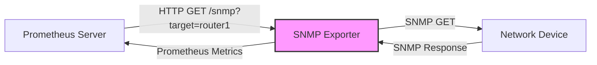

# SNMP Exporter

## Introduction

The SNMP Exporter is a crucial component in the Prometheus ecosystem that allows you to monitor devices and systems that support the Simple Network Management Protocol (SNMP) but don't natively expose Prometheus metrics. SNMP is a widely used protocol for collecting information from and managing network devices like routers, switches, servers, printers, and various IoT devices.

In modern infrastructure monitoring, Prometheus has become the gold standard for metrics collection and alerting. However, many legacy systems and network devices don't support Prometheus's pull-based metrics model. The SNMP Exporter bridges this gap by acting as a translator between the SNMP protocol and Prometheus's metrics format.

## Why SNMP Exporter?

Before diving into implementation details, let's understand why the SNMP Exporter is valuable:

1. **Legacy Integration**: Enables monitoring of older devices that only speak SNMP
2. **Unified Monitoring**: Brings all your monitoring data into a single Prometheus system
3. **Transformation**: Converts SNMP's hierarchical data model into Prometheus's flat metrics format
4. **Scalability**: Can monitor hundreds of SNMP-enabled devices from a single exporter instance

## How SNMP Exporter Works

The SNMP Exporter works by:

1. Accepting HTTP requests from Prometheus
2. Using the parameters in those requests to query SNMP-enabled devices
3. Translating the SNMP responses into Prometheus metrics format
4. Returning these metrics to Prometheus

Here's a diagram showing this flow:



## Installation and Setup

### Prerequisites

Before installing SNMP Exporter, ensure you have:

- A running Prometheus server
- Network access to your SNMP-enabled devices
- Basic knowledge of SNMP concepts (OIDs, MIBs, community strings)
- Go installed (if building from source)

### Installation Methods

#### Method 1: Using Precompiled Binaries

The simplest way to get started is by downloading precompiled binaries:

```bash
# Download the latest release (check for the newest version)
wget https://github.com/prometheus/snmp_exporter/releases/download/v0.21.0/snmp_exporter-0.21.0.linux-amd64.tar.gz

# Extract the archive
tar -xzvf snmp_exporter-0.21.0.linux-amd64.tar.gz

# Navigate to the directory
cd snmp_exporter-0.21.0.linux-amd64/
```

#### Method 2: Building from Source

For more control or to get the latest features:

```bash
# Clone the repository
git clone https://github.com/prometheus/snmp_exporter.git

# Navigate to the directory
cd snmp_exporter

# Build the binary
make build
```

### Basic Configuration

The SNMP Exporter requires a configuration file called `snmp.yml`. This file defines what SNMP metrics to collect and how to transform them.

Creating a custom `snmp.yml` from scratch can be complex due to the need to translate MIBs. Fortunately, the exporter comes with a generator tool to help with this process.

Here's a minimal example of an `snmp.yml` file:

```yaml
# Example snmp.yml configuration
modules:
  router:
    walk:
      - 1.3.6.1.2.1.2.2  # Interface table
      - 1.3.6.1.2.1.31.1.1.1  # Interface counters
    metrics:
      - name: ifDescr
        oid: 1.3.6.1.2.1.2.2.1.2
        type: DisplayString
        indexes:
          - labelname: ifIndex
            type: gauge
        lookups:
          - labels: [ifIndex]
            labelname: ifDescr
            type: DisplayString
      - name: ifOperStatus
        oid: 1.3.6.1.2.1.2.2.1.8
        type: gauge
        indexes:
          - labelname: ifIndex
            type: gauge
        lookups:
          - labels: [ifIndex]
            labelname: ifDescr
            type: DisplayString
```

## Running SNMP Exporter

Once you have the binary and configuration file, you can start the exporter:

```bash
# Start the exporter with the default configuration
./snmp_exporter

# Or specify a custom configuration file
./snmp_exporter --config.file=snmp.yml
```

By default, the exporter listens on port 9116. You can verify it's working by accessing:

```
http://localhost:9116/snmp?target=192.168.1.1&module=router
```

This will query the device at 192.168.1.1 using the "router" module defined in your configuration.

## Generating Configuration with SNMP Generator

Creating the `snmp.yml` manually is challenging. The SNMP Exporter includes a generator tool that converts MIB files into the required configuration format:

```bash
# Navigate to the generator directory
cd generator

# Install dependencies (first time only)
go get -d

# Build the generator
make build

# Create a generator.yml file
cat > generator.yml << EOF
modules:
  router:
    walk:
      - 1.3.6.1.2.1.2  # Interfaces
      - 1.3.6.1.2.1.31.1.1.1  # Counters
    lookups:
      - source_indexes: [ifIndex]
        lookup: ifAlias
      - source_indexes: [ifIndex]
        lookup: ifDescr
EOF

# Run the generator
./generator generate
```

This will create an `snmp.yml` file that you can use with the exporter.

## Configuring Prometheus to Scrape SNMP Devices

Once your SNMP Exporter is running, configure Prometheus to scrape it. Add this to your `prometheus.yml`:

```yaml
scrape_configs:
  - job_name: 'snmp'
    static_configs:
      - targets:
        - 192.168.1.1  # SNMP device IP
        - 192.168.1.2  # Another SNMP device
    metrics_path: /snmp
    params:
      module: [router]  # Use the module name from your snmp.yml
    relabel_configs:
      - source_labels: [__address__]
        target_label: __param_target
      - source_labels: [__param_target]
        target_label: instance
      - target_label: __address__
        replacement: 127.0.0.1:9116  # SNMP Exporter address
```

This configuration:
1. Creates a job called "snmp"
2. Defines which SNMP devices to monitor
3. Uses relabeling to pass the device IP as a parameter to the exporter
4. Directs all queries to your SNMP Exporter instead of trying to scrape the devices directly

## Real-World Example: Monitoring Network Switches

Let's see a practical example of monitoring network switches:

### Step 1: Create a switch-specific module in generator.yml

```yaml
modules:
  cisco_switch:
    walk:
      - 1.3.6.1.2.1.2.2  # Interfaces
      - 1.3.6.1.2.1.31.1.1  # High capacity interface counters
      - 1.3.6.1.2.1.47.1.1.1.1.2  # Entity names
      - 1.3.6.1.4.1.9.9.46.1.6.1.1.14  # Cisco VLAN membership
    lookups:
      - source_indexes: [ifIndex]
        lookup: ifAlias
      - source_indexes: [ifIndex]
        lookup: ifDescr
```

### Step 2: Generate the configuration and start the exporter

```bash
./generator generate
mv snmp.yml ../
cd ..
./snmp_exporter
```

### Step 3: Configure Prometheus

```yaml
scrape_configs:
  - job_name: 'network_devices'
    static_configs:
      - targets:
        - 192.168.1.10  # Core switch
        - 192.168.1.11  # Edge switch
    metrics_path: /snmp
    params:
      module: [cisco_switch]
    relabel_configs:
      - source_labels: [__address__]
        target_label: __param_target
      - source_labels: [__param_target]
        target_label: instance
      - target_label: __address__
        replacement: monitoring.example.com:9116  # SNMP Exporter address
```

### Step 4: Create useful dashboards in Grafana

Once you're collecting SNMP metrics, you can create dashboards to visualize:

- Interface traffic (bits/s in and out)
- Error rates and packet drops
- CPU and memory utilization
- Power supply status
- Temperature sensors

## Advanced Topics

### Authentication and Security

SNMP v3 provides authentication and encryption. Configure it in your `snmp.yml`:

```yaml
modules:
  secure_router:
    auth:
      security_level: authPriv
      username: snmp_user
      password: auth_password
      auth_protocol: SHA
      priv_protocol: AES
      priv_password: priv_password
    walk:
      - 1.3.6.1.2.1.2.2
    # ...metrics configuration...
```

### High-Cardinality Handling

SNMP devices can expose thousands of metrics. To prevent overwhelming Prometheus:

1. Be selective about which OIDs you walk
2. Use metric filters to exclude unnecessary information
3. Consider using federation or recording rules to aggregate data

### Performance Tuning

For large deployments:

1. Increase timeouts for devices with slow responses:
   ```yaml
   modules:
     slow_device:
       timeout: 10s
       # ...other configuration...
   ```

2. Adjust the SNMP retries for unreliable networks:
   ```yaml
   modules:
     flaky_device:
       retries: 2
       # ...other configuration...
   ```

3. Consider running multiple SNMP Exporter instances if monitoring hundreds of devices

## Troubleshooting Common Issues

### Problem: No metrics appear when scraping

**Solution**: Verify that:
- Your SNMP community string is correct
- The device is reachable (try an SNMP walk using `snmpwalk` utility)
- Firewalls allow SNMP traffic (UDP port 161)

### Problem: High cardinality alerts from Prometheus

**Solution**: Limit the OIDs you're collecting or use the `max_repetitions` setting:

```yaml
modules:
  big_switch:
    max_repetitions: 10  # Default is 25
    walk:
      # Limit your OIDs here
```

### Problem: Slow scrape times

**Solution**:
- Reduce the number of metrics collected
- Increase scrape interval in Prometheus
- Check network latency to the devices

## Summary

The SNMP Exporter is a powerful tool that bridges the gap between traditional network monitoring and modern, Prometheus-based observability. By following the steps in this guide, you can:

1. Install and configure the SNMP Exporter
2. Generate appropriate configurations for your devices
3. Configure Prometheus to collect metrics from SNMP-enabled devices
4. Visualize and alert on these metrics

The ability to bring legacy devices into your Prometheus ecosystem enables unified monitoring and alerting across your entire infrastructure, regardless of age or capability.

## Further Learning

To deepen your understanding of SNMP Exporter:

- Explore the [official GitHub repository](https://github.com/prometheus/snmp_exporter)
- Study SNMP basics and MIB structures
- Learn how to query SNMP using command-line tools like `snmpwalk`

## Exercises

1. Set up SNMP Exporter to monitor a router or switch in your network
2. Create a Grafana dashboard showing interface utilization from SNMP data
3. Configure an alert in Prometheus that triggers when a device interface shows errors
4. Extend your configuration to monitor multiple device types with different modules
5. Try using SNMP v3 with authentication and encryption