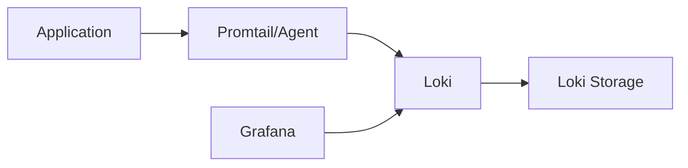
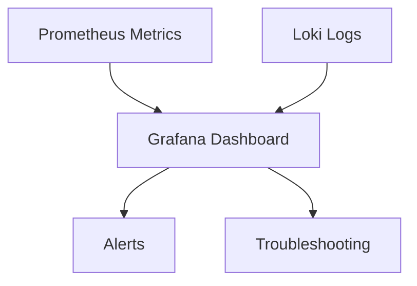

# Grafana Loki

## Introduction

Grafana Loki is a horizontally-scalable, highly-available log aggregation system designed with a unique approach to storing and querying logs. Unlike traditional logging systems that index the content of your logs, Loki indexes only metadata about your logs (such as labels), making it cost-effective and efficient for storing large volumes of log data.

Loki was created by Grafana Labs as a complement to Prometheus in the observability stack. While Prometheus focuses on metrics, Loki handles logs, allowing you to correlate metrics and logs in a single unified interface - typically Grafana.

In this tutorial, we'll explore what makes Loki special, how it differs from other logging solutions, and how to set it up and use it effectively in your Prometheus ecosystem.

## Why Loki?

Before diving into Loki, let's understand why it was created:

1. **Cost-effective**: By indexing metadata instead of full log content, Loki reduces storage and computational requirements
2. **Prometheus-inspired**: Loki uses the same label-based approach as Prometheus, making it familiar to Prometheus users
3. **Seamless Grafana integration**: Works perfectly with Grafana for visualization
4. **Kubernetes-ready**: Designed to work well in containerized environments
5. **Horizontally scalable**: Can handle logs from small applications to large distributed systems

## How Loki Works

Loki follows a unique architecture compared to traditional logging systems:



1. **Log Collection**: Agents like Promtail collect logs from various sources
2. **Label-based Indexing**: Instead of indexing the content, Loki indexes metadata
3. **Chunked Storage**: Logs are compressed and stored in chunks
4. **LogQL Queries**: Query logs using Loki's query language (LogQL)

## Loki Components

### Promtail

Promtail is Loki's agent, responsible for gathering logs and sending them to the Loki server. It:

- Discovers targets
- Attaches labels to log streams
- Pushes log entries to Loki

Here's a basic Promtail configuration:

```yaml
server:
  http_listen_port: 9080

positions:
  filename: /tmp/positions.yaml

clients:
  - url: http://loki:3100/loki/api/v1/push

scrape_configs:
  - job_name: system
    static_configs:
      - targets:
          - localhost
        labels:
          job: varlogs
          __path__: /var/log/*log
```

### Loki Server

The Loki server receives, processes, and stores logs from Promtail and other agents. It also handles queries from Grafana or other clients. Loki can run in:

- **Single binary mode**: Good for testing and small deployments
- **Microservices mode**: For production and scalability

## Setting Up Loki with Docker Compose

Let's set up a basic Loki environment using Docker Compose:

```yaml
version: "3"

services:
  loki:
    image: grafana/loki:2.8.0
    ports:
      - "3100:3100"
    command: -config.file=/etc/loki/local-config.yaml
    volumes:
      - ./loki-config.yaml:/etc/loki/local-config.yaml

  promtail:
    image: grafana/promtail:2.8.0
    volumes:
      - /var/log:/var/log
      - ./promtail-config.yaml:/etc/promtail/config.yaml
    command: -config.file=/etc/promtail/config.yaml

  grafana:
    image: grafana/grafana:latest
    ports:
      - "3000:3000"
    environment:
      - GF_PATHS_PROVISIONING=/etc/grafana/provisioning
      - GF_AUTH_ANONYMOUS_ENABLED=true
      - GF_AUTH_ANONYMOUS_ORG_ROLE=Admin
    volumes:
      - ./grafana/provisioning:/etc/grafana/provisioning
```

For this setup, you'll need two configuration files:

1. **loki-config.yaml**:
```yaml
auth_enabled: false

server:
  http_listen_port: 3100

ingester:
  lifecycler:
    address: 127.0.0.1
    ring:
      kvstore:
        store: inmemory
      replication_factor: 1
    final_sleep: 0s
  chunk_idle_period: 5m
  chunk_retain_period: 30s

schema_config:
  configs:
    - from: 2020-10-24
      store: boltdb-shipper
      object_store: filesystem
      schema: v11
      index:
        prefix: index_
        period: 24h

storage_config:
  boltdb_shipper:
    active_index_directory: /tmp/loki/boltdb-shipper-active
    cache_location: /tmp/loki/boltdb-shipper-cache
    cache_ttl: 24h
    shared_store: filesystem
  filesystem:
    directory: /tmp/loki/chunks

limits_config:
  enforce_metric_name: false
  reject_old_samples: true
  reject_old_samples_max_age: 168h
```

2. **promtail-config.yaml**:
```yaml
server:
  http_listen_port: 9080
  grpc_listen_port: 0

positions:
  filename: /tmp/positions.yaml

clients:
  - url: http://loki:3100/loki/api/v1/push

scrape_configs:
  - job_name: system
    static_configs:
      - targets:
          - localhost
        labels:
          job: varlogs
          __path__: /var/log/*log
```

## Querying Logs with LogQL

LogQL is Loki's query language, inspired by PromQL. It allows you to select and filter logs based on labels and content.

### Basic Log Selection

To select logs by their labels:

```
{app="frontend", environment="production"}
```

This will return all logs with the labels `app=frontend` and `environment=production`.

### Filtering Log Content

To filter logs by their content:

```
{app="frontend"} |= "error"
```

This returns all logs from the frontend application that contain the word "error".

### Advanced Filtering

LogQL supports regular expressions and multiple filters:

```
{app="frontend"} |= "error" != "timeout" | json | status_code >= 500
```

This query:
1. Selects logs from the frontend app
2. Includes only logs containing "error"
3. Excludes logs containing "timeout"
4. Parses logs as JSON
5. Filters for status codes >= 500

### Aggregations and Metrics

LogQL can transform logs into metrics for visualization:

```
sum(rate({app="frontend"} |= "error" [5m])) by (service)
```

This counts error rates across different services over 5-minute windows.

## Integrating Loki with Prometheus

The real power of Loki comes when used alongside Prometheus. Here's how they complement each other:

1. **Metrics lead to logs**: When you see a spike in Prometheus metrics, you can immediately switch to Loki to check the corresponding logs
2. **Unified labels**: Both systems use the same labeling scheme, making correlation easier
3. **Grafana dashboards**: Create unified dashboards showing both metrics and logs

Example Grafana dashboard showing correlation:



## Practical Example: Monitoring a Web Application

Let's look at a practical example of monitoring a web application with both Prometheus and Loki.

First, add Prometheus metrics to your application. Here's an example in Go:

```go
package main

import (
    "fmt"
    "net/http"
    "log"
    
    "github.com/prometheus/client_golang/prometheus"
    "github.com/prometheus/client_golang/prometheus/promauto"
    "github.com/prometheus/client_golang/prometheus/promhttp"
)

var (
    httpRequests = promauto.NewCounterVec(
        prometheus.CounterOpts{
            Name: "http_requests_total",
            Help: "Total number of HTTP requests",
        },
        []string{"path", "status"},
    )
)

func handleRequest(w http.ResponseWriter, r *http.Request) {
    log.Printf("Request received: %s %s", r.Method, r.URL.Path)
    
    // Your application logic here
    // ...
    
    httpRequests.WithLabelValues(r.URL.Path, "200").Inc()
    fmt.Fprintf(w, "Hello, World!")
}

func main() {
    http.HandleFunc("/", handleRequest)
    http.Handle("/metrics", promhttp.Handler())
    
    log.Println("Server starting on :8080")
    log.Fatal(http.ListenAndServe(":8080", nil))
}
```

Then, configure Promtail to collect your application logs:

```yaml
scrape_configs:
  - job_name: app
    static_configs:
      - targets:
          - localhost
        labels:
          job: webapp
          app: myapp
          __path__: /var/log/myapp.log
```

Finally, in Grafana, you can create a dashboard with:
1. A graph panel showing HTTP request rates from Prometheus
2. A logs panel showing application logs from Loki
3. Variables that filter both based on the same labels

## Best Practices for Using Loki

1. **Label Efficiently**: Don't use high-cardinality labels
2. **Log Volume Management**: Use log levels and filtering at the source
3. **Log Rotation**: Implement log rotation for long-running applications
4. **Configure Retention**: Set appropriate retention policies based on needs
5. **Monitor Loki Itself**: Use Prometheus to monitor Loki's performance

## Comparison with Other Logging Solutions

| Feature | Loki | Elasticsearch | Splunk |
|---------|------|--------------|--------|
| Indexing | Labels only | Full-text | Full-text |
| Resource usage | Low | High | High |
| Query language | LogQL | Lucene/KQL | SPL |
| Cost | Lower | Higher | Highest |
| Integration with Prometheus | Native | Via exporters | Via exporters |

## Summary

Grafana Loki provides an efficient, cost-effective way to handle logs in your Prometheus ecosystem. By using the same label-based approach as Prometheus, Loki enables seamless correlation between metrics and logs, all visualized through Grafana.

Key takeaways:
- Loki indexes metadata, not content, making it more efficient
- LogQL allows powerful queries similar to PromQL
- Promtail collects and forwards logs to Loki
- Integration with Prometheus creates a complete observability solution

## Additional Resources

- [Official Loki Documentation](https://grafana.com/docs/loki/latest/)
- [LogQL Query Language Reference](https://grafana.com/docs/loki/latest/logql/)
- [Grafana Loki GitHub Repository](https://github.com/grafana/loki)

## Exercises

1. Set up Loki using Docker Compose and collect logs from a simple application
2. Write LogQL queries to filter logs containing specific errors
3. Create a Grafana dashboard that correlates Prometheus metrics with Loki logs
4. Experiment with log parsing to extract fields and create metrics from logs
5. Implement a multi-tenant Loki setup for different applications