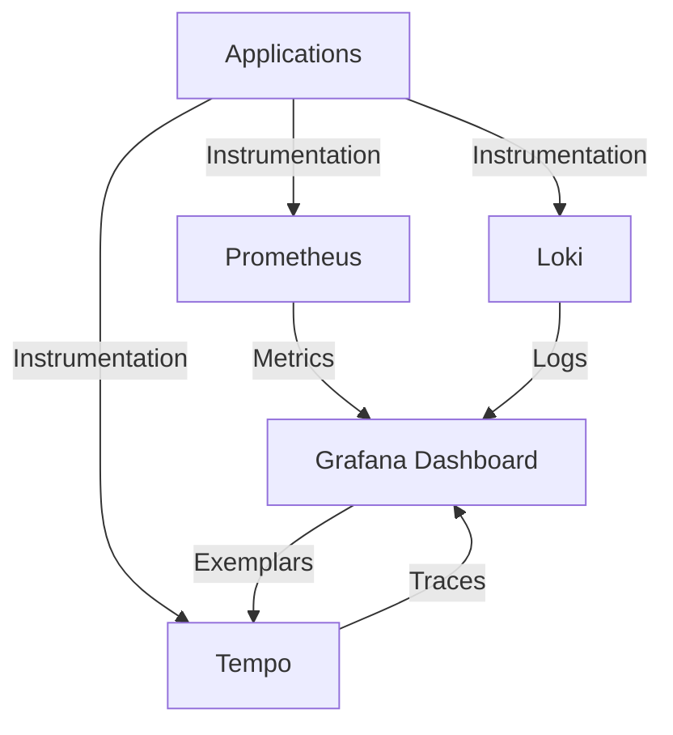

# Grafana Tempo

## Introduction

Grafana Tempo is a high-scale, minimal-dependency distributed tracing system developed by Grafana Labs. It's designed to be cost-effective and easy to operate, making it an excellent choice for organizations of all sizes looking to implement distributed tracing. As part of the Prometheus ecosystem, Tempo integrates seamlessly with Prometheus metrics and Loki logs, providing a complete observability solution.

Distributed tracing is a method used to profile and monitor applications, especially those built using a microservices architecture. Traces help you follow a request as it travels through different services, making it easier to identify performance bottlenecks and troubleshoot issues.

## Key Features of Grafana Tempo

- **Seamless Integration**: Works with the broader Prometheus ecosystem
- **Cost-Efficient Storage**: Uses object storage (S3, GCS, Azure Blob Storage) for trace data
- **Trace Discovery**: Allows finding traces by service name, duration, and other attributes
- **Compatibility**: Supports multiple tracing protocols (Jaeger, Zipkin, OpenTelemetry, OpenCensus)
- **Exemplars Support**: Connects metrics and logs to corresponding traces

## How Tempo Fits in the Prometheus Ecosystem



In the Prometheus ecosystem, Tempo complements the existing tools:

- **Prometheus** collects and stores metrics data
- **Loki** handles logs collection and storage
- **Tempo** manages distributed traces
- **Grafana** provides a unified dashboard for all three data types

This combination is often referred to as the "Three Pillars of Observability" (metrics, logs, and traces).

## Getting Started with Grafana Tempo

### Prerequisites

- Docker and Docker Compose installed
- Basic understanding of distributed systems
- Familiarity with Prometheus concepts

### Setting Up Tempo Locally

Let's set up a basic Tempo instance using Docker Compose. Create a file named `docker-compose.yml` with the following content:

```yaml
version: '3'
services:
  tempo:
    image: grafana/tempo:latest
    command: ["-config.file=/etc/tempo.yaml"]
    volumes:
      - ./tempo.yaml:/etc/tempo.yaml
    ports:
      - "3200:3200"  # tempo
      - "4317:4317"  # otlp grpc
      - "4318:4318"  # otlp http
      - "9411:9411"  # zipkin

  grafana:
    image: grafana/grafana:latest
    volumes:
      - ./grafana-datasources.yaml:/etc/grafana/provisioning/datasources/datasources.yaml
    ports:
      - "3000:3000"
```

Now, create a basic Tempo configuration file named `tempo.yaml`:

```yaml
server:
  http_listen_port: 3200

distributor:
  receivers:
    jaeger:
      protocols:
        thrift_http:
          endpoint: 0.0.0.0:14268
    zipkin:
      endpoint: 0.0.0.0:9411
    otlp:
      protocols:
        http:
          endpoint: 0.0.0.0:4318
        grpc:
          endpoint: 0.0.0.0:4317

storage:
  trace:
    backend: local
    local:
      path: /tmp/tempo/blocks
    pool:
      max_workers: 100
      queue_depth: 10000

compactor:
  compaction:
    block_retention: 48h
```

Finally, create a Grafana datasource configuration file `grafana-datasources.yaml`:

```yaml
apiVersion: 1

datasources:
  - name: Tempo
    type: tempo
    access: proxy
    orgId: 1
    url: http://tempo:3200
    basicAuth: false
    isDefault: true
    version: 1
    editable: false
    apiVersion: 1
    uid: tempo
```

Start the services with:

```bash
docker-compose up -d
```

Now you can access Grafana at `http://localhost:3000` (default credentials: admin/admin) and you'll have Tempo configured as a data source.

## Instrumenting Applications for Tracing

For Tempo to be useful, your applications need to be instrumented to emit traces. Let's look at how to instrument a simple Node.js application using OpenTelemetry:

First, install the required packages:

```bash
npm install @opentelemetry/sdk-node @opentelemetry/auto-instrumentations-node @opentelemetry/exporter-trace-otlp-http
```

Create a file named `tracing.js`:

```javascript
const { NodeSDK } = require('@opentelemetry/sdk-node');
const { getNodeAutoInstrumentations } = require('@opentelemetry/auto-instrumentations-node');
const { OTLPTraceExporter } = require('@opentelemetry/exporter-trace-otlp-http');

const sdk = new NodeSDK({
  traceExporter: new OTLPTraceExporter({
    url: 'http://localhost:4318/v1/traces'
  }),
  instrumentations: [getNodeAutoInstrumentations()]
});

sdk.start();
```

Create a simple Express application in `app.js`:

```javascript
// Load tracing first
require('./tracing');

const express = require('express');
const app = express();
const port = 3001;

app.get('/', async (req, res) => {
  // Simulate work
  await new Promise(resolve => setTimeout(resolve, 100));
  res.send('Hello World!');
});

app.get('/api', async (req, res) => {
  // Simulate database query
  await new Promise(resolve => setTimeout(resolve, 200));
  // Simulate external API call
  await fetch('https://jsonplaceholder.typicode.com/todos/1');
  res.json({ message: 'API response' });
});

app.listen(port, () => {
  console.log(`Example app listening at http://localhost:${port}`);
});
```

After starting this application and making a few requests to it, you'll be able to see the traces in Grafana.

## Querying Traces in Grafana

1. Open Grafana at `http://localhost:3000`
2. Navigate to Explore (compass icon in the left sidebar)
3. Select "Tempo" as the data source
4. You can search for traces using:
   - Service name
   - Operation name
   - Duration
   - Tags/attributes

Example query to find traces longer than 500ms for a service named "express-app":

```
{service.name="express-app"} | duration > 500ms
```

## Connecting Metrics and Traces with Exemplars

One of the most powerful features of the Prometheus ecosystem is the ability to connect metrics, logs, and traces. This is done through "exemplars".

Exemplars are sample trace IDs embedded within metrics that allow you to jump from a metric spike directly to the traces that were recorded during that time period.

Here's how to set up Prometheus to record exemplars:

```yaml
global:
  scrape_interval: 15s
  evaluation_interval: 15s

scrape_configs:
  - job_name: 'prometheus'
    static_configs:
      - targets: ['localhost:9090']

  - job_name: 'instrumented-app'
    static_configs:
      - targets: ['app:3001']
    
    # Enable exemplar storage
    params:
      exemplar: ['true']
```

When viewing metrics in Grafana, you'll see small diamonds on your metric lines indicating exemplars. Clicking on these will take you directly to the associated trace in Tempo.

## Practical Use Cases

### 1. Performance Troubleshooting

When users report slow responses:

1. Check metrics dashboards to identify when slowdowns occur
2. Use exemplars to jump to traces during those periods
3. Analyze traces to see which services or operations are taking too long
4. Optimize the identified bottlenecks

### 2. Error Investigation

When errors occur:

1. Search for traces with error status
2. Examine the full request path to see where errors originated
3. View associated logs for more context about the error
4. Fix the root cause based on the comprehensive view

### 3. Capacity Planning

For capacity planning:

1. Analyze trace data to understand service dependencies
2. Identify frequently called services that might need scaling
3. Find underutilized services that could be scaled down
4. Optimize resource allocation based on actual usage patterns

## Best Practices

1. **Use Service and Span Names Consistently**: Adopt a consistent naming convention for services and spans to make querying easier.

2. **Add Relevant Attributes**: Include meaningful attributes (tags) on your spans to make filtering more effective.

3. **Set Appropriate Sampling Rates**: In high-volume systems, use sampling to reduce costs while still capturing representative traces.

4. **Integrate with Metrics and Logs**: Connect your tracing data with metrics and logs for a complete view of your system.

5. **Trace Context Propagation**: Ensure trace context is properly propagated between services, especially across different technologies.

## Common Challenges and Solutions

| Challenge | Solution |
|-----------|----------|
| Too many traces to store | Implement tail-based sampling to store only interesting traces |
| Missing spans in traces | Check if all services propagate trace context correctly |
| High cardinality issues | Be careful with high-cardinality attributes in span tags |
| Integration with legacy systems | Use OpenTelemetry collectors to bridge trace data from legacy systems |

## Summary

Grafana Tempo is a powerful distributed tracing system that integrates smoothly with the Prometheus ecosystem. With its minimal dependencies and cost-effective storage approach, it provides an accessible entry point into the world of distributed tracing.

By combining Tempo traces with Prometheus metrics and Loki logs, you can achieve a comprehensive observability solution that helps you understand, troubleshoot, and optimize your distributed systems.

## Additional Resources

- [Grafana Tempo Documentation](https://grafana.com/docs/tempo/latest/)
- [OpenTelemetry Documentation](https://opentelemetry.io/docs/)
- [Distributed Tracing with OpenTelemetry](https://www.youtube.com/watch?v=yjZzP3aaCxs)
- [Grafana Tempo GitHub Repository](https://github.com/grafana/tempo)

## Exercises

1. Set up Tempo, Prometheus, and Loki using Docker Compose for a complete observability stack.
2. Instrument a simple application using OpenTelemetry and send traces to Tempo.
3. Create a Grafana dashboard that combines metrics, logs, and traces.
4. Implement sampling strategies for high-volume applications.
5. Practice troubleshooting by intentionally introducing latency and errors, then use Tempo to diagnose the issues.