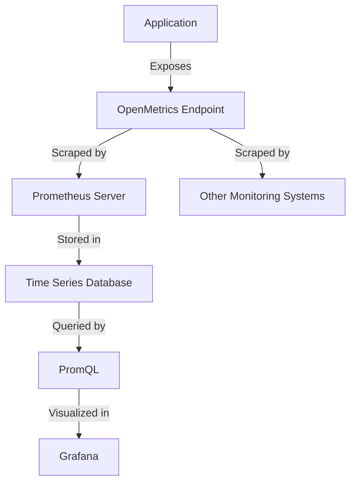

# OpenMetrics

## Introduction

OpenMetrics is an open-source standard for exposing metrics data. It originated from the Prometheus exposition format and has evolved into a more standardized, comprehensive approach to metrics exposure. The goal of OpenMetrics is to provide a vendor-neutral, portable, and widely-adopted way to transmit metrics at scale.

In the monitoring world, having a common format for metrics helps create interoperability between different systems. OpenMetrics achieves this by standardizing how metrics data is formatted, exposed, and transmitted, making it easier for various tools to collect and process metrics regardless of their source.

## What is OpenMetrics?

OpenMetrics is a specification that evolved from the Prometheus exposition formats. It is designed to:

- Standardize how metrics are exposed across different platforms and tools
- Ensure consistency in metric types and metadata
- Provide a clear path for creating and consuming metrics
- Enable interoperability between monitoring systems

OpenMetrics takes the successful aspects of the Prometheus exposition format and formalizes them with additional features and clarifications to create a more robust standard.

## OpenMetrics vs. Prometheus Exposition Format

While OpenMetrics builds upon the Prometheus exposition format, there are some key differences:

| Feature | Prometheus Exposition | OpenMetrics |
|---------|----------------------|-------------|
| Base Format | Text-based | Text-based with optional Protobuf |
| Exemplars | Limited support | Native support |
| Metadata | Limited | Enhanced metadata capabilities |
| Authentication | Not specified | Standardized approach |
| Standardization | De facto standard | CNCF specification |

## Key Components of OpenMetrics

### Metric Types

OpenMetrics supports various metric types:

1. **Counter**: A cumulative metric that represents a single monotonically increasing counter
2. **Gauge**: A metric that represents a single numerical value that can go up and down
3. **Histogram**: Samples observations and counts them in configurable buckets
4. **Summary**: Similar to a histogram, but calculates configurable quantiles
5. **Stateset**: Represents a series of related boolean values
6. **Info**: Used to expose metadata or configuration information
7. **Gaugehistogram**: A histogram that can both increase and decrease over time

### Format Specification

The OpenMetrics format follows a specific structure:

```
# HELP <metric_name> <help_text>
# TYPE <metric_name> <metric_type>
# UNIT <metric_name> <unit>
<metric_name>[{<label_name>=<label_value>, ...}] <value> [<timestamp>]
```

Let's break down each component:

- **HELP**: Provides a description of what the metric represents
- **TYPE**: Specifies the metric type (counter, gauge, etc.)
- **UNIT**: Defines the unit of measurement (optional)
- **metric_name**: The name of the metric
- **label_name, label_value**: Optional key-value pairs that provide additional context
- **value**: The actual metric value
- **timestamp**: Optional timestamp in milliseconds

## Practical Example: Exposing Metrics with OpenMetrics

Here's a simple example of how you might expose metrics in the OpenMetrics format:

```
# HELP http_requests_total Total number of HTTP requests
# TYPE http_requests_total counter
# UNIT http_requests_total requests
http_requests_total{method="get",endpoint="/api/users"} 1027 1618048122123
http_requests_total{method="post",endpoint="/api/users"} 531 1618048122123

# HELP http_request_duration_seconds HTTP request duration in seconds
# TYPE http_request_duration_seconds histogram
http_request_duration_seconds_bucket{le="0.1"} 12345
http_request_duration_seconds_bucket{le="0.5"} 23456
http_request_duration_seconds_bucket{le="1.0"} 34567
http_request_duration_seconds_bucket{le="+Inf"} 45678
http_request_duration_seconds_sum 87654.321
http_request_duration_seconds_count 45678
```

### Implementing OpenMetrics in Your Application

Here's a simple example of how you might implement OpenMetrics in a Node.js application using the `prom-client` library:

```javascript
const express = require('express');
const client = require('prom-client');
const app = express();

// Create a Registry to register metrics
const register = new client.Registry();

// Create a counter metric
const httpRequestsTotal = new client.Counter({
  name: 'http_requests_total',
  help: 'Total number of HTTP requests',
  labelNames: ['method', 'endpoint'],
  registers: [register]
});

// Create a histogram metric
const httpRequestDurationSeconds = new client.Histogram({
  name: 'http_request_duration_seconds',
  help: 'HTTP request duration in seconds',
  buckets: [0.1, 0.5, 1.0, 5.0],
  registers: [register]
});

// Sample middleware to measure request duration
app.use((req, res, next) => {
  const end = httpRequestDurationSeconds.startTimer();
  
  res.on('finish', () => {
    // Increment the counter
    httpRequestsTotal.inc({
      method: req.method.toLowerCase(),
      endpoint: req.path
    });
    
    // Record the duration
    end();
  });
  
  next();
});

// Expose metrics endpoint in OpenMetrics format
app.get('/metrics', async (req, res) => {
  res.set('Content-Type', register.contentType);
  res.end(await register.metrics());
});

app.get('/api/users', (req, res) => {
  res.json({ users: ['user1', 'user2', 'user3'] });
});

app.listen(3000, () => {
  console.log('Server listening on port 3000');
});
```

When you access the `/metrics` endpoint, you'll see something similar to the OpenMetrics format we discussed earlier.

## OpenMetrics in the Prometheus Ecosystem

OpenMetrics plays a crucial role in the Prometheus ecosystem:



The diagram illustrates how OpenMetrics serves as a universal language between your applications and various monitoring tools.

Prometheus natively understands the OpenMetrics format, making it straightforward to:

1. Expose metrics from your application using an OpenMetrics-compatible library
2. Configure Prometheus to scrape these metrics
3. Query and visualize the collected data

## Benefits of Using OpenMetrics

### 1. Standardization

By following a standardized format, you ensure your metrics can be understood by a wide range of monitoring tools, not just Prometheus.

### 2. Future-Proofing

As the monitoring landscape evolves, having your metrics in a standardized format makes it easier to adopt new tools without having to change your instrumentation.

### 3. Rich Context

OpenMetrics provides ways to add detailed metadata to your metrics, making them more useful for analysis and troubleshooting.

### 4. Community Support

As a CNCF project, OpenMetrics has strong community backing and continues to evolve based on real-world needs.

## Implementing OpenMetrics with Different Languages

OpenMetrics is language-agnostic, and there are client libraries available for most programming languages:

### Python Example

```python
from prometheus_client import Counter, Histogram, start_http_server
import time
import random

# Create metrics
http_requests_total = Counter(
    'http_requests_total', 
    'Total number of HTTP requests',
    ['method', 'endpoint']
)

http_request_duration_seconds = Histogram(
    'http_request_duration_seconds',
    'HTTP request duration in seconds',
    ['endpoint'],
    buckets=[0.1, 0.5, 1.0, 5.0]
)

# Start metrics server
start_http_server(8000)

# Simulate HTTP requests
while True:
    # Simulate request processing time
    duration = random.uniform(0.1, 10.0)
    endpoint = random.choice(['/api/users', '/api/products', '/api/orders'])
    method = random.choice(['get', 'post', 'put', 'delete'])
    
    # Record metrics
    http_requests_total.labels(method=method, endpoint=endpoint).inc()
    
    with http_request_duration_seconds.labels(endpoint=endpoint).time():
        time.sleep(duration)
```

### Java Example

```java
import io.prometheus.client.Counter;
import io.prometheus.client.Histogram;
import io.prometheus.client.exporter.HTTPServer;

import java.io.IOException;
import java.util.Random;

public class OpenMetricsExample {
    static final Counter requestsTotal = Counter.build()
            .name("http_requests_total")
            .help("Total number of HTTP requests")
            .labelNames("method", "endpoint")
            .register();

    static final Histogram requestDuration = Histogram.build()
            .name("http_request_duration_seconds")
            .help("HTTP request duration in seconds")
            .labelNames("endpoint")
            .buckets(0.1, 0.5, 1.0, 5.0)
            .register();

    public static void main(String[] args) throws IOException, InterruptedException {
        // Start a HTTP server for exposing metrics
        HTTPServer server = new HTTPServer(8000);
        
        Random random = new Random();
        String[] endpoints = {"/api/users", "/api/products", "/api/orders"};
        String[] methods = {"get", "post", "put", "delete"};
        
        while (true) {
            String endpoint = endpoints[random.nextInt(endpoints.length)];
            String method = methods[random.nextInt(methods.length)];
            
            // Increment request counter
            requestsTotal.labels(method, endpoint).inc();
            
            // Measure request duration
            Histogram.Timer timer = requestDuration.labels(endpoint).startTimer();
            Thread.sleep((long) (random.nextDouble() * 5000)); // Simulate work
            timer.observeDuration();
        }
    }
}
```

## Best Practices for OpenMetrics

When implementing OpenMetrics in your applications, consider these best practices:

1. **Consistent Naming**: Use a consistent naming convention for your metrics. The recommended approach is `namespace_subsystem_name`.

2. **Meaningful Labels**: Choose labels that provide useful context without causing cardinality explosion.

3. **Documentation**: Always include HELP comments that clearly explain what each metric represents.

4. **Units**: Where applicable, specify units for your metrics.

5. **Cardinality Management**: Be careful with high-cardinality labels (like user IDs or session IDs) as they can overload your monitoring system.

6. **Metric Types**: Choose the appropriate metric type based on what you're measuring:
   - Use counters for values that only increase
   - Use gauges for values that can go up and down
   - Use histograms for measuring distributions

7. **Security**: Secure your `/metrics` endpoint if it contains sensitive information.

## Summary

OpenMetrics represents an important evolution in the standardization of metrics exposure. By providing a common language for monitoring tools and applications, it enables better interoperability and a more consistent approach to observability.

Key takeaways:

- OpenMetrics is a standardized format for exposing metrics that evolved from Prometheus's exposition format
- It supports various metric types including counters, gauges, histograms, and summaries
- Implementation libraries are available for most programming languages
- Following OpenMetrics makes your metrics compatible with a wide range of monitoring tools
- Best practices include consistent naming, thoughtful label usage, and appropriate metric types

## Additional Resources

- [Official OpenMetrics Website](https://openmetrics.io/)
- [OpenMetrics GitHub Repository](https://github.com/OpenObservability/OpenMetrics)
- [Prometheus Documentation on OpenMetrics](https://prometheus.io/docs/instrumenting/exposition_formats/)

## Exercises

1. Install a client library for your favorite programming language and create a simple application that exposes metrics in the OpenMetrics format.

2. Set up Prometheus to scrape metrics from your application and create a simple dashboard.

3. Extend your application to track different types of metrics (counters, gauges, histograms) for various aspects of your application's performance.

4. Experiment with different label combinations and observe how they affect the cardinality of your metrics.

5. Compare the format of metrics exposed by your application with the OpenMetrics specification to ensure compliance.