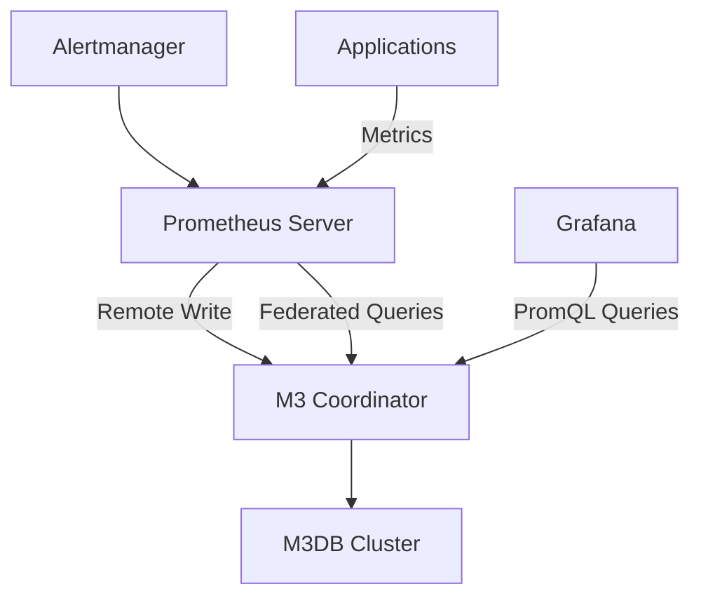
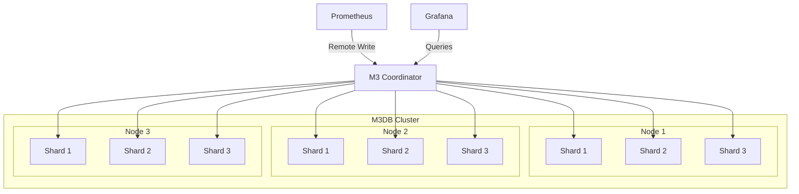

# Understanding M3DB in the Prometheus Ecosystem

## Introduction

M3DB is a distributed time series database that serves as a powerful storage solution within the Prometheus ecosystem. Developed by Uber and later open-sourced, M3DB addresses one of the key challenges in monitoring infrastructures at scale: how to store massive amounts of time series data reliably and efficiently while maintaining fast query performance.

As your monitoring needs grow, Prometheus's local storage can become a limitation. This is where M3DB comes in, offering a scalable, highly available solution for long-term metric storage that integrates seamlessly with Prometheus.

## What is M3DB?

M3DB is part of the broader M3 stack, which includes:

- **M3DB**: The distributed time series database
- **M3 Coordinator**: Handles reads/writes and provides Prometheus-compatible API
- **M3 Query**: For querying the stored time series data
- **M3 Aggregator**: Helps with downsampling and aggregating metrics

At its core, M3DB is designed to handle the unique challenges of time series data at scale:

- High write throughput
- Efficient storage with compression
- Fast queries across massive datasets
- Multi-tenancy support
- Native downsampling capabilities

Let's visualize the position of M3DB in the Prometheus ecosystem:



## Why Use M3DB with Prometheus?

While Prometheus excels at collecting and querying metrics, it has some inherent limitations:

1. **Storage Capacity**: Prometheus is designed to store data locally, which can become a bottleneck as your infrastructure grows.
2. **High Availability**: Setting up high availability with Prometheus alone can be challenging.
3. **Long-term Storage**: Prometheus typically works best with retention periods of weeks rather than months or years.
4. **Horizontal Scaling**: Prometheus doesn't natively scale horizontally for storage.

M3DB addresses these limitations by providing:

- Horizontally scalable storage
- Multi-zone and multi-region deployment options
- Native high availability architecture
- Efficient long-term storage with downsampling
- Ability to query historical data without impacting performance

## Setting Up M3DB with Prometheus

Let's walk through the basic steps to integrate M3DB with your existing Prometheus setup.

### Prerequisites

- A running Kubernetes cluster
- Helm installed
- Prometheus already deployed

### Installing M3DB using Helm

First, add the M3DB Helm repository:

```bash
helm repo add m3db https://m3db.github.io/m3db-operator/
helm repo update
```

Next, create a namespace for M3DB:

```bash
kubectl create namespace m3db
```

Now install the M3DB operator:

```bash
helm install m3db-operator m3db/m3db-operator --namespace m3db
```

Create a configuration file named `m3db-cluster.yaml`:

```yaml
apiVersion: operator.m3db.io/v1alpha1
kind: M3DBCluster
metadata:
  name: m3db-cluster
  namespace: m3db
spec:
  image: quay.io/m3db/m3dbnode:v1.0.0
  replicationFactor: 3
  numberOfShards: 256
  isolationGroups:
    - name: group1
      numInstances: 1
    - name: group2
      numInstances: 1
    - name: group3
      numInstances: 1
  configMapName: m3db-config
  podIdentityConfig:
    sources: []
  containerResources:
    requests:
      cpu: 1
      memory: 4Gi
    limits:
      cpu: 2
      memory: 8Gi
  dataDirVolumeClaimTemplate:
    metadata:
      name: m3db-data
    spec:
      accessModes:
      - ReadWriteOnce
      resources:
        requests:
          storage: 100Gi
  podSecurityContext:
    fsGroup: 2000
  securityContext:
    runAsUser: 1000
    runAsGroup: 1000
```

Apply the configuration:

```bash
kubectl apply -f m3db-cluster.yaml
```

### Configuring Prometheus for Remote Write

Next, update your Prometheus configuration to use M3DB for remote storage. Add the following to your `prometheus.yml`:

```yaml
remote_write:
  - url: "http://m3coordinator.m3db.svc.cluster.local:7201/api/v1/prom/remote/write"
    queue_config:
      capacity: 10000
      max_shards: 200
      max_samples_per_send: 1000

remote_read:
  - url: "http://m3coordinator.m3db.svc.cluster.local:7201/api/v1/prom/remote/read"
    read_recent: true
```

Apply the configuration and restart Prometheus. Your metrics should now be stored in both Prometheus local storage and M3DB.

## Understanding M3DB Architecture

M3DB uses a distributed architecture with several key components:

### Placement and Sharding

M3DB distributes data across the cluster using a concept called **shards**. Each time series is assigned to a shard based on a hash of its ID. The shards are then distributed across the nodes in the cluster.

For example, if you configure 256 shards with a replication factor of 3, each shard will have 3 replicas distributed across different nodes.

### Data Organization

M3DB organizes data in several layers:

- **Namespaces**: Similar to databases in traditional DBMS
- **Shards**: Partitions of data within a namespace
- **Series**: Individual time series within shards
- **Blocks**: Time-ordered chunks of data for a series

### Storage Engine

M3DB uses a custom storage engine optimized for time series data:

1. **Write Path**:
   - Incoming writes go to an in-memory buffer
   - Periodically flushed to disk as immutable blocks
   - Blocks are compressed using specialized time series compression

2. **Read Path**:
   - Queries check the in-memory buffer first
   - Then scan relevant blocks on disk
   - Results are merged and returned

Let's visualize this architecture:



## Working with M3DB

Now that we have M3DB set up, let's explore some common operations and real-world examples.

### Verifying the Setup

To check if your M3DB cluster is healthy and receiving data:

```bash
# Get the M3 Coordinator service
kubectl get svc -n m3db

# Port-forward to access the M3 Coordinator API
kubectl port-forward svc/m3coordinator-m3db-cluster 7201:7201 -n m3db
```

Now you can access the M3DB UI at `http://localhost:7201/`.

### Creating a Namespace for Metrics

M3DB organizes data into namespaces. Let's create one for our Prometheus metrics:

```bash
curl -X POST http://localhost:7201/api/v1/database/create -d '{
  "type": "local",
  "namespaceName": "prometheus_metrics",
  "retentionTime": "48h"
}'
```

### Setting Up Aggregation

One of M3DB's powerful features is its ability to downsample data for longer retention periods. Let's set up an aggregated namespace:

```bash
curl -X POST http://localhost:7201/api/v1/database/create -d '{
  "type": "local",
  "namespaceName": "prometheus_metrics_1d",
  "retentionTime": "720h",
  "resolution": "1h"
}'
```

### Real-World Example: Monitoring Web Service Latency

Let's say you're monitoring a web service and want to track request latency over a long period. Here's how the data would flow:

1. Your web service exposes Prometheus metrics for request latency
2. Prometheus scrapes these metrics every 15 seconds
3. Prometheus remote-writes the data to M3DB
4. M3DB stores the high-resolution data in the `prometheus_metrics` namespace
5. M3DB automatically downsamples this data to hourly resolution in the `prometheus_metrics_1d` namespace
6. You can query both recent high-resolution data and historical aggregated data through Grafana

A sample Grafana query might look like this:

```
rate(http_request_duration_seconds_sum{service="web-api"}[5m]) / 
rate(http_request_duration_seconds_count{service="web-api"}[5m])
```

This would show the average request latency over time, with M3DB automatically selecting the appropriate resolution based on the time range of your query.

## Performance Considerations

When using M3DB at scale, keep the following performance considerations in mind:

1. **Resource Allocation**: M3DB is memory-intensive. Plan for at least 4-8GB of RAM per node.

2. **Disk I/O**: Use SSDs for best performance. M3DB is I/O intensive for both reads and writes.

3. **Shard Count**: The number of shards affects how evenly data is distributed. A good rule of thumb is 2-4 times the number of nodes.

4. **Cardinality**: High cardinality (many unique time series) can impact performance. Be cautious with highly dimensional metrics.

5. **Replication Factor**: Higher replication provides better availability but increases storage requirements and write amplification.

## Troubleshooting Common Issues

### High Memory Usage

If you notice high memory usage:

```bash
# Check memory usage of M3DB pods
kubectl top pod -n m3db
```

Solution: Consider increasing memory limits or optimizing your queries.

### Slow Queries

If queries are slow:

1. Check that your time range isn't too large
2. Verify that you're using appropriate aggregations
3. Look for high cardinality metrics

Example query inspection:

```bash
curl -X POST http://localhost:7201/api/v1/debug/query -d '{
  "query": "up",
  "fetchLimit": 1000,
  "timeout": "30s"
}' | jq
```

### Missing Data

If data appears to be missing:

1. Check that Prometheus remote_write is configured correctly
2. Verify that the namespace exists in M3DB
3. Check for any errors in the Prometheus logs

```bash
kubectl logs -n prometheus prometheus-server-0
```

## Summary

M3DB provides a powerful solution for scaling Prometheus beyond its built-in storage capabilities. By integrating M3DB into your monitoring stack, you gain:

- Virtually unlimited storage capacity through horizontal scaling
- High availability for your metrics data
- Efficient long-term storage with automatic downsampling
- Better query performance for large datasets

While setting up and maintaining M3DB requires more effort than using Prometheus alone, the benefits become clear as your infrastructure and monitoring needs grow.

## Additional Resources

- [M3DB GitHub Repository](https://github.com/m3db/m3)
- [M3DB Documentation](https://m3db.io/docs)
- [M3DB Operator for Kubernetes](https://operator.m3db.io/)

## Exercises

1. Set up a local M3DB instance using Docker Compose and configure Prometheus to use it.
2. Create multiple namespaces in M3DB with different retention periods and resolutions.
3. Write a query that compares high-resolution recent data with downsampled historical data.
4. Create a Grafana dashboard that uses M3DB as a data source to monitor system metrics over time.
5. Experiment with different shard counts and replication factors to see how they affect performance and resource usage.