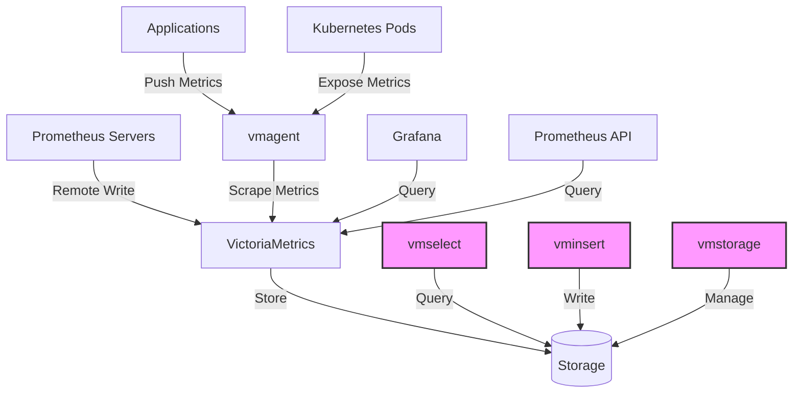
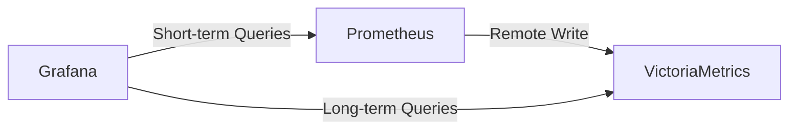
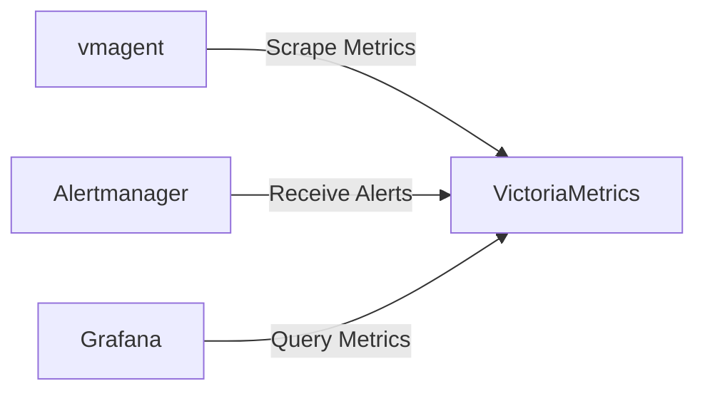

# VictoriaMetrics

## Introduction

VictoriaMetrics is a fast, cost-effective, and scalable time series database and monitoring solution that operates within the Prometheus ecosystem. Designed as an alternative to Prometheus for long-term storage and high-availability scenarios, VictoriaMetrics addresses many of the limitations of vanilla Prometheus while maintaining compatibility with its query language and ecosystem.

In this guide, we'll explore what VictoriaMetrics is, why you might choose it over standard Prometheus, and how to get started with implementing it in your monitoring infrastructure.

## What is VictoriaMetrics?

VictoriaMetrics is an open-source time series database (TSDB) designed for:

- Ingesting and storing Prometheus-compatible metrics
- Providing long-term storage of time series data
- Supporting high-cardinality metrics
- Offering excellent performance with minimal resource requirements
- Scaling horizontally for large deployments

Unlike Prometheus, which was primarily designed for single-node deployment with limited storage duration, VictoriaMetrics was built from the ground up to handle large-scale monitoring needs while remaining simple to operate.

## Why Use VictoriaMetrics?

VictoriaMetrics offers several advantages over standard Prometheus:

1. **Resource Efficiency**: Requires significantly less CPU, RAM, and storage for the same amount of data
2. **Scalability**: Offers both single-node and cluster versions for different deployment needs
3. **Long-term Storage**: Efficiently stores and queries historical data without complex federation setups
4. **High Availability**: Cluster version provides built-in replication and fault tolerance
5. **High Cardinality**: Handles high-cardinality metrics efficiently
6. **Prometheus Compatibility**: Works with existing Prometheus queries (PromQL) and integrations

## Architecture

VictoriaMetrics comes in two versions:

1. **Single-node Version**: Suitable for most cases, handling up to millions of metrics with modest hardware
2. **Cluster Version**: For large-scale deployments requiring high availability and horizontal scaling



The diagram above shows a simplified view of how VictoriaMetrics fits into a monitoring infrastructure, with both the single-node and cluster components represented.

## Getting Started with VictoriaMetrics

### Installation

Let's start by installing the single-node version using Docker:

```bash
docker run -it --rm -v $(pwd):/victoriametrics-data -p 8428:8428 victoriametrics/victoria-metrics:v1.91.3
```

This command:
- Downloads the VictoriaMetrics Docker image
- Maps local storage to the container
- Exposes port 8428 for API access

For production deployments, you might want to use Docker Compose or Kubernetes.

### Docker Compose Example

Create a `docker-compose.yml` file:

```yaml
version: '3.8'
services:
  victoriametrics:
    container_name: victoriametrics
    image: victoriametrics/victoria-metrics:v1.91.3
    ports:
      - "8428:8428"
    volumes:
      - vm-data:/victoriametrics-data
    command:
      - '--storageDataPath=/victoriametrics-data'
      - '--httpListenAddr=:8428'
      - '--retentionPeriod=1y'
    restart: always

volumes:
  vm-data:
```

Start VictoriaMetrics:

```bash
docker-compose up -d
```

### Kubernetes Installation with Helm

For Kubernetes deployments, the Helm chart is the recommended approach:

```bash
# Add VictoriaMetrics Helm repository
helm repo add vm https://victoriametrics.github.io/helm-charts/

# Update repositories
helm repo update

# Install single-node VictoriaMetrics
helm install victoria-metrics vm/victoria-metrics-single -n monitoring --create-namespace
```

## Configuring Prometheus to Use VictoriaMetrics

To use VictoriaMetrics as a long-term storage for Prometheus, configure the remote write feature in your Prometheus configuration:

```yaml
global:
  scrape_interval: 15s
  evaluation_interval: 15s

# ... your scrape configs ...

remote_write:
  - url: "http://victoriametrics:8428/api/v1/write"
    queue_config:
      max_samples_per_send: 10000
      capacity: 20000
      max_shards: 30
```

This configuration instructs Prometheus to send all collected metrics to VictoriaMetrics while continuing to operate normally.

## Using vmagent for Metric Collection

For more advanced setups, you can use `vmagent`, a special agent from VictoriaMetrics that can replace Prometheus for data collection:

```yaml
version: '3.8'
services:
  vmagent:
    container_name: vmagent
    image: victoriametrics/vmagent:v1.91.3
    ports:
      - "8429:8429"
    volumes:
      - ./prometheus.yml:/etc/prometheus/prometheus.yml
    command:
      - '--promscrape.config=/etc/prometheus/prometheus.yml'
      - '--remoteWrite.url=http://victoriametrics:8428/api/v1/write'
    depends_on:
      - victoriametrics
    restart: always
```

The `vmagent` service:
- Uses the same scrape configuration format as Prometheus
- Collects metrics from targets
- Forwards them to VictoriaMetrics
- Uses less resources than Prometheus for metric collection

## Querying Data in VictoriaMetrics

VictoriaMetrics supports two query languages:

1. **PromQL**: The standard Prometheus Query Language
2. **MetricsQL**: An extended version of PromQL with additional functions

### Basic PromQL Examples

You can query VictoriaMetrics directly through its HTTP API:

```bash
curl 'http://localhost:8428/api/v1/query?query=up'
```

This returns all instances of the `up` metric, showing which targets are online.

### Using MetricsQL Extensions

VictoriaMetrics extends PromQL with additional functions. For example:

```
rate(http_requests_total[5m]) / rate(http_requests_total[1h])
```

In MetricsQL, you can use the `rate_over_sum` function for a more efficient calculation:

```
rate_over_sum(http_requests_total[5m], http_requests_total[1h])
```

## Integrating with Grafana

VictoriaMetrics works seamlessly with Grafana. To add it as a data source:

1. Open Grafana
2. Go to Configuration > Data Sources
3. Click "Add data source"
4. Select "Prometheus"
5. Set the URL to `http://victoriametrics:8428`
6. Click "Save & Test"

Grafana will now be able to query VictoriaMetrics using either PromQL or MetricsQL.

## High Availability with VictoriaMetrics Cluster

For production environments requiring high availability, you can deploy the cluster version:

```yaml
version: '3.8'
services:
  vmstorage-1:
    image: victoriametrics/vmstorage:v1.91.3-cluster
    ports:
      - "8482:8482"
    volumes:
      - vmstorage-1:/storage
    command:
      - '--storageDataPath=/storage'
  
  vmstorage-2:
    image: victoriametrics/vmstorage:v1.91.3-cluster
    ports:
      - "8483:8482"
    volumes:
      - vmstorage-2:/storage
    command:
      - '--storageDataPath=/storage'

  vminsert:
    image: victoriametrics/vminsert:v1.91.3-cluster
    ports:
      - "8480:8480"
    command:
      - '--storageNode=vmstorage-1:8400'
      - '--storageNode=vmstorage-2:8400'

  vmselect:
    image: victoriametrics/vmselect:v1.91.3-cluster
    ports:
      - "8481:8481"
    command:
      - '--storageNode=vmstorage-1:8401'
      - '--storageNode=vmstorage-2:8401'
      - '--dedup.minScrapeInterval=15s'

volumes:
  vmstorage-1:
  vmstorage-2:
```

This setup creates a minimal cluster with:
- Two storage nodes for redundancy
- One insert node for writing data
- One select node for querying data

## Advanced Features

### Multi-Tenancy

VictoriaMetrics supports multi-tenancy through the concept of "tenants" or "namespaces":

```bash
# Insert metrics for tenant "team1"
curl -X POST 'http://localhost:8428/api/v1/write?tenant=team1' -d 'my_metric{label="value"} 123'

# Query metrics for tenant "team1"
curl 'http://localhost:8428/api/v1/query?tenant=team1&query=my_metric'
```

This allows different teams to use the same VictoriaMetrics instance while keeping their data isolated.

### Data Retention Policies

You can configure different retention periods:

```bash
docker run -it --rm -p 8428:8428 victoriametrics/victoria-metrics:v1.91.3 \
  --retentionPeriod=3m \
  --storageDataPath=/victoriametrics-data
```

This example sets a retention period of 3 months. VictoriaMetrics will automatically delete data older than this period.

### Downsampling

For efficient long-term storage, VictoriaMetrics supports downsampling:

```bash
# Create a downsampling job for monthly aggregation
curl -X POST 'http://localhost:8428/api/v1/admin/downsampling/create' \
  -d '{"srcSelector":".*", "interval":"720h", "lookback":"1y"}'
```

This creates monthly (720 hours) averages of all metrics, looking back up to 1 year.

## Performance Optimization

VictoriaMetrics is efficient by default, but here are some tips for optimization:

1. **Memory Management**: Adjust `-memory.allowedPercent` (default: 60) to control memory usage
2. **Disk Space**: Use `-storage.minFreeDiskSpaceBytes` to prevent running out of disk space
3. **Caching**: Tune `-search.cacheTimestampOffset` for frequently queried time ranges
4. **Deduplication**: Set proper deduplication intervals with `-dedup.minScrapeInterval`

Example configuration for a production environment:

```bash
docker run -it --rm -p 8428:8428 victoriametrics/victoria-metrics:v1.91.3 \
  --memory.allowedPercent=70 \
  --storage.minFreeDiskSpaceBytes=10000000000 \
  --search.maxQueryDuration=5m \
  --search.maxConcurrentQueries=20 \
  --dedup.minScrapeInterval=15s
```

## Common Use Cases

### Long-term Storage for Prometheus

The most common use case is extending Prometheus with long-term storage:



In this setup:
- Prometheus handles alerting and short-term storage
- VictoriaMetrics provides efficient long-term storage
- Grafana queries both systems depending on the time range

### Complete Prometheus Replacement

For simpler architecture, VictoriaMetrics can fully replace Prometheus:



This approach:
- Reduces the number of components to manage
- Provides a single source of truth for metrics
- Often requires fewer resources than a Prometheus-based stack

## Troubleshooting

### Common Issues and Solutions

1. **High Memory Usage**
   ```bash
   # Reduce memory usage
   --memory.allowedPercent=50
   ```

2. **Slow Queries**
   ```bash
   # Enable query stats
   --search.logSlowQueryDuration=5s
   ```
   This logs queries taking longer than 5 seconds.

3. **Missing Data**
   Check for:
   - Incorrect remote_write configuration
   - Network issues between Prometheus and VictoriaMetrics
   - Retention period settings

## Comparison with Other Solutions

| Feature | VictoriaMetrics | Prometheus | Thanos | Cortex |
|---------|----------------|------------|--------|--------|
| Storage Efficiency | High | Medium | Medium | Medium |
| Scalability | Single-node & Cluster | Single-node | Distributed | Distributed |
| Complexity | Low | Low | High | High |
| Query Speed | Fast | Fast | Medium | Medium |
| Multi-tenancy | Yes | No | Limited | Yes |
| High Cardinality | Good | Limited | Limited | Limited |

## Summary

VictoriaMetrics offers a powerful alternative to standard Prometheus for long-term storage and large-scale deployments. Its key advantages include:

- Resource efficiency and performance
- Scalability from single server to large clusters
- Full compatibility with the Prometheus ecosystem
- Simple operation with minimal configuration
- Support for high-cardinality metrics

As your monitoring needs grow beyond what vanilla Prometheus can handle efficiently, VictoriaMetrics provides a natural upgrade path without requiring major changes to your existing monitoring setup.

## Additional Resources

- [Official Documentation](https://docs.victoriametrics.com/)
- [GitHub Repository](https://github.com/VictoriaMetrics/VictoriaMetrics)
- [Benchmarks](https://victoriametrics.github.io/Articles.html)

## Exercises

1. Set up a single-node VictoriaMetrics instance and configure Prometheus to remote write to it.
2. Create a Grafana dashboard that queries both Prometheus and VictoriaMetrics.
3. Experiment with MetricsQL extensions to simplify complex PromQL queries.
4. Set up a minimal VictoriaMetrics cluster with two storage nodes for high availability.
5. Configure multiple tenants in VictoriaMetrics and isolate metrics between different teams.