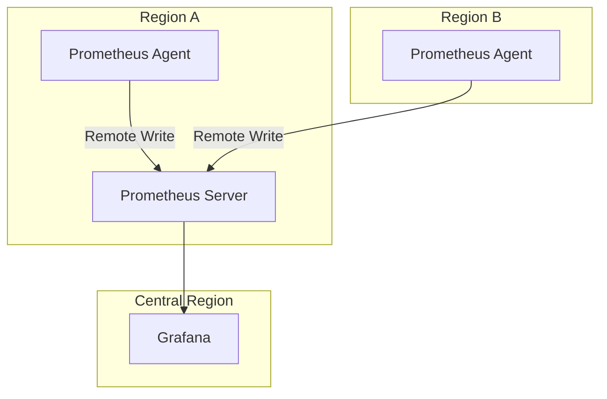

# Prometheus Agent Mode

## Introduction

Prometheus Agent Mode is a specialized operational mode introduced in Prometheus 2.32.0 that allows Prometheus to function as a lightweight metrics collection agent. Unlike the full Prometheus server, Agent Mode focuses solely on scraping metrics and forwarding them to a central Prometheus server or remote storage system, without providing local storage or querying capabilities.

This feature addresses the common need for distributed metrics collection in complex environments where running full Prometheus servers at every collection point would be resource-intensive and inefficient.

## What is Prometheus Agent Mode?

Agent Mode transforms a Prometheus instance into a streamlined metrics collection agent with the following characteristics:

- **Scrape-and-forward only**: Collects metrics from targets but doesn't store them locally
- **Reduced resource usage**: Operates with significantly lower memory and CPU requirements
- **Remote-write focused**: Designed to forward metrics to remote storage systems
- **No query capability**: Cannot serve PromQL queries or API requests
- **Simplified configuration**: Focuses only on scraping and remote-write settings

## When to Use Agent Mode

Agent Mode is particularly valuable in the following scenarios:

1. **Edge computing environments** with limited resources
2. **Multi-region deployments** that need to centralize metrics
3. **Highly distributed systems** with many collection points
4. **IoT deployments** where devices have constrained resources
5. **Air-gapped environments** that need periodic metrics forwarding

## Setting Up Prometheus in Agent Mode

Let's walk through the process of configuring and running Prometheus in Agent Mode.

### Basic Configuration

To run Prometheus in Agent Mode, you'll need to:

1. Create a configuration file with scrape targets and remote-write endpoints
2. Start Prometheus with the `--enable-feature=agent` flag

Here's a simple example of a Prometheus Agent configuration file:

```yaml
# prometheus-agent.yml
global:
  scrape_interval: 15s

scrape_configs:
  - job_name: 'node'
    static_configs:
      - targets: ['localhost:9100']

remote_write:
  - url: "http://central-prometheus:9090/api/v1/write"
```

### Starting Prometheus in Agent Mode

To launch Prometheus in Agent Mode, use:

```bash
prometheus --enable-feature=agent --config.file=prometheus-agent.yml
```

The terminal output should confirm that Agent Mode is enabled:

```
level=info ts=2023-04-15T10:20:30.123Z caller=main.go:213 msg="Starting Prometheus Agent" version="2.45.0"
level=info ts=2023-04-15T10:20:30.125Z caller=main.go:214 msg="Agent mode enabled, no storage will be configured"
```

## Remote Write Configuration

The most critical part of Agent Mode configuration is the `remote_write` section, which defines where your metrics are sent.

### Basic Remote Write

```yaml
remote_write:
  - url: "http://central-prometheus:9090/api/v1/write"
```

### Advanced Remote Write with Authentication

```yaml
remote_write:
  - url: "https://prometheus.example.org/api/v1/write"
    basic_auth:
      username: "prometheus"
      password: "secret_password"
    queue_config:
      capacity: 10000
      max_shards: 200
      min_shards: 50
      max_samples_per_send: 2000
      batch_send_deadline: 5s
      min_backoff: 30ms
      max_backoff: 5s
```

### Multiple Remote Write Endpoints

You can configure multiple remote write endpoints for redundancy or to send metrics to different storage systems:

```yaml
remote_write:
  - url: "http://prometheus-1:9090/api/v1/write"
    name: "primary"
  - url: "http://prometheus-2:9090/api/v1/write"
    name: "backup"
  - url: "http://thanos-receive:10901/api/v1/receive"
    name: "long-term-storage"
```

## Practical Example: Multi-Region Monitoring

Let's explore a practical example of using Prometheus Agent Mode in a multi-region deployment.

### Scenario

Imagine you have applications running in three different cloud regions, and you want to collect metrics from all regions while centralizing storage and querying in a single location.

### Solution Architecture



### Region-Specific Agent Configuration

Here's a configuration for the Prometheus Agent in Region A:

```yaml
# region-a-agent.yml
global:
  scrape_interval: 15s
  external_labels:
    region: "region-a"
    
scrape_configs:
  - job_name: 'node'
    static_configs:
      - targets: ['node-1:9100', 'node-2:9100']
  - job_name: 'api-service'
    static_configs:
      - targets: ['api-1:8080', 'api-2:8080']

remote_write:
  - url: "https://central-prometheus.example.org/api/v1/write"
    basic_auth:
      username: "region-a"
      password_file: "/etc/prometheus/secrets/remote_write_password"
```

The `external_labels` section adds a region label to all metrics, making it easy to filter and organize metrics by their source region.

## Resource Optimization in Agent Mode

One of the main advantages of Agent Mode is its reduced resource consumption compared to a full Prometheus server. Let's examine how to optimize your Agent Mode deployment:

### Memory Tuning

```yaml
# Low-memory agent configuration
remote_write:
  - url: "https://central-prometheus.example.org/api/v1/write"
    queue_config:
      # Reduce in-memory queue size
      capacity: 5000
      max_samples_per_send: 1000
      # More frequent sends
      batch_send_deadline: 2s
```

### CPU Tuning

To reduce CPU usage, you can adjust the scrape interval and reduce the number of targets per job:

```yaml
global:
  scrape_interval: 30s  # Less frequent scraping

scrape_configs:
  - job_name: 'node'
    static_configs:
      - targets: ['node-1:9100', 'node-2:9100']
    scrape_interval: 60s  # Even less frequent for this job
```

## High Availability Setup

For critical environments, you can run multiple Prometheus Agents for the same targets to ensure no metrics are lost:

```yaml
# agent-1.yml
global:
  external_labels:
    agent: "agent-1"

scrape_configs:
  - job_name: 'critical-service'
    static_configs:
      - targets: ['service:8080']

remote_write:
  - url: "https://central-prometheus.example.org/api/v1/write"
```

```yaml
# agent-2.yml
global:
  external_labels:
    agent: "agent-2"

scrape_configs:
  - job_name: 'critical-service'
    static_configs:
      - targets: ['service:8080']

remote_write:
  - url: "https://central-prometheus.example.org/api/v1/write"
```

The central Prometheus server can deduplicate these metrics based on their timestamps and labels.

## Troubleshooting Agent Mode

Here are some common issues you might encounter when working with Prometheus Agent Mode:

### Checking Agent Status

While Agent Mode doesn't provide the full Prometheus UI, it does expose some basic status information at:

```
http://agent-host:9090/-/healthy
http://agent-host:9090/-/ready
```

### Common Issues and Solutions

1. **Remote write failures**: Check the logs for errors related to remote_write connections
   ```
   level=error ts=2023-04-15T14:25:12.345Z caller=queue_manager.go:789 msg="Failed to send batch" remote_name=central err="server returned HTTP status 401 Unauthorized"
   ```
   Solution: Verify authentication credentials and network connectivity.

2. **High memory usage**: If the agent is using more memory than expected, adjust the queue configuration
   ```yaml
   remote_write:
     - url: "https://central-prometheus.example.org/api/v1/write"
       queue_config:
         capacity: 2500  # Reduce from default
   ```

3. **Missed scrapes**: If targets are being scraped inconsistently, check for resource constraints
   ```
   level=warn ts=2023-04-15T15:30:45.678Z caller=scrape.go:1145 component="scrape manager" scrape_pool=node target=node-1:9100 msg="Scrape failed" err="context deadline exceeded"
   ```
   Solution: Increase scrape timeout or reduce the number of concurrent scrapes.

## Integration with the Prometheus Ecosystem

Prometheus Agent Mode works seamlessly with other components in the Prometheus ecosystem:

### With Thanos

Prometheus Agent can send metrics directly to Thanos Receive:

```yaml
remote_write:
  - url: "http://thanos-receive:10901/api/v1/receive"
```

### With Grafana Mimir

```yaml
remote_write:
  - url: "http://mimir-distributor:8080/api/v1/push"
    basic_auth:
      username: "agent"
      password: "password"
```

### With Prometheus Alertmanager

Since Agent Mode doesn't process alerts, you would configure alerting on your central Prometheus server. However, Agent Mode can still help collect metrics that trigger those alerts.

## Summary

Prometheus Agent Mode provides a resource-efficient way to collect and forward metrics in distributed environments. By focusing solely on scraping and remote-write functionality, it reduces the overhead traditionally associated with running full Prometheus servers at every collection point.

Key benefits include:
- Reduced resource consumption
- Simplified configuration
- Perfect fit for edge and distributed environments
- Seamless integration with the broader Prometheus ecosystem

As systems become more distributed and complex, Agent Mode offers a practical solution for maintaining comprehensive observability without excessive resource overhead.

## Additional Resources and Exercises

### Exercises

1. **Basic Setup**: Configure a Prometheus Agent to scrape a Node Exporter and forward metrics to a central Prometheus server.

2. **Multi-Target Configuration**: Extend your Agent configuration to scrape multiple different exporters and apply appropriate labels.

3. **HA Setup**: Set up two Prometheus Agents scraping the same targets and sending to the same remote endpoint. Observe how the central system handles the duplicate data.

4. **Resource Tuning**: Experiment with different queue configurations to find the optimal balance between reliability and resource usage.

### Further Learning

- [Official Prometheus Documentation](https://prometheus.io/docs/prometheus/latest/feature_flags/#agent)
- Prometheus Remote Write Protocol
- Prometheus Service Discovery mechanisms
- Integrating with Grafana for visualizing your metrics