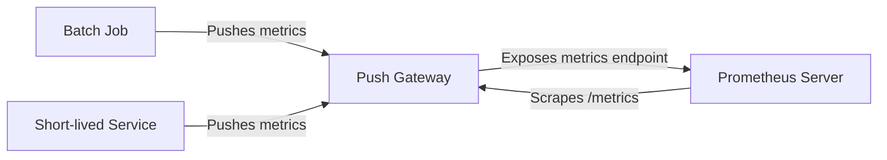

# Push Gateway

## Introduction

In the standard Prometheus monitoring model, the Prometheus server **pulls** metrics from targets by scraping HTTP endpoints. But what happens when you have short-lived jobs or services that may not exist long enough to be scraped? This is where the Push Gateway comes in.

The Prometheus Push Gateway is a component that allows you to **push** metrics to it, which Prometheus can then scrape. It acts as an intermediary service that bridges the gap between Prometheus's pull-based architecture and workloads that need to push their metrics.

## When to Use Push Gateway

The Push Gateway is designed for specific use cases:

- **Batch jobs**: Short-lived processes that complete before the regular Prometheus scrape interval
- **Service-level monitoring of ephemeral jobs**: Tasks that may not exist when Prometheus attempts to scrape them
- **Edge cases where direct scraping isn't feasible**: Cases where network topology or security restrictions prevent direct scraping

:::caution
The Push Gateway is not intended as a replacement for the standard pull model. It's specifically for cases where the pull model doesn't work.
:::

## How Push Gateway Works

Here's a simplified explanation of how the Push Gateway functions:



1. Your ephemeral jobs or services push their metrics to the Push Gateway
2. The Push Gateway stores these metrics in memory
3. Prometheus scrapes the Push Gateway on its regular schedule
4. The metrics remain in the Push Gateway until explicitly deleted or the Push Gateway restarts

## Setting Up Push Gateway

### Installation

You can download the Push Gateway from the [Prometheus website](https://prometheus.io/download/) or use Docker:

```bash
docker run -d -p 9091:9091 prom/pushgateway
```

### Configuration

By default, the Push Gateway runs on port 9091. You need to configure Prometheus to scrape it by adding this to your `prometheus.yml`:

```yaml
scrape_configs:
  - job_name: 'pushgateway'
    static_configs:
      - targets: ['localhost:9091']
```

## Pushing Metrics to Push Gateway

You can push metrics to the Push Gateway using HTTP requests. Here are some examples:

### Using curl

```bash
echo "some_metric 42" | curl --data-binary @- http://localhost:9091/metrics/job/some_job
```

### Using the Prometheus Client Libraries

#### Python Example

```python
from prometheus_client import CollectorRegistry, Gauge, push_to_gateway

# Create a registry and metric
registry = CollectorRegistry()
g = Gauge('job_last_success_unixtime', 
          'Last time a batch job successfully finished', 
          registry=registry)
g.set_to_current_time()

# Push to the gateway
push_to_gateway('localhost:9091', job='batch_job', registry=registry)
```

#### Go Example

```go
package main

import (
	"github.com/prometheus/client_golang/prometheus"
	"github.com/prometheus/client_golang/prometheus/push"
)

func main() {
	completionTime := prometheus.NewGauge(prometheus.GaugeOpts{
		Name: "job_last_success_unixtime",
		Help: "Last time a batch job successfully finished",
	})
	completionTime.SetToCurrentTime()
	
	// Push metrics
	pusher := push.New("localhost:9091", "batch_job")
	pusher.Collector(completionTime)
	if err := pusher.Push(); err != nil {
		// Handle error
	}
}
```

## Best Practices

### Use Job and Instance Labels

When pushing metrics, always include meaningful job and instance labels:

```bash
curl -X POST http://localhost:9091/metrics/job/batch_processor/instance/server-01 \
  -d 'process_runtime_seconds 42.125'
```

### Delete Metrics When No Longer Needed

To avoid stale metrics, delete them when a job completes:

```bash
curl -X DELETE http://localhost:9091/metrics/job/batch_processor/instance/server-01
```

### Only Push What's Necessary

Push Gateway is not meant for regular metrics collection. Only push metrics for:
- The final state of a job
- Key information about job completion
- Critical metrics that would be lost otherwise

### Handling Failures

Always incorporate error handling when pushing metrics:

```python
try:
    push_to_gateway('localhost:9091', job='batch_job', registry=registry)
except Exception as e:
    logging.error(f"Failed to push metrics: {e}")
    # Continue with job, don't fail because metrics couldn't be pushed
```

## Real-World Example: Monitoring Backup Jobs

Let's implement a complete example of monitoring nightly backup jobs:

```python
import time
import random
from prometheus_client import CollectorRegistry, Gauge, Counter, push_to_gateway

def perform_backup():
    # Simulate backup process
    start_time = time.time()
    time.sleep(random.uniform(1, 3))  # Simulate work
    success = random.random() > 0.2  # 80% success rate
    end_time = time.time()
    return success, end_time - start_time

# Create a registry
registry = CollectorRegistry()

# Create metrics
backup_success = Gauge('backup_success', 
                       'Whether the backup succeeded (1 for success, 0 for failure)', 
                       registry=registry)
backup_duration = Gauge('backup_duration_seconds', 
                        'Time taken to perform backup', 
                        registry=registry)
backup_size = Gauge('backup_size_bytes', 
                    'Size of the backup in bytes', 
                    registry=registry)
backup_last_timestamp = Gauge('backup_last_timestamp', 
                             'Unix timestamp of the last backup attempt', 
                             registry=registry)

# Run the backup
success, duration = perform_backup()

# Set metric values
backup_success.set(1 if success else 0)
backup_duration.set(duration)
if success:
    backup_size.set(random.randint(1000000, 5000000))  # Simulate backup size
backup_last_timestamp.set(time.time())

# Push to gateway with job and instance labels
push_to_gateway('localhost:9091', 
                job='nightly_backup', 
                registry=registry,
                grouping_key={'instance': 'database-01'})

print(f"Backup {'succeeded' if success else 'failed'} in {duration:.2f} seconds")
```

Now you can create Prometheus alerts based on these metrics:

```yaml
groups:
- name: backup-alerts
  rules:
  - alert: BackupFailed
    expr: backup_success == 0
    for: 5m
    labels:
      severity: critical
    annotations:
      summary: "Backup job failed"
      description: "The backup job on {{ $labels.instance }} failed."
  
  - alert: BackupMissing
    expr: time() - backup_last_timestamp > 86400
    for: 1h
    labels:
      severity: warning
    annotations:
      summary: "Backup job missing"
      description: "No backup has been completed on {{ $labels.instance }} in the last 24 hours."
```

## Push Gateway API

The Push Gateway provides several HTTP endpoints for interacting with metrics:

| Endpoint | Method | Description |
|----------|--------|-------------|
| `/metrics/job/<job_name>` | POST, PUT | Push metrics for a job |
| `/metrics/job/<job_name>/instance/<instance>` | POST, PUT | Push metrics with job and instance labels |
| `/metrics/job/<job_name>` | DELETE | Delete all metrics for a job |
| `/metrics` | GET | Prometheus scraping endpoint |

The difference between POST and PUT:
- **POST**: Metrics are merged with existing metrics
- **PUT**: All existing metrics for that job/instance are replaced

## Push Gateway vs. Other Approaches

### When to Use Direct Instrumentation Instead

For long-running services, you should:
1. Instrument your application directly
2. Expose a `/metrics` endpoint
3. Configure Prometheus to scrape this endpoint

### When to Use Push Gateway

Use Push Gateway only when:
- Jobs are too short-lived to be reliably scraped
- Network architecture prevents direct scraping
- You need to retain final state metrics of completed jobs

### Alternative: Textfile Collector with Node Exporter

For some batch jobs, particularly on hosts where Node Exporter runs, consider using the textfile collector instead:

```bash
echo 'batch_job_status{job="backup",status="success"} 1' > /var/lib/node_exporter/textfile_collector/backup_status.prom
```

## Common Issues and Troubleshooting

### Push Gateway Restarts and Data Loss

Since the Push Gateway stores metrics in memory, restarts will cause data loss. For critical metrics:
- Set up redundant Push Gateway instances
- Implement retry logic in clients
- Consider using Prometheus recording rules to preserve history

### Metric Naming Conflicts

Be careful with metric names to avoid conflicts between different jobs:

```
# Bad - generic name that might conflict
http_requests_total 42

# Good - specific to the job
batch_job_http_requests_total 42
```

### Security Considerations

The Push Gateway doesn't have built-in authentication. To secure it:
- Use a reverse proxy with authentication (like nginx)
- Place it behind a firewall
- Use TLS to encrypt metric submission

## Summary

The Prometheus Push Gateway serves as a critical component for monitoring short-lived jobs and services that would otherwise be missed by Prometheus's pull-based model. By understanding when and how to use the Push Gateway appropriately, you can ensure complete visibility into your system's performance.

Remember these key points:
- Use Push Gateway only for ephemeral jobs and services
- Always include job and instance labels
- Delete metrics when they're no longer needed
- Consider alternatives like direct instrumentation when possible

## Additional Resources

- [Official Prometheus Push Gateway documentation](https://prometheus.io/docs/instrumenting/pushing/)
- [Push Gateway GitHub repository](https://github.com/prometheus/pushgateway)
- [Prometheus Best Practices guide](https://prometheus.io/docs/practices/pushing/)

## Exercises

1. Set up a Push Gateway using Docker and configure Prometheus to scrape it.
2. Write a simple batch script that pushes a completion time metric to Push Gateway.
3. Create a Grafana dashboard that visualizes metrics from your Push Gateway.
4. Implement a Python script that pushes multiple metrics about a simulated data processing job.
5. Set up alerting rules in Prometheus to notify you when pushed metrics indicate failures.