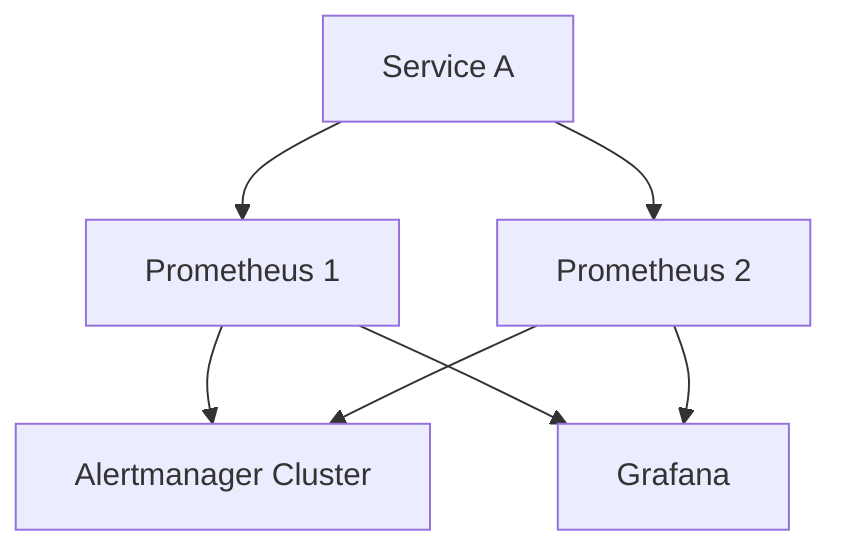
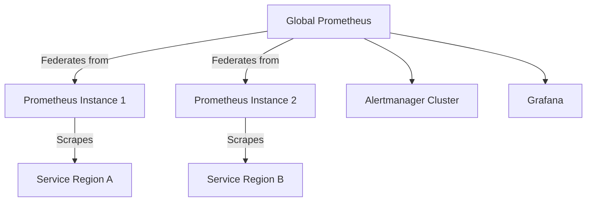
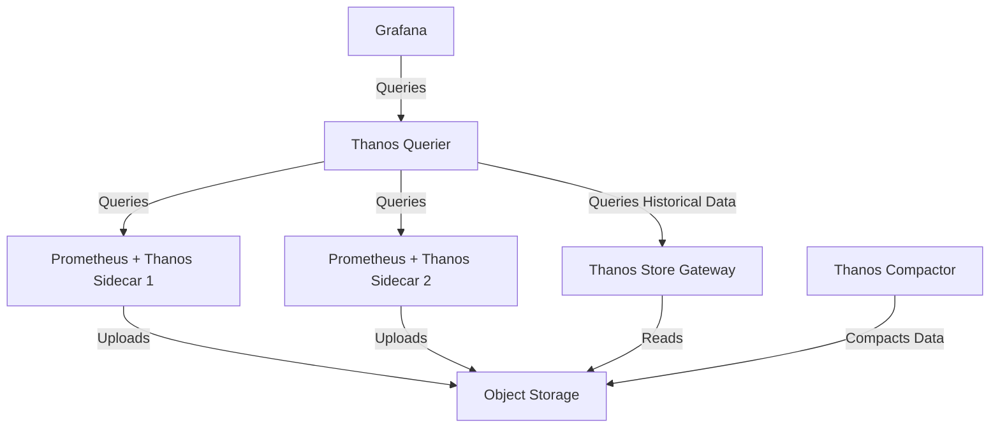
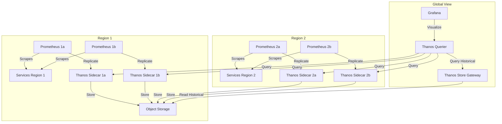

# Prometheus High Availability

## Introduction

High Availability (HA) is a critical aspect of any production monitoring system. When your monitoring system goes down, you're essentially flying blind—unable to detect issues or receive alerts about your services. This is especially problematic during outages when monitoring is most needed.

In this guide, we'll explore various strategies and patterns for making Prometheus highly available, ensuring your monitoring system remains operational even when components fail.

## Understanding High Availability in Prometheus

Prometheus was originally designed as a single-node solution, which presents some challenges when building for high availability. However, the Prometheus ecosystem has evolved to offer several approaches to achieve reliability and redundancy.

### Key Challenges in Prometheus HA

1. **Single-node architecture**: Prometheus servers traditionally operate independently
2. **Local storage**: Metrics are stored on local disks by default
3. **Alert deduplication**: Multiple Prometheus instances might trigger duplicate alerts
4. **Query consolidation**: Combining data from multiple Prometheus servers

## High Availability Approaches

Let's explore the main strategies for implementing high availability with Prometheus.

### 1. Simple Redundancy (Basic HA)

The simplest approach is to run multiple identical Prometheus instances that scrape the same targets.



#### Implementation Steps:

1. Deploy multiple Prometheus instances with identical scrape configurations
2. Configure each instance to send alerts to an Alertmanager cluster
3. Set up Grafana to query multiple Prometheus data sources

```yaml
# prometheus1.yml
global:
  scrape_interval: 15s
  evaluation_interval: 15s

alerting:
  alertmanagers:
  - static_configs:
    - targets:
      - alertmanager1:9093
      - alertmanager2:9093

scrape_configs:
  - job_name: 'example-job'
    static_configs:
      - targets: ['service-a:9090']
```

**Benefits**:
- Simple to implement
- No single point of failure for data collection

**Limitations**:
- Duplicate data storage (inefficient)
- Potential for duplicate alerts (mitigated by Alertmanager clustering)
- No unified view of data without additional tooling

### 2. Prometheus Federation

Federation allows a Prometheus server to scrape selected time series from another Prometheus server, enabling hierarchical and cross-service monitoring.



#### Implementation Example:

```yaml
# global-prometheus.yml
scrape_configs:
  - job_name: 'federate'
    scrape_interval: 30s
    honor_labels: true
    metrics_path: '/federate'
    params:
      'match[]':
        - '{job="prometheus"}'
        - '{__name__=~"job:.*"}'
    static_configs:
      - targets:
        - 'prometheus-1:9090'
        - 'prometheus-2:9090'
```

**Benefits**:
- Scales well across multiple data centers or regions
- Allows for hierarchical aggregation
- Reduces load on central monitoring instance

**Limitations**:
- Introduces additional points of failure
- Increased complexity
- Can introduce latency in global views

### 3. Thanos or Cortex for Long-term Storage

For more advanced HA setups, solutions like Thanos or Cortex provide long-term storage and global query capabilities.

#### Thanos Architecture



#### Setting up Thanos with Prometheus

First, deploy Prometheus with a Thanos sidecar:

```yaml
# prometheus.yml
global:
  external_labels:
    region: us-west
    replica: 1
  scrape_interval: 15s

scrape_configs:
  - job_name: 'prometheus'
    static_configs:
      - targets: ['localhost:9090']
```

Then run the Prometheus server with Thanos sidecar:

```bash
prometheus \
  --config.file=prometheus.yml \
  --storage.tsdb.path=/prometheus \
  --storage.tsdb.max-block-duration=2h \
  --storage.tsdb.min-block-duration=2h \
  --web.enable-lifecycle
```

```bash
thanos sidecar \
  --tsdb.path=/prometheus \
  --prometheus.url=http://localhost:9090 \
  --objstore.config-file=bucket.yml
```

**Benefits**:
- Global query view
- Long-term storage in object storage (S3, GCS, etc.)
- Deduplication of metrics
- High availability and fault tolerance

**Limitations**:
- Complex setup and maintenance
- Resource intensive
- Requires object storage infrastructure

### 4. Alertmanager HA

To ensure reliable alert delivery, Alertmanager should be deployed in a clustered configuration.

```yaml
# alertmanager.yml
global:
  resolve_timeout: 5m

route:
  group_by: ['alertname', 'job']
  group_wait: 30s
  group_interval: 5m
  repeat_interval: 12h
  receiver: 'web.hook'

receivers:
- name: 'web.hook'
  webhook_configs:
  - url: 'http://alertwebhook:9090'

inhibit_rules:
  # ...
```

Run Alertmanager in cluster mode:

```bash
alertmanager \
  --config.file=alertmanager.yml \
  --storage.path=/alertmanager \
  --cluster.peer=alertmanager1:9094 \
  --cluster.peer=alertmanager2:9094
```

## Real-world Example: Multi-Region HA Setup

Let's walk through a practical example of setting up Prometheus HA across multiple regions.

### Architecture Overview



### Implementation Steps

1. **Deploy Regional Prometheus Instances**:
   
```yaml
# prometheus-region1-a.yml
global:
  external_labels:
    region: region1
    replica: a
  scrape_interval: 15s

scrape_configs:
  - job_name: 'region1-services'
    static_configs:
      - targets:
        - 'service1:9090'
        - 'service2:9090'
```

2. **Configure Thanos Components**:

Object storage configuration:

```yaml
# bucket.yml
type: S3
config:
  bucket: "thanos"
  endpoint: "minio:9000"
  insecure: true
  access_key: "ACCESS_KEY"
  secret_key: "SECRET_KEY"
```

3. **Setup Global Query View**:

```bash
thanos query \
  --http-address=0.0.0.0:9090 \
  --store=thanos-sidecar-region1-a:19090 \
  --store=thanos-sidecar-region1-b:19090 \
  --store=thanos-sidecar-region2-a:19090 \
  --store=thanos-sidecar-region2-b:19090 \
  --store=thanos-store-gateway:19090
```

4. **Configure Grafana to Use Thanos Querier as Data Source**:
   
```yaml
# Grafana datasource configuration
apiVersion: 1
datasources:
  - name: Thanos
    type: prometheus
    access: proxy
    url: http://thanos-query:9090
    isDefault: true
```

## Best Practices for Prometheus HA

1. **Data Retention**: Configure appropriate retention periods based on your needs and storage capacity
   ```bash
   --storage.tsdb.retention.time=15d
   ```

2. **Resource Allocation**: Ensure adequate CPU, memory, and disk resources
   ```bash
   --storage.tsdb.wal-compression
   --web.enable-lifecycle
   ```

3. **Load Balancing**: Use service discovery to distribute scrape load across Prometheus instances

4. **Monitoring the Monitors**: Set up a secondary monitoring system to monitor your Prometheus instances
   ```yaml
   scrape_configs:
     - job_name: 'prometheus'
       static_configs:
         - targets: ['prometheus1:9090', 'prometheus2:9090']
   ```

5. **Regular Backups**: Implement backup strategies for Prometheus data

6. **Configuration Management**: Use version control for all configuration files

## Troubleshooting Prometheus HA

Here are some common issues and their solutions:

| Issue | Possible Cause | Solution |
|-------|---------------|----------|
| Duplicate alerts | Multiple Prometheus instances | Ensure proper Alertmanager clustering |
| Missing data in queries | Federation timing issues | Increase federation scrape interval |
| High memory usage | Too many time series | Optimize scrape configs, increase resources |
| Slow queries | Large dataset | Implement recording rules for common queries |

## Summary

Implementing high availability for Prometheus requires careful planning and consideration of your specific needs:

- **Simple redundancy** is suitable for smaller deployments
- **Federation** works well for hierarchical monitoring needs
- **Thanos or Cortex** provides the most comprehensive solution for large-scale deployments

Remember that high availability introduces complexity, so start with simpler approaches and evolve as needed.

## Additional Resources

- [Prometheus High Availability Documentation](https://prometheus.io/docs/prometheus/latest/high_availability/)
- [Thanos Project](https://thanos.io/)
- [Cortex Project](https://cortexmetrics.io/)

## Practice Exercises

1. Set up two Prometheus instances with identical configurations and verify they both scrape the same targets.
2. Configure a federation setup where a global Prometheus instance scrapes metrics from two local instances.
3. Deploy a basic Thanos setup with Prometheus, sidecar, and querier components.
4. Configure an Alertmanager cluster with three instances and test alert deduplication.
5. Design a Prometheus HA architecture for a multi-region application and document the components needed.