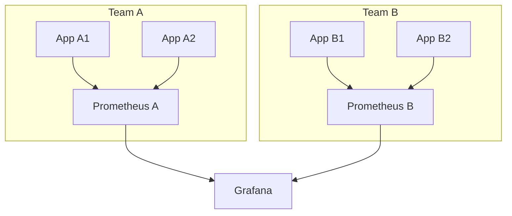
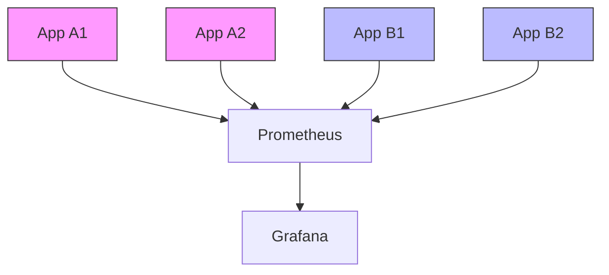
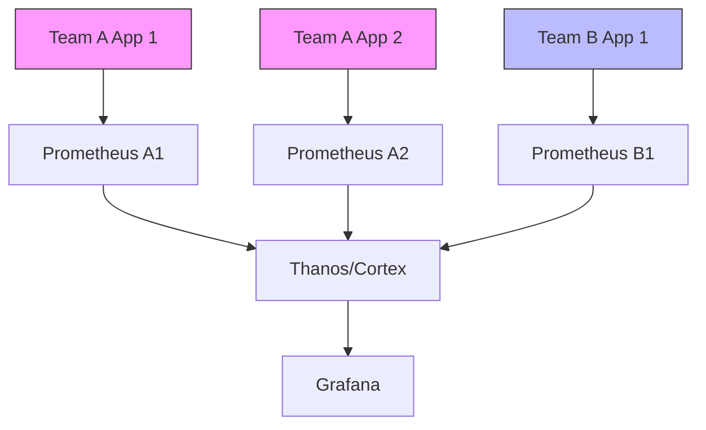
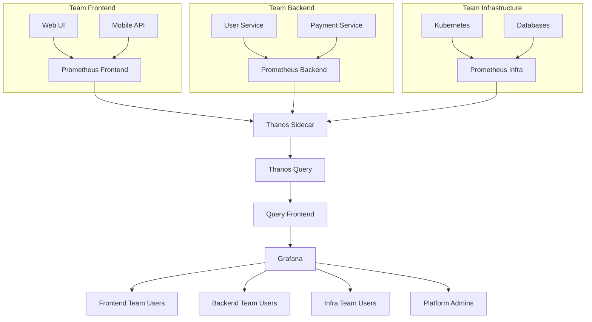

# Multi-tenant Prometheus

## Introduction

Multi-tenancy in Prometheus refers to the approach of using a single Prometheus instance or cluster to monitor multiple distinct teams, applications, or environments while keeping their data logically separated. This concept is particularly valuable in large organizations where centralized monitoring is needed, but different teams require their own isolated views and access controls.

In this guide, you'll learn:
- What multi-tenancy means in the context of Prometheus
- Different architectural approaches to implement multi-tenant Prometheus
- How to configure and manage a multi-tenant setup
- Security considerations and best practices
- Real-world examples of multi-tenant deployments

## Understanding Multi-tenancy in Prometheus

At its core, Prometheus wasn't designed with built-in multi-tenancy. It operates as a single system collecting metrics from various targets. However, organizations often need to:

1. Isolate data between different teams or applications
2. Apply different retention policies for different types of metrics
3. Implement separate access controls for different user groups
4. Optimize resource usage by sharing infrastructure

Let's explore how to address these requirements with different approaches.

## Approaches to Multi-tenant Prometheus

### 1. Multiple Prometheus Instances

The simplest form of multi-tenancy is running separate Prometheus instances for each tenant.



**Pros:**
- Complete isolation between tenants
- Straightforward to implement
- Independent scaling and configuration

**Cons:**
- Resource inefficiency
- Management overhead increases with each tenant
- Difficult to get a global view of all metrics

### 2. Label-based Multi-tenancy

This approach uses a single Prometheus instance but leverages Prometheus labels to separate data logically:



With this approach, all metrics are tagged with tenant identifiers like `tenant="team-a"` or `environment="production"`.

**Example configuration for a scrape job:**

```yaml
scrape_configs:
  - job_name: 'team-a-applications'
    relabel_configs:
      - source_labels: [__address__]
        target_label: tenant
        replacement: 'team-a'
    static_configs:
      - targets: ['app1:9090', 'app2:9090']
```

**Pros:**
- Resource efficient
- Central management
- Global views possible

**Cons:**
- No true isolation
- Limited security boundaries
- All tenants affected by performance issues

### 3. Thanos/Cortex Multi-tenancy

For advanced multi-tenancy, specialized systems built on top of Prometheus like Thanos or Cortex provide more robust solutions.



**Pros:**
- True multi-tenancy with isolation
- Horizontal scalability
- Long-term storage options
- Built-in access controls

**Cons:**
- Increased complexity
- Additional resources required
- Learning curve for operators

## Implementing Multi-tenant Prometheus with Thanos

Let's implement a multi-tenant setup using Thanos, a popular open-source project that extends Prometheus capabilities.

### Step 1: Set Up Individual Prometheus Instances

First, deploy separate Prometheus instances for each tenant with appropriate retention settings.

For Team A's Prometheus (`prometheus-team-a.yaml`):

```yaml
global:
  scrape_interval: 15s
  evaluation_interval: 15s
  external_labels:
    tenant: team-a

storage:
  tsdb:
    path: /prometheus
    retention: 24h

scrape_configs:
  - job_name: 'team-a-apps'
    static_configs:
      - targets: ['app-a1:9090', 'app-a2:9090']
```

For Team B's Prometheus (`prometheus-team-b.yaml`):

```yaml
global:
  scrape_interval: 15s
  evaluation_interval: 15s
  external_labels:
    tenant: team-b

storage:
  tsdb:
    path: /prometheus
    retention: 24h

scrape_configs:
  - job_name: 'team-b-apps'
    static_configs:
      - targets: ['app-b1:9090', 'app-b2:9090']
```

### Step 2: Deploy Thanos Sidecar with Each Prometheus

The Thanos sidecar component connects with Prometheus to expose its data:

```yaml
- args:
    - sidecar
    - --tsdb.path=/prometheus
    - --prometheus.url=http://localhost:9090
    - --objstore.config-file=/etc/thanos/bucket.yaml
    - --reloader.config-file=/etc/prometheus/prometheus.yaml
  image: quay.io/thanos/thanos:v0.28.0
  name: thanos-sidecar
  ports:
    - containerPort: 10901
      name: grpc
    - containerPort: 10902
      name: http
```

### Step 3: Set Up Thanos Query Component

The Thanos Query component provides a unified view across all Prometheus instances:

```yaml
apiVersion: apps/v1
kind: Deployment
metadata:
  name: thanos-query
spec:
  replicas: 1
  template:
    spec:
      containers:
      - name: thanos-query
        image: quay.io/thanos/thanos:v0.28.0
        args:
        - query
        - --log.level=info
        - --store=thanos-sidecar-team-a:10901
        - --store=thanos-sidecar-team-b:10901
        - --query.replica-label=replica
        ports:
        - name: http
          containerPort: 10902
```

### Step 4: Configure Tenant-Specific Access with Proxy

To control access based on tenants, we can use a proxy like thanos-query-frontend or a custom solution:

```yaml
apiVersion: apps/v1
kind: Deployment
metadata:
  name: thanos-query-frontend
spec:
  replicas: 1
  template:
    spec:
      containers:
      - name: thanos-query-frontend
        image: quay.io/thanos/thanos:v0.28.0
        args:
        - query-frontend
        - --log.level=info
        - --query-frontend.downstream-url=http://thanos-query:10902
        ports:
        - name: http
          containerPort: 10902
```

## Securing Multi-tenant Prometheus

Security is crucial in multi-tenant setups. Here are key considerations:

### 1. Authentication and Authorization

Implement authentication for API access and dashboards:

```yaml
# Example using OAuth proxy with Thanos
apiVersion: apps/v1
kind: Deployment
metadata:
  name: oauth2-proxy
spec:
  template:
    spec:
      containers:
      - name: oauth2-proxy
        image: quay.io/oauth2-proxy/oauth2-proxy:v7.3.0
        args:
        - --provider=google
        - --email-domain=*
        - --upstream=http://thanos-query-frontend:10902
        - --cookie-secret=...
        - --http-address=0.0.0.0:4180
```

### 2. Network Isolation

Use network policies to isolate Prometheus instances:

```yaml
apiVersion: networking.k8s.io/v1
kind: NetworkPolicy
metadata:
  name: prometheus-team-a-policy
spec:
  podSelector:
    matchLabels:
      app: prometheus-team-a
  ingress:
  - from:
    - podSelector:
        matchLabels:
          app: thanos-query
```

### 3. Query Filtering

Implement query filtering to ensure users can only access their own data:

```go
// Example middleware for filtering queries by tenant label
func TenantFilterMiddleware(next http.Handler) http.Handler {
  return http.HandlerFunc(func(w http.ResponseWriter, r *http.Request) {
    tenant := GetTenantFromRequest(r)
    
    // Modify the PromQL query to filter by tenant
    query := r.URL.Query().Get("query")
    newQuery := fmt.Sprintf("{tenant=\"%s\",%s}", tenant, query)
    r.URL.Query().Set("query", newQuery)
    
    next.ServeHTTP(w, r)
  })
}
```

## Real-world Example: Multi-tenant Monitoring for Microservices

Let's build a practical example for a company with three teams (Frontend, Backend, and Infrastructure), each running their own services.

### Architecture Overview



### Implementation Steps

1. **Configure Prometheus Instances**:
   - One instance per team with team-specific scrape configs
   - Add external labels to identify the team

2. **Set Up Thanos Components**:
   - Deploy sidecar with each Prometheus
   - Configure object storage for long-term metrics
   - Set up centralized query layer

3. **Configure Grafana**:
   - Create team-specific organizations or folders
   - Set up role-based access control
   - Configure data source filtering

4. **Implement Query Filtering**:
   - Use Thanos or custom middleware to filter queries
   - Apply tenant-specific rate limits

### Example Dashboard Access Control

In Grafana, you can configure team-specific access with:

```yaml
apiVersion: grafana.integreatly.org/v1alpha1
kind: GrafanaDashboard
metadata:
  name: frontend-overview
  labels:
    team: frontend
spec:
  json: >
    {
      "title": "Frontend Overview",
      "uid": "frontend-overview",
      ...
      "panels": [...]
    }
```

## Performance Considerations

Multi-tenant setups face unique performance challenges:

1. **Query Isolation**
   - Prevent resource-intensive queries from one tenant affecting others
   - Implement query timeouts and limits

2. **Storage Optimization**
   - Use appropriate retention policies per tenant
   - Consider downsampling for historical data

3. **Resource Allocation**
   - Allocate resources based on tenant requirements
   - Monitor resource usage patterns

Example resource limits for a Prometheus instance:

```yaml
resources:
  requests:
    memory: 2Gi
    cpu: 500m
  limits:
    memory: 4Gi
    cpu: 1000m
```

## Best Practices

1. **Standardize Labels**
   - Create consistent labeling conventions
   - Ensure tenant labels are automatically applied

2. **Document Isolation Boundaries**
   - Make it clear what isolation guarantees exist
   - Communicate limitations to teams

3. **Implement Graduated Access**
   - Allow some cross-tenant access for platform teams
   - Create clear escalation paths for issues

4. **Monitor the Monitoring**
   - Set up meta-monitoring for your Prometheus instances
   - Track query performance and resource usage

5. **Regular Security Audits**
   - Verify tenant isolation regularly
   - Check for potential data leakage

## Summary

Implementing multi-tenant Prometheus provides significant benefits for organizations managing monitoring at scale:

- **Resource Efficiency**: Sharing infrastructure reduces costs
- **Centralized Management**: Simplified operations and upgrades
- **Flexible Access Controls**: Tailored to organizational structure
- **Consistent Experience**: Standardized monitoring across teams

While Prometheus wasn't designed with native multi-tenancy, the approaches outlined in this guide—particularly using Thanos or Cortex—provide robust solutions for implementing effective multi-tenant monitoring.

## Additional Resources

To deepen your understanding of multi-tenant Prometheus, explore these resources:

- [Thanos Project Documentation](https://thanos.io/)
- [Cortex Project Documentation](https://cortexmetrics.io/)
- [Prometheus Operator for Kubernetes](https://github.com/prometheus-operator/prometheus-operator)
- [Grafana Multi-Org Setup Guide](https://grafana.com/docs/grafana/latest/administration/organization-management/)

## Exercises

1. Set up a basic multi-tenant Prometheus using the label-based approach with three example applications.
2. Create a Thanos-based multi-tenant setup in a local Kubernetes environment.
3. Implement query filtering middleware that enforces tenant isolation for Prometheus queries.
4. Configure Grafana dashboards with tenant-specific views of the same underlying metrics.
5. Design a disaster recovery plan for a multi-tenant Prometheus deployment.