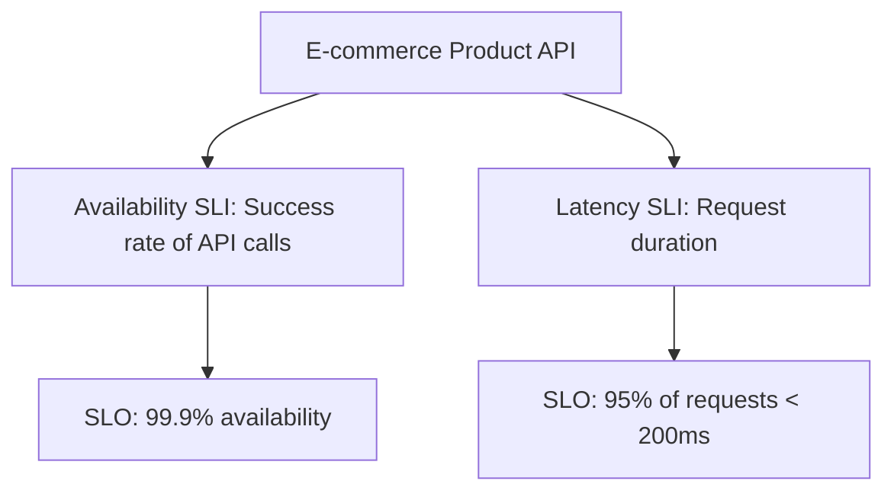
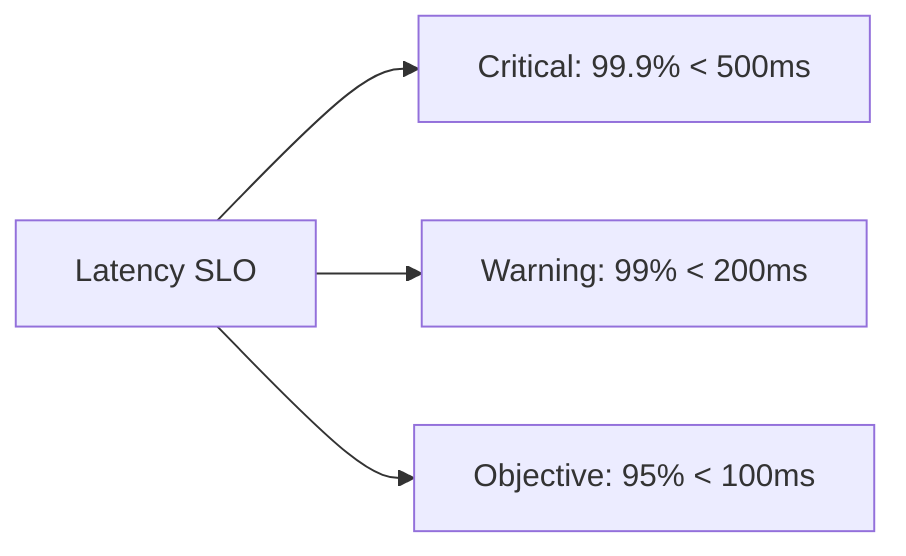

# Prometheus and SLOs

## Introduction

Service Level Objectives (SLOs) are a critical component of modern reliability engineering practices. They provide a framework for defining, measuring, and maintaining the reliability of your services. In this tutorial, we'll explore how to implement SLOs using Prometheus, a powerful open-source monitoring and alerting system.

SLOs are derived from Service Level Indicators (SLIs), which are quantitative measurements of service performance. By setting targets for these indicators, we create objectives that help teams maintain service reliability while allowing for innovation and development velocity.

## Understanding SLOs

### What are SLOs?

An SLO is a target value or range for a service level that is measured by an SLI. For example:

- "99.9% of requests will complete in less than 300ms"
- "99.99% of API calls will be successful"
- "The service will be available 99.95% of the time"

### Key Components of SLOs

1. **Service Level Indicators (SLIs)**: Metrics that measure service performance
2. **Service Level Objectives (SLOs)**: Target values for SLIs
3. **Error Budget**: The allowed amount of failure within the SLO

### Why SLOs Matter

SLOs provide several benefits:

- They create a common language between developers, operations, and business stakeholders
- They help prioritize work by focusing on what impacts user experience
- They enable teams to make data-driven decisions about reliability vs. feature development

## Implementing SLOs with Prometheus

### Prerequisites

Before implementing SLOs with Prometheus, you should have:

- A Prometheus server up and running
- Basic understanding of PromQL (Prometheus Query Language)
- Services instrumented with Prometheus metrics

### Step 1: Define Your SLIs

First, identify the critical user journeys and define metrics that represent good service from the user's perspective. Common SLIs include:

- **Availability**: The proportion of requests that are successful
- **Latency**: How long it takes to respond to a request
- **Throughput**: The number of requests handled per unit time
- **Error Rate**: The proportion of requests that fail

Let's define some example SLIs using Prometheus metrics:

```promql
# Availability SLI
sum(rate(http_requests_total{status=~"2..|3..", service="api"}[5m])) 
/ 
sum(rate(http_requests_total{service="api"}[5m]))

# Latency SLI (percentage of requests faster than 300ms)
sum(rate(http_request_duration_seconds_bucket{service="api", le="0.3"}[5m])) 
/ 
sum(rate(http_request_duration_seconds_count{service="api"}[5m]))
```

### Step 2: Set SLO Targets

Once you've defined your SLIs, set realistic targets for them. Start conservatively and adjust based on historical data:

- Availability: 99.9% (three nines)
- Latency: 95% of requests complete within 300ms

### Step 3: Calculate Error Budgets

The error budget is the allowed amount of failure within your SLO. For example, with a 99.9% availability SLO, your error budget is 0.1% of requests.

In Prometheus, we can calculate the error budget consumption like this:

```promql
# Error budget for availability (100% - SLO percentage)
1 - (
  sum(rate(http_requests_total{status=~"2..|3..", service="api"}[5m])) 
  / 
  sum(rate(http_requests_total{service="api"}[5m]))
)

# Error budget consumption over time
(1 - minimal_slo_threshold) - (
  sum(rate(http_requests_total{status=~"2..|3..", service="api"}[30d])) 
  / 
  sum(rate(http_requests_total{service="api"}[30d]))
)
```

### Step 4: Create SLO Recording Rules

To efficiently calculate SLOs over longer time periods, create Prometheus recording rules. Add these to your `prometheus.yml` configuration:

```yaml
groups:
  - name: slo_rules
    rules:
      - record: job:sli_availability:ratio_rate5m
        expr: |
          sum without(instance) (rate(http_requests_total{status=~"2..|3..", job="api"}[5m]))
          /
          sum without(instance) (rate(http_requests_total{job="api"}[5m]))
      
      - record: job:sli_latency:ratio_rate5m
        expr: |
          sum without(instance) (rate(http_request_duration_seconds_bucket{job="api", le="0.3"}[5m]))
          /
          sum without(instance) (rate(http_request_duration_seconds_count{job="api"}[5m]))
```

### Step 5: Implement SLO Alerts

Create alerts that trigger when you're at risk of violating your SLO. A common approach is to alert when you're burning through your error budget too quickly:

```yaml
groups:
  - name: slo_alerts
    rules:
      - alert: HighErrorBudgetBurn
        expr: |
          (
            1 - (
              sum(rate(http_requests_total{status=~"2..|3..", job="api"}[1h]))
              /
              sum(rate(http_requests_total{job="api"}[1h]))
            )
          ) > (1 - 0.999) * 14.4
        for: 5m
        labels:
          severity: warning
        annotations:
          summary: "High error budget burn for API"
          description: "Error budget consumption is higher than expected, which may lead to SLO violation."
```

This alert triggers when the error budget consumption rate for the past hour is more than 14.4 times the allowed rate (which would consume the entire error budget in less than 1 day).

## Visualizing SLOs with Grafana

Prometheus data can be visualized in Grafana to create SLO dashboards. Here's how to set up a basic SLO dashboard:

1. Create a new Grafana dashboard
2. Add a panel for each SLI
3. Use Prometheus as the data source
4. Configure the following queries:

```promql
# Panel for availability SLO
sum(rate(http_requests_total{status=~"2..|3..", job="api"}[$__rate_interval]))
/
sum(rate(http_requests_total{job="api"}[$__rate_interval]))

# Panel for latency SLO
sum(rate(http_request_duration_seconds_bucket{job="api", le="0.3"}[$__rate_interval]))
/
sum(rate(http_request_duration_seconds_count{job="api"}[$__rate_interval]))

# Panel for error budget consumption
1 - 0.999 - (
  sum(rate(http_requests_total{status=~"2..|3..", job="api"}[30d]))
  /
  sum(rate(http_requests_total{job="api"}[30d]))
)
```

5. Add thresholds to visually indicate SLO compliance

## Real-World Example: E-commerce API SLOs

Let's walk through implementing SLOs for an e-commerce API:

### Scenario: E-commerce Product API

We have a product API that needs to be reliable for customers browsing our online store.

### Step 1: Define SLIs and SLOs



### Step 2: Instrument the Service

Make sure your API is instrumented to record the necessary metrics:

```python
from prometheus_client import Counter, Histogram
import time

# Define metrics
REQUEST_COUNT = Counter(
    'http_requests_total', 
    'Total HTTP Requests', 
    ['method', 'endpoint', 'status']
)

REQUEST_LATENCY = Histogram(
    'http_request_duration_seconds', 
    'HTTP Request Duration in seconds',
    ['method', 'endpoint'],
    buckets=[0.05, 0.1, 0.2, 0.3, 0.5, 0.8, 1, 2, 3, 5, 8, 13, 21]
)

# Use in request handlers
def get_product(product_id):
    start_time = time.time()
    
    try:
        # Business logic to fetch product
        result = database.get_product(product_id)
        REQUEST_COUNT.labels(method='GET', endpoint='/products', status='200').inc()
        return result
    except Exception as e:
        REQUEST_COUNT.labels(method='GET', endpoint='/products', status='500').inc()
        raise e
    finally:
        duration = time.time() - start_time
        REQUEST_LATENCY.labels(method='GET', endpoint='/products').observe(duration)
```

### Step 3: Create PromQL Queries for SLOs

```promql
# Availability SLO (99.9%)
sum(rate(http_requests_total{method="GET", endpoint="/products", status="200"}[5m]))
/
sum(rate(http_requests_total{method="GET", endpoint="/products"}[5m]))

# Latency SLO (95% of requests < 200ms)
sum(rate(http_request_duration_seconds_bucket{method="GET", endpoint="/products", le="0.2"}[5m]))
/
sum(rate(http_request_duration_seconds_count{method="GET", endpoint="/products"}[5m]))
```

### Step 4: Calculate Long-term SLO Performance

For monthly tracking, set up recording rules:

```yaml
groups:
  - name: e_commerce_slos
    rules:
      - record: sli:availability:ratio_30d
        expr: |
          sum(rate(http_requests_total{method="GET", endpoint="/products", status="200"}[30d]))
          /
          sum(rate(http_requests_total{method="GET", endpoint="/products"}[30d]))
      
      - record: sli:latency:ratio_30d
        expr: |
          sum(rate(http_request_duration_seconds_bucket{method="GET", endpoint="/products", le="0.2"}[30d]))
          /
          sum(rate(http_request_duration_seconds_count{method="GET", endpoint="/products"}[30d]))
```

### Step 5: Set Up Error Budget Policies

Create a policy for what happens when error budgets are depleted:

1. If less than 50% of the error budget is consumed: Continue feature development
2. If 50-75% is consumed: Slow down new deployments, focus on reliability improvements
3. If more than 75% is consumed: Freeze feature development, focus entirely on reliability

## Using Multi-window, Multi-burn Rate Alerts

A more sophisticated approach to SLO alerting uses multiple time windows and burn rates:

```yaml
groups:
  - name: slo_burn_rate_alerts
    rules:
      # Fast burn: 1 hour window, 14.4x burn rate (would consume all error budget in < 1 day)
      - alert: ErrorBudgetBurningFast
        expr: |
          (
            1 - (
              sum(rate(http_requests_total{status=~"2..|3..", job="api"}[1h]))
              /
              sum(rate(http_requests_total{job="api"}[1h]))
            )
          ) > (1 - 0.999) * 14.4
        for: 10m
        labels:
          severity: critical
          category: slo
        annotations:
          summary: "Error budget burning extremely quickly"
          description: "Error budget is being consumed at over 14x the sustainable rate."
          
      # Slow burn: 6 hour window, 6x burn rate (would consume all error budget in < 1 week)
      - alert: ErrorBudgetBurningSlow
        expr: |
          (
            1 - (
              sum(rate(http_requests_total{status=~"2..|3..", job="api"}[6h]))
              /
              sum(rate(http_requests_total{job="api"}[6h]))
            )
          ) > (1 - 0.999) * 6
        for: 30m
        labels:
          severity: warning
          category: slo
        annotations:
          summary: "Error budget burning quickly"
          description: "Error budget is being consumed at over 6x the sustainable rate."
```

## Advanced SLO Patterns

### Apdex Score for User Satisfaction

The Application Performance Index (Apdex) is a standard for measuring user satisfaction:

```promql
(
  sum(rate(http_request_duration_seconds_bucket{le="0.2"}[5m])) +
  sum(rate(http_request_duration_seconds_bucket{le="0.5", le!="0.2"}[5m])) * 0.5
) / sum(rate(http_request_duration_seconds_count[5m]))
```

This gives full credit to "satisfied" requests (< 200ms) and half credit to "tolerating" requests (200ms-500ms).

### Multiple Severity Levels

You can define different severity levels for your SLOs:



### SLO for API Dependencies

When your service depends on other services, you can create SLOs that account for this:

```promql
# Availability accounting for dependencies
min(
  sum(rate(http_requests_total{status=~"2..|3..", service="api"}[5m])) 
  / 
  sum(rate(http_requests_total{service="api"}[5m])),
  
  sum(rate(http_requests_total{status=~"2..|3..", service="auth"}[5m])) 
  / 
  sum(rate(http_requests_total{service="auth"}[5m]))
)
```

## Summary

In this tutorial, we've explored how to implement Service Level Objectives (SLOs) using Prometheus. We've covered:

- The fundamentals of SLOs, SLIs, and error budgets
- How to define appropriate SLIs for your services
- Implementing SLOs with Prometheus and PromQL
- Setting up recording rules for efficient SLO calculation
- Creating alerts based on error budget consumption
- Visualizing SLOs in Grafana
- Real-world examples of SLO implementation
- Advanced SLO patterns and techniques

By implementing SLOs, you'll be able to make data-driven decisions about service reliability and balance feature development with operational stability.

## Exercises

1. Calculate the error budget for a service with a 99.5% availability SLO over a 30-day period. How many minutes of downtime are allowed?

2. Write PromQL queries to implement SLOs for a service of your choice. Define at least one availability SLI and one latency SLI.

3. Create a multi-window, multi-burn-rate alerting strategy for your SLOs.

4. Design a Grafana dashboard that visualizes your SLOs and error budget consumption.

## Additional Resources

- [Implementing SLOs](https://sre.google/workbook/implementing-slos/)
- [Prometheus Documentation](https://prometheus.io/docs/introduction/overview/)
- [SLOs with Prometheus](https://promtools.dev/docs/slo)
- [Site Reliability Engineering: How Google Runs Production Systems](https://sre.google/sre-book/service-level-objectives/)
- [Practical Alerting Based on SLOs](https://sre.google/workbook/alerting-on-slos/)