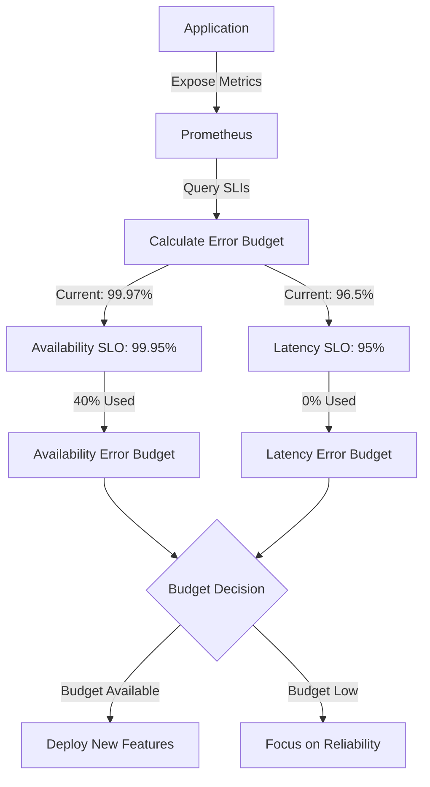

# Prometheus and Error Budgets

## Introduction

Error budgets are a fundamental concept in Site Reliability Engineering (SRE) that provide a quantitative approach to managing service reliability. They represent the acceptable level of failure or downtime a service can experience before corrective action is required. Prometheus, with its powerful monitoring and alerting capabilities, serves as an excellent tool for implementing and tracking error budgets.

In this guide, we'll explore how to use Prometheus to define, measure, and maintain error budgets for your services, helping you balance reliability with the pace of innovation.

## Understanding Error Budgets

### What is an Error Budget?

An error budget is the difference between:
- Your Service Level Objective (SLO) - the target reliability you promise to users
- The actual measured reliability of your service

For example, if your SLO states that your API should have 99.9% availability in a month (allowing for about 43 minutes of downtime), and you've only used 10 minutes of that allowed downtime, your remaining error budget would be 33 minutes.

### The Error Budget Formula

The basic formula for calculating an error budget is:

```
Error Budget = (1 - SLO) × Total Service Time
```

For a 99.9% SLO over a 30-day month:
```
Error Budget = (1 - 0.999) × (30 days × 24 hours × 60 minutes)
Error Budget = 0.001 × 43,200 minutes = 43.2 minutes
```

### Why Error Budgets Matter

Error budgets provide several benefits:

1. **Objective Decision Making**: They create a data-driven framework for deciding when to focus on new features versus fixing reliability issues
2. **Aligning Incentives**: They help development and operations teams find the right balance between speed and stability
3. **Risk Management**: They allow for controlled risk-taking without compromising overall service health
4. **Prioritization**: They help teams focus on the most impactful reliability improvements

## Implementing Error Budgets with Prometheus

### Prerequisites

Before implementing error budgets, you need:

1. Clearly defined Service Level Indicators (SLIs) - metrics that measure service health
2. Service Level Objectives (SLOs) - target values for your SLIs
3. Prometheus set up to collect relevant metrics
4. Grafana (optional but recommended) for visualization

### Step 1: Define Your SLIs in Prometheus

First, you need to identify and collect the metrics that represent your service's health. Common SLIs include:

- **Availability**: The percentage of successful requests
- **Latency**: Response time for requests
- **Error Rate**: The percentage of failed requests
- **Throughput**: The number of requests handled

Let's implement a basic availability SLI using Prometheus:

```yaml
# prometheus.yml
scrape_configs:
  - job_name: 'api'
    metrics_path: '/metrics'
    static_configs:
      - targets: ['api-server:8080']
```

Your application should expose metrics that allow you to count total requests and errors:

```go
// Go example with Prometheus client
package main

import (
    "net/http"
    "github.com/prometheus/client_golang/prometheus"
    "github.com/prometheus/client_golang/prometheus/promauto"
    "github.com/prometheus/client_golang/prometheus/promhttp"
)

var (
    httpRequestsTotal = promauto.NewCounterVec(
        prometheus.CounterOpts{
            Name: "http_requests_total",
            Help: "Total number of HTTP requests",
        },
        []string{"path", "status"},
    )
)

func recordMetrics(path string, status int) {
    httpRequestsTotal.WithLabelValues(path, fmt.Sprintf("%d", status)).Inc()
}

func handler(w http.ResponseWriter, r *http.Request) {
    // Handle request...
    recordMetrics(r.URL.Path, 200)
}

func main() {
    http.HandleFunc("/", handler)
    http.Handle("/metrics", promhttp.Handler())
    http.ListenAndServe(":8080", nil)
}
```

### Step 2: Create PromQL Queries for SLOs

Once your metrics are being collected, you can create PromQL queries to calculate your SLIs:

```promql
# Availability SLI: Percentage of successful requests
(sum(rate(http_requests_total{status=~"2.."}[5m])) / sum(rate(http_requests_total[5m]))) * 100
```

For latency SLO (assuming you have a histogram metric for request duration):

```promql
# Latency SLI: Percentage of requests that complete within your target time (e.g., 300ms)
sum(rate(http_request_duration_seconds_bucket{le="0.3"}[5m])) / sum(rate(http_request_duration_seconds_count[5m]))
```

### Step 3: Calculate Error Budget Consumption

To calculate error budget consumption, you need to measure how much of your allowed error budget you've used:

```promql
# For a 99.9% availability SLO
# First, calculate the error rate (complement of availability)
1 - (sum(rate(http_requests_total{status=~"2.."}[24h])) / sum(rate(http_requests_total[24h])))

# Then, compare to your allowed error rate
# Error budget used (as a percentage)
(1 - (sum(rate(http_requests_total{status=~"2.."}[24h])) / sum(rate(http_requests_total[24h]))) / 0.001) * 100
```

Where `0.001` represents your allowed error rate for a 99.9% SLO.

### Step 4: Create a Grafana Dashboard

A Grafana dashboard can help visualize your SLOs and error budget consumption. Here's how to structure it:

1. Create a panel showing your SLI over time
2. Add a panel showing error budget consumption
3. Include burn rate (how quickly you're using your error budget)
4. Add remaining error budget for the current period

Let's create a Grafana dashboard using JSON:

```json
{
  "title": "Error Budget Dashboard",
  "panels": [
    {
      "title": "Availability SLI",
      "type": "graph",
      "targets": [
        {
          "expr": "(sum(rate(http_requests_total{status=~\"2..\"}[5m])) / sum(rate(http_requests_total[5m]))) * 100",
          "legendFormat": "Availability (%)"
        }
      ],
      "yaxes": [
        {
          "min": 90,
          "max": 100
        }
      ]
    },
    {
      "title": "Error Budget Consumption",
      "type": "gauge",
      "targets": [
        {
          "expr": "(1 - (sum(rate(http_requests_total{status=~\"2..\"}[30d])) / sum(rate(http_requests_total[30d]))) / 0.001) * 100",
          "legendFormat": "Budget Used (%)"
        }
      ],
      "thresholds": [
        {
          "value": 50,
          "color": "green"
        },
        {
          "value": 80,
          "color": "yellow"
        },
        {
          "value": 90,
          "color": "red"
        }
      ],
      "min": 0,
      "max": 100
    }
  ]
}
```

### Step 5: Set Up Alerting on Error Budget Consumption

Create alerts that trigger when you're consuming your error budget too quickly:

```yaml
# prometheus-rules.yml
groups:
- name: error-budget
  rules:
  - alert: ErrorBudgetBurnRate
    expr: (1 - (sum(rate(http_requests_total{status=~"2.."}[1h])) / sum(rate(http_requests_total[1h])))) > (0.001 * 24)
    for: 5m
    labels:
      severity: warning
    annotations:
      summary: "Error budget burning too fast"
      description: "Error budget is being consumed 24x faster than allocated, which would deplete the monthly budget in approximately {{ $value | humanizeDuration }}."
```

This alert triggers when your error rate exceeds 24 times your allowed rate (which would consume your entire monthly budget in one day).

## Multi-Window, Multi-Burn-Rate Alerts

For more sophisticated error budget monitoring, implement multi-window, multi-burn-rate alerts:

```yaml
# prometheus-rules.yml
groups:
- name: error-budget
  rules:
  - alert: ErrorBudgetBurnFast
    expr: (1 - (sum(rate(http_requests_total{status=~"2.."}[5m])) / sum(rate(http_requests_total[5m])))) > (0.001 * 144)
    for: 5m
    labels:
      severity: critical
    annotations:
      summary: "Error budget burning very fast"
      description: "Error budget is being consumed 144x faster than allocated, which would deplete the monthly budget in approximately 5 hours."
      
  - alert: ErrorBudgetBurnMedium
    expr: (1 - (sum(rate(http_requests_total{status=~"2.."}[30m])) / sum(rate(http_requests_total[30m])))) > (0.001 * 24)
    for: 15m
    labels:
      severity: warning
    annotations:
      summary: "Error budget burning at medium rate"
      description: "Error budget is being consumed 24x faster than allocated, which would deplete the monthly budget in approximately 1 day."
      
  - alert: ErrorBudgetBurnSlow
    expr: (1 - (sum(rate(http_requests_total{status=~"2.."}[6h])) / sum(rate(http_requests_total[6h])))) > (0.001 * 4)
    for: 1h
    labels:
      severity: warning
    annotations:
      summary: "Error budget burning steadily"
      description: "Error budget is being consumed 4x faster than allocated, which would deplete the monthly budget in approximately 1 week."
```

This approach uses different time windows and burn rates to detect both fast-burning issues and slower, sustained problems.

## Real-World Example: Implementing Error Budgets for an E-commerce API

Let's walk through a complete example for an e-commerce API service:

### 1. Define SLOs

For our e-commerce API, we'll establish:
- 99.95% availability (2.2 hours downtime per month)
- 95% of requests completing in under 200ms

### 2. Instrument Your Application

```go
package main

import (
    "time"
    "net/http"
    "github.com/prometheus/client_golang/prometheus"
    "github.com/prometheus/client_golang/prometheus/promauto"
    "github.com/prometheus/client_golang/prometheus/promhttp"
)

var (
    httpRequestsTotal = promauto.NewCounterVec(
        prometheus.CounterOpts{
            Name: "ecommerce_http_requests_total",
            Help: "Total number of HTTP requests for e-commerce API",
        },
        []string{"endpoint", "status"},
    )
    
    requestDuration = promauto.NewHistogramVec(
        prometheus.HistogramOpts{
            Name:    "ecommerce_request_duration_seconds",
            Help:    "Duration of HTTP requests for e-commerce API",
            Buckets: prometheus.ExponentialBuckets(0.01, 2, 10), // 10ms to ~5s
        },
        []string{"endpoint"},
    )
)

func apiHandler(w http.ResponseWriter, r *http.Request) {
    start := time.Now()
    
    // Process request...
    
    duration := time.Since(start).Seconds()
    requestDuration.WithLabelValues(r.URL.Path).Observe(duration)
    httpRequestsTotal.WithLabelValues(r.URL.Path, "200").Inc()
}

func main() {
    http.HandleFunc("/api/", apiHandler)
    http.Handle("/metrics", promhttp.Handler())
    http.ListenAndServe(":8080", nil)
}
```

### 3. Calculate Error Budgets with PromQL

For availability:

```promql
# Availability SLI
availability_sli = sum(rate(ecommerce_http_requests_total{status=~"2.."}[1h])) / sum(rate(ecommerce_http_requests_total[1h]))

# Error budget consumption (for 99.95% SLO)
error_budget_used = (1 - availability_sli) / 0.0005
```

For latency:

```promql
# Latency SLI (% of requests under 200ms)
latency_sli = sum(rate(ecommerce_request_duration_seconds_bucket{le="0.2"}[1h])) / sum(rate(ecommerce_request_duration_seconds_count[1h]))

# Error budget consumption (for 95% SLO)
latency_budget_used = (1 - latency_sli) / 0.05
```

### 4. Visualize with a Mermaid Diagram



### 5. Using Error Budgets in Practice

1. **Weekly SRE Review**:
   - Review current error budget consumption
   - If over 50% consumed, prioritize reliability work
   - If under 50% consumed, proceed with feature work

2. **Automated Release Policy**:
   - Configure your CI/CD system to check error budget before deploying:

```bash
#!/bin/bash
# Script to check error budget before deployment

# Query Prometheus for current error budget consumption
BUDGET_CONSUMED=$(curl -s "http://prometheus:9090/api/v1/query?query=(1+-+(sum(rate(ecommerce_http_requests_total%7Bstatus%3D~%222..%22%7D%5B30d%5D))+%2F+sum(rate(ecommerce_http_requests_total%5B30d%5D))))+%2F+0.0005" | jq '.data.result[0].value[1]' | tr -d '"')

# If budget consumption is over 80%, block deployment
if (( $(echo "$BUDGET_CONSUMED > 0.8" | bc -l) )); then
    echo "Error budget is over 80% consumed. Blocking deployment."
    exit 1
else
    echo "Error budget is at acceptable levels. Proceeding with deployment."
    # Continue with deployment
fi
```

## Implementing Error Budget Policies

The real power of error budgets comes from the policies you build around them:

### Example Error Budget Policy

1. **Define Error Budget Thresholds**:
   - Green: `<50%` consumed - Accelerate feature development
   - Yellow: `50-80%` consumed - Balance features and reliability
   - Red: `>80%` consumed - Focus on reliability improvements

2. **Establish Response Actions**:
   - Implement a "feature freeze" when error budget is depleted
   - Require additional testing for changes when budget is `<30%`
   - Auto-approve low-risk changes when budget is `>70%`

3. **Document the Policy in Version Control**:

```yaml
# error-budget-policy.yaml
service: ecommerce-api
slos:
  - name: availability
    target: 99.95%
    measurement: sum(rate(ecommerce_http_requests_total{status=~"2.."}[window])) / sum(rate(ecommerce_http_requests_total[window]))
  - name: latency
    target: 95% under 200ms
    measurement: sum(rate(ecommerce_request_duration_seconds_bucket{le="0.2"}[window])) / sum(rate(ecommerce_request_duration_seconds_count[window]))

error_budget_policies:
  - budget_remaining: <20%
    actions:
      - Halt all non-essential deployments
      - Escalate to engineering leadership
      - Form incident team if not already in place
  - budget_remaining: 20-50%
    actions:
      - Require additional pre-deployment testing
      - Implement canary deployments for all changes
      - Prioritize reliability improvements
  - budget_remaining: >50%
    actions:
      - Normal development velocity
      - Standard change management procedures
```

## Advanced Error Budget Concepts

### 1. Weighted Error Budgets

Not all errors have the same impact. You can weight your error budget by the importance of different endpoints:

```promql
# Weighted error budget for critical endpoints
sum(rate(ecommerce_http_requests_total{status!~"2..", endpoint=~"/(cart|checkout)/.*"}[1h])) * 5 +
sum(rate(ecommerce_http_requests_total{status!~"2..", endpoint=~"/browse/.*"}[1h])) * 1
```

### 2. Dynamic SLOs

For seasonal businesses, you might want stricter SLOs during high-traffic periods:

```promql
# Dynamic SLO based on traffic
(
  sum(rate(ecommerce_http_requests_total[1d])) > 1000000 
  and (1 - (sum(rate(ecommerce_http_requests_total{status=~"2.."}[1h])) / sum(rate(ecommerce_http_requests_total[1h])))) > 0.0002
)
or
(
  sum(rate(ecommerce_http_requests_total[1d])) <= 1000000 
  and (1 - (sum(rate(ecommerce_http_requests_total{status=~"2.."}[1h])) / sum(rate(ecommerce_http_requests_total[1h])))) > 0.001
)
```

### 3. Customer-Centric Error Budgets

Rather than system-level metrics, measure error budgets from the customer perspective:

```promql
# User-journey success rate
sum(rate(user_checkout_journey_success[1h])) / sum(rate(user_checkout_journey_attempts[1h]))
```

## Common Pitfalls and Challenges

1. **Too Many SLOs**: Start with just 1-3 key SLOs that genuinely reflect user experience
2. **Incorrect Time Windows**: Use appropriate time windows for your traffic patterns
3. **Failure to Reset**: Remember to reset error budgets at the end of each measurement period
4. **Ignoring Burn Rate**: Monitor not just total consumption but how quickly budget is being depleted
5. **Lack of Buy-In**: Ensure teams understand and commit to the error budget policy

## Summary

Error budgets provide a quantitative framework for balancing reliability and innovation. With Prometheus, you can implement a robust error budget system by:

1. Defining clear SLOs based on user experience
2. Instrumenting your applications to capture relevant metrics
3. Creating PromQL queries to calculate SLIs and error budget consumption
4. Setting up visualizations and alerts
5. Implementing policies that guide decision-making based on error budget status

By following these steps, you can create a data-driven reliability culture that supports both stability and innovation.

## Additional Resources

For further learning about error budgets and SRE practices:

- Read Google's SRE Book, particularly the chapters on SLOs and Error Budgets
- Explore Prometheus documentation for more advanced PromQL queries
- Research "Multi-Window, Multi-Burn-Rate" alerting patterns
- Practice with the examples in this guide on a test service

## Exercises

1. Set up basic availability and latency SLOs for a simple web service
2. Create a Grafana dashboard to visualize your error budgets
3. Implement a multi-window alert system for different burn rates
4. Draft an error budget policy for your team
5. Simulate an outage and observe how it affects your error budget

Remember, the goal of error budgets isn't perfect reliability, but rather the right level of reliability for your users and business needs.