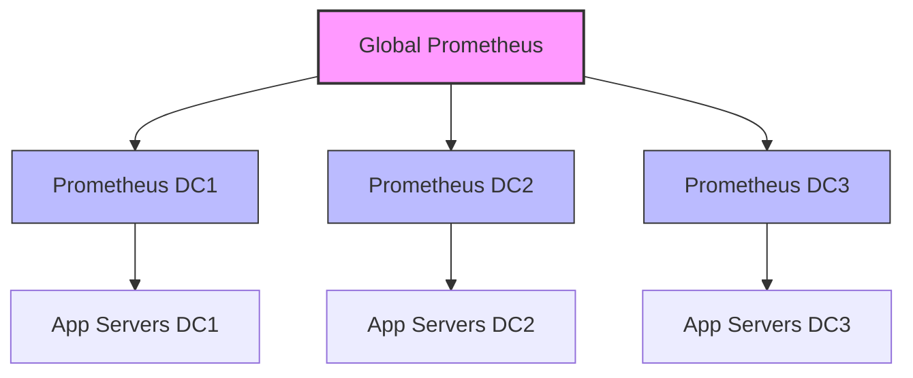
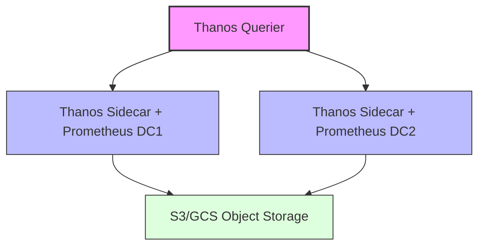

# Prometheus Federation

## Introduction

Prometheus Federation is an advanced feature that allows you to create hierarchical monitoring systems by enabling one Prometheus server to scrape selected metrics from another Prometheus server. This approach is particularly useful when your infrastructure grows beyond what a single Prometheus instance can efficiently monitor, enabling you to build scalable, hierarchical monitoring architectures.

In this guide, we'll explore how federation works, when to use it, and how to implement it in your monitoring infrastructure.

## What is Prometheus Federation?

Federation in Prometheus allows you to create a hierarchical structure where higher-level Prometheus servers can scrape selected metrics from lower-level Prometheus servers. Instead of having all monitoring targets report to a single Prometheus instance, you distribute the load across multiple instances and then aggregate specific metrics at a higher level.



## When to Use Federation

Federation is beneficial in several scenarios:

1. **Large-scale deployments**: When your infrastructure is too large for a single Prometheus server to handle
2. **Geographically distributed systems**: When you have monitoring targets across multiple regions or data centers
3. **Organizational boundaries**: When different teams manage different parts of the infrastructure
4. **High-availability requirements**: When you need redundancy in your monitoring setup
5. **Hierarchical views**: When you want different levels of aggregation (e.g., per-datacenter, global)

## Types of Federation

Prometheus supports two main approaches to federation:

### 1. Hierarchical Federation

In hierarchical federation, you set up multiple levels of Prometheus servers. Lower-level servers scrape metrics from actual targets, while higher-level servers scrape aggregated metrics from the lower-level servers.

### 2. Cross-Service Federation

In cross-service federation, Prometheus servers in different service domains scrape metrics from each other to gain visibility across service boundaries.

## Setting Up Federation

Let's walk through the steps to implement federation in Prometheus:

### Step 1: Expose the Metrics

By default, a Prometheus server exposes its own metrics at the `/metrics` endpoint. However, to expose metrics from its scrape targets, you need to use the federated endpoint at `/federate`.

The `/federate` endpoint accepts a `match[]` parameter that specifies which metrics should be exposed for federation. This parameter supports the same syntax as the `match[]` parameter in Prometheus's HTTP API.

### Step 2: Configure the Higher-Level Prometheus Server

On your higher-level (or "global") Prometheus server, you need to add a scrape configuration that collects metrics from the lower-level Prometheus servers:

```yaml
scrape_configs:
  - job_name: 'federate'
    scrape_interval: 15s
    honor_labels: true
    metrics_path: '/federate'
    params:
      'match[]':
        - '{job="prometheus"}'
        - '{__name__=~"job:.*"}'
        - '{__name__=~"node_.*"}'
    static_configs:
      - targets:
        - 'prometheus-dc1:9090'
        - 'prometheus-dc2:9090'
        - 'prometheus-dc3:9090'
```

In this configuration:

- `job_name`: Identifies this federation scrape job
- `scrape_interval`: Defines how often to scrape metrics from federated Prometheus servers
- `honor_labels`: When set to `true`, this preserves the original labels from the federated Prometheus servers
- `metrics_path`: Set to `/federate` to use the federation endpoint
- `params`: Contains the match parameters that specify which metrics to collect
- `static_configs`: Lists the Prometheus servers to federate from

### Step 3: Choose Metrics to Federate

It's crucial to be selective about which metrics you federate. Federating all metrics would defeat the purpose of distribution and could lead to performance issues. Consider these guidelines:

1. **Federate aggregated metrics**: Instead of federating raw metrics, consider using recording rules on the lower-level Prometheus servers to pre-aggregate metrics
2. **Federate critical alerts**: Metrics that trigger critical alerts should be federated to provide global visibility
3. **Limit cardinality**: Be cautious with high-cardinality metrics (those with many label combinations)

Here's an example of a recording rule that pre-aggregates metrics on a lower-level Prometheus:

```yaml
groups:
  - name: federation
    interval: 30s
    rules:
      - record: job:node_cpu_seconds:avg_rate5m
        expr: avg by (job) (rate(node_cpu_seconds_total{mode="user"}[5m]))
```

## Practical Example: Multi-Datacenter Monitoring

Let's walk through a practical example of setting up federation for monitoring multiple datacenters:

### Lower-level Prometheus Configuration (DC1)

First, create recording rules to pre-aggregate metrics:

```yaml
# prometheus-dc1-rules.yml
groups:
  - name: datacenter_aggregation
    interval: 30s
    rules:
      - record: dc:memory_usage:percent
        expr: 100 * (1 - sum(node_memory_MemAvailable_bytes) / sum(node_memory_MemTotal_bytes))
      - record: dc:cpu_usage:percent
        expr: 100 * (1 - avg(rate(node_cpu_seconds_total{mode="idle"}[5m])))
      - record: dc:service_errors:rate5m
        expr: sum(rate(http_requests_total{status=~"5.."}[5m])) / sum(rate(http_requests_total[5m])) * 100
```

### Global Prometheus Configuration

Next, configure the global Prometheus to scrape these aggregated metrics:

```yaml
# prometheus-global.yml
scrape_configs:
  - job_name: 'federate'
    scrape_interval: 15s
    honor_labels: true
    metrics_path: '/federate'
    params:
      'match[]':
        - '{__name__=~"dc:.*"}'  # Only federate the pre-aggregated metrics
    static_configs:
      - targets:
        - 'prometheus-dc1:9090'
        labels:
          datacenter: 'dc1'
      - targets:
        - 'prometheus-dc2:9090'
        labels:
          datacenter: 'dc2'
      - targets:
        - 'prometheus-dc3:9090'
        labels:
          datacenter: 'dc3'
```

### Querying Federated Metrics

Once federation is set up, you can query the global Prometheus to get a unified view:

```
# CPU usage across all datacenters
dc:cpu_usage:percent

# Memory usage by datacenter
dc:memory_usage:percent{datacenter="dc1"}

# Error rates across all services and datacenters
sum by (datacenter) (dc:service_errors:rate5m)
```

### Expected Output

When querying the global Prometheus, you might see results like:

```
dc:cpu_usage:percent{datacenter="dc1"} 68.5
dc:cpu_usage:percent{datacenter="dc2"} 72.3
dc:cpu_usage:percent{datacenter="dc3"} 45.1

dc:memory_usage:percent{datacenter="dc1"} 82.4
dc:memory_usage:percent{datacenter="dc2"} 76.9
dc:memory_usage:percent{datacenter="dc3"} 60.2
```

## Best Practices for Prometheus Federation

To effectively use federation, keep these best practices in mind:

### 1. Be Selective with Metrics

Only federate metrics that you need at a global level. Typically, these include:
- Aggregated metrics that provide an overview of system health
- Metrics used for alerting at a global level
- Metrics needed for global dashboards

### 2. Use Recording Rules

Create recording rules on the lower-level Prometheus servers to pre-aggregate metrics before federation. This reduces the volume of data transferred and stored in the global Prometheus.

### 3. Consider Retention Settings

Adjust the retention settings based on the role of each Prometheus server:
- Lower-level servers might need detailed data but for shorter periods
- Higher-level servers might store aggregated data for longer periods

```yaml
# Lower-level Prometheus
storage:
  tsdb:
    retention.time: 7d

# Global Prometheus
storage:
  tsdb:
    retention.time: 90d
```

### 4. Monitor the Federation Process

Set up monitoring for the federation process itself:
- Track scrape durations and failures
- Monitor resource usage on both the federated and federating Prometheus servers

### 5. Use Labels Effectively

Use labels to distinguish the source of federated metrics. Adding a `datacenter` or `region` label, as shown in the example above, makes it easier to query and visualize metrics.

## Federation vs. Alternatives

While federation is powerful, it's not always the best solution. Consider these alternatives:

### Prometheus High Availability

For redundancy without hierarchical aggregation, you might prefer Prometheus's high-availability features, where multiple identical Prometheus servers scrape the same targets.

### Thanos or Cortex

For long-term storage and global querying, projects like Thanos or Cortex provide alternatives to federation by using object storage and centralized query systems.



## Troubleshooting Federation

If you encounter issues with federation, check these common problem areas:

### 1. Network Connectivity

Ensure that the higher-level Prometheus server can reach the `/federate` endpoint on the lower-level servers. Check firewalls and network policies.

### 2. Match Parameters

Verify that your `match[]` parameters correctly select the metrics you want to federate. Test these parameters directly against the `/federate` endpoint:

```
curl 'http://prometheus-dc1:9090/federate?match[]={__name__=~"dc:.*"}'
```

### 3. Labels and Conflicts

If you see unexpected or missing data, check for label conflicts. The `honor_labels` setting determines how label conflicts are handled.

### 4. Resource Constraints

Federation adds load to both the federated and federating Prometheus servers. Monitor resource usage and adjust configurations if necessary.

## Summary

Prometheus Federation provides a powerful way to scale your monitoring infrastructure by creating hierarchical monitoring systems. By carefully selecting which metrics to federate and using recording rules for pre-aggregation, you can build a monitoring system that efficiently handles large, distributed infrastructures.

Key takeaways:
- Federation allows one Prometheus server to scrape selected metrics from another
- It's ideal for large-scale, geographically distributed systems
- Be selective about which metrics you federate
- Use recording rules to pre-aggregate metrics
- Consider alternatives like Thanos or Cortex for specific use cases

## Exercises

1. Set up a basic federation between two Prometheus servers, federating only the `up` metric.
2. Create recording rules that aggregate CPU, memory, and disk usage per job, then federate these aggregated metrics.
3. Create a Grafana dashboard that displays federated metrics from multiple Prometheus servers.
4. Compare the performance impact of federating raw metrics versus pre-aggregated metrics.
5. Experiment with different `match[]` parameters to understand how they affect the federation results.

## Additional Resources

- [Prometheus Federation Documentation](https://prometheus.io/docs/prometheus/latest/federation/)
- [Recording Rules Documentation](https://prometheus.io/docs/prometheus/latest/configuration/recording_rules/)
- [Scaling with Prometheus Blog Series](https://prometheus.io/blog/)
- [Thanos Project](https://thanos.io/) for long-term storage solutions
- [Cortex Project](https://cortexmetrics.io/) for horizontally scalable Prometheus