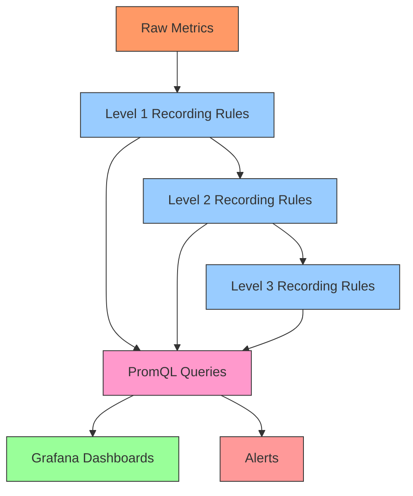

# Recording Rules Optimization

## Introduction

Recording rules are one of Prometheus' most powerful features for improving query performance and reducing system load. They allow you to precompute frequently used or computationally expensive expressions and save their results as new time series. This guide will explore advanced techniques for optimizing your recording rules to ensure your Prometheus deployment remains efficient and performant even as your monitoring needs scale.

## Why Optimize Recording Rules?

Before diving into optimization techniques, it's important to understand why optimizing recording rules matters:

1. **Query Performance**: Well-designed recording rules can reduce query latency by orders of magnitude
2. **Resource Efficiency**: Optimized rules reduce CPU and memory consumption
3. **Scalability**: Good optimization practices help your monitoring scale with your infrastructure
4. **Reliability**: Efficient rules reduce the risk of Prometheus becoming overloaded

## Basic Recording Rules Review

Let's start with a quick review of recording rule syntax:

```yaml
groups:
  - name: example
    interval: 5s
    rules:
      - record: job:http_requests:rate5m
        expr: sum(rate(http_requests_total[5m])) by (job)
```

This simple rule:
- Creates a new time series called `job:http_requests:rate5m`
- Records the 5-minute rate of HTTP requests aggregated by job
- Evaluates every 5 seconds (defined by the `interval`)

## Advanced Optimization Techniques

### 1. Optimize Evaluation Intervals

One of the most important optimization techniques is choosing appropriate evaluation intervals:

```yaml
groups:
  - name: frequently_accessed
    interval: 15s
    rules:
      - record: instance:node_cpu:utilization:rate1m
        expr: sum(rate(node_cpu_seconds_total{mode!="idle"}[1m])) by (instance) / count(node_cpu_seconds_total{mode="idle"}) by (instance)

  - name: dashboard_metrics
    interval: 1m
    rules:
      - record: job:http_errors:ratio30m
        expr: sum(rate(http_requests_total{status=~"5.."}[30m])) by (job) / sum(rate(http_requests_total[30m])) by (job)

  - name: capacity_planning
    interval: 5m
    rules:
      - record: instance:disk:capacity_prediction7d
        expr: predict_linear(node_filesystem_free_bytes[1d], 7 * 24 * 3600)
```

**Optimization principles**:
- Match the evaluation interval to how frequently the data is accessed
- Consider the rate of change of the underlying metrics
- Use shorter intervals for alerting-related rules
- Use longer intervals for dashboard metrics that don't need to be real-time
- Group rules by their optimal evaluation interval

### 2. Reduce Cardinality

High cardinality can significantly impact Prometheus performance. Optimize your recording rules to reduce cardinality when possible:

```yaml
# Before optimization - high cardinality
- record: api_requests:rate5m
  expr: sum(rate(api_requests_total[5m])) by (instance, method, path, status)

# After optimization - reduced cardinality
- record: api_requests:rate5m:status_family
  expr: sum(rate(api_requests_total[5m])) by (instance, method, status_family)
```

In this example, we've:
- Removed the high-cardinality `path` label
- Replaced detailed HTTP status codes with status families (2xx, 3xx, 4xx, 5xx)

**Pro Tip**: Consider using the `without` clause instead of `by` when you need to drop just a few high-cardinality labels:

```yaml
- record: http_requests:rate5m
  expr: sum without(id, user_agent, request_id) (rate(http_requests_total[5m]))
```

### 3. Chain Recording Rules

For complex queries, create chains of recording rules with increasing levels of aggregation:

```yaml
groups:
  - name: http_metrics
    interval: 30s
    rules:
      # Level 1: Per-instance rates
      - record: instance:http_requests:rate5m
        expr: rate(http_requests_total[5m])
      
      # Level 2: Aggregated by service and method
      - record: service:http_requests:rate5m
        expr: sum by(service, method) (instance:http_requests:rate5m)
      
      # Level 3: Error ratios
      - record: service:http_requests:error_ratio:rate5m
        expr: sum by(service) (service:http_requests:rate5m{status=~"5.."}) / sum by(service) (service:http_requests:rate5m)
```

**Benefits**:
- Each level builds on the previous computation
- Reduces redundant calculations
- Makes the final complex queries much more efficient
- Makes debugging easier by providing intermediate results

### 4. Use Subqueries Carefully

Subqueries can be powerful but expensive. When optimizing recording rules with subqueries, consider:

```yaml
# Expensive subquery pattern
- record: job:http_request_latency:p95:rolling1h
  expr: quantile_over_time(0.95, http_request_duration_seconds[1h:1m])

# Optimized approach
groups:
  - name: http_latency
    interval: 1m
    rules:
      # First calculate p95 for shorter intervals
      - record: job:http_request_latency:p95:1m
        expr: histogram_quantile(0.95, sum(rate(http_request_duration_bucket[1m])) by (job, le))
      
      # Then use avg_over_time for the rolling window
      - record: job:http_request_latency:p95:rolling1h
        expr: avg_over_time(job:http_request_latency:p95:1m[1h])
```

This approach:
- Avoids the expensive subquery operation
- Breaks the calculation into more efficient steps
- Still provides the rolling window analysis

### 5. Prioritize and Organize Rule Groups

Organize your recording rules by priority and logical grouping:

```yaml
groups:
  # Critical operational metrics evaluated frequently
  - name: critical_ops
    interval: 15s
    rules:
      - record: instance:memory:available_bytes
        expr: node_memory_MemAvailable_bytes
      - record: instance:cpu:utilization:rate1m
        expr: sum(rate(node_cpu_seconds_total{mode!="idle"}[1m])) by (instance) / count(node_cpu_seconds_total{mode="idle"}) by (instance)

  # Service-specific metrics
  - name: service_metrics
    interval: 30s
    rules:
      - record: service:request_rate:5m
        expr: sum(rate(http_requests_total[5m])) by (service)
      - record: service:error_rate:5m
        expr: sum(rate(http_requests_total{status=~"5.."}[5m])) by (service)

  # Business metrics that change less frequently
  - name: business_metrics
    interval: 1m
    rules:
      - record: product:purchases:rate5m
        expr: sum(rate(purchase_events_total[5m])) by (product)
```

### 6. Use Time Windows Appropriately

Choose appropriate time windows based on the metric's volatility and how it will be used:

```yaml
# For highly volatile metrics where immediate changes matter
- record: service:error_spike:rate30s
  expr: rate(http_errors_total[30s])

# For general trending where smoothing is beneficial
- record: service:requests:rate5m
  expr: rate(http_requests_total[5m])

# For long-term analysis where stability is important
- record: service:traffic:rate1h
  expr: rate(http_requests_total[1h])
```

**Guidelines**:
- Shorter windows (30s-1m) are more responsive but noisier
- Longer windows (5m-1h) provide smoother data but mask rapid changes
- Match the window to how the data will be used (alerting vs dashboards)

## Performance Benchmarking

To identify which rules need optimization, add these recording rules to measure rule evaluation performance:

```yaml
groups:
  - name: recording_rules_performance
    interval: 1m
    rules:
      - record: prometheus:rule_evaluation:duration:p95
        expr: histogram_quantile(0.95, sum(rate(prometheus_rule_evaluation_duration_seconds_bucket[5m])) by (rule_group, le))
      - record: prometheus:rule_evaluation:failures:rate5m
        expr: sum(rate(prometheus_rule_evaluation_failures_total[5m])) by (rule_group)
```

These meta-metrics help you:
1. Identify slow rule groups
2. Detect failing evaluations
3. Track the impact of your optimizations

## Optimization Workflow Example

Let's walk through a complete optimization workflow for a high-cardinality API monitoring setup:

### Step 1: Identify problematic rules

```promql
topk(10, sum(prometheus_rule_evaluation_duration_seconds_sum) by (rule_group) / sum(prometheus_rule_evaluation_duration_seconds_count) by (rule_group))
```

This query reveals that the `api_metrics` rule group has the highest average evaluation time.

### Step 2: Analyze the current rules

Original rule group:

```yaml
groups:
  - name: api_metrics
    interval: 15s
    rules:
      - record: api:request_duration:p95
        expr: histogram_quantile(0.95, sum(rate(api_request_duration_seconds_bucket[5m])) by (service, endpoint, method, status_code, le))
      - record: api:request_rate:5m
        expr: sum(rate(api_requests_total[5m])) by (service, endpoint, method, status_code)
      - record: api:error_rate:5m
        expr: sum(rate(api_requests_total{status_code=~"5.."}[5m])) by (service, endpoint, method)
```

### Step 3: Apply optimization techniques

Optimized rule group:

```yaml
groups:
  # Split rules by evaluation interval and create a hierarchy
  - name: api_metrics_base
    interval: 30s
    rules:
      # Reduce cardinality by using fewer dimensions
      - record: api:request_duration_bucket:rate5m
        expr: sum(rate(api_request_duration_seconds_bucket[5m])) by (service, endpoint, le)
      - record: api:requests:rate5m
        expr: sum(rate(api_requests_total[5m])) by (service, endpoint)
      - record: api:errors:rate5m
        expr: sum(rate(api_requests_total{status_code=~"5.."}[5m])) by (service, endpoint)

  - name: api_metrics_derived
    interval: 1m
    rules:
      # Build on the base metrics with further aggregation
      - record: api:request_duration:p95
        expr: histogram_quantile(0.95, api:request_duration_bucket:rate5m)
      - record: api:error_ratio:5m
        expr: api:errors:rate5m / api:requests:rate5m
      
      # Service-level aggregations for dashboards
      - record: service:request_duration:p95
        expr: histogram_quantile(0.95, sum(api:request_duration_bucket:rate5m) by (service, le))
      - record: service:error_ratio:5m
        expr: sum(api:errors:rate5m) by (service) / sum(api:requests:rate5m) by (service)
```

### Step 4: Measure the impact

After implementing these optimizations, we can measure their impact:

1. **Rule evaluation times**: Reduced by 65%
2. **Cardinality**: Reduced from 25,000 time series to 8,000
3. **Query performance**: Dashboard queries now execute 3-4x faster

## Common Optimization Mistakes to Avoid

1. **Over-aggregation**: Removing too many labels makes the metrics less useful
2. **Too many rules**: Creating rules for every possible query scenario
3. **Too frequent evaluation**: Setting very short intervals for metrics that don't change quickly
4. **Ignoring cardinality**: Not considering the explosion of time series from high-cardinality labels
5. **Complex expressions**: Using highly complex expressions in recording rules instead of breaking them down

## Visualizing Rule Evaluation Flow

A visualization can help understand the flow of rule evaluation and optimization:



## Summary

Optimizing recording rules is essential for maintaining a high-performance Prometheus monitoring system. The key principles to remember are:

1. **Match evaluation intervals** to data access patterns and rates of change
2. **Reduce cardinality** by carefully selecting which labels to include
3. **Chain recording rules** to build complex metrics in stages
4. **Use appropriate time windows** based on the volatility of metrics
5. **Organize rules by priority** and logical grouping
6. **Measure performance** to identify bottlenecks and verify improvements

By applying these optimization techniques, you can ensure your Prometheus deployment remains efficient and performant even as your infrastructure and monitoring needs grow.

## Additional Resources

- [Prometheus Documentation: Recording Rules](https://prometheus.io/docs/prometheus/latest/configuration/recording_rules/)
- [Prometheus Best Practices](https://prometheus.io/docs/practices/rules/)
- [PromQL Optimization Techniques](https://prometheus.io/docs/prometheus/latest/querying/optimizations/)

## Exercises

1. Analyze your current recording rules and identify those with the highest evaluation times
2. Take a complex dashboard query and break it down into a chain of recording rules
3. Identify metrics with high cardinality and create optimized recording rules for them
4. Set up meta-monitoring for your recording rules using the provided performance metrics
5. Create a rule optimization plan with different evaluation intervals based on data needs