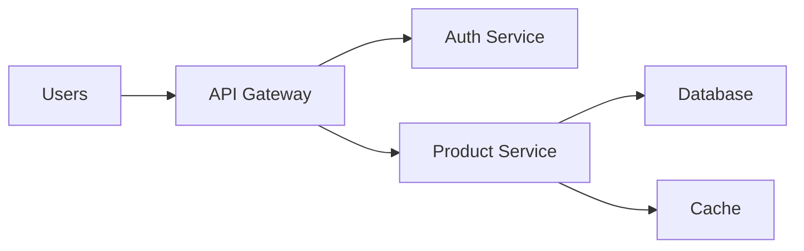

# Complex PromQL Queries

## Introduction

PromQL (Prometheus Query Language) is the powerful query language that makes Prometheus such a valuable tool in the monitoring ecosystem. While basic PromQL queries help you retrieve and visualize simple metrics, complex queries unlock the full potential of your monitoring data by enabling sophisticated analysis, correlation between metrics, and advanced alerting conditions.

In this guide, we'll explore advanced PromQL techniques that go beyond the basics. You'll learn how to construct multi-step queries, use advanced functions, and create complex expressions that reveal deeper insights into your system's behavior and performance.

## Prerequisites

Before diving into complex PromQL, you should:
- Understand basic PromQL syntax and simple queries
- Be familiar with Prometheus metrics types (counters, gauges, histograms, summaries)
- Have a running Prometheus instance to experiment with

## Building Blocks of Complex Queries

### Quick Recap of PromQL Basics

Let's start with a quick refresher on the basic components of PromQL:

```promql
http_requests_total{status="200", handler="/api/users"}[5m]
```

This query:
- Selects the `http_requests_total` metric
- Filters for HTTP status 200 and the `/api/users` handler
- Uses a time range selector `[5m]` to get the last 5 minutes of data

Now, let's move beyond the basics.

## Advanced Operators

### Binary Operators

Binary operators allow you to perform calculations between two metrics or between a metric and a scalar value.

#### Arithmetic Operators

- `+` (addition)
- `-` (subtraction)
- `*` (multiplication)
- `/` (division)
- `%` (modulo)
- `^` (power/exponentiation)

**Example**: Calculate the percentage of CPU used by each container in a Kubernetes pod:

```promql
(container_cpu_usage_seconds_total / machine_cpu_cores) * 100
```

#### Comparison Operators

- `==` (equal)
- `!=` (not equal)
- `>` (greater than)
- `<` (less than)
- `>=` (greater than or equal)
- `<=` (less than or equal)

**Example**: Find instances where CPU usage exceeds 80%:

```promql
(node_cpu_seconds_total{mode="idle"} / on(instance) group_left sum(node_cpu_seconds_total) by (instance)) < 0.2
```

#### Logical Operators

- `and` (intersection)
- `or` (union)
- `unless` (complement)

**Example**: Alert when a service is both high in CPU and memory usage:

```promql
(node_memory_MemAvailable_bytes / node_memory_MemTotal_bytes) < 0.1 and (rate(node_cpu_seconds_total{mode="idle"}[5m]) < 0.2)
```

## Vector Matching

One of the most powerful aspects of PromQL is its ability to match and join different time series together.

### Types of Vector Matching

1. **One-to-one**: Each series from the left side matches with exactly one series from the right side.
2. **One-to-many/many-to-one**: These are specified using `group_left` and `group_right` modifiers.

**Example**: Calculate the ratio of errors to total requests for each API endpoint:

```promql
sum(rate(http_requests_total{status=~"5.."}[5m])) by (endpoint) / 
sum(rate(http_requests_total[5m])) by (endpoint)
```

### Vector Matching Modifiers

- `on`: Specify which labels to match on
- `ignoring`: Specify which labels to ignore when matching
- `group_left`: Perform a many-to-one join
- `group_right`: Perform a one-to-many join

**Example**: Calculate the percentage of CPU usage per application, including node information:

```promql
sum by (application, instance) (rate(process_cpu_seconds_total[5m])) / 
  on(instance) group_left
  node_cpu_cores * 100
```

## Subqueries

Subqueries allow you to apply a range query to each point in an outer range query. They are formatted as:

```promql
<instant_query>[<range>:<step>]
```

**Example**: Calculate the 5-minute rate of HTTP requests, evaluated every minute for the last hour:

```promql
rate(http_requests_total[5m])[1h:1m]
```

## Advanced Aggregation Operators

PromQL offers various aggregation operators to combine time series:

- `sum`, `min`, `max`, `avg`
- `stddev`, `stdvar` (standard deviation and variance)
- `count`, `count_values`
- `bottomk`, `topk` (smallest/largest k elements)
- `quantile`

**Example**: Find the top 3 endpoints with the highest error rates:

```promql
topk(3, sum by (endpoint) (rate(http_requests_total{status=~"5.."}[5m])))
```

## Time-Based Functions

### Rate and Increase

For counter metrics, `rate()` and `increase()` are essential functions:

```promql
# Average rate of increase per second over the last 5 minutes
rate(http_requests_total[5m])

# Total increase over the last 5 minutes
increase(http_requests_total[5m])
```

### Time Series Prediction

Predict future values using linear regression:

```promql
predict_linear(node_filesystem_free_bytes[6h], 4 * 3600)
```

This predicts the disk space available in 4 hours based on the last 6 hours of data.

### Historical Data Analysis

Compare current metrics with past values:

```promql
# Compare current request rate with the rate 24 hours ago
rate(http_requests_total[5m]) / 
  rate(http_requests_total[5m] offset 24h)
```

## Real-World Complex Query Examples

### Example 1: Service Level Objectives (SLOs)

Calculate the error budget consumption for an API with a 99.9% availability target:

```promql
# First, calculate the error rate
sum(rate(http_requests_total{status=~"5.."}[1h])) / 
sum(rate(http_requests_total[1h]))

# Then, track against the SLO target of 0.1% errors (99.9% availability)
(sum(rate(http_requests_total{status=~"5.."}[1h])) / 
sum(rate(http_requests_total[1h]))) / 0.001
```

This calculates what percentage of our error budget we're currently consuming. A value of 1 means we're exactly at our SLO threshold.

### Example 2: Kubernetes Resource Optimization

Identify pods that are consistently using less than 20% of their CPU requests:

```promql
avg_over_time(
  (sum by (pod) (rate(container_cpu_usage_seconds_total[5m])) / 
   sum by (pod) (kube_pod_container_resource_requests{resource="cpu"}))
[1d]) < 0.2
```

This helps identify over-provisioned resources that could be scaled down to save costs.

### Example 3: Database Query Performance Monitoring

Calculate the 95th percentile of query latency and its trend:

```promql
# Calculate 95th percentile query time
histogram_quantile(0.95, sum(rate(db_query_duration_seconds_bucket[5m])) by (le, query_type))

# See if it's trending up or down
deriv(histogram_quantile(0.95, sum(rate(db_query_duration_seconds_bucket[5m])) by (le, query_type))[1h:])
```

### Example 4: Network Traffic Anomaly Detection

Detect sudden spikes in network traffic that deviate from the norm:

```promql
abs(
  (rate(node_network_transmit_bytes_total[5m]) - 
   avg_over_time(rate(node_network_transmit_bytes_total[5m])[1d:1h])
  ) / 
  avg_over_time(rate(node_network_transmit_bytes_total[5m])[1d:1h])
) > 0.3
```

This alerts when current network traffic deviates by more than 30% from the average traffic at the same time of day over the past day.

## Common Patterns and Best Practices

### Rate then Sum, Not Sum then Rate

For counters, always apply `rate()` before aggregation operations:

✅ **Correct**:
```promql
sum(rate(http_requests_total[5m]))
```

❌ **Incorrect**:
```promql
rate(sum(http_requests_total)[5m])
```

### Handle Counter Resets

When a service restarts, counters reset to zero. PromQL functions like `rate()`, `increase()`, and `irate()` automatically handle these resets, but be careful with manual calculations.

### Use Labels Effectively

Structure your metrics with thoughtful labels to enable powerful queries later:

```promql
# Bad - difficult to filter and aggregate
http_requests_total

# Good - enables powerful filtering and aggregation
http_requests_total{service="payment-api", endpoint="/process", method="POST", status_code="200"}
```

### Keep Cardinality Under Control

While labels are powerful, too many unique combinations can cause performance issues. For example, avoid labels like `user_id` that could have millions of values.

## Debugging Complex Queries

When a complex query doesn't return the expected results, try these approaches:

1. **Break it down**: Execute each part of the query separately to see intermediate results
2. **Check for missing data**: Use `absent()` to verify if metrics exist
3. **Examine label matching**: Ensure that your vector matching is working as expected
4. **Verify time ranges**: Confirm that your time windows capture the data you're interested in

## Visualizing Complex Queries

Complex PromQL queries truly shine when visualized in dashboards. Here are some tips:

1. **Use appropriate visualization types**:
   - Use gauges for current values against thresholds
   - Use graphs for rates and trends
   - Use heatmaps for histograms

2. **Add context with multiple panels**:
   - Show related metrics side by side
   - Include both the raw data and calculated values

3. **Effective dashboard layout**:
   - Group related metrics
   - Order panels from high-level overview to detailed metrics

## Case Study: Building a Comprehensive Service Dashboard

Let's combine everything we've learned to create a comprehensive service monitoring dashboard. Here's a diagram of the components we'll monitor:



For this architecture, we'll create PromQL queries to monitor:

1. **Overall Service Health** - Error rate across all services:
   ```promql
   sum(rate(http_requests_total{status=~"5.."}[5m])) / sum(rate(http_requests_total[5m]))
   ```

2. **Request Latency** - 95th percentile response time per service:
   ```promql
   histogram_quantile(0.95, sum(rate(http_request_duration_seconds_bucket[5m])) by (service, le))
   ```

3. **Resource Utilization** - CPU and memory usage per service:
   ```promql
   sum(rate(process_cpu_seconds_total[5m])) by (service) / 
     sum(container_spec_cpu_quota) by (service)
   ```

4. **Database Performance** - Query throughput and latency:
   ```promql
   rate(database_queries_total[5m])
   
   histogram_quantile(0.95, sum(rate(database_query_duration_seconds_bucket[5m])) by (query_type, le))
   ```

5. **Cache Efficiency** - Cache hit ratio:
   ```promql
   sum(rate(cache_hits_total[5m])) / (sum(rate(cache_hits_total[5m])) + sum(rate(cache_misses_total[5m])))
   ```

6. **Error Budget** - SLO compliance tracking:
   ```promql
   1 - (sum(increase(http_requests_total{status=~"5.."}[30d])) / sum(increase(http_requests_total[30d])))
   ```

## Summary

Complex PromQL queries are powerful tools for extracting meaningful insights from your monitoring data. In this guide, we've covered:

- Advanced operators for arithmetic, comparison, and logical operations
- Vector matching to combine and correlate different metrics
- Subqueries for analyzing patterns over time
- Aggregation operators for summarizing data
- Time-based functions for rate calculations and predictions
- Real-world examples and best practices
- Techniques for debugging and visualizing complex queries

With these advanced PromQL skills, you can build more sophisticated monitoring dashboards, create precise alerting rules, and gain deeper insights into your systems' behavior.

## Exercises

1. Write a PromQL query to calculate the average memory usage per Kubernetes namespace over the last hour.
2. Create a query that shows the 99th percentile of API request latency for each endpoint, but only for endpoints that have processed more than 100 requests in the last 5 minutes.
3. Write a query to predict when a disk will reach 90% capacity based on the growth rate over the last week.
4. Create a dashboard panel that shows a ratio of errors to total requests for your top 5 most-used API endpoints.
5. Write a query to detect if any of your services are experiencing an unusual increase in error rates compared to their historical baseline.

## Additional Resources

- [Prometheus Documentation - PromQL](https://prometheus.io/docs/prometheus/latest/querying/basics/)
- [PromLabs PromQL Cheat Sheet](https://promlabs.com/promql-cheat-sheet/)
- [PromQL for Humans](https://timber.io/blog/promql-for-humans/)
- [Grafana Labs: PromQL Examples](https://grafana.com/blog/2020/02/04/introduction-to-promql-the-prometheus-query-language/)
- [Robust Perception Blog](https://www.robustperception.io/blog/) - Expert articles on Prometheus