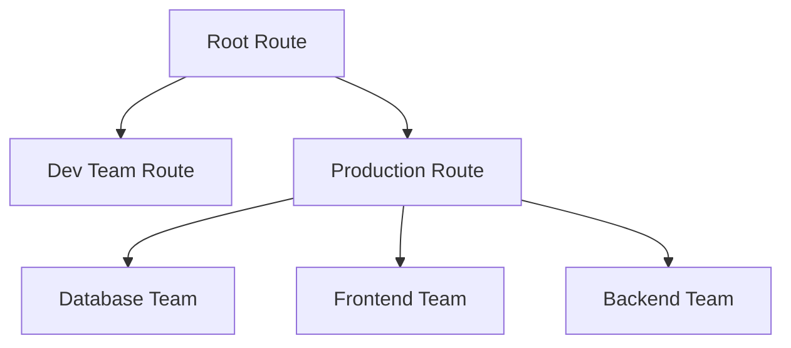

# Advanced Alert Routing

## Introduction

Alert routing is a critical aspect of any monitoring system. It ensures that alerts are delivered to the appropriate teams or individuals based on various criteria such as severity, service, time of day, and on-call schedules. Prometheus, through its Alertmanager component, provides powerful and flexible alert routing capabilities.

In this guide, we'll explore advanced alert routing techniques in Prometheus Alertmanager, enabling you to create sophisticated notification pipelines that direct alerts efficiently and intelligently across your organization.

## Prerequisites

Before diving into advanced alert routing, you should have:

- A working Prometheus setup
- Alertmanager installed and configured
- Basic understanding of Prometheus alerts and rules
- Familiarity with YAML configuration

## Understanding Alertmanager Routing

Alertmanager uses a tree-based routing configuration that determines how alerts are processed. This configuration is defined in the `alertmanager.yml` file.

The routing tree starts with a top-level route (the root), which can have nested child routes. Each route can specify:

- Matching criteria for alerts
- Grouping behavior
- Notification receivers
- Timing parameters (repeat interval, group wait, etc.)
- Child routes for further routing

Here's a visual representation of the routing tree:



## Basic Routing Configuration

Let's start with a basic routing configuration to understand the core concepts:

```yaml
route:
  receiver: 'default-receiver'
  group_by: ['alertname']
  group_wait: 30s
  group_interval: 5m
  repeat_interval: 4h
  routes:
    - match:
        severity: critical
      receiver: 'team-critical'
    - match:
        team: database
      receiver: 'database-team'
```

In this example:
- All alerts first enter the root route
- Alerts with `severity: critical` are sent to `team-critical`
- Alerts with `team: database` are sent to the `database-team`
- All other alerts go to the `default-receiver`

## Advanced Routing Techniques

Now, let's explore more sophisticated routing strategies.

### Routing by Service and Severity

A common pattern is to route alerts based on both the service and its severity:

```yaml
route:
  receiver: 'default-receiver'
  group_by: ['alertname']
  group_wait: 30s
  group_interval: 5m
  repeat_interval: 4h
  routes:
    - match:
        service: database
      receiver: 'database-team'
      routes:
        - match:
            severity: critical
          receiver: 'database-oncall'
        - match:
            severity: warning
          receiver: 'database-slack'
    - match:
        service: api
      receiver: 'api-team'
      routes:
        - match:
            severity: critical
          receiver: 'api-oncall'
```

This configuration creates a hierarchical routing structure where:
1. Alerts are first matched by service
2. Within each service, they're further routed based on severity

### Using Match_RE for Regular Expression Matching

For more flexible matching, Alertmanager supports regular expressions via `match_re`:

```yaml
route:
  receiver: 'default-receiver'
  routes:
    - match_re:
        service: (api|web|auth)
      receiver: 'frontend-team'
    - match_re:
        service: (database|cache|queue)
      receiver: 'backend-team'
```

This routes alerts for multiple services to specific teams using pattern matching.

### Time-Based Routing

You can implement time-based routing to handle different notification paths during business hours versus outside hours:

```yaml
route:
  receiver: 'default-receiver'
  routes:
    - match:
        severity: critical
      receiver: 'daytime-oncall'
      routes:
        - match:
            timeperiod: afterhours
          receiver: 'nighttime-oncall'
```

To make this work, you'll need to use the Time-based alerting label injector like `prom/alertmanager-injector` to add time-based labels to your alerts.

### Routing by Environment

Different environments often require different handling:

```yaml
route:
  receiver: 'default-receiver'
  routes:
    - match:
        environment: production
      receiver: 'prod-team'
      group_by: ['alertname', 'cluster', 'service']
      routes:
        - match:
            severity: critical
          receiver: 'prod-oncall'
          group_wait: 0s  # Immediate notification for production criticals
          repeat_interval: 1h
    - match:
        environment: staging
      receiver: 'dev-team'
      group_by: ['alertname', 'service']
      group_wait: 1m
      repeat_interval: 12h
```

This configuration applies different grouping and timing parameters based on the environment.

## Implementing Inhibition Rules

Inhibition rules allow you to suppress notifications for certain alerts if other alerts are already firing. This reduces alert noise during outages.

```yaml
inhibit_rules:
  - source_match:
      severity: 'critical'
      alertname: 'ClusterDown'
    target_match:
      severity: 'warning'
    equal: ['cluster']
```

This rule suppresses all warning alerts for a cluster if there's already a critical `ClusterDown` alert for that same cluster.

## Practical Example: Multi-Team, Multi-Environment Setup

Let's create a comprehensive example for a company with multiple teams and environments:

```yaml
global:
  resolve_timeout: 5m

route:
  receiver: 'default-email'
  group_by: ['alertname', 'job']
  group_wait: 30s
  group_interval: 5m
  repeat_interval: 4h
  
  routes:
    # Production environment routing
    - match:
        environment: production
      receiver: 'prod-alerts'
      group_by: ['alertname', 'job', 'instance']
      routes:
        # Database team routing
        - match:
            team: database
          receiver: 'database-slack'
          routes:
            - match:
                severity: critical
              receiver: 'database-pager'
              group_wait: 0s
              repeat_interval: 1h
        
        # Frontend team routing
        - match:
            team: frontend
          receiver: 'frontend-slack'
          routes:
            - match:
                severity: critical
              receiver: 'frontend-pager'
              group_wait: 0s
              repeat_interval: 1h
    
    # Staging environment routing
    - match:
        environment: staging
      receiver: 'staging-slack'
      group_wait: 1m
      repeat_interval: 12h
      
    # Development environment routing
    - match:
        environment: development
      receiver: 'dev-slack'
      group_wait: 5m
      repeat_interval: 24h

# Receiver definitions
receivers:
  - name: 'default-email'
    email_configs:
      - to: 'alerts@example.com'
  
  - name: 'prod-alerts'
    slack_configs:
      - channel: '#prod-alerts'
  
  - name: 'database-slack'
    slack_configs:
      - channel: '#db-alerts'
  
  - name: 'database-pager'
    pagerduty_configs:
      - service_key: '<your-pagerduty-key>'
  
  - name: 'frontend-slack'
    slack_configs:
      - channel: '#frontend-alerts'
  
  - name: 'frontend-pager'
    pagerduty_configs:
      - service_key: '<your-pagerduty-key>'
  
  - name: 'staging-slack'
    slack_configs:
      - channel: '#staging-alerts'
  
  - name: 'dev-slack'
    slack_configs:
      - channel: '#dev-alerts'

# Inhibition rules
inhibit_rules:
  - source_match:
      severity: 'critical'
      alertname: 'ServiceDown'
    target_match:
      severity: 'warning'
    equal: ['job', 'instance']
```

This configuration implements:
1. Environment-based routing (production, staging, development)
2. Team-based sub-routes (database, frontend)
3. Severity-based routing within teams
4. Different timing parameters based on environment
5. Different notification channels (email, Slack, PagerDuty)
6. Inhibition rules to reduce alert noise

## Verifying Your Routing Configuration

Before deploying your configuration, you can use the Alertmanager API to test routing:

```bash
curl -X POST -H "Content-Type: application/json" -d '[{
  "labels": {
    "alertname": "DiskFull",
    "severity": "critical",
    "team": "database",
    "environment": "production"
  }
}]' http://alertmanager:9093/api/v1/alerts
```

You can also use the Alertmanager UI to check the status of active alerts and verify they've been routed correctly.

## Common Routing Patterns and Best Practices

### Tiered Escalation

Create escalation tiers that gradually increase the urgency of notifications:

```yaml
route:
  receiver: 'slack'
  routes:
    - match:
        severity: critical
      receiver: 'tier1'
      group_wait: 0s
      continue: true  # Continue to process child routes
      routes:
        - match:
            severity: critical
          receiver: 'tier2'
          group_wait: 10m  # Wait 10 minutes before escalating
```

The `continue: true` parameter is crucial here—it allows an alert to match multiple receivers in the same branch.

### Geographical Routing

For global teams, route alerts based on geographical regions:

```yaml
route:
  receiver: 'global-team'
  routes:
    - match:
        region: us-east
      receiver: 'us-team'
    - match:
        region: eu-west
      receiver: 'eu-team'
    - match:
        region: ap-south
      receiver: 'asia-team'
```

### Service Level Objectives (SLO) Routing

Route alerts differently based on whether they affect SLOs:

```yaml
route:
  receiver: 'default'
  routes:
    - match:
        affects_slo: 'true'
      receiver: 'slo-violations'
      group_by: ['slo_name', 'service']
```

## Troubleshooting Routing Issues

If alerts aren't being routed as expected, check:

1. **Label inconsistencies**: Ensure alert labels match your routing criteria
2. **Route order**: Routes are evaluated in order. More specific routes should appear before general ones
3. **Configuration validation**: Run `amtool check-config alertmanager.yml` to validate your configuration
4. **Inhibition issues**: Check if alerts are being inhibited by other active alerts
5. **Grouping conflicts**: Ensure your `group_by` settings don't conflict with your routing needs

## Summary

Advanced alert routing in Prometheus Alertmanager is a powerful capability that helps organizations direct alerts to the right people at the right time. Key takeaways include:

- Alertmanager uses a tree-based routing structure
- Routing can be based on labels like severity, team, service, or environment
- Regular expressions provide flexible matching with `match_re`
- Timing parameters control notification behavior
- Inhibition rules reduce alert noise
- Complex organizational structures can be represented with nested routes

By mastering these advanced routing techniques, you can create a notification system that balances responsiveness with minimal alert fatigue, ensuring your teams can effectively respond to issues.

## Additional Resources

- [Alertmanager Configuration Documentation](https://prometheus.io/docs/alerting/latest/configuration/)
- [Alertmanager GitHub Repository](https://github.com/prometheus/alertmanager)
- [Prometheus Alerts Best Practices](https://prometheus.io/docs/practices/alerting/)

## Exercises

1. Create a routing configuration for a company with three teams (infrastructure, application, and security) across two environments.

2. Implement time-based routing that sends alerts to different teams based on work hours in different time zones.

3. Design an inhibition rule that suppresses service-specific alerts when there's a broader infrastructure problem.

4. Create a multi-tier escalation policy that starts with Slack notifications and escalates to PagerDuty after 15 minutes for unacknowledged critical alerts.